**அலகு - 7**

காலனியத்துக்கு எதிரான இயக்கங்களும் தேசியத்தின் தோற்றமும்

**கற்றலின் நோக்கங்கள்**

**கீழ்க்ககாண்பனவற்றோடு அறிமுகமாதல்**

- ஆங்கிலேயருக்கு எதிரான பழங்குடியினர் மற்றும் விவசாயிகளின் போராட்டங்களின் தன்மமை
- 1857இல் பெரும்கலகம் வெடிப்பதற்ககான காரணிகளும் அதனைத் தொடர்ந்து ஆங்கிலேயர் இந்தியாவை ஆளும் தங்கள் அணுகுமுறையில் ஏற்படுத்திக்கொண்ட மாற்றங்களும்

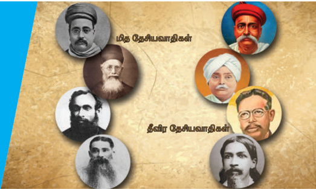

- இந்திய தேசிய காங்கிரஸ் உருவாக்கத்துக்ககான காரணிகளும் தொடக்ககால தேசியவாதிகளின் கண்ணோட்டமும்
- 1905இல் வங்கப்பிரிவினைக்கு பின்னனாலிருந்த ஆங்கிலேயர்களின் பிரித்ததாளும் கொள்ககையும் வங்ககாளத்தில் சுதேசி இயக்கத்தின் தோற்றமும்
- தன்னனாட்சி (ஹோம் ரூல்) இயக்கத் தோற்றத்துக்ககானப் பின்னணி

**அறிமுகம்**

1757 ஜூன் 23இல் நடைபெற்ற பிளாசிப் போரில் வங்ககாள நவாபான சிராஜ்- உத்-தௌலா ஆங்கிலேய கிழக்கிந்திய க ம்பபெனியால் தோற்கடிக்கப்பட்டடார். ஆங்கிலேயப் ப டையின் தலைமைத் தளபதியான ராபர்ட் கிளைவ், வங்ககாளத்தின் நவாப் படைக்கு தலைமையேற்றிருந்தவரும் சிராஜ்-உத்- தௌலாவின் சித்தப்பபாவுமான மீர் ஜாபரின் இரகசிய ஆதரவைப் பெற்று, பிளாசிப் போருக்கு வித்திட்டடார். சிராஜ்-உத்-தௌலாவின் அடக்குமுறைக் கொள்ககைகளால் அவதிப்பட்ட ஜகத் சேத்துகள் (வங்ககாளத்திலிருந்த வட்டிக்கு ப ணம் கொடுப்போர்) கிளைவுக்கு உதவினார்கள். வங்ககாளத்தின் புதிய நவாபாக நியமிக்கப்பட்ட மீர் ஜாபரிடம் இருந்து கிழக்கிந்திய கம்பபெனி 2 கோடியே 25 லட்சம் ரூபாயை 1757 மற்றும் 1760-க்கு இடைப்பட்ட காலகட்டத்தில் பெற்றது. இந்தத் தொகை பின்னர் ஆங்கிலேயர்களின் ஜவுளித்துறையை அதிவேகமாக இயந்திரமயமாக்க உதவிய பிரிட்டனின் தொழில் புரட்சிக்கு ப யன்படுத்தப்பட்டது. அதே நேரத்தில் இந்தியாவில்

தொழில்கள் முடங்கவும் பிரிட்டனில் தயாரிக்கப்பட்ட பொருட்களுக்ககான சந்ததையை இந்தியாவில் உருவாக்கவும் வழிவகுத்தது. இந்தியா, கிழக்கிந்திய க ம்பபெனியால் கொள்ளளையடிக்கப்படும் செயலானது மேலும் 190 ஆண்டுகளுக்கு நீடித்தது.

இந்திய துணைக் கண்டத்தில் பத்தொன்பதாம் நூற்றறாண்டின் தொடக்கம் மற்றும் மத்தியிலும் தொடர்ந்து இருபதாம் நூற்றறாண்டின் தொடக்கத்திலும் ஆங்கிலேய ஆட்சிக்கு எதிராக நடந்த பல்வவேறு போராட்டங்கள் மற்றும் நிலைப்பபாடுகளை விளக்குவதாக இந்தப் பாடம் அமைந்துள்ளது.

ப ல்வவேறு சமூக-சமய சீர்திருத்த இயக்கங்களில் ஈடுபட்டு மேற்கத்திய நவீன கருத்துகள் மற்றும் ப குத்தறிவுவாதம் ஆகியவை குறித்து இந்தியாவின் நகர்ப்புற உயர்குடி மக்கள் முனைப்பபாக இருந்த காலகட்டத்தில் ஊரகப்பகுதிகளில் ஆங்கிலேய ஆட்சிக்கு எதிராக மிக வலுவுடைய மற்றும் தீவிரமான போக்கு நிலவியது. பாரம்பரியமான உயர்குடி

ம க்களும் விவசாயிகளும் பழங்குடியின மக்களுடன் இணைந்து கிளர்ச்சி செய்தனர். இந்தியாவிலிருந்து ஆங்கிலேயர்களை வெளியேற்றுவதை அவர்கள் கோராமல் காலனியாதிக்கத்திற்கு முன்னிருந்த நிலையை மீண்டும் நிலைநிறுத்துவதை வலியுறுத்தினார்கள்.

ஆங்கிலேய ஆட்சியில் கிட்டத்தட்ட ஒரு நூறுக்கும் குறையாத எண்ணிக்ககையில் விவசாயிகளின் கிளர்ச்சிகள் நடந்தன. அவற்றறைக் கீழ்க்ககாணும்மமாறு வகைப்படுத்தலாம்:

**வருவாய் முறையில் மாற்றங்கள்**

இந்தியா முழுவதிலும் செயல்பபாட்டில் இருந்த முகலாய வருவாய் அமைப்பபை கிழக்கிந்திய க ம்பபெனி மறுசீரமைத்ததையடுத்து விவசாயிகளின் நிதிச்சுமைகள் பெரிதும் அதிகரித்தன. ஆங்கிலேய ஆட்சிக்கு முன் இந்தியாவில் தனிச்சொத்துரிமை பற்றிய எந்த விரிவான திட்டமும் நடைமுறைப்படுத்தப்படவில்லலை .

**நிலத்ததைக் கீழ்க்குத்தகைக்கு விடுவது**

நிலத்ததைக் குத்தகைக்கு விடுவதும் கீழ்க்குத்தகைக்கு (subletting) விடுவதும் விவசாய உறவுகளைப் பெரிதும் சிக்கலாக்கியது. ஜமீன்ததாரர் தன்னிடம் இருந்த நிலத்ததைப் பெரும்பபாலும் தன்னனைச் சார்ந்திருந்த நிலப்பிரபுக்களுக்கு கீழ்க்குத்தகைக்கு விட்டடார். பதிலுக்கு நிலப்பிரபு, விவசாயிகளிடமிருந்து ஒரு குறிப்பிட்ட தொகையை வசூலித்துக் கொடுப்பபார். இதனால் விவசாயிகள் மீதான வரிச்சுமை அதிகரித்தது.

**(அ) விவசாயிகளின் கிளர்ச்சி**

19ஆம் நூற்றறாண்டின் தொடக்கத்தில் வெடிக்கத் தொடங்கிய விவசாயிகளின் கிளர்ச்சிகள் இந்தியாவில் ஆங்கிலேய ஆட்சி முடிவுக்கு வரும்வரைதொடர்ந்தன.

**ஃபராசி இயக்கம்**

ஹாஜி ஷரியத்துல்லலா என்பவரால் 1818ஆம் ஆண்டு ஃபராசி இயக்கம் தொடங்கப்பட்டது. 1839இல் ஷரியத்துல்லலா மறைந்த பிறகு இந்த கிளர்ச்சிக்கு அவரது மகன் டுடு மியான் தலைமை ஏற்றறார். அவர் வரி செலுத்தவேண்டடாம் என்று விவசாயிகளை கேட்டுக்கொண்டடார். பொதுமக்கள் நிலத்ததையும் அனைத்து வளத்ததையும் சரிசமமாக

அனுபவிக்கவேண்டும் என்ற எளிய கொள்ககையில் இந்த அறிவிப்பு பிரபலமடைந்தது. சம த்துவ இயல்பிலான மதம் குறித்து வலியுறுத்திய டுடு மியான், 'நிலம் கடவுளுக்குச் சொந்தமானது' என்று அறிவித்ததார். எனவே வாடகை வசூலிப்பது அல்லது வரி விதிப்பது ஆகியன இறைச்சட்டத்துக்கு எதிரானது

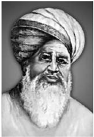

என்றறார். கிராம அமைப்புகளின் கட்டமைப்பு மூலமாக பெரும் எண்ணிக்ககையிலான விவசாயிகள் ஒன்றுதிரட்டப்பட்டனர். 1862இல் டுடு மியான் மறைந்தபிறகு 1870களில் நோவா மியான் என்பவரால் இந்த இயக்கம் மீண்டும் உயிர்பபெற்றது.

**பரசத்தில் வஹாபி கிளர்ச்சி**

வஹாபி கிளர்ச்சி என்பது ஆங்கிலேய ஆட்சிக்கும் நிலப்பிரபுக்களுக்கும் எதிராக தொடங்கப்பட்டதாகும். வங்ககாளத்தில் பரசத் ப குதியில் 1827 வாக்கில் தோன்றியது. வஹாபி போ தனைகளால் பெரிதும் ஆழமாக

ஈர்க்கப்பட்டவராக திகழ்ந்த இசுலாமிய மதபோதகர் டிடு மீர் என்பவர் இந்தக் கிளர்ச்சிக்குத் தலைமையேற்றறார். ஜமீன்ததாரி முறையால் ஒடுக்கப்பட்ட குறிப்பபாக இசுலாமிய விவசாயிகள் மத்தியில் அவர் செல்வவாக்குமிக்க நபராகத் திகழ்ந்ததார்.

**(ஆ) பழங்குடியினர் கிளர்ச்சி**

க லனி ஆட்சியின் கீழ் இந்திய வரலாற்றில் முதன்முறையாக அரசு வனங்கள் குறித்த நேரடித் தனியுரிமை வேண்டும் என்று கோரியது. வனங்களை வர்த்தகமயமாக்கும் நடவடிக்ககைகளுக்கு ஆங்கிலேய ஆட்சியில்

காலனியத்துக்கு எதிரான இயக்கங்களும் தேசியத்தின் தோற்றமும் 81

ஊக்கம் கிடைத்ததன் காரணமாகப் பாரம்பரிய ப ழங்குடியின நடைமுறை தனது கட்டுக்கோப்பபை இழந்தது. இதனால் பழங்குடியினப் பகுதிகளில் ப ழங்குடியினரல்லலாதோரான வட்டிக்குப்பணம் கொடுப்போர், வர்த்தகர்கள், நில ஆக்கிரமிப்பபாளர்கள் ம ற்றும் ஒப்பந்ததாரர்கள் போன்றோர் ஊடுருவுவதற்கு அது ஊக்கம் தந்தது. இதனால் ஆதிவாசி நிலத்தின் பெரும்பகுதி இழக்கப்பட்டு அவர்கள் தாங்கள் பாரம்பரியமாகக் குடியிருந்து வந்த ப குதிகளில் இருந்து இடம்பபெயர்ந்து வாழநேர்ந்தது.

எனவே அமைதியான பழங்குடியினர் வாழ்க்ககையில் மாற்றங்களை அறிமுகம் செய்தோர் அல்லது பழங்குடியின மக்களின் அப்பபாவித்தனத்ததைத் தேவையின்றி தங்களுக்குச் சாதகமாக பயன்படுத்தியோருக்கு எதிரானதொரு ப தில் நடவடிக்ககையே பழங்குடியினக் கிளர்ச்சியாகும்.

**(i) கோல் கிளர்ச்சி**

ஜார்க்கண்ட் மற்றும் ஒடிஷா ஆகிய ப குதிகளிலுள்ள சோட்டடா நாக்பூர் மற்றும் சிங்பும் ஆகிய இடங்களில் 1831-32ஆம் ஆண்டுகளில் நடந்த மிகப்பபெரிய பழங்குடியின கிளர்ச்சி கோல் கிளர்ச்சியாகும். இது பிந்த்ரராய் மற்றும் சிங்ரராய் தலைமையில் நடந்தது. சோட்டடா நாக்பூர் ப குதியின் அரசர் வருவாய் வசூலிக்கும் பணியை வட்டிக்குப் பணம்கொடுப்போரிடம் குத்தகைக்கு விட்டிருந்ததார். அதிக வட்டிக்கு கடன்கொடுத்தல் ம ற்றும் பழங்குடியினரைக் கட்டடாயப்படுத்தி அவர்களின் பகுதிகளிலிருந்து வெளியேற்றுதல் போன்றவை கோல் இனத்தவரிடையே கோபத்ததை ஏற்படுத்தியது. வெளியாட்களின் சொத்துக்கள் மீது தாக்குதல்கள் நடத்துதல், கொள்ளளையடித்தல், க லவரம் செய்தல் ஆகிய வழிகளில் கோல்களின் தொடக்ககாலப் போராட்டம் மற்றும் எதிர்ப்புகள் அமைந்தன. அதனை அடுத்து வட்டிக்குப் பணம்கொடுப்போர் மற்றும் வர்த்தகர்கள் ஆகியோர் கொல்லப்பட்டனர். மேளங்களை முழங்கியும் அம்புகளை எய்தும் வெளியாட்களை வெளியேறச் செய்யும் எச்சரிக்ககைகளை செய்தும் பல வகைகளில் ப ழங்குடியினத் தலைவர்கள் தங்கள் கிளர்ச்சி ப ற்றிய செய்தியைப் பரப்பினர். ஆங்கிலேய அரசு பெரிய அளவிலான வன்முறை மூலம் இந்தக் கிளர்ச்சியை அடக்கியது.

**(ii) சாந்தலர்களின் கிளர்ச்சி**

இந்தியாவின் கிழக்குப் பகுதிகளில் பரவலாக வாழ்ந்துவந்த சாந்தலர்கள் நிரந்தர குடியிருப்புகளின் கீழ் ஜமீன்களை உருவாக்குவதற்ககாக தங்கள் பூர்வீக இடத்ததை விட்டு இடம்பபெயரவேண்டி நிர்ப்பந்திக்கப்பட்டதால் ராஜ்மஹால் மலையைச்

காலனியத்துக்கு எதிரான இயக்கங்களும் தேசியத்தின் தோற்றமும்

சுற்றிலும் இருந்த வனப்பகுதியைவிட்டு க ட்டடாயப்படுத்தி வெளியேற்றப்பட்டனர். ரயில்வவே க ட்டுமானப் பணியில் ஈடுபட்டிருந்த ஐரோப்பிய அதிகாரிகள் மற்றும் உள்ளூர் காவலர்களால் அவர்கள் ஒடுக்கப்பட்டனர். வெளியாட்களால் வாழ்விடங்களை விட்டு வெளியேற்றப்பட்ட ச ந்தலர்கள் தங்கள் வாழ்வவாதாரத்துக்ககாக வட்டிக்குப்பணம் கொடுப்போரைச் சார்ந்துவாழ நிர்ப்பந்திக்கப்பட்டனர். விரைவில் கடன் மற்றும் ப ணம்பறித்தல் ஆகிய தீய வலையில் அவர்கள் சிக்கத்தொடங்கினர். மேலும், ஊழல்கறைபடிந்த ஆங்கிலேய நிருவாகத்தின் கீழ் தங்களின் நியாயமான குறைகளுக்கு நீதி கிடைக்கமுடியாத சூழலில் தாங்கள் புறக்கணிக்கப்பட்டதாக ச ந்தலர்கள் உணர்ந்தனர்.

**வெளிப்பபாடு**

1854ஆம் ஆண்டு வாக்கில் பல இடங்களில் சமூகக் கொள்ளளை நடவடிக்ககைகள் பீர் சிங் என்பவரின் தலைமையில் நடந்தன. மகாஜன்கள் ம ற்றும் வர்த்தகர்களுக்கு எதிராகக் குறிவைத்து இவை நடந்தன.

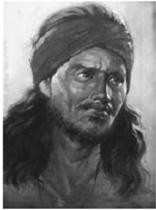

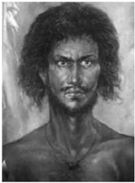

*1855இல் சித்து மற்றும் கணு ஆகிய இரண்டு சாந்தலர் சகோதரர்கள் கிளர்ச்சியைத் தலைமையேற்று நடத்தவேண்டி தங்களுக்கு கடவுளிடமிருந்து தேவசெய்தி கிடைத்ததாக அறிவித்தனர்.*

1855ஆம் ஆண்டு ஜுலை மாதத்தில் கிளர்ச்சியானது மகாஜன்கள், ஜமீன்ததாரர்கள், ஆங்கிலேய அதிகாரிகள் ஆகியோருக்கு எதிரான வெளிப்படையான கிளர்ச்சியாக உருவெடுத்தது. வில் ம ற்றும் விஷம் தடவிய அம்புகளை ஏந்தியவாறும், கோடரிகள், கத்திகள் ஆகியவற்றுடனும் ராஜ்மகால் ம ற்றும் பாகல்பூர் நோக்கி கம்பபெனி ஆட்சிக்கு முடிவு க ட்டப்போவதாக முழக்கமிட்டபடி பேரணியாகச் சென்றனர். இதனையடுத்து கிராமங்கள் மீது அதிரடி நடவடிக்ககை எடுத்த ஆங்கிலேயர் சொத்துக்களைச் சூறையாடினார்கள். இறுதியாக கிளர்ச்சி முழுமையாக ஒடுக்கப்பட்டது. 1855இல் சாந்தலர்கள் வசமிருந்த பகுதிகளை ஒழுங்குமுறைப்படுத்துவது ப ற்றிய சட்டம் நிறைவேற்றப்பட்டது. சாந்தல் பர்ககானா

ம ண்டலம் என்ற தனி மண்டலத்ததை உருவாக்கும் வகையில் இந்தச் சட்டம் நிறைவேறியது.

**(இ) முண்டடா கிளர்ச்சி**

ராஞ்சியில் இக்ககாலகட்டத்தில் நடைபெற்ற உலுகுலன் கிளர்ச்சி (பெரிய கலகம்) பழங்குடியினக் கிளர்ச்சிகளில் மிக முக்கியமானதாக அறியப்படுகிறது. கூட்டடாக நிலத்ததைவைத்துக்கொண்டு ''குண்டக்கட்டி'' (கூட்டுச்சொத்து) என்ற முறையில் விவசாயம் செய்வதில் முண்டடா மக்கள் பெயர்பபெற்றவர்கள். நிலத்துக்ககான தனிச்சொத்துரிமையின் அறிமுகமும் வர்த்தகர்கள் மற்றும் வட்டிக்குப்பணம் கொடுப்போரின் ஊடுருவல் ஆகியவற்றின் காரணமாக இந்த நடைமுறை முற்றிலும் சிதைந்தது. தோட்டங்களில் வேலைசெய்ய முண்டடா இனமக்கள் கொத்தடிமைகளாக வலுக்கட்டடாயமாக பணியில் அமர்த்தப்பட்டனர். 1890 களில் பழங்குடியின மக்களை அவர்கள் வாழும் பகுதிகளிலிருந்து இடம்பபெயரச் செய்வது மற்றும் அவர்களைக் கட்டடாய உழைப்பிற்கு உட்படுத்துவது ஆகியவற்றறை பழங்குடியினத் தலைவர்கள் எதிர்த்தனர்.

பிர்சசா முண்டடா தம்மமை கடவுளின் தூதர் என்று அறிவித்த உடன் இந்த இயக்கத்துக்கு ஊக்கம் கிடைத்தது. தமக்கு இறைத் தொடர்பு இருப்பதாகக் கூறிய பிர்சசா குறி சொல்வதின் மூலமாக முண்டடா இன மக்களின் பிரச்சனைகளுக்குத் தீர்வு காணப்போவதாகவும் மக்களின் அரசை நிறுவப்போவதாகவும் பிர்சசா உறுதியளித்ததார். பிர்சசா முண்டடாவின் பிரபலத்ததைப் பயன்படுத்தி மேலும் அதிக எண்ணிக்ககையில் பிர்சசா இன மக்களை இந்த நோக்கத்துக்ககாக ஒன்றிணைக்க முண்டடா தலைவர்கள் முயன்றனர். இரவுக் கூட்டங்கள் பல நடத்தப்பட்டு கிளர்ச்சி ஒன்றுக்கு திட்டமிடப்பட்டது. 1889ஆம் ஆண்டு கிறிஸ்துமஸ் நாளில் அவர்கள் வன்முறையை கையில் எடுத்தனர். கட்டடங்கள் தீக்கிரையாக்கப்பட்டன. கிறித்தவ தூதுக்குழுக்கள் ம ற்றும் கிறித்தவர்களாக மதம் மாறிய முண்டடாக்கள் மீது அம்பு எறிந்து தாக்குதல்கள் நடந்தன. அதன் பின் காவல் நிலையங்களும் தாக்கப்பட்டன, அரசு அதிகாரிகளும் தாக்கப்பட்டனர். அடுத்த சில மாதங்களுக்கு இதுபோன்ற தாக்குதல்கள் தொடர்ந்து நடத்தப்பட்டன. இறுதியாக இந்த கிளர்ச்சி முடக்கப்பட்டது. 1900ஆம் ஆண்டு பிப்ரவரி மாதம் கைது செய்யப்பட்ட பிர்சசா முண்டடா பின்னர் சிறையில் உயிர்நீத்ததார். பழங்குடியினரின் தலைவராக அறியப்பட்ட பிர்சசா முண்டடா இன்றளவும் ப ல நாட்டுப்புறப் பாடல்களில் போற்றப்படுகிறார். இந்த முண்டடா கிளர்ச்சியை அடுத்து ஆங்கிலேய அரசு பழங்குடியின நிலம் பற்றிய கொள்ககையை வகுக்க முனைந்தது. 1908இல் சோட்டடா நாக்பூர் குத்தகைச் சட்டம் நிறைவேற்றப்பட்டு பழங்குடியினர்

நிலத்தில் பழங்குடியினரல்லலாதோர் நுழைவது தடுக்கப்பட்டது.

### 7.2 1857ஆம் ஆண்டின் பெருங்கிளர்ச்சி (முதல் இந்திய சுதந்திரப் போர்)

1857ஆம் ஆண்டில் ஆங்கிலேய ஆட்சிக்கு பெரும் சவால் ஏற்பட்டது. தொடக்கத்தில் வங்ககாள மாக ணத்தில் சிப்பபாய் கலகமாக உருவெடுத்த இந்த கிளர்ச்சி பின்னர் குறிப்பபாக விவசாயிகள் உள்ளிட்ட பெரும் எண்ணிக்ககையிலான மக்கள் பங்ககேற்றதை அடுத்து நாட்டின் இதர பகுதிகளுக்கும் பரவியது. 185758ஆம் ஆண்டுகளில் நடந்த நிகழ்வுகள் கீழ்க்ககாணும் க ரணங்களால் முக்கியத்துவம் பெற்றன:

- இராணுவ வீரர்களுடன் ஆயுதமேந்திய படைக ளும் இணைந்து நடந்த முதல் மாபெரும் புரட்சி இதுவேயாகும்.
- இருதரப்புகளிலும் தூண்டப்பட்டதால் முன் எ ப்பொழுதும் இல்லலாத அளவுக்கு கிளர்ச்சியில் வன்முறை வெடித்தது.
- கிழக்கிந்திய கம்பபெனியின் பணியினை புரட்சி முடிவுக்குக் கொண்டுவந்ததுடன் இந்திய துணைக் கண்டத்ததை நிர்வகிக்கும் பொறுப்பு ஆங்கில மகாராணியின் நேரடி ஆட்சியின் கீழ் வந்தது.

**(அ) காரணங்கள்**

1840 மற்றும் 1850 களில் இரண்டு முக்கியக் கொள்ககைகளின் மூலம் அதிக நிலப்பகுதிகள் இணைத்துக் கொள்ளப்பட்டன.

மேலாதிக்கக் கொ ள்ககை: ஆங்கிலேயர் தங்களை வானளாவிய அதிகாரங்கள் கொண்ட உயர் அதிகார அமைப்பபாக கருதினார்கள். உள்நநாட்டு ஆட்சியாளர்கள் திறனற்றவர்கள் என்ற அடிப்படையில் புதிய நிலப்பகுதிகள் இணைக்கப்பட்டன.

வாரிசு இழப்புக்கொள்ககை: அரசுக்கட்டிலில் அரியணை ஏற நேரடி ஆண்வவாரிசு இல்லலையெனில் அந்த ஆட்சியாளரது இறப்புக்குப்பின் அந்தப்பகுதி ஆங்கிலேயர்களின் ஆட்சியின் கீழ் கொண்டுவரப்படும். சதாரா, ச ம்பல்பூர், பஞ்சசாபின் சில பகுதிகள், ஜான்சி ம ற்றும் நாக்பூர் ஆகியன இந்த வாரிசு இழப்புக் கொள்ககையின் அடிப்படையில் ஆங்கிலேய ஆட்சியின் கீழ் கொண்டுவரப்பட்டன.

1806ஆம் ஆண்டில் வேலூரில் சிப்பபாய்கள் சம யக்குறியீடுகளை நெற்றியில் அணிவதற்கும், தாடி

காலனியத்துக்கு எதிரான இயக்கங்களும் தேசியத்தின் தோற்றமும் 83

வைத்துக் கொள்வதற்கும், தடைவிதிக்கப்பட்டதோடு தலைப்பபாகைகளுக்கு பதிலான வட்ட வடிவிலான தொப்பிகளை அணியுமாறும் பணிக்கப்பட்டனர். அதனை எதிர்த்து அவர்கள் கிளர்ச்சி செய்தனர். இத்தகைய ஆடைக் கட்டுப்பபாடுகள் சிப்பபாய்களை கிறித்தவ மதத்துக்கு மாறச் செய்வதற்ககான ஒரு முயற்சியாக அவர்கள் அஞ்சினார்கள்.

அதேபோன்று 1824ஆம் ஆண்டு கல்கத்ததா அருகே பாரக்பூரில் சிப்பபாய்கள் கடல்வழியாக ப ர்மமா செல்ல மறுத்தனர். கடல் கடந்து சென்றறால் தங்களது சாதியை இழக்க நேரிடும் என்று அவர்கள் நம்பினார்கள்.

ஊதியம் மற்றும் பதவி உயர்வில் பாரபட்சம் க ட்டப்படுவது குறித்தும் சிப்பபாய்கள் கவலை அடைந்தனர். ஐரோப்பிய சிப்பபாய்களுடன் ஒப்பிடுகையில் இந்திய சிப்பபாய்களுக்கு மிகக்குறைந்த அளவில் ஊதியம் வழங்கப்பட்டது. அவர்கள் தரக்குறைவாக நடத்தப்பட்டதோடு மூத்த படையினரால் இனக் குறியிடப்பட்டு அவமதிக்கப்பட்டடார்கள்.

**(ஆ) கலகம்**

புதிய என்ஃபீல்டு துப்பபாக்கிக்கு வழங்கப்பட்ட தோட்டடாக்கள் பற்றிய வதந்திகள் புரட்சிக்கு வித்திட்டது. பசு ம ற்றும் பன்றிக் கொழுப்பில் இருந்து தயாரிக்கப்பட்ட பசை (கிரீஸ்) இத்தகைய

புதிய குண்டு பொதியுறையில் (காட்ரிட்ஜ்களில்) ப யன்படுத்தப்பட்டதாக சிப்பபாய்கள் பெரிதும் ச ந்ததேகம் கொண்டனர். அவற்றறை நிரப்பும் முன் அதை வாயால் கடிக்கவேண்டி இருந்தது (இந்துக்களில் பெரும்பபான்மமையானவர்களுக்கு பசு புனிதம் வாய்ந்ததாகவும், முஸ்லிம்களுக்கு ப ன்றி இறைச்சி தடை செய்யப்பட்ட உணவாகவும் இருந்தது).

ம ர்ச் 29ஆம் தேதி மங்கள் பாண்டடே என்ற பெயர் கொண்ட சிப்பபாய் தனது ஐரோப்பிய அதிகாரியைத் தாக்கினார். கைது செய்ய உத்தரவிட்டும் அவரது சக சிப்பபாய்கள் மங்கள் ப ண்டடேவை கைது செய்ய மறுத்துவிட்டனர். ம ங்கள் பாண்டடேயும் வேறு பலரும் நீதிமன்றத்தில் ஆஜர்படுத்தப்பட்டு தூக்கிலிடப்பட்டனர். இதனால் ஆத்திரம் அதிகரித்து அதனையடுத்து வந்த நாட்களில் கீழ்ப்படிய மறுத்தல் போன்ற பல நிகழ்வுகள் அதிகரித்தன. கலவரம், பொருட்களை தீயிட்டுக் கொளுத்துவது ஆகியன அம்பபாலா, லக்னோ, மீரட் ஆகிய இராணுவக் குடியிருப்புப் ப குதிகளில் நிகழ்ந்ததாக தகவல்கள் வெளியாயின.

காலனியத்துக்கு எதிரான இயக்கங்களும் தேசியத்தின் தோற்றமும்

**இந்துஸ்ததானத்தின் மாமன்னராக பகதூர் ஷா அறிவிக்கப்படுதல்**

1857 மே மாதம் 11இல் மீரட்டில் இருந்து தில்லி செங்கோட்டடை நோக்கி ஒரு குழுவாக சிப்பபாய்கள் அணிவகுத்துச் சென்றனர். சிப்பபாய்கள் போன்று அதே அளவு ஆர்வமிக்க கூட்டமும் முகலாய மாம ன்னர் இரண்டடாம் பக தூர் ஷா தங்கள் தலைவராக வேண்டும்

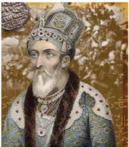

என்று கோருவதற்ககாக அங்கு குழுமியது. பெரும் தயக்கங்களுக்குப் பிறகு இரண்டடாம் பக தூர் ஷா இந்துஸ்ததானத்தின் (ஷாஹின்ஷஷா இ-ஹிந்துஸ்ததான்) மாமன்னராக பதவியேற்றறார். அதனை அடுத்து விரைவாக வடமேற்கு மாகாணம் ம ற்றும் அயோத்தி பகுதிகளைக் கிளர்ச்சியாளர்கள் கைப்பற்றினார்கள். தில்லி வீழ்ச்சி அடைந்தது ப ற்றிய செய்தி கங்ககை நதிப்பள்ளத்ததாக்ககை எட்டியவுடன், ஜூன் மாதத் தொடக்கம் வரை ஒவ்வொரு இராணுவக் குடியிருப்பு பகுதியிலும் கிளர்ச்சிகள் நடந்தன. வட இந்தியாவில் குறிப்பபாக ப ஞ்சசாப் மற்றும் வங்ககாளத்ததைத் தவிர ஆங்கிலேய ஆட்சி காணாமல் போனது.

**உள்நநாட்டு கிளர்ச்சி**

வட இந்தியாவின் பாதிக்கப்பட்ட கிராம சமூகத்தில் வாழ்ந்த மக்களும் இந்தக் கிளர்ச்சிக்கு சரிசமமாக ஆதரவு தெரிவித்தனர். ஆங்கிலேய இராணுவத்தில் வேலை பார்த்த சிப்பபாய்கள் உண்மமையில் சீருடையில் இருந்த விவசாயிகள் ஆவர். வருவாய் நிர்வவாகம் மறுசீரமைப்பு செய்யப்பட்டதில் அவர்களும் சமமான பாதிப்புகளை அடைந்தனர். சிப்பபாய் கலகமும் அதனை அடுத்து இந்தியாவின் பல பகுதிகளில் நடந்த உள்நநாட்டு கிளர்ச்சியும் ஊரகப் பகுதிகளுடன் இணைப்பபைக் கொண்டவையாகும். வடமேற்கு மாகாணங்கள் ம ற்றும் அயோத்தியின் பகுதிகளில் இந்த முதலாவது உள்நநாட்டு கிளர்ச்சி வெடித்தது. இந்த இரண்டு பகுதிகளில் இருந்துதான் சிப்பபாய்கள் முக்கியமாகப் பணியில் சேர்க்கப்பட்டனர். பெரும் எண்ணிக்ககையிலான ஜமீன்ததாரர்களும் தாலுக்ததார்களும் ஆங்கிலேய அரசின் கீழ் பல சலுகைகளை இழந்த காரணத்ததால் கிளர்ச்சி நோக்கி ஈர்க்கப்பட்டனர். தாலுக்ததார்-விவசாயக் கூட்டணி என்பது தாங்கள் இழந்ததை மீட்கும் ஒரு பொது முயற்சியாகக் கருதப்பட்டது. அதேபோன்று, ப ல இந்திய மாநிலங்களில் ஆட்சியாளர்கள் ப ட்டத்ததைத் துறக்க நேரிட்டதால் அவர்களால்

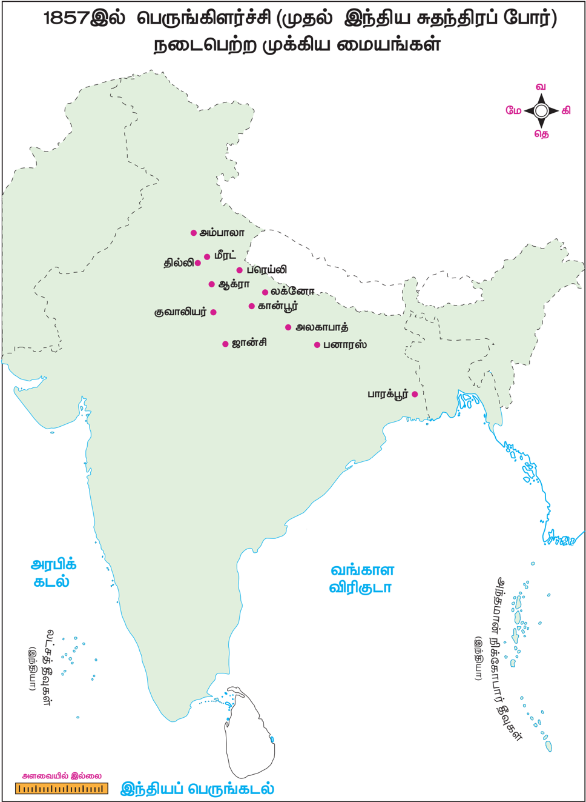

காலனியத்துக்கு எதிரான இயக்கங்களும் தேசியத்தின் தோற்றமும் 85

ஆதரிக்கப்பட்ட கைவினைக்கலைஞர்களும் சரிசமமாக அவதியுற்றனர். ஆங்கிலேயப் பொருட்களால் இந்திய கைவினைப் பொருட்கள் ப திக்கப்பட்டு ஆயிரக்கணக்ககான நெசவாளர்கள் வேலை இழந்தனர். ஆங்கிலேயர்களுக்கு எதிரான ஒட்டுமொத்த ஆத்திரம் கிளர்ச்சியாக வெடித்தது.

**பிரிட்டிஷாருக்கு எதிராகப் போராடிய முக்கியப் போராட்ட வீரர்கள்**

ப திக்கப்பட்ட அரசர்கள், நவாபுகள், அரசிகள், ஜமீன்ததாரர்கள், ஆகியோர் ஆங்கிலேயர்களுக்கு எதிரான தங்கள் ஆத்திரத்ததைப் ப யன்படுத்திக்கொள்ள இந்தக் கிளர்ச்சி ஒரு மேடையை அமைத்துக் கொடுத்தது. கடைசி பேஷ்வவா மன்னரான இரண்டடாவது பாஜிராவின் தத்துப்பிள்ளளையான நானா சாகிப், கான்பூர் ப குதியில் இந்த கிளர்ச்சிக்குத் தலைமை தாங்கினார். அவருக்கு ஓய்வூதியம் தர கம்பபெனி மறுத்துவிட்டது. அதேபோன்று, லக்னோவில் பேகம் ஹஸ்ரத் மகால், பரெய்லியில் கான் பகதூர் ஆகியோர் தத்தமது ப குதிகளில் பொறுப்பபை ஏற்றுக்கொண்டனர். ஒருகாலத்தில் இந்தப் பகுதிகள் அவர்களாலோ அல்லது அவர்களுடைய மூதாதையர்களாலோ ஆளப்பட்டவையாகும்.

இந்தக் கிளர்ச்சியின் மற்றொரு முக்கிய தலைவராக ஜான்சியின் ராணி லட்சுமிபாய் திகழ்ந்ததார். அவரது விஷயத்தில், வங்ககாளத்தின் தலைமை ஆளுநரான டல்ஹௌசி பிரபு, லட்சுமிபாயின் கணவர் மறைந்தபிறகு அவரது வாரிசாக ஒரு ஆண்பிள்ளளையை தத்து எடுத்துக்கொள்ள அனுமதி தர மறுத்துவிட்டதால் வாரிசு இழப்புக் கொள்ககையின் அடிப்படையில் அவரது அரசு ஆங்கிலேய அரசுடன் இணைக்கப்பட்டது. ச க்திவாய்ந்த ஆங்கிலேயர்களுக்கு எதிராக போரைத் துவக்கிய ராணி லட்சுமிபாய் தாம் வீழும் வரை ஆங்கிலேயரை எதிர்த்துப் போராடினார்.

பக தூர் ஷா ஜாபர், கன்வர் சிங், கான் பகதூர், ராணி லட்சுமிபாய் மற்றும் பலரும், ஆங்கிலேய

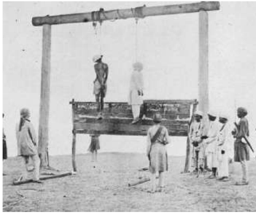

காலனியத்துக்கு எதிரான இயக்கங்களும் தேசியத்தின் தோற்றமும்

ஆட்சியை ஏற்கமறுத்த சிப்பபாய்களின் வீரதீரத்ததால் நிர்ப்பந்திக்கப்பட்ட பலரும் இவர்களில் அடங்குவர்.

**(இ) கிளர்ச்சி அடக்கப்படுதல்**

1857ஆம் ஆண்டு ஜூன் மாத தொடக்கத்தில் தில்லி, மீரட், ரோகில்கண்ட், ஆக்ரரா, அலகாபாத் ம ற்றும் பனாரஸ் ஆகிய மண்டலங்களின் படைகள் ஆங்கிலேயரின் கட்டுப்பபாட்டின் கீழ் கொண்டுவரப்பட்டு கடுமையான இராணுவச்சட்டம் அமல்படுத்தப்பட்டது.

**(ஈ) தோல்விக்ககான காரணங்கள்**

1857ஆம் ஆண்டு நடந்த கிளர்ச்சி ஒருங்கிணைக்கப்பட்டது மற்றும் திட்டமிடப்பட்டது என்பதை நிரூபிக்க எந்தவித ஆதாரமும் இல்லலை . அது தானாக நடந்தது. ஆனால் தில்லி முற்றுகை இடப்பட்ட பிறகு அண்டடை மாநிலங்களின் ஆதரவைப்பபெற முயற்சி மேற்கொள்ளப்பட்டது. மேலும் ஒருசில இந்திய மாநிலங்களைத் தவிர, இந்தக் கிளர்ச்சியில் பங்ககேற்க இந்திய இளவரசர்களிடம் பொதுவாக ஆர்வம் குறைந்து காணப்பட்டது. க லனி அரசுக்கு விசுவாசமாக அல்லது ஆங்கிலேய அதிகாரத்ததை அறிந்து அச்சப்பட்டு இந்திய அரசர்களும் ஜமீன்ததாரர்களும் ஒதுங்கியிருந்தனர். கிளர்ச்சியில் ஈடுபட்டவர்களும் குறைந்த அளவே ஆயுதங்கள் மற்றும் வெடிபொருட்கள் கிடைத்தோ அல்லது கிடைக்ககாமலோ இருந்தனர். ஆங்கில அறிவு பெற்ற நடுத்தர வகுப்பும் கிளர்ச்சிக்கு ஆதரவு தெரிவிக்கவில்லலை .

ம த்திய தலைமை இல்லலாததும் கிளர்ச்சி தோல்வியடைய முக்கிய காரணமாக அமைந்தது. தனிநபர்கள், இந்திய அரசர்கள் மற்றும் ஆங்கிலேய அரசுக்கு எதிராகசண்டடையிட்டபல்வவேறு சக்திகளை ஒன்றிணைக்கப் பொதுவான செயல்திட்டம் ஏதுமில்லலாமல் போனது.

இறுதியில் ஆங்கிலேய ராணுவம் கிளர்ச்சியை கடுமையாக ஒடுக்கியது. ஆயுதங்கள் கிடைக்கப்பபெறாமை, அமைப்பபாற்றல் இன்மமை, ஒழுக்கமின்மமை, உதவியாளர்களால் க ட்டிக்கொடுக்கப்பட்டது ஆகிய காரணங்களால்

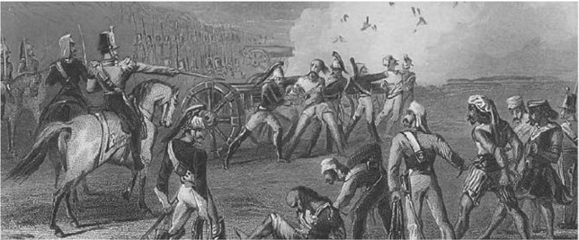

*புரட்சியில் ஈடுபட்ட சிப்பபாய்களை பீரங்கிகளில் கட்டி சுடுதல்*

86

கிளர்ச்சித் தலைவர்கள் தோல்வி அடைந்தனர். 1857ஆம் ஆண்டின் பிற்பகுதியில் தில்லி ஆங்கிலேய துருப்புகளால் கைப்பற்றப்பட்டது. சிறைபிடிக்கப்பட்ட பக தூர் ஷா பர்மமாவுக்கு கொண்டு செல்லப்பட்டடார்.

1858ஆம் ஆண்டு நவம்பர் மாதம் இந்திய அரசு சட்டம் பிரிட்டிஷ் நாடாளுமன்றம் ஏற்றுக்கொள்ளப்பட்டு, நாடாளுமன்றத்ததால் நேரடியாக ஆட்சி அதிகாரம் செலுத்தப்படும் ஆங்கிலேய அரசின் காலனிகளில் ஒன்றறாக இந்தியா அறிவிக்கப்பட்டது. அமைச்சரவை உறுப்பினர் ஒருவரிடம் பொறுப்பு வழங்கப்பட்டது, அவர் இந்தியாவுக்ககான அரசுச் செயலராக பதவி வகிப்பபார்.

**நிர்வவாகத்தில் செய்யப்பட்ட மாற்றங்கள்**

1857ஆம் ஆண்டுக்குப் பிறகு பிரிட்டிஷ் ஆட்சியும் அதன் கொள்ககைகளும் பெரிய அளவில் ம ற்றங்களைச் சந்தித்தன. சமூக சீர்திருத்தம் தொடர்பபான விஷயத்தில் பிரிட்டிஷ் அரசு எச்சரிக்ககை மிகுந்த அணுகுமுறையைக் கையாண்டது. இந்திய மக்களுக்கு விக்டோரியா அரசியார் செய்த அறிவிப்பில், பாரம்பரிய நிறுவனங்கள் மற்றும் மதம் தொடர்பபான விஷயங்களில் ஆங்கிலேய அரசு தலையிடாது என்று தெரிவித்ததார். அரசுப்பணிகளில் இந்தியர்கள் சேர்த்துக்கொள்ளப்படுவார்கள் என்றும் உறுதிமொழி கூறப்பட்டது. இந்திய இராணுவத்தின் க ட்டமைப்பில் இரண்டு முக்கிய மாற்றங்கள் செய்யப்பட்டன. இந்தியர்களின் எண்ணிக்ககை வெகுவாகக் குறைக்கப்பட்டது. முக்கியமான பதவிகள் மற்றும் பொறுப்புகள் வகிப்பதிலிருந்து இந்தியர்கள் விலக்கி வைக்கப்பட்டனர். க லாட்படையின் கட்டுப்பபாட்டடை எடுத்துக்கொண்ட ஆங்கிலேயர், அவற்றுக்கு ஆளெடுக்கும் முயற்சியை இதர பகுதிகளுக்கும் 1857ஆம் ஆண்டின் கிளர்ச்சியின்போது ஆங்கிலேயருக்கு விசுவாசமாக இருந்த சமூகங்களுக்கும் மாற்றினார்கள். உதாரணமாக ராஜபுத்திரர்கள், பிராமணர்கள், வடஇந்திய முஸ்லிம்கள் ஆகியோரை விலக்கி வைத்த ஆங்கிலேயர் கூர்க்ககாக்கள், சீக்கியர்கள், பதான்கள் போன்ற இந்து அல்லலாத குழுக்களுக்கு முக்கியத்துவம் கொடுத்தனர். இவற்றுடன், இந்திய சமூகத்தின் சாதி, மதம், மொழி மற்றும் மண்டலம் ஆகியன சார்ந்த வேறுபாடுகளை ஆங்கிலேயர்கள் தங்களுக்குச் சாதகமாகப் பயன்படுத்திக் கொண்டதையடுத்து அது 'பிரித்ததாளும் கொள்ககை' என்று அறியப்பட்டது.

### 7.3 பிரிட்டிஷ் ஆட்சியின் கீழ் விவசாயிகளின் கிளர்ச்சிகள்

(இண்டிகோ)

கிளர்ச்சி

செயற்ககை நீலச்சசாயம் உருவாக்கப்படும் முன் இயற்ககையான கருநீலச்சசாயம் உலகம் முழுவதும் இருந்த ஆடை தயாரிப்பபாளர்களால் பெரிதும் ம தித்துப் போற்றப்பட்டது. பல ஐரோப்பியர்கள் இண்டிகோ பயிரிட இந்திய விவசாயிகளை ப ணியில் அமர்த்தினார்கள். பின்னர் அது சாயமாக தொழிற்சசாலைகளில் உருவாக்கப்பட்டது. அதன் பிறகு அந்த சாயம் ஐரோப்பபாவுக்கு ஏற்றுமதி செய்யப்பட்டது. விவசாயிகள் இந்தப் பயிரை ப யிரிடுமாறு நிர்ப்பந்திக்கப்பட்டனர். ஆங்கிலேய முகவர்கள் பயிரிடுவோருக்கு நிலத்துக்ககான வாடகை மற்றும் இதர செலவுகளை சமாளிப்பதற்ககாக , ரொக்கப்பணத்ததை முன்பணமாகக் கொடுத்து உதவினர். ஆனால் இந்த முன்பணம் வட்டியுடன் திரும்பச் செலுத்தப்படவேண்டும். உணவு தானியப் ப யிர்களுக்குப் பதிலாக இண்டிகோ பயிரைப் ப யிரிட விவசாயிகள் வற்புறுத்தப்பட்டனர். ப ருவத்தின் இறுதியில் இண்டிகோ பயிருக்கு மிகக்குறைந்த விலையையே விவசாயிகளுக்கு ஆங்கிலேய முகவர்கள் கொடுத்தனர். இந்த குறைந்த தொகையைக் கொண்டு தாங்கள் வாங்கிய முன்பணத்ததைத் திரும்பச் செலுத்த முடியாது என்பதால் அவர்கள் கடனில் மூழ்கினர். எனினும், லாபம் கிடைக்ககாத நிலையிலும், மீண்டும் இண்டிகோ பயிரை பயிரிடும் மற்றொரு ஒப்பந்தத்ததை மேற்கொள்ளுமாறு விவசாயிகள் மீண்டும் நிர்ப்பந்திக்கப்பட்டனர். விவசாயிகளால் தாங்கள் வாங்கிய கடனை திரும்பச் செலுத்த முடியவே இல்லலை . தந்ததை வாங்கிய கடன்கள் அவரது மகன் மீதும் சுமத்தப்பட்டன.

இண்டிகோ கிளர்ச்சி 1859ஆம் ஆண்டு தொடங்கியது. இந்தக் கிளர்ச்சி ஒரு வேலைநிறுத்த வடிவில் தொடங்கியது. வங்ககாளத்தின் நடியா ம வட்டத்தின் ஒரு கிராமத்ததைச் சேர்ந்த விவசாயிகள் இனி இண்டிகோ பயிரிடப்போவதில்லலை என ம றுத்து வேலைநிறுத்தத்தில் ஈடுபட்டனர். இந்த இயக்கம் இண்டிகோ பயிரிடப்பட்ட வங்ககாளத்தின் இதர மாவட்டங்களுக்கும் பரவியது. இந்தக் கிளர்ச்சி பின்னர் வன்முறையாக வெடித்தது. இந்து மற்றும் முஸ்லிம் விவசாயிகள் இந்தக் கிளர்ச்சியில் பங்ககேற்றனர். குடங்கள் மற்றும் உலோகத்தட்டுக்களை ஆயுதங்களாக ஏந்தியபடி பெண்களும் ஆடவரோடு இந்தப் போராட்டத்தில் ப ங்ககேற்றனர். ஆங்கிலேயப் பண்ணணை கொடுமைகள் குறித்து கல்கத்ததாவில் வாழ்ந்த

காலனியத்துக்கு எதிரான இயக்கங்களும் தேசியத்தின் தோற்றமும் 87

அப்போதைய இந்திய பத்திரிக்ககையாளர்கள் எழுதினார்கள். நீல் தர்பன் (இண்டிகோவின் க ண்ணணாடி) என்ற தலைப்பில் ஒரு நாடகத்ததை தீனபந்து மித்ரரா எழுதினார். இந்தியாவிலும் ஐரோப்பபாவிலும் வாழ்ந்தமக்களிடையே இண்டிகோ விவசாயிகள் குறித்த பிரச்சனைகளை கவனத்தில் கொண்டுவர இந்த நாடகம் பயன்பட்டது.

**(ஆ) தக்ககாண கலவரங்கள் 1875**

அதிக அளவிலான வரி விதிப்பு வேளாண்மமையைப் பாதித்தது. பஞ்சத்ததால் ஏற்படும் உயிரிழப்புகள் அதிகரித்தன. 1875ஆம் ஆண்டு மே மாதத்தில் தக்ககாணத்தில் வட்டிக்குப் ப ணம் வழங்குவோருக்கு எதிரான கலவரங்கள் பூனா அருகே உள்ள சூபா என்ற கிராமத்தில் முதன்முதலாக வெடித்ததாகப் பதிவாகியுள்ளது. பூனா மற்றும் அகமதுநகர் ஆகிய பகுதிகளில் சுமார் 30 கிராமங்களில் இதே போன்ற கலவரங்கள் ஏற்பட்டதாகப் பதிவாகியது. குஜராத்தில் வட்டிக்குப் ப ணம் வழங்குவோரை குறிவைத்துதான் இந்த கலவரங்கள் பெரும்பபாலும் அரங்ககேறின. ஆங்கிலேய ஆட்சியின் கீழ் விவசாயிகள் நேரடியாக வருவாயை அரசுக்கு செலுத்த நிர்ப்பந்திக்கப்பட்டனர். மேலும் புதிய சட்டப்படி எந்த நிலத்ததை அடமானம் வைத்து கடன் வாங்கப்பட்டதோ அந்த நிலத்ததை எடுத்துக்கொண்டு ஏலம் விட்டு கடன் தொகையை எடுத்துக்கொள்ள கடன்வழங்கியோருக்கு அனுமதி கிடைத்திருந்தது. இதன் விளைவாக உழும் வர்க்கத்திடமிருந்து நிலம் உழாத வர்க்கத்திடம் கைமாறத் தொடங்கியது. கடன் என்னும் மாய வலையில் சிக்கிய விவசாயிகள் நிலுவைத் தொகையைச் செலுத்த இயலாமல் பயிரிடுதலையும் விவசாயத்ததையும் கைவிட வேண்டிய அவல நிலைக்குத் தள்ளப்பட்டனர்.

### 7.4 இந்திய தேசிய காங்கிரஸ் நிறுவப்படுதல் (1870-1885)

**(அ) தேசியத்தின் எழுச்சி**

19ஆம் நூற்றறாண்டின் இரண்டடாவது பாதியில் ஆங்கிலக் கல்வி பெற்ற இந்தியர்களின் புதிய சமூக வகுப்பினர் மத்தியில் தேசிய அரசியல் குறித்த விழிப்புணர்வு ஏற்பட்டது. பல்வவேறு பிரச்சசாரங்கள் மூலமாக தேசம், தேசியம் மற்றும் பல்வவேறு ம க்களாட்சியின் உயர்ந்த இலட்சியங்கள் பற்றிய க ருத்துக்களை அதிக எண்ணிக்ககையிலான ம க்களுக்கு விழிப்புணர்வவை ஏற்படுத்தும் முக்கிய பணியை இந்திய அறிவாளர்கள் மேற்கொண்டனர். வட்டடார மொழி மற்றும் ஆங்கில அச்சு ஊடகங்களின் வளர்ச்சி இது போன்ற கருத்துகளைப் பரப்புவதில் முக்கியப் பங்ககாற்றியது.

காலனியத்துக்கு எதிரான இயக்கங்களும் தேசியத்தின் தோற்றமும்

எண்ணிக்ககையில் அவர்கள் குறைவாக இருந்ததாலும் தேசிய அளவிலான வீச்சசைக் கொண்டு அகில இந்தியா முழுவதும் தொடர்புகளை உருவாக்கும் திறன் பெற்றிருந்தனர். அவர்கள் வழக்கறிஞர்கள், பத்திரிக்ககையாளர்கள், அரசு ஊழியர்கள், ஆசிரியர்கள் அல்லது மருத்துவர்களாக ப ணியாற்றினார்கள். சென்னனைவாசிகள் சங்கம் (1852), கிழக்கிந்திய அமைப்பு (1866), சென்னனை மகாஜன சபை (1884), பூனா சர்வஜனிக் சபை (1870), பம்பபாய் மாகாண சங்கம் (1885) மற்றும் பல அரசியல் அமைப்புகளைத் தொடங்குவதில் அவர்கள் முனைப்பு காட்டினார்கள்.

க லனி ஆட்சி பற்றிய பொருளாதார விமர்சனத்ததை உருவாக்குவதே தொடக்ககால இந்திய தேசியவாதிகளின் பங்களிப்புகளில் முக்கியமான ஒன்றறாக இருந்தது.

தாதாபாய் நௌரோஜி, நீதிபதி ரானடே மற்றும் ரொமேஷ் சந்திர தத் ஆகியோர் காலனி ஆட்சியின் பொருளாதாரம் பற்றிய இந்த விமர்சனத்ததைச் செய்வதில் முக்கியப் பங்ககாற்றினார்கள். இந்தியாவை அரசியல் மற்றும் பொருளாதார ரீதியாக அடக்கி ஆள்வதுதான் பிரிட்டிஷாரின் வளத்துக்கு அடிப்படையானது என்பதை அவர்கள் தெளிவாக உணர்ந்தனர். இந்தியாவின் பொருளாதார வளர்ச்சிக்கு காலனி ஆதிக்கமே முக்கியத் தடையாக உள்ளதென்று அவர்கள் முடிவு செய்தனர்.

**(இ) குறிக்கோள்கள் மற்றும் வழிமுறைகள்**

ஒரு அகில இந்திய அமைப்பபை உருவாக்க முனைந்ததன் விளைவாக 1885ஆம் ஆண்டில் இந்திய தேசிய காங்கிரஸ் உருவானது. பம்பபாய், மதராஸ், க ல்கத்ததா ஆகிய மூன்று மாக ணங்களிலும் அரசியல் ரீதியாக தீவிரம் காட்டிய கல்வி அறிவு பெற்ற இந்தியர்களின்

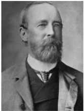

குழுக்கள் மேற்கொண்ட முயற்சிகளின் விளைவாக இந்திய தேசிய காங்கிரஸ் அமைப்பபை உருவாக்க A.O. ஹியூம் தமது சேவைகளை வழங்கினார். இந்திய தேசிய காங்கிரசின் முதல் (1885) தலைவராக உமேஷ் சந்திர பானர்ஜி இருந்ததார்.

1885 டிசம்பர் 28இல் இந்திய தேசிய க ங்கிரசின் முதல் அமர்வு (கூட்டம்) நடைபெற்றது. தேசிய ஒற்றுமை குறித்த உணர்வுகளை ஒருங்கிணைப்பதே காங்கிரஸின் ஆரம்பகால முக்கிய குறிக்கோள்களில் ஒன்றறாக இருந்ததாலும்

பிரிட்டனுக்கு விசுவாசமாக நடந்துகொள்ளவும் உறுதி மேற்கொண்டது. பிரிட்டனிடம் மேல்முறையீடுகள் செய்வது, மனுக்களைக் கொடுப்பது, அதிகாரப் பகிர்வு, ஆகியவற்றறை ஆங்கிலேய அரசு உருவாக்கிய அரசியல்சசாசன கட்டமைப்பிற்குள் செய்வது உள்ளிட்ட வழிமுறைகளை காங்கிரஸ் பின்பற்றியது. கீழ்க்கண்டவை சில முக்கிய கோரிக்ககைகள் ஆகும்:

- மாகாண மற்றும் மத்தியஅளவில் ச ட்டமேலவைகளை உருவாக்குவது.
- சட்டமேலவைகளுக்கு தேர்ந்ததெடுக்கப்படும் உறுப்பினர்களின் எண்ணிக்ககையை அதிகரிப்பது.
- நிருவாகத்துறையிலிருந்து நீதித்துறையைப் பிரிப்பது.
- இராணுவச்சசெலவுகளைக் குறைப்பது.
- உள்நநாட்டு வரிகளைக் குறைப்பது.
- நீதிபதி மூலமாக விசாரணையை விரிவுசெய்வது.
- ஒரே நேரத்தில் இந்தியாவிலும் இங்கிலாந்திலும் ஆட்சிப்பணித் தேர்வுகளை நடத்துவது.
- காவல்துறை சீர்திருத்தங்கள்.
- வனச்சட்டத்ததை மறுபரிசீலனை செய்தல்.
- இந்தியத் தொழிற்சசாலைகளின் மேம்பபாடு ம ற்றும் முறையற்ற கட்டணங்கள் மற்றும் க லால் வரிகளை முடிவுக்குக் கொண்டுவருவது.

**(ஈ) தீவிர தேசியவாதம்**

தொடக்ககால இந்திய தேசியவாதிகளின் மிதவாத கோரிக்ககைகள் தொடர்பபான ஆங்கிலேயர்களின் அணுகுமுறை குறிப்பிடத்தக்க அளவில் மாறவில்லலை என்பதால் மித தேசியவாத தலைவர்களின் திட்டங்கள் தோல்விகண்டன. "தீவிர தேசியவாதிகள்" என்று அழைக்கப்பட்ட தலைவர்களின் குழுவால் இவர்கள் விமர்சிக்கப்பட்டனர். மனுக்கள் மற்றும் கோரிக்ககைகள் கொடுப்பதை விட, சுய உதவியில் அதிக கவனம் செலுத்தினர்.

### 7.5 வங்கப் பிரிவினை

1905ஆம் ஆண்டின் வங்கப் பிரிவினை மிகவும் அதிருப்தியை ஏற்படுத்திய நிகழ்வவாகும். இந்தியா முழுவதும் விரிவான போராட்டங்கள் பரவ இந்தப் பிரிவினை வழிவகுத்ததன் மூலம் இந்திய தேசிய இயக்கத்துக்கு புதிய அத்தியாயத்ததை உருவாக்கியது.

இந்துக்கள், முஸ்லிம்கள் இடையே பிளவை உருவாக்கி வங்ககாளத்தில் ஆங்கிலேய ஆட்சிக்கு எதிராக நடந்த அரசியல் நடவடிக்ககைகளை அடக்க வங்கப்பிரிவினை வகுக்கப்பட்டது.

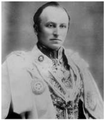

**(அ) இந்து-முஸ்லிம் பிரிவினை**

வங்ககாளிகளின் ஆதிக்கத்ததை கட்டுப்படுத்தி தேசியவாத இயக்கத்ததை வலுவிழக்கச் செய்வதே வங்கப் பிரிவினைக்ககான நோக்கம் என்று வெளிப்படையாக தெரிவிக்கப்பட்டது. வங்ககாளத்ததைப் இரண்டு நிருவாகப் பிரிவுகளின் கீழ் பிரித்து வைத்ததன் மூலம் வங்ககாள மொழி பேசும் மக்களை ஒரு மொழிசிறுபான்மமையினர் என்ற தகுதிக்கு கர்சன் பிரபு குறைத்துவிட்டடார். முகலாயர்களின் ஆட்சிக்ககாலங்களில் கூட அனுபவிக்ககாத ஒற்றுமையை முஸ்லிம்கள் கிழக்கு வங்ககாளம் என்ற புதிய மாகாணத்தில் அனுபவிப்பபார்கள் என்று கர்சன் உறுதியளித்ததார்.

மத அடிப்படையில் வங்ககாள மக்களைப் பிரிக்க நினைத்த பிரிவினைச்சசெயலானது அவர்களைப் பிரிப்பதற்குப் பதிலாக ஒன்றிணைத்தது. வங்ககாள அடையாளத்ததை உணர்வுப் பெருமையுடன் உருவாக்க வட்டடார மொழிப் பத்திரிகைகளின் வளர்ச்சி பெரும் பங்ககாற்றியது.

**(ஆ) பிரிவினைக்கு எதிரான இயக்கம்**

வங்கப் பிரிவினையை தடுக்கத் தவறிய மித தேசியவாதத் தலைவர்கள், தங்களுடைய உத்திகள் பற்றி மறு சிந்தனைக்கு நிர்ப்பந்திக்கப்பட்டடார்கள். ஆர்ப்பபாட்டங்களுக்கு புதிய வழிமுறையையும் அவர்கள் தேடத் தொடங்கினார்கள். பிரிட்டிஷ் பொருட்களை புறக்கணிப்பது அவற்றில் ஒரு முறையாகும். எனினும் சுதேசி இயக்கத்தின் கொள்ககை வங்கப் பிரிவினையைத் திரும்பப் பெறுவதை உறுதி செய்வதில் இன்னமும் கட்டுப்பட்டிருந்தது. முழுமையான மறைமுக எதிர்ப்பபைத் தொடங்குவதற்கு பிரச்சசாரத்ததைப் பயன்படுத்த மித தேசியவாதிகள் ஆதரவாக இல்லலை . மற்றொருபுறம் தீவிர தேசியவாதிகள் வங்ககாளத்ததை தாண்டி இந்த இயக்கத்ததை விரிவு செய்வதற்கு மிகப்பபெரிய அளவில் பொதுமக்கள் போராட்டத்ததைத் தொடங்க ஆதரவாக இருந்தனர்.

1905 அக்டோபர் 16இல் வங்ககாளம் அதிகாரபூர்வமாகப் பிரிவினையானபோது அந்தநாள் துக்கநாளாக அறிவிக்கப்பட்டது. ஆயிரக்கணக்ககானவர்கள் கங்ககை நதியில் புனித நீராடியதோடு வந்ததே மாதரம் பாடலை பாடியபடி

காலனியத்துக்கு எதிரான இயக்கங்களும் தேசியத்தின் தோற்றமும் 89

க ல்கத்ததாவின் சாலைகளில் அணிவகுத்துச் சென்றறார்கள்.

புறக்கணிப்பும் சுதேசி இயக்கமும் இந்தியாவைத் தற்சசார்பு அடையச் செய்யும் விரிவான திட்டத்தின் ஒரு பகுதியாக எப்போதும் ஒன்றுடன் ஒன்று இணைந்ததே இருந்தன. வங்ககாளத்தில் சுதேசி இயக்கத்தின் போது நான்கு முக்கியப் போக்குகள் காணப்பட்டன:

- மிதவாதப் போக்கு
- ஆக்கபூர்வ சுதேசி
- தீவிர தேசியவாதம்
- புரட்சிகர தேசியவாதம்

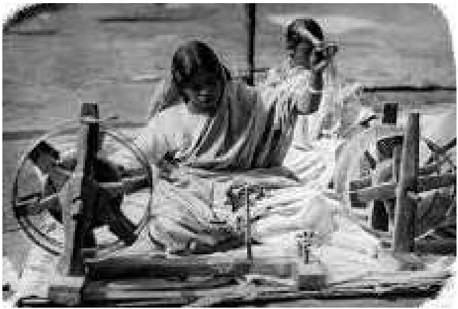

**ஆக்கபூர்வ சுதேசி**

ஆக்கபூர்வ திட்டங்கள் அனைத்தும் பெரும்பபாலும் சுய உதவியையே வலியுறுத்தின. ஆங்கிலேய ஆட்சியின் கட்டுப்பபாட்டில் சிக்ககாமல் சுதந்திரமாகச் செயல்படக்கூடிய உள்ளளாட்சி அமைப்புகளை மாற்றறாக உருவாக்குவது குறித்து அது கவனம் செலுத்தியது. மக்களை சுயமாக வலுவாக்க வேண்டிய அவசியம் குறித்து அது வலியுறுத்தியது. துணிகள், கைத்தறி ஆடைகள், ச வக்ககாரம் (சோப்புகள்), மண்பபாண்டங்கள், தீப்பபெட்டி, தோல்பொருட்கள் ஆகியன எங்கும் ப ரவியிருந்த சுதேசி கடைகளில் விற்கப்பட்டன.

**மறைமுக எதிர்ப்பு**

1906இல் சுதேசி இயக்கம் மாற்றுப்பபாதையில் செல்லத் தொடங்கியது. இந்த புதிய திசையில் சுதேசி இயக்கம் நான்கு அம்சங்களைக் கொண்டிருந்தது. அந்நியப் பொருட்களைப் புறக்கணிப்பது; அரசுப்பள்ளிகள், கல்லூரிகளைப் புறக்கணிப்பது, நீதிமன்றங்கள், பட்டங்கள் ம ற்றும் அரசு சேவைகளை புறக்கணிப்பது; சுதேசி தொழிற்சசாலைகளை மேம்படுத்துவது;

காலனியத்துக்கு எதிரான இயக்கங்களும் தேசியத்தின் தோற்றமும்

பொறுத்துக்கொள்ளும் அளவைத் தாண்டி ஆங்கிலேயர்களின் அடக்குமுறை இருக்குமானால் ஆயுதமேந்திய போராட்டத்துக்கு ஆயத்தமாவது என நான்கு அம்சங்கள் பின்பற்றப்பட்டன.

**தீவிர தேசியவாதம்**

ப ஞ்சசாபின் லாலா லஜபதி ராய், மக ராஷ்டிராவின் பால கங்ககாதர திலகர், வங்ககாளத்தின் பிபின் சந்திர பால், ஆகிய மூன்று முக்கிய தலைவர்களும் சுதேசி காலத்தில் எ ப்போதும் லால்-பால்–பால் (Lal-Bal-Pal) மூவர் என்று குறிக்கப்பட்டனர். சுதேசி இயக்கத்தின்போது தீவிர தேசியவாதத்தின் இயங்கு தளமாக பஞ்சசாப், மகாராஷ்டிரா, வங்ககாளம் ஆகியன உருவெடுத்தன. தென்னிந்தியாவில் வ.உ. சிதம்பரனார் சுதேசி க ப்பல் நிறுவனத்ததை தொடங்கியதை அடுத்து தூத்துக்குடி சுதேசி இயக்கத்தின் மிகமுக்கியத் தளமாக விளங்கியது.

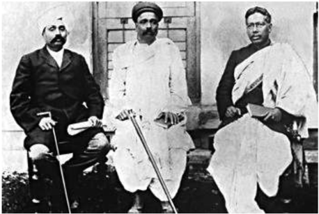

**சுயராஜ்ஜியம் அல்லது அரசியல் சுதந்திரம்**

சுயராஜ்ஜியம் அல்லது தன்னனாட்சி அடைவதே தீவிரவாதத் தன்மமை கொண்ட தலைவர்களின் பொதுக் குறிக்கோள்களில் ஒன்றறாக இருந்தன. எனினும் சுயராஜ்ஜியம் என்ற வார்த்ததையின் பொருளில் தலைவர்கள் வேறுபட்டனர். திலகரைப் பொறுத்தவரை சுயராஜ்ஜியம் என்பது, முழுமையான தன்னனாட்சி மற்றும் அந்நிய ஆட்சியில் இருந்து முழுமையான விடுதலை பெறுவதாக இருந்தது.

### 7.6 தன்னனாட்சி (ஹோம் ரூல்) இயக்கம் (1916-18)

லோகமான்ய பாலகங்ககாதர திலகர், அன்னிபெசன்ட் அம்மமையார் ஆகியோர் தலைமையிலான தன்னனாட்சி (1916-1918) இயக்கத்தின் போது இந்திய தேசிய இயக்கம் புத்துயிரூட்டப்பட்டு தீவிரப்படுத்தப்பட்டது. முதல் உலகப் போரும், இந்தியா அந்தப் போரில் ப ங்ககேற்றதும் தான் தன்னனாட்சி இயக்கத்துக்ககான

பின்னணியாகும். 1914ஆம் ஆண்டில் ஜெர்மனிக்கு எதிராக பிரிட்டன் போர் அறிவித்த நிலையில் மித தேசியவாத மற்றும் தாராளமய தலைமை பிரிட்டிஷாருக்ககாக ஆதரவைத் தந்தது. அதற்குப் பதில் பிரிட்டிஷ் அரசு போருக்குப் பிறகு தன்னனாட்சியை இந்தியாவிற்கு வழங்கும் என்று எதிர்பபார்க்கப்பட்டது. உலகப் போரின் பல அரங்குகளுக்கு இந்தியத் துருப்புகள் அனுப்பப்பட்டன. ஆனால், இந்தக் குறிக்கோள்கள் குறித்து பிரிட்டிஷ் அரசுக்கு எந்தவித உறுதிப்பபாடும் இல்லலை. இந்தியாவின் தன்னனாட்சிக்கு வழிவகுக்கும் காரணத்துக்கு உதவாமல் ஆங்கிலேய அரசு ஏமாற்றியதால் ஆங்கிலேய அரசுக்கு நெருக்கடி தரும் புதிய மக்கள் இயக்கத்துக்ககான அழைப்பபாக இது உருவெடுத்தது.

**(அ) தன்னனாட்சி இயக்கத்தின் குறிக்கோள்கள்**

- அரசியலமைப்பு வழிகளைப் பயன்படுத்தி பிரிட்டிஷ் பேரரசிற்குள் தன்னனாட்சியை அடைவது.
- தன்னனாட்சிப் பகுதி (டொமினியன்) என்ற தகுதியை அடைவது. ஆஸ்திரேலியா, கனடா, தென்னனாப்பிரிக்ககா மற்றும் நியூசிலாந்து ஆகியவற்றுக்குப் பின்னர் இந்த அரசாட்சி சாராத நிலை வழங்கப்பட்டது.
- அவர்களின் இலக்குகளை அடைய வன்முறையல்லலாத அரசியல்சசாசன வழிமுறைகளைக் கையாள்வது.

**(ஆ) லக்னோ ஒப்பந்தம் (1916)**

தன்னனாட்சி இயக்கமும் அதனையடுத்து மித தேசியவாதிகள் மற்றும் தீவிர தேசியவாதிகளின் ம று இணைப்பு காரணமாக முஸ்லிம்களுடன் புதிய பேச்சுகளுக்ககான சாத்தியக்கூறு

லக்னோ ஒப்பந்தத்தின்போது ஏற்பட்டது. லக்னோ ஒப்பந்தத்தின் (1916) போது காங்கிரஸ் கட்சியும் முஸ்லிம் லீக்கும் இந்தியாவில் விரைவில் தன்னனாட்சி வேண்டுமென்பதை ஏற்றுக்கொண்டது. இதற்கு ப திலாக முஸ்லிம்களுக்கு தனித் தொகுதிகளை வழங்கும் திட்டத்ததை காங்கிரஸ் தலைமை ஏற்றது.

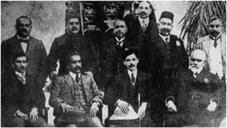

**(இ) பிரிட்டிஷாரின் பதில் நடவடிக்ககை**

சுயராஜ்ஜியத்துக்ககான கோரிக்ககையை திலகரும் அன்னிபெசன்ட் அம்மமையாரும் எழுப்பியது பிரபலமானதைத் தொடர்ந்து தலைவர்களை தனிமைப்படுத்தி அவர்களின் செயல்பபாடுகளை முடக்கும் அதே பழைய திட்டத்ததை ஆங்கிலேய அரசு ப யன்படுத்தியது.

1919இல் மாண்டடேகு-செம்ஸ்ஃபோர்ட் சீர்திருத்தங்களை ஆங்கிலேய அரசு அறிவித்தது. இதன் மூலம் இந்தியா தன்னனாட்சி நோக்கி ப டிப்படியாக முன்னனேற உறுதி கூறப்பட்டது. இந்திய தேசியவாதிகள் இடையே இது மிகப்பபெரிய ஏமாற்றத்ததை ஏற்படுத்தியது. மேலும் ஒரு பேரிடியாக , தன்னிச்சசையான கைது மற்றும் கடும் தண்டனைகளுடன் கூடிய ரௌலட் சட்டத்ததை அரசு இயற்றியது.

**பாட ச்சுருக்கம்**

- பத்தொன்பதாம் நூற்றறாண்டின் பிற்பகுதியில் ஆங்கிலேய இந்தியாவில் காலனிய அரசியல் மற்றும் பொருளாதார ஆதிக்கத்துக்கு எதிராக விவசாயிகள் மற்றும் பழங்குடியினர் ஆர்ப்பபாட்டங்களில் ஈடுபடுவது அதிகரித்தது.
- பல்வவேறு ஆங்கிலேய எதிர்ப்புப் போக்குகளின் முடிவாக 1857இல் மிகப்பபெரிய கிளர்ச்சி ஏற்பட்டது. ஆங்கிலேயர்கள் இந்தியாவை ஆளத் தொடங்கியதற்கு முன்பிருந்த பழைய முறைமையை மீண்டும் நிலைநிறுத்தும் நோக்கங்களைக் கொண்ட, நிலப்பிரபுத்துவத் தலைவர்கள் இந்தக் கிளர்ச்சிக்கு தலைமை ஏற்றிருந்தனர்.
- கிளர்ச்சியின் தலைவர்கள் தொலைநோக்குப் பார்வவையின்றி உள்ளூர் நோக்கங்களுக்ககாக கிளர்ச்சியை வழிநடத்தியபோதிலும் கொடுங்கோன்மமையான அன்னிய அரசுக்கு சவால்விட்டு எதிர்க்கும் வகையில் ஒரு முற்போக்ககான முயற்சியாக அது அமைந்தது.
- சுரண்டல்வவாத, அடக்குமுறை சார்ந்த ஆங்கிலேய அரசுக்கு எதிரான பொதுக்கருத்துகளை உருவாக்கிய இந்திய தேசிய இயக்கம், காலனி ஆதிக்கத்துக்கு எதிரான போராட்டங்களில் தங்களையும் ஈடுபடுத்திக்கொள்ள இளைய தலைமுறையினரை ஊக்கப்படுத்தியது.
- தேசிய அரசியலில் பொதுமக்கள் பங்ககேற்பதை அதிகரிக்க சுதேசி இயக்கம் உதவியது.

காலனியத்துக்கு எதிரான இயக்கங்களும் தேசியத்தின் தோற்றமும் 91

**க லைச்சொற்கள்**

|  |  |  |
| --- | --- | --- |
| நினைத்ததை நிறைவேற்ற போடப்பட்ட திட்டம் | orchestrated | organized to achieve a desired effect |
| இரகசிய | clandestine | secret |
| மீட்கின்ற | restorative | re-establishing |
| கீழ்க்குத்தகைக்கு விடுதல், உள் குத்தகைக்கு விடுதல் | subletting | property leased by one lessee to another |
| அனைத்து மக்களுக்கும் சமமான | egalitarian | equal rights for all people |
| வலுக்கட்டடாயமாக | coercive | forcible |
| தாக்குதல் மூலம் பணம், பொருள் பறித்தல் | extortion | the practice of taking something from an unwilling person by physical force |
| நிறைவில்லலாத, திருப்தியற்ற | disgruntled | dissatisfied, frustrated |
| மிக மோசமான, படுபாதாளமான | abysmal | extremely bad, deep and bottomless |
