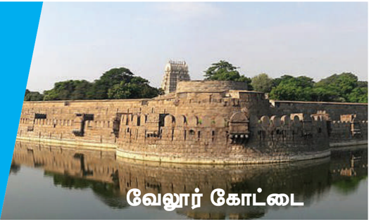
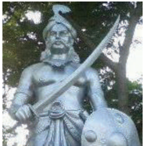
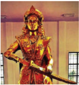
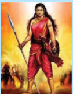
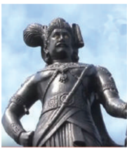
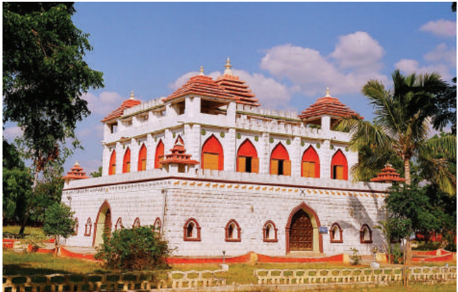
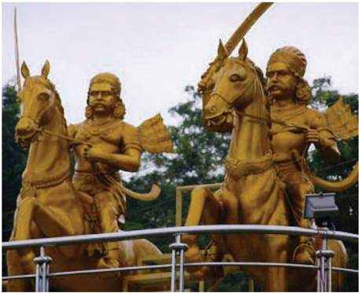
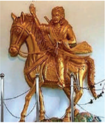
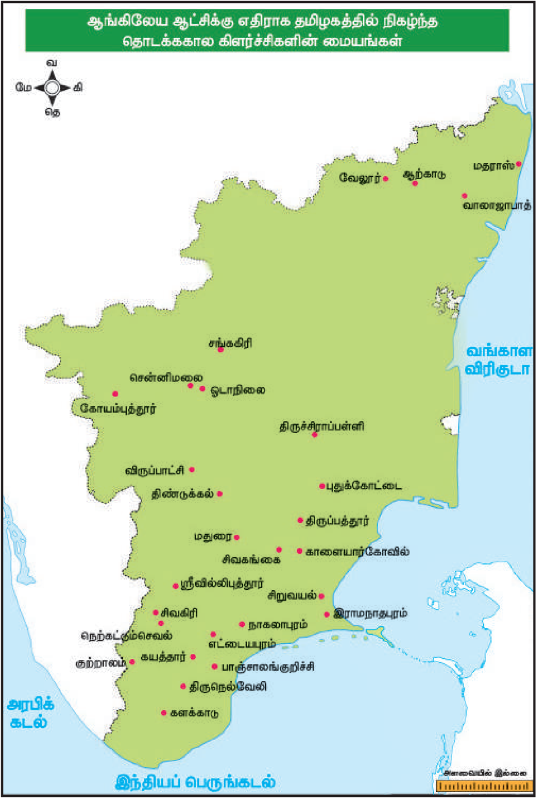

**அலகு - 6**

**ஆங்கிலேய ஆட்சிக்கு எதிராக தமிழகத்தில் நிகழ்ந்த தொடக்ககால கிளர்ச்சிகள்**

**க ற்றலின் நோக்கங்கள்**

**கீழ்க் காண்பனவற்றோடு அறிமுகமாதல்**

- பாளையக்ககாரர் அமைப்பும், ஆங்கிலேயர்களுக்கு எதிரான பாளையக்ககாரர்களின் புரட்சியும்
- வேலுநாச்சியார், பூலித்ததேவர், கட்டபொம்மன், மருது சகோதரர்கள் போன்றோரின் ஆங்கிலேய எதிர்ப்புக் கிளர்ச்சிகள்
- தென்னிந்தியாவில் ஆங்கிலேயரின் அடக்குமுறைக்கு பதிலடியாக அமைந்த வேலூர் புரட்சி

**அறிமுகம்**

பிரெஞ்சுப் படைகளையும், அதோடு தோழமை கொண்டிருந்த இந்திய ஆட்சியாளர்களையும் மூன்று கர்நநாடகப் போர்களில் தோற்கடித்திருந்த கிழக்கிந்திய கம்பபெனி தனது அதிகாரத்ததையும், செல்வவாக்ககையும் விரிவாக்கி ஒருங்கிணைக்கத் தொடங்கியது. எனினும் உள்ளூர் ஆட்சியாளர்களும் நிலக்கிழார்களும் இதனை எதிர்த்தனர். நாடுபிடிக்கும் அவர்களின் நோக்கத்திற்கு முதல் எதிர்வினை திருநெல்வவேலிப் பகுதியில் (தற்போதைய தென்ககாசி மாவட்டத்தின்) நெற்கட்டும்சசெவலில் ஆட்சிபுரிந்து வந்த பூலித்ததேவரிடமிருந்து வெளிப்பட்டது. இதைத்தொடர்ந்து வேலுநாச்சியார், வீரபாண்டிய கட்டபொம்மன், மருது சகோதரர்கள், தீரன் சின்னமலை போன்ற தமிழகத்தின் பிற பகுதிகளை ஆட்சிபுரிந்து வந்தோரும் எதிர்த்தனர். பாளையக்ககாரர் போர் என அறியப்படும் இது 1806இல் நிகழ்ந்த வேலூர் புரட்சிக்கு இட்டுச் சென்றது. தமிழ்நநாட்டில் பிரிட்டிஷாருக்கு எதிராகத் தோன்றிய இத்தொடக்ககால எதிர்ப்புப் பற்றி இப்பபாடத்தில் காணலாம்.

### 6.1 ஆங்கிலேயருக்கு எதிரான மண்டல சக்திகளின் எதிர்ப்பு

(அ) பாளையங்களும் பாளையக்ககாரர்களும்

பாள யம் என்ற சொல் ஒரு பகுதியையோ , ஓர் இராணுவ முகாமையோ அல்லது

68

ஒரு சிற்றரசையோ குறிப்பதாகும். பாளையக்ககாரர்கள் (இவர்களை ஆங்கிலேயர்கள் 'போலிகார்' (Poligar) என்று குறிப்பிட்டனர்) என்ற தமிழ்சச்சசொல் இறையாண்மமை கொண்ட ஒரு பேரரசுக்குக் கப்பம்கட்டும் குறுநில அரசைக் குறிக்கிறது. இவ்வமைப்பின் கீழ் தனிநபர் ஒருவர் ஆற்றிய சீரிய இராணுவ சேவைக்ககாக அவரின் கட்டுப்பபாட்டின்கீழ் பாள யம் கொடுக்கப்பட்டது. வாரங்கல்லலை சா ர்ந்த பிரதாபருத்ரனின் ஆட்சிக்ககாலத்தில் கா கதீய அரசில் இப்பபாளையக்ககாரர் முறை நடைமுறைப்படுத்தப்பட்டது. மதுரை நாயக்கராக 1529இல் பதவியேற்ற விஸ்வநாத நாயக்கர் அவர்தம் அமைச்சரான அரியநாதரின் உதவியோடு தமிழகத்தில் இம்முறையை அறிமுகப்படுத்தினார். பரம்பரை பரம்பரையாக 72 பாளையக்ககாரர்கள் இருந்திருக்கக்கூடும்.

பாள யக்ககாரர்களால் வரிவசூலிப்பதிலும், நிலப்பகுதிகளை நிர்வகிப்பதிலும், வழக்குகளை விசாரிப்பதிலும், சட்டம் ஒழுங்ககைப் பா துகாப்பதிலும் தன்னிச்சசையாகச் செயல்பட முடிந்தது. அவர்களது காவல் காக்கும் கடமை படிக்ககாவல் என்றும் அரசுக்ககாவல் என்றும் அழைக்கப்பட்டது. பல்வவேறு சந்தர்ப்பங்களில் நாயக்க ஆட்சியாளர்கள் தங்கள் அதிகாரத்ததைத் தக்கவைத்துக்கொள்ள பாளையக்ககாரர்கள் உதவிபுரிந்தனர். பாளையக்ககாரர்களுக்கும், அரசர்களுக்கும் இடையேயான தனிப்பட்ட உறவு மற்றும் புரிதல் மதுரை நாயக்கர்களால்

இம்முறை நிறுவப்பட்டதிலிருந்து இருநூறு ஆண்டுகளுக்கும் மேலாக அதாவது ஆங்கிலேயர் இந்நிலப்பகுதிகளைத் தங்கள் வசம் கொண்டு வரும்வரை நீடித்திருந்தது.

**கிழக்கு மற்றும் மேற்குப் பாளையங்கள்**

நாயக்க மன்னர்களால் உருவாக்கப்பட்ட 72 பாளையங்களுள் கிழக்கு மற்றும் மேற்கு என்ற இரு தொகுதிகளாகப் பிரிக்கப்பட்டிருந்த பாளையங்களே முக்கியத்துவம் பெற்றவையாகக் கருதப்பட்டன. கிழக்கில் அமையப்பபெற்ற பாளையங்கள் சாத்தூர், நாகலாபுரம், எட்டடையபுரம் ம ற்றும் பாஞ்சசாலங்குறிச்சி ஆகியனவும் மேற்கில் அமையப்பபெற்ற முக்கியமான பாளையங்கள் ஊத்துமலை , தலைவன்கோட்டடை , நடுவக்குறிச்சி, சிங்கம்பட்டி, சேத்தூர் ஆகியனவாகும்.

### 6.2 பாளையக்ககாரர்களின் புரட்சி (1755-1801)

**அ) பூலித்ததேவரின் புரட்சி (1755-1767)**

கர்னல் ஹெரான் தலைமையிலான கம்பபெனியின் படை ஒன்றறை அழைத்துக் கொண்டு மா ர்ச் 1755இல் மாபூஸ்ககான் (ஆற்ககாட்டு நவாபின் சகோதரர்) திருநெல்வவேலிக்குச் சென்றறார். ம துரை எளிதில் அவர்களது கையில் வீழ்ந்தது. அதன்பின் தொடர்ந்து கம்பபெனிக்குக் கீழ்ப்படிய ம றுத்துவந்த பூலித்ததேவரை அடக்க கர்னல் ஹெரான் பணிக்கப்பட்டடார். மேற்குப் பகுதியில் இருந்த பாளையக்ககாரர்களிடம் பூலித்ததேவர் மிகுந்த செல்வவாக்குப் பெற்றிருந்ததார். பீரங்கிகளின் தேவையும் துணைக்கலப்பொருட்கள் மற்றும்

படைவீரர்களின் ஊதியம் உள்ளிட்ட காரணங்களினால் ஹெரான் தனது திட்டத்ததைக் கை விட்டு மதுரைக்கு பின்வவாங்கினார். கம்பபெனி நிருவாகம் அவரைத் திரும்ப அழைத்ததோடு நிரந்தரப் பணிநீக்கம் செய்தும்

உத்தரவிட்டது.

**பிரிட்டிஷ் எதிர்ப்பபாளர்களின் கூட்டமைப்பும், நட்புக் கூட்டணியும்**

நவாப் சந்ததாசாகிப்பின் முகவர்களாக செயல்பட்டு வந்த மியானா, முடிமையா , நபீகான் கட்டடாக் எனும் மூன்று பத்ததாணிய அதிகாரிகள் ம துரை மற்றும் திருநெல்வவேலிப் பகுதிகளில் பொறுப்புவகித்தனர். அவர்கள் ஆற்ககாட்டு நவாபான முகமது அலிக்கு எதிராக மேற்கு

பாள யக்ககாரர்களுக்கு ஆதரவளித்தனர். அவர்களோடு பூலித்ததேவர் நெருக்கமான நட்புறவை ஏற்படுத்திக்கொண்டிருந்ததார். மேலும், பூலித்ததேவர் ஆங்கிலேயர்களுக்கு எதிராகப் போரிட பாள யக்ககாரர்களின் கூட்டமைப்பு ஒன்றறையும் ஏற்படுத்தினார். சிவகிரிப் பாளையக்ககாரர் நீங்கலாகப் பிற மறவர் பாளையங்கள் யாவும் அவரை ஆதரித்தன. எட்டடையபுரமும் பாஞ்சசாலங்குறிச்சியும் கூட இக்கூட்டமைப்பில் இணையவில்லலை . மேலும், ஆங்கிலேயர்கள் இராமநாதபுரம் மற்றும் புதுக்கோட்டடை மன்னர்களின் ஆதரவைப் பெ ற்றனர். பூலித்ததேவர் மைசூரின் ஹைதர் அலி மற்றும் பிரெஞ்சுக்ககாரர்களது ஆதரவினைப் பெற முயன்றறார். ஏற்கனவே மராத்தியர்களோடு கடுமையான மோதலில் ஈடுப்பட்டிருந்த ஹைதர் அலியால் பூலித்ததேவருக்கு உதவ இயலவில்லலை .

**களக்ககாடு போர்**

நவாப் கூடுதல் படைகளை மாபூஸ்ககானுக்கு அனுப்பி திருநெல்வவேலிக்குச் செல்லும் படையை பலப்படுத்தினார். மேலும், கம்பபெனியின் 1000 சிப்பபாய்களோடு நவாபால் அனுப்பப்பட்ட 600க்கும் மேற்பட்ட படை வீரர்களையும் மாபூஸ்ககான் பெற்றறார். மேலும், அவருக்கு கர்நநாடகப் பகுதியிலிருந்த குதிரைப் படை மற்றும் காலாட்படையின் ஆதரவும் இருந்தது. மாபூஸ்ககான் களக்ககாடு பகுதியில் தனது படைகளை நிலைநிறுத்தும் முன்பபாக திருவிதாங்கூரின் 2000 வீரர்கள் பூலித்ததேவரின் படைகளோடு இணைந்தனர். களக்ககாட்டில் நடைபெற்ற போரில் மாபூஸ்ககானின் படைகள் தோற்கடிக்கப்பட்டன.

**யூசுப்ககானும் பூலித்ததேவரும்**

பூலித்ததேவர் தலைமையில் ஒருங்கிணைக்கப்பட்ட பாளையக்ககாரர்கள் எதிர்ப்பு திருநெல்வவேலிப் பகுதியில் ஆங்கிலேயர் நேரடியாகத் தலையிடுவதற்ககான வாய்ப்பபை ஏற்படுத்திக் கொடுத்தது. திருவிதாங்கூர் மன்னரின் ஆதரவோடு 1756 முதல் 1763 வரையிலான கா லத்தில் பூலித்ததேவர் தலைமையிலான திருநெல்வவேலி பாளையக்ககாரர்கள் நவாபின் அதிகாரத்ததை எதிர்ப்பதையே முழு நோக்கமாகக் கொண்டிருந்தனர். கம்பபெனியாரால் அனுப்பப்பட்ட யூசுப்ககான் (கான்சசாகிப் என்றும் தமது மதமாற்றத்திற்கு முன்பு மருதநாயகம் என்றும் அழைக்கப்பட்டவர்), திருச்சிராப்பள்ளியில் இருந்து தான் எதிர்பபார்த்த பெரும்பீரங்கிகள் மற்றும் வெடிபொருட்கள் வந்துசேரும் வரை பூலித்ததேவர் மீது தாக்குதல் தொடுக்க அவர் ஆயத்தமாகவில்லலை . பிரெஞ்சுப் படைகளோடு ஒருபுறமும், ஹைதர் அலி மற்றும் மராத்தியரோடு மறுபுறமும்

ஆங்கிலேய ஆட்சிக்கு எதிராக தமிழகத்தில் நிகழ்ந்த தொடக்ககால கிளர்ச்சிகள் 69

ஆங்கிலேயர் போரில் ஈடுபட்டுக் கொண்டிருந்ததால் பீரங்கிப்படைகள் செப்டம்பர் 1760இல் தான் வந்து சேர்ந்தன. யூசுப்ககான் நெற்கட்டும்சசெவலில் கோட்டடையை முற்றுகையிடுவதற்ககாக நடத்திய இத்ததாக்குதல் இரண்டு மாதங்கள் நீடித்தது. 1761 மே 16இல் பூலித்ததேவரின் மூன்று முக்கியக் கோட்டடைகள் (நெற்கட்டும்சசெவல், வாசுதேவநல்லூர் ம ற்றும் பனையூர்) யூசுப்ககானின் கட்டுப்பபாட்டிற்குள் வந்தன.

இதற்கிடையே பாண்டிச்சசேரியைக் கைப்பற்றிய ஆங்கிலேயர்கள் பிரெஞ்சுக்ககாரர்களின் முக்கியத்துவத்ததை முழுவதுமாக குறைத்திருந்தனர். இதன் விளைவாக பிரெஞ்சுக்ககாரர்களின் உதவி கிடைக்ககாது என்றுணர்ந்த பாளையக்ககாரர்களின் ஒற்றுமை உடையத் தொடங்கியது. இதையடுத்து திருவிதாங்கூர், சேத்தூர், ஊத்துமலை மற்றும் சுரண்டடை ஆகிய பகுதிகள் எதிரணியினருக்கு தங்கள் ஆதரவை அளிக்கத் தொடங்கின. கம்பபெனியின் நிர்வவாகத்திற்கு முறையான தகவல் அளிக்ககாமல் பாளையக்ககாரர்களோடு பேச்சுவார்த்ததை நடத்திய யூசுப்ககான் மீது நம்பிக்ககை துரோகக் குற்றம் சுமத்தப்பட்டு 1764இல் தூக்கிலிடப்பட்டடார்.

**பூலித்ததேவரின் வீழ்ச்சி**

கா ன்சசாகிப் காலமானதைத் தொடர்ந்து, நாடிழந்த நிலையில் சுற்றிவந்த பூலித்ததேவர் திரும்பிவந்து 1764இல் நெற்கட்டும்சசெவலை மீண்டும் கைப்பற்றினார். எனினும் 1767இல் கேப்டன் கேம்ப்பபெல் என்பவரால் தோற்கடிக்கப்பட்டடார். தப்பிச்சசென்ற அவர் நாடிழந்த நிலையிலேயே காலமானார்.

ஒண்டிவீரன் : ஒண்டிவீரன் பூலித்ததேவரின் படைப் பிரிவுகளில் ஒன்றனுக்குத் தலைமையேற்றிருந்ததார். பூலித்ததேவரோடு இணைந்து போரிட்ட அவர் கம்பபெனிப் படைகளுக்கு பெரும் சேதங்களை ஏற்படுத்தினார். செவிவழிச் செய்தியின்படி ஒரு போரில் அவரது கை துண்டிக்கப்பட்டதாகவும், அதனால் பூலித்ததேவர் பெரிதும் வருந்தியதாகவும் தெரிகிறது. ஆனால், ஒண்டிவீரன், எதிரியின் கோட்டடையில் தான் நுழைந்து பல தலைகளைக் கொய்தமைக்ககாகத் தமக்கு கிடைத்தப் பரிசு என்று கூறியுள்ளளார்.

**(ஆ) வேலுநாச்சியார் (1730-1796)**

இராமநாதபுரத்தின் அரசர் செல்லமுத்து சேதுபதிக்கு 1730இல் அரசகுடும்பத்தின் ஒரே பெண் வாரிசாக வேலுநாச்சியார் பிறந்ததார். மன்னருக்கு ஆண் வாரிசு இல்லலை. அரச குடும்பத்ததால்

ஆங்கிலேய ஆட்சிக்கு எதிராக தமிழகத்தில் நிகழ்ந்த தொடக்ககால கிளர்ச்சிகள்

வளரி, சிலம்பம் போன்ற தற்ககாப்புக் கலைகளிலும், போர்க் கருவிகளைக் கையாளுவதற்கும் பயிற்சி அளிக்கப்பட்டு வளர்க்கப்பட்டடார். மேலும், அவர் ஆங்கிலம், பிரெஞ்சு, உருது போன்ற மொழிகளில் வல்லமை பெற்றிருந்ததோடு குதிரையேற்றத்திலும், வில்வித்ததையிலும் திறமையானவராக விளங்கினார். வேலுநாச்சியார்

தனது 16வது வயதில் வேலுநாச்சியார் சிவகங்ககை மன்னரான முத்துவடுகநாதரை மணந்து வெள்ளச்சி நாச்சியார் என்ற பெண்மகவையும் பெற்றறெடுத்ததார். 1772இல் ஆற்ககாட்டு நவாபும் லெப்டினன்ட் கர்னல் பான் ஜோர் தலைமையிலான கம்பபெனி படைகளும் இணைந்து காளையார்கோவில் அரண்மனையைத் தாக்கினர். இதனால் மூண்ட போரில் முத்துவடுகநாதர் கொல்லப்பட்டடார். தன் மகளோடு தப்பிச்சசென்ற வேலுநாச்சியார் கோபால நாயக்கரின் பாதுகாப்பில் திண்டுக்கல் அருகே உள்ள விருப்பபாட்சியில் எட்டு ஆண்டுகள் வாழ்ந்ததார்.

மறைந்துவாழ்ந்த காலத்தில் வேலுநாச்சியார் ஒரு படைப்பிரிவை உருவாக்கியதோடு கோபால நாயக்கர் மட்டுமல்லலாமல் ஹைதர் அலியோடும் கூட்டணியை ஏற்படுத்திக்கொண்டடார். வேலுநாச்சியாரின் சார்பில் ஹைதர் அலிக்கு, தளவாய் (இராணுவத் தலைவர்) தாண்டவராயனார் எழுதிய கடிதத்தில் ஆங்கிலேயரைத் தோற்கடிக்கும் பொருட்டு 5000 காலாட்படைகளும், 5000 குதிரைப் படைகளும் அனுப்பும்படி அவரிடம் கோரினார். வேலுநாச்சியார் உருது மொழியில் தனக்கு கிழக்கிந்திய கம்பபெனியோடு இருந்த பிணக்குகளை கடிதத்தில் விவரித்திருந்ததார்.

விருப்பபாட்சியின் பாளையக்ககாரரான கோபால நாயக்கர் : கோபால நாயக்கரைத் தலைவராகக் கொண்ட திண்டுக்கல் கூட்டமைப்பில் (Dindigul League) மணப்பபாறையின் லெட்சுமி நாயக்கரும், தேவதானப்பட்டியின் பூஜை நாயக்கரும் இடம் பெற்றிருந்தனர். தனது நட்பபை வெளிப்படுத்தும் விதமாக ஒரு நல்லுறவுக் குழுவை அனுப்பிவைத்த திப்பு சுல்ததானால் கோபால நாயக்கர் ஈர்க்கப்பட்டடார். கோயம்புத்தூரை மையமாக க்கொண்டு பிரிட்டிஷாரை எதிர்த்த அவர், பின்னனாட்களில் கட்டபொம்மனின் சகோதரரான ஊமைத்துரையோடு இணைந்ததார். அவர் உள்ளூர் விவசாயிகளின் ஆதரவுடன் ஆனைமலையில் கடும் போர் புரிந்ததார். ஆயினும் பிரிட்டிஷ் படைகளால் அவர் 1801இல் வெற்றிகொள்ளப்பட்டடார்.

மேலும், தான் ஆங்கிலேயரோடு மோதுவதில் தீவிரமாக இருப்பதைத் தெளிவுபடுத்தினார். அவரது ம னவுறுதியைப் பார்த்து வியந்த ஹைதர் அலி தனது திண்டுக்கல் கோட்டடை படைத்தலைவரான சையதிடம் அவருக்கு வேண்டிய இராணுவ உதவிகளை வழங்குமாறு ஆணையிட்டடார்.

வேலுநாச்சியார் பிரிட்டிஷாரின் ஆயுதங்கள் குவிக்கப்பட்டிருக்கும் இடத்ததை அறிந்துகொள்ள உளவாளிகளை நியமித்ததார். கோபால நாயக்கர் ம ற்றும் ஹைதர் அலியின் இராணுவ உதவியோடு அவர் சிவகங்ககையை மீண்டும் கைப்பற்றினார். ம ருது சகோதரர்களின் உதவியினால் அவர் அரசியாக முடிசூட்டிக்கொண்டடார். இந்திய நாட்டில் பிரிட்டிஷ் காலனியாதிக்க அதிகாரத்ததை எதிர்த்த முதல் பெண் ஆட்சியாளர் அல்லது அரசி என்ற பெருமை அவருக்ககே உரித்ததானதாகும்.

வேலுநாச்சியாரின்

நம்பிக்ககைக்குரிய

தோழியாகத் திகழ்ந்த குயிலி, உடையாள் என்ற பெண்களின் படைப்பிரிவைத் தலைமையேற்று வழிநடத்தினார். உடையாள் என்பது குயிலி பற்றி உளவு கூறமறுத்ததால் கொல்லப்பட்ட மேய்த்தல் தொழில்புரிந்த பெண்ணின்

*பெயராகும். குயிலி தனக்குத்ததானே நெருப்புவைத்துக்கொண்டு (1780) அப்படியே சென்று பிரிட்டிஷாரின் ஆயுதக்கிடங்கிலிருந்த அனைத்துத் தளவாடங்களையும் அழித்ததார். குயிலி*

**(இ) வீரபாண்டிய கட்டபொம்மனின் கலகம் (1790-1799)**

தன் தந்ததையாரான ஜெகவீரபாண்டிய கட்டபொம்மனின் இறப்பிற்குப் பின் பா ஞ்சசாலங்குறிச்சியின் பாளையக்ககாரராக தனது

முப்பதாவது வயதில் வீரபாண்டிய கட்டபொம்மன் பொறுப்பபேற்றறார். கம்பபெனி நிருவாகிகளான ஜேம்ஸ் லண்டன் மற்றும் காலின் ஜாக்சன் என்போர் இவரை அமைதியை விரும்பும் மனம் கொண்டவராகவே கருதினர். எனினும் தொடர்ந்து நடந்த

ச ம்பவங்கள் கட்டபொம்மனுக்கும், கிழக்கிந்திய கம்பபெனிக்கும் மோதல்போக்ககை ஏற்படுத்தின. 1781இல் கம்பபெனியாருடன் நவாப் ஏற்படுத்திக்கொண்ட உடன்படிக்ககையின்படி, ம சூரின் திப்பு சுல்ததானுடன் ஆற்ககாட்டு நவாப் போர்புரிந்து கொண்டிருந்தபோது,

கர்நநாடகப்பகுதியில் வரி மேலாண்மமையும், நிருவாகமும் கம்பபெனியின் முழுக்கட்டுப்பபாட்டின் கீழ் செல்லும்நிலை ஏற்பட்டது. வசூலிக்கப்பட்ட வ ரியில் ஆறில் ஒரு பங்கு நவாபிற்கும் அவர் குடும்ப பராமரிப்பிற்கும் என ஒதுக்கப்பட்டது. இவ்வவாறு பா ஞ்சசாலங்குறிச்சியிடமிருந்து வரி வசூலிக்கும் உரிமையை கம்பபெனி பெற்றிருந்தது. அனைத்துப் பாளையங்களிலிருந்தும் வரிகளை வசூலிக்க கம்பபெனி அதன் ஆட்சியர்களை நியமித்தது. ஆட்சியர்கள் பாளையக்கரர்களை அவமானப்படுத்தியதோடு வரிகளை வசூலிக்க படையினைப் பயன்படுத்தினர். இதுவே கட்டபொம்மனுக்கும் ஆங்கிலேயருக்கும் இடையே பெரும் பகை ஏற்பட அடிப்படையானது.

**ஜாக்சனோடு ஏற்பட்ட மோதல்**

கட்டபொம்மனிடமிருந்து வசூலிக்க வேண்டிய

நிலவரி நிலுவையானது 1798ஆம் ஆண்டு வாக்கில் 3310 பகோடாக்களாக இருந்தது. இவற்றறை வசூலிப்பதற்ககாக ஜாக்சன் என்ற கர்வமுள்ள ஆட்சியர் இராணுவத்ததை

அனுப்ப முனைந்தபோது மதராஸ் அரசாங்கம் அதற்கு அனுமதியளிக்க மறுத்தது. 1798 ஆகஸ்ட் 18இல் இராமநாதபுரத்தில் வந்து தன்னனைச் ச ந்திக்குமாறு கட்டபொம்மனுக்கு அவர் ஆணை பிறப்பித்ததார். ஆனால், கட்டபொம்மன் மேற்கொண்ட முயற்சி பலனளிக்ககாததோடு குற்றறாலம் மற்றும் ஸ்ரீவில்லிப்புத்தூர் ஆகிய இடங்களிலும் ஜாக்சன் அவரைச் சந்திக்க மறுத்ததார். இறுதியாக 1798 செப்டம்பர் 19 அன்று அனுமதியளித்ததன்பபேரில் கட்டபொம்மன் இராமநாதபுரத்தில் ஜாக்சனைச் சந்தித்ததார். ஆணவத்தின் மொத்த உருவமாகத் திகழ்ந்த ஜாக்சனின் முன்பு கட்டபொம்மன் மூன்று மணி நேரம் நிற்க வைக்கப்பட்டதாகச் சொல்லப்படுகிறது. ஆபத்ததை உணர்ந்த கட்டபொம்மன் தன் அமைச்சரான சிவசுப்ரமணியனாருடன் தப்பிச்சசெல்ல முயன்றறார். உடனடியாக ஊமைத்துரை தன் ஆட்களோடு கோட்டடைக்குள் நுழைந்து கட்டபொம்மன் தப்ப உதவினார். இராமநாதபுரம் கோட்டடை வாசலில் நடந்த மோதலில் லெப்டினென்ட் கிளார்க் உள்ளிட்ட சிலர் கொல்லப்பட்டனர். சிவசுப்ரமணியனார் கைது செய்யப்பட்டு சிறையிலடைக்கப்பட்டடார்.

**மதராஸ் ஆட்சிக்குழுவின் முன்பபாக ஆஜராதல்**

பா ஞ்சசாலங்குறிச்சிக்குத் திரும்பிய கட்டபொம்மன் ஆட்சியர் ஜாக்சன் தன்னனை எவ்வவாறெல்லலாம் அவமானப்படுத்தினார் என்பதை மதராஸ் ஆட்சிக்குழுவிற்குத் தெரியப்படுத்தினார்.

அக்குழு வில்லியம் ப்ரௌன், வில்லியம் ஓரம், ஜான் காஸாமேஜர் ஆகியோர் அடங்கிய குழுவின் முன்பபாக ஆஜராகும்படி கட்டபொம்மனைப் பணித்தது. இதற்கிடையே சிவசுப்ரமணியனாரை சிறையிலிருந்து விடுவித்தும், கலெக்டர் ஜாக்ஸனைப் பணி இடைநீக்கம் செய்தும் ஆளுநர் எட்வர்ட் கிளைவ் உத்தரவிட்டடார். குழுவின் முன்பபாக 1798 டிசம்பர் 15 அன்று கட்டபொம்மன் ஆஜராகி இராமநாதபுரத்தில் நிகழ்ந்தவற்றறை விளக்கினார். கட்டபொம்மன் குற்றவாளி அல்லர் என்று குழு முடிவுசெய்தது. ஜாக்சன் நிரந்தரப் பணிநீக்கம் செய்யப்பட்டு அவரது இடத்தில் புதிய ஆட்சியராக S.R. லூஷிங்டன் என்பவர் நியமிக்கப்பட்டடார். கட்டபொம்மனும் நிலுவைத் தொகையில் 1080 பகோடாக்கள் நீங்கலாக பிற நிலுவைத் தொகையினைச் செலுத்தியிருந்ததார்.

கட்டபொம்மனும் கூட்டமைப்பும்

பாளையக்ககாரர்களின்

இதற்கிடையே, திண்டுக்கல்லின் கோபால நாயக்கர், ஆனைமலையின் யதுல் நாயக்கர் போன்ற அருகாமையிலிருந்த பாளையங்களை உள்ளடக்கிய தென்னிந்தியக் கூட்டமைப்பபை சிவகங்ககையின் மருதுபாண்டியர் ஏற்படுத்தினார். ம ருதுபாண்டியர் அதன் தலைவராகச் செயல்பட்டடார். திருச்சிராப்பள்ளி அறிக்ககை தயாரிக்கப்பட்டது. இக்கூட்டமைப்பு கட்டபொம்மனின் ஆர்வத்ததைத் தூண்டியது. மருது சகோதரர்களை கட்டபொம்மன் ச ந்திப்பதை ஆட்சியர் லூஷிங்டன் தடுக்க முயன்றறார். ஆனால், மருது சகோதரர்களும், கட்டபொம்மனும் இணைந்து ஆங்கிலேயரை எதிர்ப்பது என்று முடிவெடுத்ததார்கள். கட்டபொம்மன் தனது செல்வவாக்ககைப் பயன்படுத்தி சிவகிரி பாள யக்ககாரரைத் தங்களோடு இணைக்க முயன்றறார், அவர் அதற்கு மறுத்ததார். அதனால் சிவகிரியை நோக்கி கட்டபொம்மன் முன்னனேறினார். ஆனால் சிவகிரி பாளையத்தினர் கம்பபெனிக்குக் கப்பம் கட்டிவந்தனர். அதனால் கட்டபொம்மனின் சிவகிரி நோக்கியப் படைநகர்வவை தங்களுக்கு விடப்பட்ட சவாலாகவே கம்பபெனியார் கருதினர். கம்பபெனி தனது படைகளை திருநெல்வவேலி நோக்கிச் செல்ல உத்தரவிட்டது.

**பாஞ்சசாலங்குறிச்சி முற்றுகை**

மே 1799இல் மதராஸில் இருந்த வெல்லலெஸ்லி பிரபு திருச்சிராப்பள்ளி, தஞ்சசாவூர் மற்றும் மதுரை ஆகிய பகுதிகளில் நிறுத்தி வைக்கப்பட்டிருந்த படைகளை திருநெல்வவேலி நோக்கிச் செல்ல உத்தரவிட்டடார். படைகளுக்கு மேஜர் பானெர்மமென் தலைமையேற்றறார். திருவிதாங்கூர் படைகளும் பிரிட்டிஷ் படைகளோடு இணைந்தன.

ஆங்கிலேய ஆட்சிக்கு எதிராக தமிழகத்தில் நிகழ்ந்த தொடக்ககால கிளர்ச்சிகள்

கட்டபொம்மனைச் சரணடையக் கோரிய நிபந்தனையொன்று 1799 செப்டம்பர் 1 அன்று வழங்கப்பட்டது. கட்டபொம்மனின் பிடிகொடுக்ககாத பதிலால் மேஜர் பானெர்மமென் கோட்டடையைத் தாக்கினார். பானெர்மமென் செப்டம்பர் 5 அன்று முழுப் படைகளையும் பாஞ்சசாலங்குறிச்சியில் கொண்டுவந்து நிறுத்தினார். அவர்கள் கோட்டடையின் அனைத்துத் தொடர்புகளையும் துண்டித்தனர். பானெர்மமென் இராமலிங்கரை தூதனுப்பி கட்டபொம்மனைச் சரணடையுமாறு கேட்டுக்கொண்டடார். கட்டபொம்மன் மறுத்ததார். கோட்டடையின் இரகசியங்கள் அனைத்ததையும் இராமலிங்கர் சேகரித்ததார். அவரது அறிக்ககையை அடிப்படையாகக் கொண்டு பானெர்மமென் தாக்குதல் உத்திகளை வடிவமைத்ததார். கோலார்பட்டியில் நடைபெற்ற மோதலில் சிவசுப்ரமணியனார் கைது செய்யப்பட்டடார்.

**கட்டபொம்மன் தூக்கிலிடப்படல்**

கட்டபொம்மன் புதுக்கோட்டடைக்கு தப்பிச் சென்றறார். பிரிட்டிஷார் அவரது தலைக்கு ஒரு வெகுமதியை நிர்ணயித்தனர். எட்டடையபுரம் மற்றும் புதுக்கோட்டடை அரசர்களால் துரோகமிழைக்கப்பட்ட கட்டபொம்மன் இறுதியில் பிடிபட்டடார். சிவசுப்ரமணியனார் நாகலாபுரத்தில் செப்டம்பர் 13 அன்று தூக்கிலிடப்பட்டடார். பானெர்மமென் விசாரணை என்ற பெயரில் ஒரு கேலிக்கூத்ததை பாள யக்ககாரர்களின் முன்பபாக அக்டோபர் 16 அன்று அரங்ககேற்றினார். விசாரணையின் போது கட்டபொம்மன் தன்மீது சுமத்தப்பட்ட அனைத்துக் குற்றச்சசாட்டுகளையும் ஏற்றுக்கொண்டடார். திருநெல்வவேலிக்கு மிக அருகேயுள்ள கயத்ததாறின் ப ழையகோட்டடைக்கு முன்பபாக இருந்த புளியமரத்தில் சகப் பாளையக்ககாரர்களின் முன்னிலையில் கட்டபொம்மன் தூக்கிலிடப்பட்டடார். இவ்வவாறு போற்றுதலுக்குரியவராகத் திகழ்ந்த பா ஞ்சசாலங்குறிச்சியின் பாளையக்ககாரர் கட்டபொம்மனின் வாழ்க்ககை முடிவுற்றது. அவர் மீது புனையப்பட்ட நாட்டுப்புறப்பபாடல்கள்

பலவும் அவரது நினைவை மக்களிடையே உயிர்ப்புடன் தக்கவைத்துக் கொள்ள உதவுகின்றன.

**(ஈ) மருது சகோதரர்கள்**

பெரிய மருது என்ற வெள்ள மருது (17481801) மற்றும் அவரது தம்பியான சின்ன மருது (1753-1801) ஆகிய இருவரும் சிவகங்ககையின் முத்துவடுகநாதரின் திறமையான படைத் தளபதிகளாவர். காளையார்கோவில் போரில் முத்துவடுகநாதர் இறந்தபின் வேலுநாச்சியாருக்கு அரசுரிமையை மீட்டுக்கொடுக்க மருது சகோதரர்கள் அரும்பபாடுபட்டனர். பதினெட்டடாம் நூற்றறாண்டின் கடைசி ஆண்டுகளில் மருது சகோதரர்கள் பிரிட்டிஷாரை எதிர்க்கத் திட்டமிட்டனர். கட்டபொம்மனின் இறப்பிற்குப் பின்னர் அவரது சகோதரர் ஊமைத்துரையோடு இணைந்து பணியாற்றினர். அவர்கள் நவாபுக்குச் சொந்தமான களஞ்சியங்களைக் கொள்ளளையிட்டதோடு கம்பபெனியின் படைகளுக்குப் பெரும்சசேதத்ததையும், அழிவையும் ஏற்படுத்தினர்.

**மருது சகோதரர்களின் கலகம் (1800-1801)**

கட்டபொம்மனின் கலகம் 1799இல் ஒடுக்கப்பட்டபோதும், 1800இல் மீண்டும் கலகம் வெடித்தது. பிரிட்டிஷாரின் குறிப்புகளில் இது இரண்டடாவது பாளையக்ககாரர் போர் என்று குறிப்பிடப்படுகிறது. இப்போரானது சிவகங்ககையின் ம ருது பாண்டியர், திண்டுக்கல்லின் கோபால நாயக்கர், மலபாரின் கேரள வர்மமா , ம சூரின் கிருஷ்ணப்பபா மற்றும் தூண்டடாஜி ஆகியோர் அடங்கிய கூட்டமைப்பபால் வழிநடத்தப்பட்டது. விருப்பபாட்சியில் ஏப்ரல் 1800இல் சந்தித்த அவர்கள் கம்பபெனியாருக்கு எதிராகக் கிளர்ந்ததெழ முடிவெடுத்ததார்கள். கோயம்புத்தூரில் ஜூன் 1800இல் ஏற்பட்ட எழுச்சி அதிவேகமாக இராமநாதபுரத்திற்கும், மதுரைக்கும் பரவியது.

நிலைமையைப் புரிந்துகொண்ட கம்பபெனியார் ம சூரின் கிருஷ்ணப்பபா மீதும், மலபாரின் கேரளவர்மமா மீதும் மேலும் சிலர் மீதும் போர் தொடுக்கப்போவதாக அறிவித்ததார்கள். கோயம்புத்தூர், சத்தியமங்கலம் மற்றும் தாராபுரம் ஆகிய பகுதிகளின் பாளையக்ககாரர்கள் பிடிக்கப்பட்டு தூக்கிலிடப்பட்டடார்கள்.

கட்டபொம்மனின் சகோதரர்களான ஊமைத்துரையும், செவத்ததையாவும் பிப்ரவரி 1801இல் பாளையங்கோட்டடைச் சிறையிலிருந்து தப்பி கமுதியில் பதுங்கியிருப்பதை அறிந்த சின்ன ம ருது அவர்களைத் தமது தலைமையிடமான சிறுவயலுக்கு அழைத்துச் சென்றறார். பா ஞ்சசாலங்குறிச்சி கோட்டடை மிக குறைந்த கா லத்தில் மீண்டும் கட்டி முடிக்கப்பட்டது. கா லின் மெக்ககாலே தலைமையிலான பிரிட்டிஷ் படைகள் ஏப்ரலில் மீண்டும் கோட்டடையை முற்றுகையிட்டதால் அவர்கள் மருது சகோதரர்களிடம் சிவகங்ககையில் அடைக்கலம் கோரினர். தப்பியோடியவர்களை (ஊமைத்துரையும், செவத்ததையாவும்) ஒப்படைக்கும்படி மருது சகோதரர்கள் வலியுறுத்தப்பட்டனர். ஆனால், அவர்கள் மறுத்துவிட்டடார்கள். இதையடுத்து கர்னல் அக்னியூவும், கர்னல் இன்னஸும் சிவகங்ககையை நோக்கி படைநடத்திச் சென்றனர். ம ருது சகோதரர்கள் ஜூன் 1801இல் நாட்டின் விடுதலையை முன்னிறுத்திய ஒரு பிரகடனத்ததை வெளியிட்டனர் இதுவே 'திருச்சிராப்பள்ளி பேரறிக்ககை' என்றழைக்கப்படுகிறது.

**1801ஆம் ஆண்டு பேரறிக்ககை (திருச்சிராப்பள்ளி பேரறிக்ககை)**

பிரிட்டிஷாருக்கு எதிராக மண்டல, சாதி, சமய, இன வேறுபாடுகளைக் கடந்து நிற்பதற்ககாக முதலில் விடுக்கப்பட்ட அறைகூவலே 1801ஆம் ஆண்டின் பேரறிக்ககை ஆகும். இப்பபேரறிக்ககை திருச்சியில் அமையப்பபெற்ற நவாபின் கோட்டடையின் முன்சுவரிலும், ஸ்ரீரங்கம் கோவிலின் சுற்றுச் சுவ ரிலும் ஒட்டப்பட்டது. ஆங்கிலேயருக்கு எதிராகச் செயல்பட விழைந்த தமிழகப் பாளையக்ககாரர்கள் பலரும் ஒன்று திரண்டனர். சின்ன மருது ஏறத்ததாழ 20,000 ஆட்களை ஆங்கிலேயர்களுக்கு எதிராகத் திரட்டினார். வங்ககாளம், சிலோன், மலேயா ஆகிய இடங்களில் நிறுத்தி வைக்கப்பட்டிருந்த பிரிட்டிஷ் படைகள் விரைந்து வந்தன. புதுக்கோட்டடை, எட்டடையபுரம் மற்றும் தஞ்சசாவூரின் அரசர்கள் பிரிட்டிஷாருடன் கைகோர்த்ததார்கள். ஆங்கிலேயரின் பிரித்ததாளும் கொள்ககை என்ற உத்தி விரைவில் பாளையக்ககாரர்களின் படைகளில் பிரிவினையை ஏற்படுத்தியது.

ஆங்கிலேய ஆட்சிக்கு எதிராக தமிழகத்தில் நிகழ்ந்த தொடக்ககால கிளர்ச்சிகள் 73

**சிவகங்ககையின் வீழ்ச்சி**

ஆங்கிலேயர்கள் மே 1801இல் தஞ்சசாவூரிலும் திருச்சியிலும் இருந்த கிளர்ச்சியாளர்களைத் தாக்கினார்கள். கிளர்ச்சியாளர்கள் பிரான்மலையிலும், காளையார் கோவிலிலும் தஞ்சம் புகுந்தனர். அவர்கள் பிரிட்டிஷ் படைகளால் மீண்டும் தோற்கடிக்கப்பட்டனர். இறுதியாக வலுவான இராணுவமும், சிறப்பபான தலைமையும் கொண்ட ஆங்கிலேய கம்பபெனியே விஞ்சி நின்றது. கலகம் தோற்றதால் 1801இல் சிவகங்ககை இணைக்கப்பட்டது. இராமநாதபுரத்திற்கு அருகே அமைந்துள்ள திருப்பத்தூர் கோட்டடையில் 1801 அக்டோபர் 24 அன்று மருது சகோதரர்கள் தூக்கிலிடப்பட்டனர். ஊமைத்துரையும், செவத்ததையாவும் பிடிக்கப்பட்டு 1801 நவம்பர் 16இல் பா ஞ்சசாலங்குறிச்சியில் தலை துண்டிக்கப்பட்டனர். கிளர்ச்சியாளர்களில் 73 பேர் பிடிக்கப்பட்டு மலேயாவின் பினாங்கிற்கு நாடு கடத்தப்பட்டடார்கள். பாள யக்ககாரர்கள் வீழ்ச்சியடைந்ததாலும் அவர்களது வீரமும், தியாகமும் எதிர்ககாலச் ச ந்ததிகளை ஈர்ப்பதாக அமைந்தது. இதனால் மருது சகோதரர்களின் கலகம் 'தென்னிந்தியப் புரட்சி' என்று அழைக்கப்படுவதோடு தமிழக வரலாற்றில் தனித்துவம் பெற்றதாகவும் கருதப்படுகிறது.

**கர்நநாடக உடன்படிக்ககை , 1801**

1799 மற்றும் 1800-1801ஆம் ஆண்டு பாள யக்ககாரர்களின் கலகம் அடக்கப்பட்டதன் விளைவு தமிழகத்திலிருந்த அனைத்து உள்ளூர் குடித்தலைமையினரின் எண்ணங்களையும் நீர்த்துப்போகச்சசெய்தது. 1801 ஜூலை 31இல் ஏற்பட்ட கர்நநாடக உடன்படிக்ககையின் விதிகளின்படி, பிரிட்டிஷார் நேரடியாக தமிழகத்தின்மீது தங்கள் கட்டுப்பபாட்டடை ஏற்படுத்தியதோடு பாளையக்ககாரர் முறையும் முடிவுக்கு வந்ததுடன் அனைத்துக் கோட்டடைகளும் இடிக்கப்பட்டு அவர்களது படைகளும் கலைக்கப்பட்டன.

**(உ) தீரன் சின்னமலை (1756 -1805)**

தீர்த்தகிரி என்று அழைக்கப்பட்ட தீரன் 1756இல் பிறந்ததார். அவர் சிலம்பு, வில்வித்ததை, குதிரையேற்றம் ம ட்டுமல்லலாமல் நவீன போர் முறைகளையும் கற்றுத் தேர்ந்ததார். கொங்குப்பகுதியில் குடும்ப மற்றும்

நிலப்பிரச்சனைகளுக்குத் தீர்வு வழங்குதல் போன்ற செயல்களில் ஈடுபட்டுவந்ததார். அப்பகுதி மைசூர் சுல்ததானின் கட்டுப்பபாட்டில் இருந்தது, திப்புவின் திவான் முகம்மது அலி என்பவரால்

ஆங்கிலேய ஆட்சிக்கு எதிராக தமிழகத்தில் நிகழ்ந்த தொடக்ககால கிளர்ச்சிகள்

வரி வசூலிக்கப்பட்டது. ஒரு முறை திவான் வ சூலிக்கப்பட்ட வரிப்பணத்தோடு மைசூருக்குத் திரும்பிக்கொண்டிருந்த போது, தீர்த்தகிரி அவரை வழிமறித்து வரிப்பணம் முழுவதையும் பறித்துக்கொண்டடார். இவர் முகம்மது அலியிடம் சிவமலைக்கும், சென்னிமலைக்கு இடையே இருந்த 'சின்னமலையே' வரிப்பணத்ததைப் பிடுங்கிக்கொண்டதாக சுல்ததானுக்குப் போய்ச் சொல் என்று அறிவுறுத்தினார். அதன் பிறகே 'தீரன் சின்னமலை' என்று அவர் அழைக்கப்படலானார். அவமதிப்புக்குள்ளளான திவான் சின்னமலையைத் தாக்க படை அனுப்பினார். இருபடைகளும் நொய்யல் ஆற்றங்கரையில் மோதிக்கொண்டன. அதில் சின்னமலையே வெற்றிபெற்றறார்.

திப்புவின் இறப்பிற்குப் பிறகு ஒரு கோட்டடையை எழுப்பிய தீரன் சின்னமலை அவ்விடத்ததைவிட்டு வெளியேறாமல் ஆங்கிலேயரை எதிர்த்துப் போராடினார். எனவே அவ்விடம் 'ஓடாநிலை' என்றழைக்கப்படுகிறது. அவர் பிடிபடாமலிருப்பதற்ககாக கொரில்லலாப் போர் முறைகளைக் கையாண்டடார். இறுதியாக அவரையும் அவர் சகோதரர்களையும் கைது செய்த ஆங்கிலேயர்கள் அவர்களை சங்ககிரியில் சிறைவைத்தனர். ஆங்கிலேய ஆட்சியை ஏற்க வ ற்புறுத்தப்பட்டபோது அவர்கள் அதற்கு இணங்க ம றுத்தனர். அதனால் 1805 ஜூலை 31 அன்று ச ங்ககிரி கோட்டடையின் உச்சியில் அவர்கள் தூக்கிலிடப்பட்டனர்.

### 6.3 வேலூர் புரட்சி 1806

தென்தமிழகத்தின் பாளையக்ககாரர்கள் அனைவரையும் ஒடுக்குவதற்கு முன்பபாகவே கிழக்கிந்திய கம்பபெனி 1792இல் திப்புவோடு ஏற்பட்ட போரின் முடிவில் சேலம் மற்றும் திண்டுக்கல் வருவாய் மாவட்டங்களைப் பெற்றுக்கொண்டது. 1799இல் நடந்த ஆங்கிலேய-மைசூர் போரின் முடிவில் கோயம்புத்தூர் இணைக்கப்பட்டது. 1798ஆம் ஆண்டு தஞ்சசாவூரின் அரசர் அப்பகுதியின் இறையாண்மமை உரிமையை ஆங்கிலேயருக்கு விட்டுக்கொடுத்து அதே ஆண்டு கப்பம்கட்டும் நிலைக்கும் தள்ளப்பட்டடார். கட்டபொம்மன் எதிர்ப்பு (1799), மருது சகோதரர்களின் எதிர்ப்பு (1801) ஆகியவற்றறை ஒடுக்கியப் பின்பு, பிரிட்டிஷார் ஆற்ககாட்டு நவாபை விசுவாசமற்றவர் என்று குற்றம்சுமத்தி அவர்மீது கட்டடாயப்படுத்தி ஓர் ஒப்பந்தத்ததைத் திணித்தனர். 1801இல் ஏற்பட்ட இவ்வொப்பந்தத்தின்படி, ஆற்ககாட்டு நவாப் வட ஆற்ககாடு, தென் ஆற்ககாடு, திருச்சிராப்பள்ளி, மதுரை ம ற்றும் திருநெல்வவேலி ஆகிய மாவட்டங்களை அவற்றறை நிர்வகிக்கும் அதிகாரத்தோடு ஒப்படைத்துவிட வேண்டும் என்றறானது.

**(அ) இந்திய வீரர்களின் மனக்குறை**

ஆனாலும் எதிர்ப்பு அடங்கிவிடவில்லலை . வெளியேற்றப்பட்ட சிற்றரசர்களும், நிலச்சுவான்ததார்களும் கம்பபெனி அரசுக்கு எதிராக எதிர்ககாலத் திட்டம் குறித்து நிதானமாக சிந்தித்துக்கொண்டடே இருந்ததார்கள். இதன் விளைவாக வெளிப்பட்டதே 1806ஆம் ஆண்டு வேலூர் புரட்சியாகும். புரட்சியின் இறுதி நிகழ்வு அந்நிய ஆட்சியை தூக்கி எறிவதை நோக்கமாகக் கொண்டிருந்தது. பிரிட்டிஷாரின் இராணுவத்தில் சிப்பபாயாகப் பணியாற்றியவர்களுக்கு குறைவான ஊதியமே வழங்கப்பட்டது. பதவி உயர்வுக்ககான வாய்ப்புகள் குறைவாகவே இருப்பது ஆகியவற்றறை நினைத்து கடுமையான கோபத்துடனே பணியாற்றிக் கொண்டிருந்ததார்கள். தங்களின் சமூக மற்றும் சமய நம்பிக்ககைகளுக்கு ஆங்கிலேய அதிகாரிகள் குறைவான மதிப்பளித்ததும், மேலும் அவர்களின் கோபத்ததை வலுப்படுத்தியது. விவசாயப் பின்னணிகொண்ட வீரர்களின் வேளாண் சிக்கலும் அவர்களை மேலும் சிரமப்படுத்தியது. சோதனை அடிப்படையில் நடைமுறைப்படுத்தபட்ட நிலக்குத்தகை முறையில் ஒரு நிலையற்றதன்மமைக் காணப்பட்டதாலும் 1805இல் பஞ்சம் ஏற்பட்டதாலும் பல சிப்பபாய்களின் குடும்பங்கள் கடும் பொருளாதார நெருக்கடியைச் சந்தித்தன. திப்புவின் மகன்களும் அவர்தம் குடும்பத்தினரும் வேலூர் கோட்டடையில் சிறைவைக்கப்பட்ட வேளையில் தங்கள் அதிருப்தியை வெளிப்படுத்தும் அந்த வாய்ப்பு கூடிவந்தது. புரட்சி ஏற்படுவதற்ககான இயக்க ச க்தியாக தலைமைத்தளபதி (Commander-inChief) சர் ஜான் கிரடாக் வெளியிட்ட புதிய இராணுவ விதிமுறை அமைந்தது.

புதிய விதிமுறைகளின்படி, இந்திய வீரர்கள் சீருடையிலிருக்கும்போது சாதி அடையாளங்களையோ, காதணிகளையோ அணியக்கூடாது என்று கேட்டுக்கொள்ளப்பட்டனர். அவர்கள் தாடையை முழுமையாகச் சவரம் செய்யவும் மீசையை ஒரே பாணியில் வைத்துக்கொள்ளவும் அறிவுறுத்தப்பட்டடார்கள். புதிய வகை தலைப்பபாகை எரிகிற தீயில் எண்ணணெய் சேர்ப்பது போலானது. மிகவும் ஆட்சசேபனைக்குரிய செயலாகக் கருதப்பட்டது. தலைப்பபாகையில் வைக்கப்படும் விலங்கு தோலினால் ஆன இலட்சினையாகும். புதிய தலைப்பபாகையை அணிவதில் தங்களுக்கு உடன்பபாடில்லலை என்று இந்திய சிப்பபாய்கள் போதுமான முன்னனெச்சரிக்ககை விடுத்தனர். ஆனால், கம்பபெனி நிருவாகம் அதனை கவனத்தில் கொள்ளவில்லலை .

**(ஆ) புரட்சி வெடித்தல்**

1806 ஜூலை 10 அன்று அதிகாலையிலேயே முதல் மற்றும் இருபத்தி மூன்றறாம் படைப்பிரிவுகளின் இந்திய சிப்பபாய்கள் துப்பபாக்கிகளின் முழக்கத்தோடு புரட்சியில் இறங்கினர். கோட்டடைக் காவற்படையின் உயர் பொறுப்புவகித்த கர்னல் பேன்கோர்ட் என்பவர்ததான் முதல் பலியானார். அடுத்ததாக இருபத்தி மூன்றறாம் படைப்பிரிவைச் சேர்ந்த கர்னல் மீக்ககாரஸ் கொல்லப்பட்டடார். கோட்டடையைக் கட ந்து சென்றுகொண்டிருந்த மேஜர் ஆர்ம்ஸ்டட்ரராங் துப்பபாக்கிகளின் முழக்கத்ததைக் கேட்டடார். சூழலை விசாரித்தறிய முற்பட்ட அவரது உடல் தோட்டடாக்களால் துளைக்கப்பட்டது. ஏறத்ததாழ பன்னிரண்டுக்கும் அதிகமான அதிகாரிகள் அடுத்த ஒரு மணிநேரத்துக்குள் கொல்லப்பட்டடார்கள். அவர்களில் லெப்டினென்ட் எல்லியும், லெப்டினென்ட் பா ப்ஹஹாமும் பிரிட்டிஷ் மன்னரின் படைப்பிரிவைச் (Battalion) சேர்ந்தவர்களாவர்.

**ஜில்லஸ்பியின் கொடுங்கோன்மமை**

கோட்டடைக்கு வெளியேயிருந்த மேஜர் கூட்ஸ் ஆற்ககாட்டின் குதிரைப்படைத் தளபதியாக இருந்த கர்னல் ஜில்லஸ்பிக்கு தகவல் கொடுத்ததார். கேப்டன் யங்கின் தலைமையிலான குதிரைப் படைப்பிரிவுடன் காலை 9 மணியளவில் கர்னல் ஜில்லஸ்பி கோட்டடையை வந்தடைந்ததார். இதற்கிடையே புரட்சிக்ககாரர்கள் திப்புவின் மூத்த மகனான ஃபதே ஹைதரை புதிய மன்னராகப் பிரகடனம் செய்து மைசூர் சுல்ததானின் புலி கொடியை கோட்டடையில் ஏற்றியிருந்தனர். போர்விதிமுறைகள் எதையும் பொருட்படுத்ததாத ஜில்லஸ்பி வீரர்களின் புரட்சியை வன்மமையாக ஒடுக்கினார். நேரில் கண்ட ஒருவரின் வாக்குமூலப்படி, கோட்டடையில் மட்டும் எண்ணூறு வீரர்கள் பிணமாகக் கிடந்ததாகப் பதிவு செய்யப்பட்டுள்ளது. திருச்சிராப்பள்ளியிலும், வேலூரிலும் அறுநூறு வீரர்கள் விசாரணையை எதிர்நோக்கி சிறையிலடைக்கப்பட்டடார்கள்.

**இ) புரட்சியின் பின்விளைவுகள்**

நீதிமன்ற விசாரணைக்குப்பின் குற்றவாளிகள் என்று நிரூபிக்கப்பட்ட ஆறு நபர்கள் பீரங்கியில் கட்டியநிலையில் சுடப்பட்டும், ஐந்து நபர்கள் துப்பபாக்கியால் சுடப்பட்டும், எட்டு நபர்கள் தூக்கிலிடப்பட்டும் கொல்லப்பட்டடார்கள். திப்புவின் மகன்களை கல்கத்ததாவுக்கு அனுப்ப உத்தரவிடப்பட்டது. கலவரத்ததை அடக்குவதில் ஈடுபட்ட அதிகாரிகளுக்குப் பரிசுத்தொகையும் பதவிஉயர்வும் வழங்கப்பட்டது. கர்னல் ஜில்லஸ்பிக்கு 7,000 பகோடாக்கள் வெகுமதியாக அளிக்கப்பட்டது. எனினும் தலைமைத் தளபதி ஜான் கிரடாக்கும், உதவித்

ஆங்கிலேய ஆட்சிக்கு எதிராக தமிழகத்தில் நிகழ்ந்த தொடக்ககால கிளர்ச்சிகள் 75

76

ஆங்கிலேய ஆட்சிக்கு எதிராக தமிழகத்தில் நிகழ்ந்த தொடக்ககால கிளர்ச்சிகள்

தளபதி (Adjutant General) அக்னியூவும், ஆளுநர் வில்லியம் பெண்டிங்கும் புரட்சி நடக்கக் காரணமானவர்கள் என்று கருதப்பட்டு அவர்களைப் பணிநீக்கம் செய்ததோடு, அவர்கள் இங்கிலாந்துக்கு திருப்பியழைத்துக் கொள்ளப்பட்டடார்கள். புதிய இராணுவ விதிமுறைகள் திரும்பப் பெறப்பட்டது.

**ஈ) புரட்சியைப் பற்றிய மதிப்பீடு**

வெளியிலிருந்து உடனடியாக எந்தவொரு உதவியும் கிடைக்ககாத காரணத்தினாலேயே வேலூர் புரட்சி தோல்வியுற்றது. சமீபகால ஆய்வுகளின் வழியாக நாம் அறிந்துகொள்வது யாதெனில் புரட்சிக்ககான ஏற்பபாடுகளை 23ஆம் படைப்பிரிவின் 2ஆவது பட்டடாளத்ததைச் சேர்ந்த சுபேதார்களான ஷேக் ஆடமும், ஷேக் ஹமீதும்,

**பாட ச்சுருக்கம்**

ஜமேதாரான ஷேக் ஹுஸைனும், 1ஆம் படைப்பிரிவின் 1ஆம் பட்டடாளத்ததைச் சேர்ந்த இரு சுபேதார்களும், ஜமேதார் ஷேக் காஸிமும் சிறப்பபாகச் செய்திருந்ததாகத் தெரிகிறது. 1857ஆம் ஆண்டு பெரும்கலகத்திற்ககான அனைத்து முன்அறிகுறிகளையும், எச்சரிக்ககைகளையும் வேலூர் புரட்சி கொண்டிருந்தது. ஒரே வித்தியாசம் என்னவென்றறால், கலகத்ததைத் தொடர்ந்து எந்த உள்நநாட்டுக் கிளர்ச்சியும் ஏற்படவில்லலை. 1806ஆம் ஆண்டு புரட்சியானது வேலூர் கோட்டடையுடன் முடிந்துவிடவில்லலை . பெல்லலாரி, வாலாஜாபாத், ஹைதராபாத், பெங்களூரு, நந்திதுர்க்கம், ச ங்கரிதுர்க்கம் ஆகிய இடங்களிலும் எதிரொலித்தது.

- தமிழ்நநாட்டினுடைய முக்கியமானப் பாளையக்ககாரர்களைப் பற்றியும், அவர்கள் கிழக்கிந்திய கம்பபெனியின் அதிகாரத்ததை எதிர்த்துநின்று ஆற்றிய தீரச்சசெயல்கள் பற்றியும் விவாதிக்கப்பட்டுள்ளது.
- பூலித்ததேவர், வேலுநாச்சியார், வீரபாண்டிய கட்டபொம்மன், ஆகியோரைத் தொடர்ந்து சிவகங்ககையின் ம ருது சகோதரர்கள் மற்றும் தீரன் சின்னமலை ஆகியோர் பிரிட்டிஷாருக்கு எதிராகத் தொடுத்த போர்கள் பற்றியும் விளக்கமாகக் கூறப்பட்டுள்ளது.
- வேலூர் புரட்சிக்ககான காரணங்கள் மற்றும் அது ஜில்லஸ்பியால் எவ்வவாறு இரக்கமின்றி ஒடுக்கப்பட்டது என்ற தகவல்கள் விவரிக்கப்பட்டுள்ளன.

**க லைச்சொற்கள்**

|  |  |  |
| --- | --- | --- |
| பிறர் ஆதரவில் இருப்பவர் | protege | dependent, a person who receives support from a patron |
| செல்வாக்கை வளர்த்தல், ஆக்கிரமிப்பு செய்தல் | aggrandisement | the act of elevating or raising one's wealth, prestige and power |
| பணிய மறுக்கும் | defiant | resisting, disobedient |
| அமைதி | tranquillity | harmony, peace, free from disturbances |
| வஞ்சித்தல் | treachery | disloyalty, betrayal, breach of trust |
| பயமற்ற, துணிவுமிக்க | audacious | daring, fearless |
| இறுதி எச்சரிக்ககை | ultimatum | a final dominating demand |
| கொடை | bounty | payment or reward – something given liberally |
| தொப்பியை அணிசெய்யும் குஞ்சம் | cockade | an ornament, especially a knot of ribbon worn on the hat |
| கவனம் | cognisance | notice, having knowledge of |
| தோற்கடி | trounce | crush, defeat |
| சிறைப்படுத்தல் | interned | imprisoned |
