அலகு

**தமிழ்நநாட்டில் விடுதலைப் போராட்டம்**

**கற்றலின் நோக்கங்கள்**

**கீழ்க்ககாண்பனவற்றோடு அறிமுகமாதல்**

- தமிழ்நநாட்டில் காலனிய எதிர்ப்புப் போராட்டங்கள்
- கல்வியின் வளர்ச்சிக்கும் ஒடுக்கப்பட்ட மக்களின் மேம்பபாட்டிற்கும் கிறித்தவ சமயப்பரப்பு நிறுவனங்களின் பங்களிப்பு
- தமிழ்நநாட்டில் காங்கிரசின் அரசியலுக்கு நீதிக்கட்சியின் சவால்
- தமிழ்நநாட்டில் காங்கிரசின் போர்க்குணமிக்க வெகு மக்கள் இயக்கங்கள்

**அறிமுகம்**

காலனியாட்சியை எதிர்ப்பதில் தமிழ்நநாடு முன்னோடியாகத் திகழ்ந்தது. பதினெட்டடாம் நூற்றறாண்டின் இறுதிப் பகுதியிலேயே பாள யக்ககாரர்கள், தமிழ்நநாட்டில் தங்கள் அரசியல் ஆதிக்கத்ததை நிறுவமுயன்ற ஆங்கிலேயர்களின் முயற்சிகளை எதிர்த்தனர். பாளையக்ககாரர்களின் தோல்விக்குப் பின்னரும் கூட 1806இல் வேலூர் கோட்டடையில் இந்திய வீரர்களும் அதிகாரிகளும் ஓர் எழுச்சியைத் திட்டமிட்டு நடத்தினர். அப்புரட்சி தென்னிந்தியாவின் பல இராணுவமுகாம்களிலும் எதிரொலித்தது. மேற்கத்திய கல்வி அறிமுகம் ம ற்றும் இறுதியில் தோன்றிய படித்த இந்திய நடுத்தர வர்க்கத்தின்தோற்றம் ஆகியவை ஆங்கிலேயருக்கு எதிரான போராட்டத்ததை அரசமைப்புப் பாதையில் எடுத்துச் சென்றது. தமிழ்நநாட்டில் நடைபெற்ற விடுதலைப் போராட்டம் தனித்தன்மமை வாய்ந்ததாகும். ஏனெனில் தொடக்கத்திலிருந்ததே அது ஆங்கிலேயரிடமிருந்து விடுதலை பெறுவதற்ககான போராட்டமாக மட்டுமல்லலாமல், தீங்கினை விளைவிக்கும் சாதிமுறை ஏற்படுத்தியிருந்த சமூகத் தடைகளிலிருந்து விடுதலை பெறுவதற்குமான போராட்டமாகவும் அமைந்தது. இப்பபாடத்தில் தமிழ்நநாட்டில் வெவ்வவேறு கருத்தியல்களைப் பின்பற்றிய தேசியவாதிகள் வகித்த பாத்திரத்ததை நாம் அறிந்து கொள்வோம்.

**(அ) சென்னனைவாசிகள் சங்கம்**

சென்னனைவாசிகள் சங்கம் (Madras Native Association–MNA), தென்னிந்தியாவில், தொடங்கப்பபெற்ற காலத்ததால் முற்பட்ட அமைப்பபான இவ்வமைப்பு தனிப்பட்ட குழுக்களின் விருப்பங்களைக் காட்டிலும் பொதுமக்களின் தேவைகளை அனைவருக்கும் தெரிவிப்பதை நோக்கமாகக் கொண்டு உருவானது. இவ்வமைப்பு 1852இல் கஜுலு லட்சுமிநரசு, சீனிவாசனார் ம ற்றும் அவர்களைச் சேர்நந்ததோர்களாலும் நிறுவப் பெற்றது. இவ்வமைப்பில் வணிகர்களே அதிக எண்ணிக்ககையில் அங்கம் வகித்தனர். தனது உறுப்பினர்களின் நலன்களை முன்னனெடுப்பது, வரிகளைக் குறைக்ககோரிக்ககைவைப்பது போன்ற

நோக்கங்களை இவ்வமைப்பு உள்ளடக்கி இருந்தது. மேலும், கிறித்தவ சமயப்பரப்பபாளர்களின் செயல்பபாடுகளுக்கு அரசு ஆதரவளித்ததை எதிர்த்தனர். ம க்களின் நிலை அவர்களின் தேவைகள் ஆகியவற்றின் மீது அரசின் கவனத்ததைத் திருப்பும் பணியை இவ்வமைப்பு

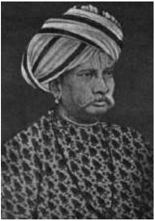

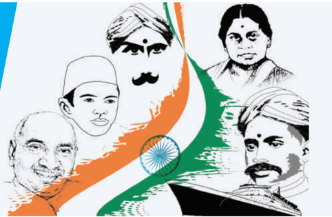

மேற்கொண்டது. வருவாய்த்துறை அதிகாரிகளால் விவசாயிகள் சித்திரவதைப்படுத்தப்படுவதற்கு எதிராக இவ்வமைப்பு (MNA) நடத்திய போராட்டம் முக்கியமான பங்களிப்பபாகும். இவ்வமைப்பு மேற்கொண்ட முயற்சிகளால் சித்திரவதை ஆணையம் (Torture Commission) நிறுவப்பட்டது. அதன் விளைவாகச் சித்திரவதை முறைகள் மூலம் கட்டடாய வரிவசூல் முறையை நியாயப்படுத்திய சித்திரவதைச் சட்டம் (Torture Act) ஒழிக்கப்பட்டது. இருந்தபோதிலும் இவ்வமைப்பு 1862க்குப் பின்னர் செயலிழந்து இல்லலாமலானது.

T. முத்துசாமி என்பவர் சென்னனை உயர்நீதிமன்றத்தின் முதல் இந்திய நீதிபதியாக 1877இல் நியமிக்கப்பட்டது சென்னனைமாகாணத்தில் பெரும் பரபரப்பபை ஏற்படுத்தியது. ஒரு இந்தியர் நீதிபதியாக பணியமர்த்தப்பட்டதை சென்னனையைச் சேர்ந்த அனைத்துப் பத்திரிக்ககைகளும் விமர்சனம் செய்தன. எதிர்ப்பு தெரிவித்த அனைத்துப் பத்திரிக்ககைகளும் ஐரோப்பியர்களால் நடத்தப்படுவதை கல்விகற்ற இளைஞர்கள் உணர்ந்தனர். இது குறித்து இந்தியரின் எண்ணங்களை வெளிப்படுத்த ஒரு செய்திப் ப த்திரிக்ககை தேவை என்பது உணரப்பட்டது. G. சுப்பிரமணியம், M. வீரராகவாச்சசாரி மற்றும் இவர்களின் நண்பர்கள் நால்வர் ஆகியோர் இணைந்து 1878இல் 'தி இந்து' எனும் (The Hindu) செய்திப் பத்திரிக்ககையைத் தொடங்கினர். மிக விரைவில் இச்சசெய்திப் பத்திரிக்ககை தேசியப் பிரச்சசாரத்திற்ககான கருவியானது. G. சுப்பிரமணியம் 1891இல் சுதேசமித்திரன் என்ற பெயரில் தமிழில் ஒரு தேசியப் பருவ இதழையும் தொடங்கினார். 1899இல் அவ்விதழ் நாளிதழாக ம றியது. இந்தியன் பேட்ரியாட் (Indian Patriot) சவுத் இந்தியன் மெயில் (South Indian Mail), மெட்ரராஸ் ஸ்டடாண்டர்ட் (Madras Standard), தேசாபிமானி, விஜயா, சூர்யோதயம், இந்தியா போன்ற உள்நநாட்டுப் பத்திரிக்ககைகள் தொடங்கப்படுவதற்கு ஊக்கமளித்தது.

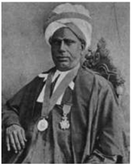

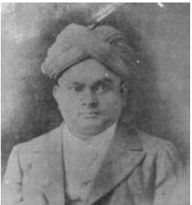

*தமிழ்நநாட்டில் விடுதலைப் போராட்டம்*

**(இ) சென்னனை மகாஜன சபை**

தென்னிந்தியாவில் தெளிவான தேசிய நோக்கங்களுடன் தொடங்கப்பபெற்ற தொடக்ககால அமைப்பு சென்னனை மகாஜன சபையாகும். 1884 மே 16இல் M. வீரராகவாச்சசாரி, P. அனந்ததாச்சசார்லு, P. ரங்ககையா மற்றும் சிலரால் நிறுவப்பட்ட இவ்வமைப்பின் முதல் தலைவராக P. ரங்ககையா பொறுப்பபேற்றறார். இதனுடைய செயலாளராக பொறுப்பபேற்ற P. அனந்ததாச்சசார்லு இதன் செயல்பபாடுகளில் பங்ககாற்றினார். அமைப்பின் உறுப்பினர்கள் குறிப்பிட்ட இடைவெளிகளில் ஒன்று கூடி தனிப்பட்ட விதத்திலும் அறைக்கூட்டங்கள் நடத்தியும் பொதுப்பிரச்சனைகள் குறித்து விவாதித்து தங்கள் கருத்துகளை அரசுக்குத் தெரியப்படுத்தினர். குடிமைப் பணிகளுக்ககான தேர்வுகள் இங்கிலாந்திலும் இந்தியாவிலும் ஒரே சம யத்தில் நடத்தப்பட வேண்டும். லண்டனிலுள்ள இந்தியக் கவுன்சிலை மூடுவது, வரிகளைக் குறைப்பது, இராணுவ குடியியல் நிர்வவாகச் செலவுகளைக் குறைப்பது ஆகியன இவ்வமைப்பின் கோரிக்ககைகளாகும். இவ்வமைப்பின் பல கோரிக்ககைகள் பின்னர் 1885இல் உருவாக்கப்பட்ட இந்திய தேசிய காங்கிரசின் கோரிக்ககைகளாயின.

**(ஈ) மிதவாதக் கட்டம்**

சென்னனை மகாஜன சபை போன்ற மாகாண அமைப்புகள் அகிலஇந்திய அளவிலான அமைப்புகள் நிறுவப்படுவதற்கு வழிகோலியது. இந்தியாவின் ப ல்வவேறு பகுதிகளிலிருந்த இந்திய தேசிய காங்கிரஸ் தலைவர்கள் காங்கிரஸ் உருவாக்கப்படுவதற்கு முன்பபாக பல கூட்டங்களில் கலந்து கொண்டனர். அவ்வவாறான ஒரு கூட்டம் 1884 டிசம்பரில் அடையாறு எனும் இடத்தில் உள்ள பிரம்மஞான சபை யில் கூடியது. தாதாபாய் நௌரோஜி, K.T. தெலாங், சுரேந்திரநாத் பானர்ஜி மற்றும் சில முக்கியத் தலைவர்களுடன் , சென்னனையிலிருந்து G. சுப்பிரமணியம், P. ரங்ககையா, P. அனந்ததாச்சசார்லு போன்றோரும் இக்கூட்டத்தில் கலந்து கொண்டனர்.

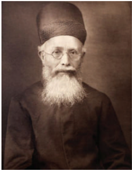

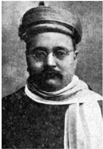

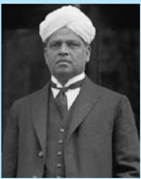

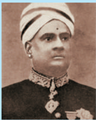

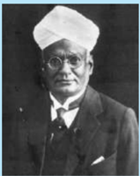

**தமிழ்நநாட்டின் முக்கிய தொடக்ககால மிதவாத தேசியவாதிகள்**

தொடக்ககால தேசியவாதிகள் அரசமைப்பு வழிமுறைகளின் மீது நம்பிக்ககை கொண்டிருந்தனர். அறைக்கூட்டங்கள் நடத்துவதும் பிரச்சனைகள் குறித்து ஆங்கிலத்தில் கலந்துரையாடுவதும் அவர்களின் செயல்பபாடுகளாக இருந்தன.

வங்கப் பிரிவினையின் போது திலகரும் ஏனைய தலைவர்களும் பெருவாரியான மக்கள் கலந்து கொண்ட பொதுக்கூட்டங்களை நடத்தியதாலும் மக்களை ஈடுபடச்சசெய்வதற்ககாக வட்டடாரமொழியைப் பய ன்படுத்தியதாலும் தொடக்ககால தேசியவாதிகள் மிதவாதிகளென அழைக்கப்படலாயினர். சென்னனையைச் சேர்ந்த புகழ்பபெற்ற தமிழ்நநாட்டு மிதவாதத் தலைவர்கள் V.S. சீனிவாசனார், P.S. சிவசாமி, V. கிருஷ்ணசாமி, T.R. வெங்கட்ரராமனார், G.A. நடேசன், T.M. மாதவராவ் மற்றும் S. சுப்பிரமணியனார் ஆகியோராவர்.

இந்திய தேசியக் காங்கிரசின் முதற்கூட்டம் 1885இல் பம்பபாயில் நடைபெற்றது. மொத்தம் கலந்து கொண்ட 72 பிரதிநிதிகளில் 22 பிரதிநிதிகள் சென்னனையைச் சேர்நந்ததோராவர்.

இந்தியாவின் பல பகுதிகளில் குறிப்பபாக வங்ககாளம், ப ஞ்சசாப் மற்றும் மகாராஷ்டிரா ஆகிய பகுதிகளில் புகழ்பபெற்ற தலைவர்கள் தோன்றினர். கொல்கத்ததா காங்கிரசில் மேற்கொள்ளப்பட்ட திட்டத்தின்படி சுதேசி நிறுவனங்களை ஊக்குவித்தல், அந்நியப் ப ண்டங்களைப் புறக்கணித்தல், தேசியக் கல்வியை முன்னனெடுத்தல் ஆகியவற்றறை அவர்கள் நடைமுறைப்படுத்தினர்.

இந்திய தேசிய காங்கிரசின் இரண்டடாவது மாநாடு 1886இல் கொல்கத்ததாவில் தாதாபாய் நௌரோஜியின் தலைமையில் நடைபெற்றது. காங்கிரசின் மூன்றறாவது மாநாடு பத்ருதீன் தியாப்ஜியின் தலைமையில் 1887இல் சென்னனையில் இன்று ஆயிரம் விளக்கு என்று

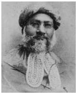

**(அ) தமிழ்நநாட்டின் எதிர்வினை**

வ. உ. சிதம்பரனார், V. சர்க்கரையார், சு ப்பிரமணிய பாரதி, சுரேந்திரநாத் ஆரியா ஆகியோர் தமிழ்நநாட்டடைச் சேர்ந்த சிறந்த தலைவர்களாவர். தமிழ்நநாட்டின் பல்வவேறு ப குதிகளில் ஆயிரக்கணக்கில் பொதுமக்கள் கலந்து கொண்ட பொதுக்கூட்டங்கள் நடத்தப்பட்டன. ம க்களைத் திரட்டுவதற்கு முதன்முதலாக தமிழ் பய ன்படுத்தப்பட்டது. மக்களின் நாட்டுப்பற்று உணர்வுகளைத் தட்டி எழுப்பியதில்

அழைக்கப்படுகிற மக்கிஸ் தோட்டத்தில் (Makkies Garden) நடைபெற்றது. கலந்து கொண்ட 607 அகில இந்தியப் பிரதிநிதிகளுள் 362 பிரதிநிதிகள் சென்னனை மாகாணத்ததைச் சேர்ந்தவர்கள் ஆவர்.

சு ப்பிரமணிய பாரதியின் தேசபக்திப் பாடல்கள் மிக முக்கியமா னவைய கு ம் . சுதேசி கருத்துகளைப் பரப்புரை செய்ய பல இதழ்கள் தோன்றின. சுதேசமித்திரன் , இந்தியா ஆகிய இரண்டும் முக்கிய இதழ்களாகும். தீவிர தேசியவாதத் தலைவரான பிபின் சந்திரபால்

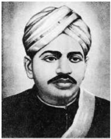

தமிழ்நநாடு அன்றறைய சென்னனை ம காணத்தின் ஒரு பகுதியாக இருந்தது. சென்னனை மாகாணம் என்பது இன்றறைய ஆந்திரப் பிரதேசத்தின் பெரும் பகுதிகளையும் (கடற்கரை மாவட்டங்கள் மற்றும் ராயலசீமா) கர்நநாடகாவையும் (பெங்களூரு, பெல்லலாரி, தெற்கு கனரா) கேரளாவையும் (மலபார்) ம ற்றும் ஒடிசாவின் (கஞ்சம்) சிலபகுதியையும் உள்ளடக்கியதாக இருந்தது.

சென்னனையில் சுற்றுப்பயணம் மேற்கொண்டபோது ஆற்றிய சொற்பொழிவுகள் இளைஞர்களைக் கவர்ந்தன. சுதேசி இயக்கத்தில் மாணவர்களும் இளைஞர்களும் பெரும் எண்ணிக்ககையில் ப ங்ககேற்றனர்.

### 9.2 சுதேசி இயக்கம்

வங்கப் பிரிவினை (1905) சுதேசி இயக்கத்திற்கு இட்டுச் சென்று விடுதலைப் போராட்டத்தின் போக்ககை மாற்றியமைத்தது.

தமிழ்நநாட்டில் விடுதலைப் போராட்டம்

**சுதேசி நீராவிக் கப்பல் நிறுவனம் (1906)**

செயல்படுத்துவதில் துணிகரமான நடவடிக்ககைகளில் ஒன்று யாதெனில் வ.உ.சிதம்பரனாரால் தொடங்கப்பட்ட சுதேசி நீராவிக் கப்பல் நிறுவனம்

சுதேசியைச் மேற்கொள்ளப்பட்ட தூத்துக்குடியில் ஆகும். இவர் காலியா ம ற்றும் லாவோ எனும் இரு க ப்பல்களை விலைக்கு வாங்கி அவற்றறை தூத்துக்குடிக்கும் கொழும்புக்குமிடையே ஓட்டினார்.

**திருநெல்வவேலி எழுச்சி**

திருநெல்வவேலியிலும் தூத்துக்குடியிலும் நூற்பபாலைத் தொழிலாளர்களை அணி திரட்டுவதில் வ.உ.சி., சுப்பிரமணிய சிவாவின் தோளோடுதோள் நின்றறார். இவர் 1908இல் ஐரோப்பியருக்குச் சொந்தமான கோரல் நூற்பபாலையில் நடைபெற்ற வேலை நிறுத்தத்திற்குத் தலைமையேற்றறார். இந்நிகழ்வு நடைபெற்ற அதே சமயத்தில் பிபின் ச ந்திரபால் விடுதலை செய்யப்பட்டடார். பிபின் விடுதலைசெய்யப்பட்டதைக் கொண்டடாடுவதற்ககாகப் பொதுக்கூட்டம் ஏற்பபாடு செய்ததற்ககாக வ.உ.சியும் சிவாவும் கைது செய்யப்பட்டனர். தலைவர்கள் இருவரும் அரச துரோகக் குற்றம் சாட்டப்பட்டு கடுங்ககாவல் தண்டனை விதிக்கப்பட்டனர். தொடக்கத்தில் வ.உ.சிக்கு கொடுமையான வகையில் இரண்டு ஆயுள் தண்டனைகள் வழங்கப்பட்டன. மக்கள் செல்வவாக்கு பெற்ற இவ்விரு தலைவர்களும் கைது செய்யப்பட்ட செய்தி ப ரவியதில் திருநெல்வவேலியில் கலகம் வெடித்தது. காவல்நிலைய, நீதிமன்ற, நகராட்சி அலுவலகக் கட்டடங்கள் தீக்கிரையாக்கப்பட்டன. காவலர்கள் நடத்திய துப்பபாக்கிச்சூட்டில் நான்கு நபர்கள் கொல்லப்பட்டனர். சிறையில் வ.உ.சி கடுமையாக நடத்தப்பட்டதோடு செக்கிழுக்க வைக்கப்பட்டடார். சிறைத்தண்டனையைத் தவிர்ப்பதற்ககாக சு ப்பிரமணிய பாரதி பிரெஞ்சுக்ககாரர்களின் ஆதிக்கத்திலிருந்த பாண்டிச்சசேரிக்கு இடம்பபெயர்ந்ததார். பாரதியின் முன்னுதாரணத்ததை அரவிந்தகோஷ், V.V. சுப்பிரமணியனார் போன்ற தேசியவாதிகளும் பின்பற்றினர்.

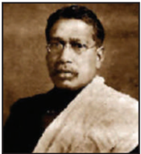

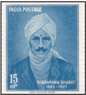

*தமிழ்நநாட்டில் விடுதலைப் போராட்டம்*

புரட்சிகர தேசியவாதிகளுக்குப் பாண்டிச்சசேரி ப துகாப்பபான புகலிடமாயிற்று. தமிழ்நநாட்டடைச் சேர்ந்த இப்புரட்சிகர தேசியவாதிகள் பலருக்குப் புரட்சிகர நடவடிக்ககைகள் குறித்த அறிமுகமும் ப யிற்சியும் லண்டனிலிருந்த இந்தியா ஹவுஸ் (India House) என்ற இடத்திலும் பாரிசிலும் வழங்கப்பபெற்றது. அவர்களில் முக்கியமானவர்கள் M.P.T. ஆச்சசாரியா, V.V. சுப்ரமணியனார் ம ற்றும் T.S.S. ராஜன் ஆகியோராவர். அவர்கள் புரட்சிகர நூல்களை பாண்டிச்சசேரியின் வழியாக சென்னனையில் விநியோகம் செய்தனர். புரட்சிவாதச் செய்தித்ததாள்களான இந்தியா, விஜயா, சூர்யோதயம் ஆகியன பாண்டிச்சசேரியிலிருந்து வெளிவந்தன.

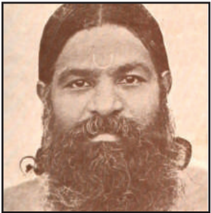

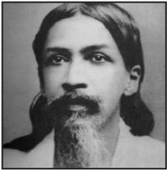

1904இல் நீலகண்ட பிரம்மச்சசாரியும் வேறு சிலரும் பாரத மாதா சங்கம் எனும் ரகசிய அமைப்பபை உருவாக்கினர். ஆங்கில அதிகாரிகளைக் கொல்வதன் மூலம் மக்களிடையே நாட்டுப்பற்று உணர்வவைத் தூண்டுவதே இவ்வமைப்பின் நோக்கமாகும். செங்கோட்டடையைச் சேர்ந்த வாஞ்சிநாதன் இவ்வமைப்பபால் உள்ளுணர்வு தூண்டப்பட்டடார். அவர் 1911 ஜுன் 17இல் திருநெல்வவேலி ம வட்ட ஆட்சியரான ராபர்ட் W.D.E. ஆஷ் என்பவரை ம ணியாச்சி ரயில் சந்திப்பில் சுட்டுக் கொன்றறார். அதன் பின்னர் தன்னனைத்ததானே சுட்டுக் கொண்டடார்.

தீவிர தேசியவாதிகளும் புரட்சிகர தேசியவாதிகளும் இரும்புக் கரம் கொண்டு அடக்கப்பட்ட நிலையில் மிதவாத தேசியவாதிகள் சில அரசமைப்பு சீர்திருத்தங்கள் செய்யப்படலாம் என நம்பினர். இருந்தபோதிலும் மிண்டோ-மார்லி சீர்திருத்தங்கள் பொறுப்பபாட்சியை வழங்கவில்லலை எ ன்பதால் அவர்கள் மனச்சோர்வடைந்தனர்.

இவ்வவாறு தேசிய இயக்கம் தளர்வுற்று இருந்த நிலையில் பிரம்மஞான சபையின் தலைவரும், அயர்லலாந்துப் பெண்மணியுமான அன்னிபெசன்ட் அயர்லலாந்தின் தன்னனாட்சி

அமைப்புகளை அடியொற்றி தன்னனாட்சி இயக்கத்ததை முன்மொழிந்ததார். 1916இல் தன்னனாட்சி இயக்கத்ததை (Home Rule League) தொடங்கிய அவர் அகில இந்திய அளவில் தன்னனாட்சி வழங்கப்பட வேண்டும் எனும் கோரிக்ககையை முன்னனெடுத்துச் சென்றறார். இச்சசெயல் திட்டத்தில் G.S. அருண்டடேல், B.P. வாடியா மற்றும் C.P. ராமசாமி ஆகியோர் அவருக்குத் துணை நின்றனர். இவர்கள் கோரிய தன்னனாட்சி ஆங்கில அரசிடம் ஓரளவிற்ககான விசுவாசத்ததையே கொண்டிருந்ததாக அமைந்தது. தன்னுடைய திட்டத்ததை மக்களிடையே கொண்டு செல்வதற்ககாக அன்னிபெசன்ட் நியூ இந்தியா (New India), காமன் வீல் (Commonweal) எனும் இரண்டு செய்தித்ததாள்களைத் தொடங்கினார். "அதிநவீன வசதிகளுடன் கூடிய ரயிலில் அடிமைகளாக இருப்பதைவிட சுதந்திரத்துடன் கூடிய மாட்டு வண்டியே சிறந்தது" என கூறினார். 1910ஆம் ஆண்டு பத்திரிக்ககைச் சட்டத்தின்படி அன்னிபெசன்ட் பிணைத் தொகையாக பெருமளவு பணத்ததைச் செலுத்தும்படி அறிவுறுத்தப்பட்டடார். அன்னி பெசன்ட் 'விடுதலை பெற இந்தியா எப்படித் துயருற்றது' ('How India wrought for Freedom'), இந்தியா: ஒரு தேசம் (India: A Nation) எனும் இரண்டு புத்தகங்களையும் சுயாட்சி குறித்த துண்டுப்பிரசுரத்ததையும் எழுதினார்.

**(அ) தென்னிந்திய நலவுரிமைச் சங்கம்**

பிராமணரல்லலாதோர் தங்கள் நலன்களைப் ப துகாத்துக் கொள்வதற்ககாகத் தங்களை ஒரு அரசியல் அமைப்பபாக அணிதிரட்டிக் கொண்டனர். 1912இல் சென்னனை திராவிடர் கழகம் (Madras Dravidian Association) உருவாக்கப் பெற்றது. அதன் செயலராக C. நடேசனார் செயலூக்கமிக்க வகையில் பங்ககாற்றினார். 1916 ஜுன் மாதத்தில் அவர் பிராமணர் அல்லலாத மாணவர்களுக்ககாக 'திராவிடர் சங்க தங்கும் விடுதி'யை நிறுவினார். 1916 நவம்பர் 20இல் P. தியாகராயர், டாக்டர் T.M. நாயர், C. நடேசனார் ஆகியோர் தலைமையில் சும ர் முப்பது பிராமணரல்லலாதவர்கள் சென்னனை விக்டோரியா பொதுஅரங்கில் கூடினர். பிராமணரல்லலாதோர்களின் நலன்களை மேம்படுத்துவதற்ககாகத் தென்னிந்திய நலவுரிமைச் சங்கம் (South Indian Liberal Federation – SILF) எனும் அமைப்பு உருவாக்கப்பட்டது.

**நீதிக்கட்சி அமைச்சரவை**

1920இல் நடத்தப்பட்ட தேர்தல்களைக் காங்கிரஸ் புறக்கணித்தது. சட்டமன்றத்தில் மொத்தமிருந்த 98 இடங்களில் 63இல் நீதிக்கட்சி

வெற்றிபெற்றது. நீதிக்கட்சியின் A. சுப்பராயலு முதலாவது முதலமைச்சரானார். 1923இல் நடைபெற்ற தேர்தலுக்குப் பின்னர் நீதிக் கட்சியைச் சேர்ந்த பனகல் அரசர் அமைச்சரவையை அமைத்ததார்.

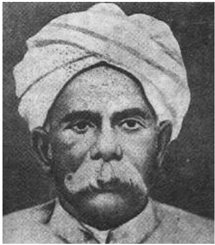

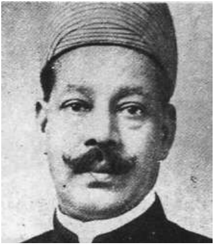

ஆங்கில அரசு 1919இல் கொடூரமான குழப்பவாத புரட்சிக் குற்றச் சட்டத்ததை இயற்றியது. இச்சட்டத்ததைப் பரிந்துரை செய்த குழுவினுடைய தலைவரின் பெயர் சர் சிட்னி ரௌலட் ஆவார். எனவே, இச்சட்டம் பரவலாக ரௌலட் சட்டம் என அறியப்பட்டது. இச்சட்டத்தின் கீழ் முறையான நீதித்துறை சார்ந்த விசாரணைகள் இல்லலாமலேயே யாரை வேண்டுமானாலும் பயங்கரவாதி எனக் குற்றம்சசாட்டி அரசு சிறையில் அடைக்கலாம். இதைக் கண்டு இந்தியர்கள் திகிலடைந்தனர். மக்களின் கோபத்திற்குக் குரல்கொடுத்த காந்தியடிகள், தென்னனாப்பிரிக்ககாவில் தான் பயன்படுத்திய போராட்ட வடிவமான சத்தியாகிரகத்ததை மேற்கொண்டடார்.

**ரௌலட் சத்தியாகிரகம்**

1919 மார்ச் 18இல் சென்னனை மெரினா கட ற்கரையில் நடைபெற்ற கூட்டத்தில் காந்தியடிகள் உரையாற்றினார். 1919 ஏப்ரல் 6இல் 'கருப்புச் சட்டத்ததை' எதிர்க்கும் நோக்கில் கடையடைப்பும்

வேலை நிறுத்தங்களும் நடத்தப்பட்டன. தமிழ்நநாட்டின் பல பகுதிகளிலும் எதிர்ப்பு ஆர்ப்பபாட்டங்கள் நடைபெற்றன. சென்னனை நகரின்பல பகுதிகளிலிருந்து தொடங்கிய ஊர்வலங்கள் மெரினா கடற்கரையில் ஒன்றிணைந்து பெரும் ம க்கள் கூட்டமானது. அந்நநாள் முழுவதும்

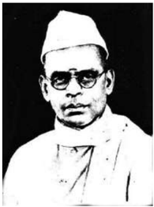

தமிழ்நநாட்டில் விடுதலைப் போராட்டம்

ஜார்ஜ் ஜோசப் : வழக்கறிஞரும் நன்கு சொற்பொழிவாற்றும் திறன் படைத்தவருமான ஜார்ஜ் ஜோசப் மதுரையில் தன்னனாட்சி இயக்கத்ததை ஏற்படுத்தியதிலும், அதன் நோக்கத்ததை மக்களின் கவனத்திற்குக் கொண்டு சென்றதிலும் முக்கியப் பங்குவகித்ததார். செங்கண்ணூரில் (இன்றறைய கேரள மாநிலம் ஆலப்புழா மாவட்டம்) பிறந்திருந்ததாலும் ம

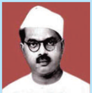

சபை எ ன்ற அமைப்பும் நிறுவப்பட்டது. ராஜாஜி, கஸ்தூரிரங்கர், S. சத்தியமூர்த்தி, ஜார்ஜ் ஜோசப் ஆகியோர் கூட்டத்தில் உரை நிகழ்த்தினர். தொழிலாளர்களுக்ககென தனியாக நடத்தப்பட்ட கூட்டமொன்றில் V. கல்யயாணசுந்தரம் (திரு.வி.க), B.P. வாடியா., வ.உ.சி ஆகியோர் உரையாற்றினர். தொழிலாளர்களும், மாணவர்களும், பெண்களும் பெருவாரியான எண்ணிக்ககையில் பங்ககேற்றதே இவ்வியக்கத்தின் முக்கிய அம்சமாகும்.

**(இ) கிலாபத் இயக்கம்**

ஜாலியன்வவாலாபாக் படுகொலையைத் தொடர்ந்து அதற்குக் காரணமான ஜெனரல் ட யர் அனைத்துக் குற்றச்சசாட்டுகளில் இருந்தும் விடுக்கப்பட்டதோடல்லலாமல் அவருக்குப் ப ரிசுகளும் வெகுமதியும் வழங்கப்பட்டன. முதல் உலகப் போருக்குப் பின்னர் துருக்கியின் கலீபா அவமரியாதை செய்யப்பட்டதுடன் அவரது அனைத்து அதிகாரங்களும் பறிக்கப்பட்டன. கலீபா பதவியை மீட்பதற்ககாக கிலாபத் இயக்கம் தொடங்கப் பெற்றது. பெரும்பபாலும் தேசிய இயக்கத்திலிருந்து ஒதுங்கி இருந்த முஸ்லிம்கள் தற்போது பெரும் எண்ணிக்ககையில் பங்ககேற்கத் தொடங்கினர். தமிழ்நநாட்டில் 1920 ஏப்ரல் 17இல் மௌலானா சௌகத் அலி தலைமையேற்ற ஒரு பொதுக்கூட்டத்துடன் கிலாபத் நாள் கடைப்பிடிக்கப்பட்டது. இதைப்போன்ற ஒரு மாநாடு ஈரோட்டிலும் நடத்தப்பட்டது. வாணியம்பபாடி, கிலாபத் எழுச்சி நடவடிக்ககைகளின் முக்கிய மையமாகத் திகழ்ந்தது.

### 9.4 ஒத்துழையாமை இயக்கம்

ஒத்துழையாமை இயக்கத்தின்போது தமிழ்நநாடு செயல்துடிப்புடன் விளங்கியது.

தமிழ்நநாட்டில் விடுதலைப் போராட்டம்

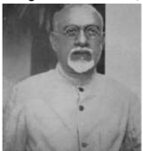

C. ராஜாஜியும் ஈ.வெ . ராமசாமியும் (ஈ.வெ . ரா பின்னர் பெரியார் என அழைக்கப்பட்டடார்) தலைமையேற்று நடத்தினர். முஸ்லிம் லீக்கின் சென்னனைக் கிளையை நிறுவிய யாகுப் ஹசன் என்பபாருடன் இராஜாஜி நெருக்கமாகச் செயல்பட்டடார். இதன் காரணமாக தமிழ்நநாட்டில் ஒத்துழையாமை இயக்கத்தின் போது அனைவரும் இணைந்து செயல்பட்டனர் யாகுப் ஹசன்

ஒத்துழையாமை இயக்கத்தின் ஒரு பகுதியாக, பல இடங்களில் விவசாயிகள் வரிகொடுக்க ம றுத்தனர். தஞ்சசாவூரில் வரிகொடா இயக்கம் ஒன்று நடைபெற்றது. சட்டமன்றங்கள், பள்ளிகள் மற்றும் நீதிமன்றங்கள் ஆகியவை புறக்கணிக்கப்பட்டன. அந்நியப்பொருட்கள் புறக்கணிக்கப்பட்டன. பல பகுதிகளில் தொழிலாளர்களின் வேலை நிறுத்தங்கள் அதிக எண்ணிக்ககையில் நடைபெற்றன அவற்றில் பல தேசியத் தலைவர்களால் வழிநடத்தப்பட்டது. தமிழ்நநாட்டில் நடைபெற்ற ஒத்துழையாமை இயக்கத்தின் முக்கிய அம்சமாகத் திகழ்ந்தது கள்ளுக்கடைகளுக்கு எதிரான போராட்டங்களே. 1921 நவம்பரில் சட்ட ம றுப்பு இயக்கத்ததைத் தொடங்குவதென முடிவு செய்யப்பட்டது. ராஜாஜி, சுப்பிரமணிய சாஸ்திரி, ஈ.வெ.ரா ஆகியோர் கைது செய்யப்பட்டனர். 1922 ஜனவரி 13இல் வேல்ஸ் இளவரசரின் வருகை புறக்கணிக்கப்பட்டது. காவல்துறையின் அடக்குமுறையில் இருவர் கொல்லப்பட்டனர் ப லர் காயமுற்றனர். 1922இல் சௌரி சௌரா நிகழ்வில் 22 காவலர்கள் கொல்லப்பட்டதைத் தொடர்ந்து ஒத்துழையாமை இயக்கம் விலக்கிக் கொள்ளப்பட்டது.

ஒத்துழையாமை இயக்கம் விலக்கி கொள்ளப்பட்டதைத் தொடர்ந்து காங்கிரஸ் " ம ற்றத்ததை விரும்பபாதோர்", "மாற்றத்ததை விரும்புவோர்" எனப் பிரிந்தது. மாற்றத்ததை விரும்பபாதோர் சட்டமன்றப் புறக்கணிப்பபைத் தொடர விரும்பினர். மாற்றத்ததை விரும்பியோர் தேர்தலில் போட்டியிட்டுச் சட்டமன்றத்தினுள் செல்ல விரும்பினர். ராஜாஜியுடன் காந்தியத்ததைத் தீவிரமாகப் பின்பற்றும் வேறு சிலர் இணைந்து சட்டமன்றத்திற்குச் செல்வதை எதிர்த்தனர். கஸ்தூரிரங்கர், M.A. அன்சசாரி ஆகியோருடன் சேர்ந்து கொண்ட

ராஜாஜி சட்டமன்றத்ததைப் புறக்கணிப்பது எனும் கருத்ததை முன்வவைத்ததார். இக்கருத்துக்கு ஏற்பட்ட எதிர்ப்பு காங்கிரசுக்குள்ளளேயே சித்தரஞ்சன் தாஸ், மோதிலால் நேரு ஆகியோரால் சுயராஜ்ஜியக் கட்சி உருவாக்கப்படுவதற்கு இட்டுச் சென்றது. தமிழ்நநாட்டில் S. சீனிவாசனார், S. சத்தியமூர்த்தி ஆகியோர் சுயராஜ்ஜியக் கட்சியினருக்குத் தலைமை ஏற்றனர்.

**(இ) சுப்பராயன் அமைச்சரவை**

1926இல் நடைபெற்ற சென்னனை மாகாண தேர்தலில் தேர்ந்ததெடுக்கப்பட்ட உறுப்பினர்களில் சுயராஜ்ஜியக் கட்சியினர் பெரும்பபான்மமை இடங்களில் வெற்றி பெற்றனர். இருந்தபோதிலும் காங்கிரசின் கொள்ககைக்கு இணங்க ஆட்சிப் பொறுப்பபை ஏற்கமறுத்தது. மாறாக

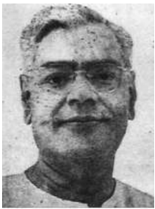

அவர்கள் சுயேட்சசை வேட்பபாளரான P. சுப்பராயனுக்கு அமைச்சரவை அமைக்க உதவினர். 1930இல் நடைபெற்ற தேர்தலில் சுயராஜ்ஜியக் கட்சியினர் போட்டியிடாததால் நீதிக்கட்சி எளிதாக வெற்றி பெற்றது. அக்கட்சி தொடர்ந்து 1937 வரை ஆட்சி செய்தது.

**(ஈ) சைமன் குழுவைப் புறக்கணித்தல்**

1919ஆம் ஆண்டுச் சட்டத்தின் செயல்பபாடுகளைப் பரிசீலனை செய்து சீர்திருத்தங்களைப் பரிந்துரை செய்ய 1927இல் இந்திய சட்டப்பூர்வ ஆணையம் ஒன்று

**நீல் சிலை அகற்றும் போராட்டம் (1927)**

ஜேம்ஸ் நீல், மதராஸ் துப்பபாக்கி ஏந்திய காலாட்படையைச் சேர்ந்தவர். 1857 பேரெழுச்சியின்போது நடைபெற்ற கான்பூர் படுகொலை என்றழைக்கப்படும் சம்பவத்தில் ப ல ஆங்கிலப் பெண்களும் குழந்ததைகளும் கொல்லப்பட்டனர். இதற்கு வஞ்சம் தீர்க்கும் வகை யில் நீல் கொடூரமாக நடந்து கொண்டடார், பின்னர் நீல் இந்திய வீரர் ஒருவரால் கொல்லப்பட்டடார். சென்னனை மௌண்டட்ரரோட்டில் ஆங்கிலேயர் அவருக்கு ஒரு சிலை வைத்தனர். இதை, இந்தியர்களின் உணர்வுகளுக்கு இழைக்கப்படும் அவமரியாதை எனக் கருதிய தேசியவாதிகள் சென்னனையில் தொடர் போராட்டங்களை மேற்கொண்டனர். 1937இல் ராஜாஜியின் தலைமையில் காங்கிரஸ் ஆட்சி அமைத்திருந்தபோது இச்சிலை அகற்றப்பட்டு சென்னனை அருங்ககாட்சியகத்திற்கு கொண்டு செல்லப்பட்டது.

சர் ஜான் சைமனின் தலைமையில் அமைக்கப் பெற்றது. ஆனால் வெள்ளளையர்களை மட்டுமே கொண்டிருந்த இக்குழுவில் ஒரு இந்தியர் கூட இடம்பபெறாதது இந்தியர்களுக்கு மிகப்பபெரும் மனச்சோர்வவை ஏற்படுத்தியது. ஆகையால் காங்கிரஸ் சைமன் குழுவைப் புறக்கணித்தது. சென்னனையில் S. சத்தியமூர்த்தி தலைமையில் சைமன் குழு எதிர்ப்பு பிரச்சசாரக் குழுவொன்று உருவாக்கப்பட்டது. 1929 பிப்ரவரி 18இல் சைமன் குழு சென்னனைக்கு வந்தபோது குழுவுக்கு எதிராகக் கறுப்புக்கொடி காட்டப்பட்டது.

### 9.5 சட்ட மறுப்பு இயக்கம்

**(அ) பூரண சுயராஜ்ஜியத்ததை நோக்கி**

1927இல் இந்திய தேசிய காங்கிரசின் சென்னனை மாநாடு முழுமையான சுதந்திரமே தனது இலக்கு என அறிவித்தது. 1929இல் லாகூரில் கூடிய காங்கிரஸ் மாநாட்டில் பூரண சுயராஜ்ஜியம் (முழு சுதந்திரம்) என்பதே இலக்கு எனத் தீர்மமானம் நிறைவேற்றப்பட்டது. மேலும் 1930 ஜனவரி 26இல் ராவி நதியின் கரையில் சுதந்திரத்ததை அறிவிக்கும் விதமாக ஜவகர்லலால் நேரு தேசியக் கொடியை ஏற்றினார்.

**(ஆ) வேதாரண்யம் உப்பு சத்தியாகிரகம்**

கா ந்தியடிகள் முன்வவைத்த கோரிக்ககைகளை வைஸ்ரராய் ஏற்றுக் கொள்ளளாததைத் தொடர்ந்து அவர் சட்டமறுப்பு இயக்கத்ததைத் தொடங்கினார். ராஜாஜி உப்பு சத்தியாகிரகம் ஒன்றினை ஏற்பபாடுசெய்து தலைமையேற்று வேதாரண்யம் நோக்கி அணி வகுத்துச் சென்றறார். 1930 ஏப்ரல் 13இல் திருச்சிராப்பள்ளியிலிருந்து தொடங்கி ஏப்ரல் 28இல் தஞ்சசாவூர் மாவட்டத்தின் வேதாரண்யத்ததைச் சென்றடைந்தது. இவ்வணிவகுப்புக்ககென்றறே "கத்தியின்றி ரத்தமின்றி யுத்தமொன்று வருகுது, சத்தியத்தின் நித்தியத்ததை நம்பும் யாரும் சேருவீர்" எனும் சிறப்புப்பபாடலை நாமக்கல் கவிஞர் இராமலிங்கனார் புனைந்திருந்ததார். காவல்துறையின் கொடூரமான நடவடிக்ககைகளைப் பொருட்படுத்ததாமல் அணிவகுத்துச் சென்ற சத்தியாகிரகிகளுக்கு பயணித்த பாதையெங்கும் எழுச்சிமிகு வரவேற்பு அளிக்கப்பட்டது. வேதாரண்யம் சென்றடைந்த பின்னர் இராஜாஜியின் தலைமையில் 12 தொண்டர்கள் உப்புச் சட்டத்ததை மீறி உப்பபை அள்ளினர். உப்புச் சட்டத்ததை மீறியதற்ககாக இராஜாஜி கைது செய்யப்பட்டடார். T.S.S. ராஜன், திருமதி. ருக்மணிலட்சுமிபதி, சர்ததார் வேதரத்தினம், C. சாமிநாதர் மற்றும் K. சந்ததானம்

தமிழ்நநாட்டில் விடுதலைப் போராட்டம்

ஆகியோர் வேதாரண்யம் உப்புச் சத்தியாகிரகத்தில் ப ங்ககேற்ற ஏனைய முக்கியத் தலைவர்களாவர்.

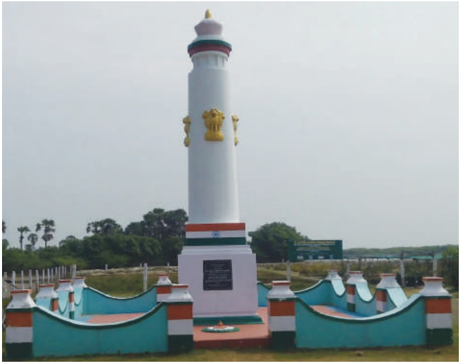

T. பிரகாசம், K. நாகேஸ்வர ராவ் ஆகியோர் தலைமையில் சத்தியாகிரகிகள் சென்னனைக்கு அருகேயுள்ள உதயவனம் என்ற இடத்தில் ஒரு முகாமை அமைத்திருந்தனர். ஆனால் அவர்கள்

காவல்துறையால் கைது செய்யப்பட்டனர். இந்நிகழ்வு சென்னனையில் கடையடைப்பிற்கு வழிகோலியது. 1930 ஏப்ரல் 27இல் திருவல்லிக்ககேணியில் காவல்துறையினருடன் மோதல் எற்பட்டது. மூன்று மணி நேரம் நடைபெற்ற இம்மோதலில் மூன்று நபர்கள் உயிரிழந்தனர். இராமேஸ்வரத்தில் உப்பு

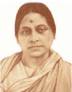

சத்தியாகிரம் மேற்கொள்ள முயன்ற தொண்டர்கள் கைது செய்யப்பட்டனர். மாகாணம் முழுவதிலும் நூற்பபாலைத் தொழிலாளர்கள் வேலை நிறுத்தம் செய்தனர். பெண்கள் மிகுந்த ஆர்வத்துடன் ப ங்ககேற்றனர். உப்புச்சட்டங்களை மீறியதற்ககாக அபராதம் கட்டிய முதல் பெண்மணி ருக்மணி லட்சுமிபதியாவார். இயக்கத்ததைநசுக்க காவல்துறை கொடுமையான படையைப் பயன்படுத்தியது. 1932 ஜனவரி 26இல், பரவலாக ஆரியா என அழைக்கப்பட்ட பாஷ்யம் புனித ஜார்ஜ் கோட்டடையின் உச்சியில் தேசியக்கொடியை ஏற்றினார்.

**திருப்பூர் குமரனின் வீரமரணம்**

1932 ஜனவரி 11இல் திருப்பூரில் கொடிகளை ஏந்திய வண்ணம் நாட்டுப்பற்று மிகுந்தபாடல்களைப் ப டிச் சென்ற ஊர்வலத்தினர் காவல்துறையினரால் இரக்கமின்றி அடித்து உதைக்கப்பட்டனர்.

தமிழ்நநாட்டில் விடுதலைப் போராட்டம்

ப ரவலாக திருப்பூர் குமரன் எ ன் ற ழை க் கப் ப டு ம் O.K.S.R. குமாரசாமி தேசியக் கொடியை உயர்த்திப் பிடித்தவாறே விழுந்து இறந்ததார். ஆகையால் இவர் கொடிகாத்த குமரன் என புகழப்படுகிறார்.

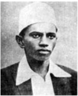

**ஈ) முதல் காங்கிரஸ் அமைச்சரவை**

1937ஆம் ஆண்டு தேர்தலில் காங்கிரஸ் வெற்றி பெற்றது. நீதிக்கட்சி படுதோல்வி அடைந்தது. தேர்தல்களில் காங்கிரஸ் பெற்ற வெற்றியானது, ம க்களிடையே அது பெற்றிருந்த செல்வவாக்ககைச் சுட்டிக்ககாட்டியது.

சென்னனையில் இராஜாஜி முதல் காங்கிரஸ் அமைச்சரவையை அமைத்ததார். ம து விலக்ககைப் பரிசோதனை முயற்சியாக சேலத்தில் அறிமுகம் செய்ததார். இதன் மூலம் ஏற்படும் வருவாய் இழப்பபை ஈடு செய்ய விற்பனை வரியை அறிமுகப்படுத்தினார். தேர்ததெடுக்கப்பட்ட இந்திய

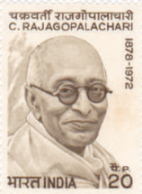

அமைச்சரவையைக் கலந்ததாலோசிக்ககாமல் ஆங்கில அரசு இந்தியாவை இரண்டடாம் உலகப்போரில் ஈடுபடுத்தியதால் காங்கிரஸ் அமைச்சரவை ராஜினாமா செய்தது.

**உ) இந்தி எதிர்ப்புப் போராட்டம்**

ப ள்ளிகளில் இந்தி மொழி கட்டடாயப்பபாடமாக அறிமுகம் செய்யப்பட்டது, இது இராஜாஜியால் மேற்கொள்ளப்பட்ட ஒரு சர்ச்சசைக்குரிய நடவடிக்ககையாகும். தமிழ் மொழிக்கும் பண்பபாட்டிற்கும் தீங்கு விளைவிக்க, ஆரிய வட இந்தியர்களால் சும த்தப்பட்ட ஏற்பபாடாக இது கருதப்பட்டதால் ம க்களிடையே பெரும் மனக்கசப்பபை ஏற்படுத்தியது. இதற்கு எதிராக ஈ.வெ.ரா மிகப்பபெரிய பரப்புரையை மேற்கொண்டடார். அவர் இந்தி எதிர்ப்பு மாநாடு ஒன்றினை சேலத்தில் நடத்தினார். உறுதியான செயல்பபாட்டிற்ககான திட்டத்ததை இம்மமாநாடு வடிவமைத்தது. இந்தி எதிர்ப்புப் போராட்டத்திற்கு ஒடுக்கப்பட்டோர் கூட்டமைப்பும், முஸ்லிம் லீக்கும் ஆதரவளித்தன. தாளமுத்து மற்றும் நடராஜன் எனும் இரண்டு ஆர்வமிக்க போராட்டக்ககாரர்கள் சிறையில் மரணமடைந்தனர். திருச்சியிலிருந்து சென்னனைக்கு ஊர்வலமொன்று திட்டமிடப்பட்டது. பெரியார் உட்பட 1200 போராட்டக்ககாரர்கள் கைது செய்யப்பட்டனர். காங்கிரஸ் அரசு பதவி விலகியதைத் தொடர்ந்து நிருவாகத்ததைக் கைக்கொண்ட சென்னனை மாகாண ஆளுநர் இந்தி கட்டடாயப் பாடம் என்பதை நீக்கினார்.

வெள்ளளையனே வெளியேறு இயக்கத்திற்ககாக ம க்களைத் திரட்டும் பணியை மேற்கொண்டடார்.

### 9.6 வெள்ளளையனே வெளியேறு இயக்கம்

**தீராத மக்கள் இயக்கம்**

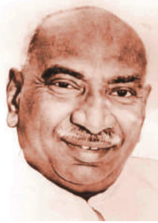

1942 ஆகஸ்டு 8இல் வெள்ளளையனே வெளியேறு தீர்மமானம் நிறைவேற்றப்பட்டு கா ந்தியடிகள் "செய் அல்லது செத்துமடி" எனும் முழக்கத்ததை வழங்கினார். ஒட்டு மொத்த காங்கிரஸ் தலைவர்களும் ஒரே நாள் இரவில் கைது செய்யப்பட்டனர். ஒவ்வொரு ரயில் நிலையத்திலும்

இவ்வியக்கத்தில் சமூகத்தின் அனைத்துப் பிரிவினரும் பங்ககேற்றனர். பக்கிங்ககாம் மற்றும் கர்நநாட்டிக் மில், சென்னனை துறைமுகம், சென்னனை மாநகராட்சி மற்றும் மின்சசார டிராம் போக்குவரத்து போன்ற இடங்களில் பெருமளவிலான தொழிலாளர் போராட்டங்கள் நடைபெற்றன. பெரும் எண்ணிக்ககையில் ஆண்களும் பெண்களும் இந்திய தேசிய இராணுவத்தில் (INA) சேர்ந்தனர். வெள்ளளையனே வெளியேறு இயக்கம் இரக்கமற்ற முறையில் வன்முறை மூலம் ஒடுக்கப்பட்டது.

காவலர்கள் உள்ளூர் தலைவர்களின் பெயர்ப் ப ட்டியலை வைத்துக் கொண்டு அவர்கள் ரயிலை விட்டு இறங்கியதும் கைது செய்ததை ப ம்பபாயிலிருந்து ஊர் திரும்பிக் கொண்டிருந்த கு. காமராஜர் கவனித்ததார். காவல் துறையினரின் கண்களில்படாமல் அரக்கோணத்திலேயே இறங்கிவிட்டடார். பின்னர் அவர் தலைமறைவாகி

ராயல் இந்தியக் கப்பற்படைப் புரட்சியும், இங்கிலாந்தில் புதிதாக ஆட்சிப் பொறுப்பபேற்ற தொழிலாளர் கட்சி அரசு தொடங்கிய பேச்சு வார்த்ததைகளும் இந்திய விடுதலைக்கு வழிகோலின. சோகம் யாதெனில் நாடு இந்தியா, பாகிஸ்ததான் என இரண்டடாகப் பிரிக்கப்பட்டதுதான். அது குறித்து எட்டடாம் பாடத்தில் எடுத்துரைக்கப்பட்டுள்ளது.

**பா டச்சுருக்கம்**

- தமிழ் நாட்டில் தேசியவாதம் வளர்வதற்கு சென்னனைவாசிகள் சங்கம், சென்னனை மகாஜன சபை , தேசியவாதப் பத்திரிக்ககைகள் ஆகியவற்றின் பங்களிப்புகள் விவாதிக்கப்பட்டுள்ளன.
- தமிழ் நாட்டில் நடைபெற்ற இந்திய தேசிய இயக்கத்தின் சுதேசி இயக்க கட்டம் பற்றி குறிப்பபாக வ.உ.சி. சு ப்பிரமணிய சிவா, சுப்பிரமணிய பாரதி ஆகியோர் வகித்த பாத்திரம் குறித்தும் விவரிக்கப்பட்டுள்ளது.
- ஒத்துழையாமை இயக்கம், காங்கிரசோடு ஈ.வெ.ரா வின் முரண்பபாடுகள், தேசிய அளவில் சுயராஜ்ஜியக் கட்சியின் தோற்றம், தமிழ்நநாட்டில் சுயமரியாதை இயக்கத்தின் தோற்றம் ஆகியவை கூர்ந்ததாராயப்பட்டுள்ளன.
- சைமன் குழுவின் மீதும், வட்டமேஜை மாநாடுகளின் மீதும் ஏற்பட்ட அதிருப்தியின் காரணமாக சட்ட ம றுப்பு இயக்கத்தில் தமிழ்நநாடு பங்ககேற்றது ஆகியவை விளக்கப்பட்டுள்ளன.
- 1935 இந்திய அரசு சட்டத்தின்படி நடைபெற்ற தேர்தல்களும், சென்னனையில் ராஜாஜியின் தலைமையில் முதல் காங்கிரஸ் அமைச்சரவை உருவாக்கப்பட்டதும் கோடிட்டுக் காட்டப்பட்டுள்ளன.

**க லைச்சொற்கள்**

|  |  |  |
| --- | --- | --- |
| மேலாதிக்கம் | hegemony | leadership or dominance, especially by one state or social group over others |
| விரும்பத்தகாத, வெறுக்கப்படுகிற | obnoxious | extremely unpleasant |
| கருத்து ஒருமைப்பபாடு, முழு இசைவு | consensus | a general agreement |
| பாசாங்கு, போலிமை | hypocrisy | insincerity/two-facedness, dishonesty, lip service |
| ஆட்சிக்கு எதிரான | seditious | inciting or causing people to rebel against the authority of a state or monarch |
| பொது ஆர்ப்பபாட்ட நிகழ்ச்சி | demonstration | a protest meeting or march against something |

தமிழ்நநாட்டில் விடுதலைப் போராட்டம்

|  |  |  |
| --- | --- | --- |
| மறியல் | picket | a blockade of a workplace or other venue |
| புறக்கணி | boycott | refuse to cooperate with or participate in |
| கொடுமைமிக்க, இரக்கமற்ற | brutal | savagely violent |
| நாட்டுப்பற்று | patriotic | having devotion to and vigorous support for one's own country |
| அடக்குமுறை | repression | action of subduing someone or something with force |
