அலகு - 8

**தேசியம்: காந்திய காலகட்டம்**

**க ற்றலின் நோக்கங்கள்**

**நாம் கீழ்க்ககாண்பனவற்றறை பற்றி அறிந்து கொள்ள**

- இந்திய விடுதலைப் போராட்டத்தில் காந்திய காலகட்டம்
- இந்தியாவில் மக்களை ஒன்றிணைக்க அகிம்சசை மற்றும் சத்தியாகிரகம் ஆகிய கா ந்தியக் கொள்ககைகள் பயன்படுத்தப்பட்டு சோதிக்கப்பட்ட காலகட்டம்
- சம்பரான் மற்றும் ரௌலட் சட்டம் ஆகியவற்றுக்கு எதிரான வன்முறையற்ற போராட்டங்கள்
- ஒத்துழையாமை இயக்கம் மற்றும் அதன் வீழ்ச்சி

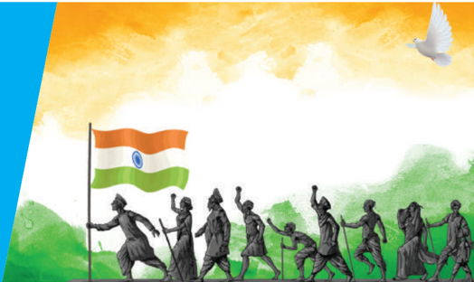

- தீவிரத்தன்மமை கொ ண்டவர்களும் தீவிர தேசியவாதப் போக்கு உடையவர்களின் தோற்றமும் விடுதலைப் போராட்டத்தில் அவர்கள் ஆற்றிய பங்கும்
- சட்டமறுப்பு இயக்கத்தின் தொடக்கம்
- தனித்தொகுதிகள் குறித்த சர்ச்சசை மற்றும் பூனா ஒப்பந்தம் கையெழுத்திடப்படுதல்
- மாகாணங்களில் முதலாவதாக அமைந்த காங்கிரஸ் அமைச்சரவைகள் மற்றும் வெள்ளளையனே வெளியேறு இயக்கம் தோன்றுவதற்ககான சூழ்நிலைகள்
- இந்தியத் துணைக்கண்டத்ததை இந்தியா-பாகிஸ்ததான் என இரண்டடாகப் பிரிவினை செய்ய வழிவகுத்த வகுப்புவாதம்

**அறிமுகம்**

மகா த்மமா காந்தி, தென்னனாப்பிரிக்ககாவில் வாழ்ந்த இந்தியர்களின் சமூக உரிமைகளுக்ககாக சுமா ர் 20 ஆண்டுகள் போராடிய பிறகு 1915இல் தாயகம் திரும்பினார். இந்திய அரசியலுக்கு புதிய எழுச்சியை அவர் ஏற்படுத்தினார். தென்னனாப்பிரிக்ககாவில் அவர் ஆண்கள், பெண்கள், இளைஞர்கள், முதியோர் என அனைவரும் பின்பற்றத்தக்க 'சத்தியாகிரகம்' என்ற புதிய வழிமுறையை அறிமுகம் செய்ததார். அடித்தட்டு வறியவர்களின் மேன்மமைக்ககாக உறுதிபூண்ட அவரால் மக்களின் நல்லலெண்ணத்ததை எளிதில் பெறமுடிந்தது. இந்திய தேசிய இயக்கத்ததை கா ந்தியடிகள் எவ்வவாறு மடைமாற்றம் பெறவைத்ததார் என்பதை இந்தப் பாடத்தில் நாம் க ண்போம்.

### 8.1 காந்தியடிகளும் மக்கள் தேசியமும்

**(அ) காந்தியடிகள் உருவாகிறார்**

குஜராத்தின் போர்பந்தரில் ஒரு வசதியான குடும்பத்தில் 1869 அக்டோபர் 2ஆம் நாள் மோகன்ததாஸ் கரம்சந்த் காந்தி பிறந்ததார். அவரது தந்ததையார் காபா காந்தி, போர்பந்தரின் திவானாகவும் பின்னர் ராஜ்கோட்டின் திவானாகவும் பொறுப்பு வகித்ததார். அவரது தாயார் புத்லிபாயின் தாக்கம் இளையவரான காந்தியின் நடவடிக்ககைகளில் பெரிதும் இருந்தது. பதின்ம ப ள்ளிப் (Matriculation) படிப்பபை முடித்த காந்தியடிகள் ச ட்டம் பயில்வதற்ககாக 1888இல் இங்கிலாந்துக்குக் கட ல்பயணம் மேற்கொண்டடார். 1891ஆம் ஆண்டு ஜூன் மாதம் வழக்கறிஞர் பட்டம்பபெற்ற பின்பு அவர் பிரிட்டிஷாரின் நீதி மற்றும் நியாய முறையில்

நம்பிக்ககை கொ ண்டவராக இந்தியாவுக்குத் திரும்பினார்.

இந்தியா திரும்பியவுடன் பம்பபாயில் வழக்குரைஞராக பணியாற்ற காந்தியடிகள் மேற்கொண்ட முயற்சி தோல்வியடைந்தது. அந்த காலகட்டத்தில்ததான் தென்னனாப்பிரிக்ககாவில் இருந்த குஜராத்தி நிறுவனம் ஒன்று சட்ட உரிமை வழக்குகள் தொடர்பபாக காந்தியடிகளின் சேவையை நாடியது. இந்த வாய்ப்பபை ஏற்றுக்கொண்ட காந்தியடிகள் 1893 ஏப்ரல் மாதம் தென்னனாப்பிரிக்ககாவுக்குப் புறப்பட்டுச் சென்றறார். தென்னனாப்பிரிக்ககாவில்ததான் முதன்முறையாக அவர் இனவெறியை எதிர்கொண்டடார். டர்பனில் இருந்து பிரிட்டோரியாவுக்கு ரயில்பயணம் மேற்கொண்டபோது பீட்டர்மமாரிட்ஸ்பர்க் ரயில் நிலையத்தில் முதல்வகுப்புப் பெட்டியிலிருந்து வலுக்கட்டடாயமாக வெளியேற்றப்பட்டடார். கா ந்தியடிகள் இதை எதிர்த்துப்போராட உறுதி பூண்டடார்.

கா ந்தியடிகள் டிரான்ஸ்வவாலில் உள்ள இந்தியர்களின் கூட்டத்ததைக் கூட்டி அவர்கள் தங்களுடைய குறைகளை உறுதியுடன் வெளிப்படுத்தி களைவதற்ககாக ஒரு அமைப்பபை ஏற்படுத்தவேண்டும் என்று அறிவுறுத்தினார். இது போன்ற கூட்டங்களைத் தொடர்ந்து நடத்திய அவர், அந்த நாட்டின் சட்டங்களை மீறும் விதமாக நடந்த அநீதிகள் தொடர்பபாக நிர்வவாகத்தினருக்கு மனுக்களை அளித்ததார். டிரான்ஸ்வவாலில் வசித்த இந்தியர்கள் தலை வரியாக 3 பவுண்டுகளை செலுத்த வேண்டியிருந்தது. அவர்களுக்ககென குறிக்கப்பட்ட பகுதிகளை விடுத்து வேறு இடங்களில் அவர்கள் நிலத்ததை சொந்தமாக வைத்துக்கொள்ள முடியாதநிலை இருந்தது. இரவு 9 மணிக்குப் பிறகு அனுமதியின்றி வெளியிடங்களுக்கு செல்லமுடியாத நிலையும் இருந்தது. இத்தகைய நியாயமற்ற ச ட்டங்களை எதிர்த்து அவர் போராட்டத்ததைத் தொடங்கினார்.

கா ந்தியடிகளுக்கு டால்ஸ்டடாய், ஜான் ரஸ்கின் ஆகியோரின் எழுத்துக்களுடன் அறிமுகம் கிடைத்தது. 'கடவுளின் அரசாங்கம் உன்னில் உள்ளது' (The Kingdom of God is Within You) என்ற டால்ஸ்டடாயின் புத்தகம், 'அண்டூ திஸ் லா ஸ்ட்' (Unto the Last) என்ற ஜான் ரஸ்கின் எழுதிய புத்தகம் தாரோவின் 'சட்டமறுப்பு' (Civil Disobedience) ஆகிய புத்தகங்களால் காந்தியடிகள் பெரும் தாக்கத்திற்குள்ளளானார். ரஸ்கின் அவர்களால் பெரிதும் ஈர்க்கப்பட்ட காந்தியடிகள் ஃபீனிக்ஸ் குடியிருப்பபையும் (1905) டால்ஸ்டடாய் ப ண்ணணையையும் (1910) நிறுவினார். சமத்துவம், சமூக வாழ்க்ககை , செய்யும் தொழில் மீது மரியாதை

தேசியம்: காந்திய காலகட்டம்

96

ஆகிய நற்பண்புகள் இந்தக் குடியிருப்புகளில் ஊக்கப்படுத்தப்பட்டன. சத்தியாகிரகிகளுக்கு இவை ப யிற்சிக் களங்களாகத் திகழ்ந்தன.

**தென்னனாப்பிரிக்ககாவில் ஒரு செயல்உத்தியாக சத்தியாகிரகம்**

கா ந்தியடிகள் உண்மமையின் வடிவமாக ச த்தியாகிரகத்ததை மேம்படுத்தினார். நியாயமற்ற ச ட்டங்களுக்கு எதிராக அமைதிப் பேரணிகளை நடத்திய பரப்புரையாளர்கள் எதிர்ப்பு தெரிவிக்கும் விதமாக தாங்களாகவே முன்வந்து கைதானார்கள். குடியேற்றம் மற்றும் இனவேறுபாடு ஆகிய பிரச்சனைகளுக்ககாகப் போராட அவர் ச த்தியாகிரக சோதனைகளை மேற்கொண்டடார். குடிப்பபெயர்நந்ததோரை பதிவு செய்யும் அலுவலகங்கள் முன் கூட்டங்களும் ஆர்ப்பபாட்டங்களும் நடத்தப்பட்டன. காவல்துறையினர் வன்முறையை கட்டவிழ்த்துவிட்டபோதிலும் சத்தியாகிரகிகள் எந்தவித எதிர்ப்பபையும் காட்டவில்லலை . கா ந்தியடிகளும் இதர தலைவர்களும் கைதானார்கள். பெரும்பபாலும், ஒப்பந்த தொழிலாளர்களாக இருந்து தெருவோர வியாபாரிகளாக மாறிய இந்தியர்கள், கா வல்துறையினரின் கடுமையான நடவடிக்ககையையும் பொருட்படுத்ததாமல் போராட்டத்ததைத் தொடர்ந்தனர். இறுதியாக ஒப்பந்த தொழிலாளர்கள் மீது விதிக்கப்பட்ட தலைவரி ஸ்மட்ஸ்-காந்தி ஒப்பந்தத்தின்படி ரத்துசெய்யப்பட்டது.

### 8.2 இந்தியாவில் காந்தியடிகள் நடத்திய தொடக்ககால சத்தியாகிரகங்கள்

முந்ததைய இந்திய வருகைகளின்போது கா ந்தியடிகள் தான் சந்தித்த கோபால கிருஷ்ண கோகலே மீது பெரும் மரியாதை கொ ண்டு அவரையே தமது அரசியல் குருவாக ஏற்றறார். அவரது அறிவுரையின்படி, அரசியலில் ஈடுபடுமுன் நாட்டின் அனைத்துப் பகுதிகளுக்கும் காந்தியடிகள் பயணம் மேற்கொண்டடார். இதனால் மக்களின் நிலையை அவர் அறிந்துகொள்ள வழிபிறந்தது. இதுபோன்ற ஒரு பயணத்தின்போதுதான் தமிழகத்தில் தமது வழக்கமான ஆடைகளை விடுத்து சாதாரண வேட்டிக்கு அவர் மாறினார்.

**(அ) சம்பரான் சத்தியாகிரகம்**

பீகாரில் உள்ள சம்பரானில் 'தீன் காதியா' முறை பின்பற்றப்பட்டது. இந்த சுரண்டல் முறையில் இந்திய விவசாயிகள் தங்களின் நிலத்தின் இருபதில்

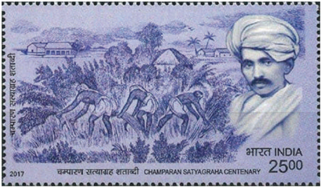

மூன்று பங்கு பகுதியில் அவுரி (இண்டிகோ) பயிரிட வேண்டும் என்று ஐரோப்பியப் பண்ணணையாளர்கள் அவர்களைக் கட்டடாயப்படுத்தினர். பத்தொன்பதாம் நூற்றறாண்டின் கடைசியில் ஜெர்மமானிய செயற்ககை சாயங்களால், இண்டிகோ எனப்படும் நீலச்சசாயம் சந்ததையில் விற்கப்படுவது குறைந்தது. ச ம்பரானில் இண்டிகோ பயிரிட்ட ஐரோப்பியப் ப ண்ணணையாளர்கள் நீலச்சசாயம் பயிரிடும் கடமை யிலிருந்து விவசாயிகளை விடுவிக்கும் தேவையை உணர்ந்து அந்த நிலைமையை தங்களுக்குச் சாதகமாகப் பயன்படுத்திக்கொள்ள விரும்பினார்கள். இந்தக் கடமையிலிருந்து விவசாயிகளை விடுவிக்கும்பொருட்டு சட்டத்துக்கு புறம்பபான நிலுவைத்தொகைகளை வசூலித்ததோடு வாடகையையும் அதிகரித்ததார்கள். எனவே , எதிர்ப்பு வெடித்தது. இந்த வகையில் சிரமங்களைச் ச ந்தித்த சம்பரானைச் சேர்ந்த விவசாயியான ராஜ்குமார் சுக்லலா , ச ம்பரானுக்கு வருகை புரியுமாறு கா ந்தியடிகளைக் கேட்டுக்கொண்டடார். சம்பரானை கா ந்தியடிகள் சென்று சேர்ந்தவுடன், அங்கிருந்து உடனடியாக வெளியேறுமாறு காவல்துறையினர் அவரைக் கேட்டுக்கொண்டனர். அதற்கு அவர் மறுத்ததையடுத்து வழக்ககைச் சந்திக்குமாறு ப ணிக்கப்பட்டடார். இந்தச் செய்தி காட்டுத்தீ போன்று பரவியதை அடுத்து ஆயிரக்கணக்ககானோர் அந்த இடத்தில் காந்தியடிகளுக்கு ஆதரவாகக் கூடினர். 'நாடு முதன்முதலாக ஒத்துழையாமை இயக்கச் செயல்முறைப் பாடத்ததைக் கற்றுக்கொண்டதாக' கா ந்தியடிகள் தெரிவித்ததார். இந்தியாவின் முதலாவது குடியரசுத்தலைவராக பின்னனாளில் பொறுப்பபேற்ற இராஜேந்திர பிரசாத்தும் வழக்குரைஞராக தொழில் செய்த பிரஜ்கிஷோர் பிரசாத்தும் காந்தியடிகளுக்குத் துணையாக செயல்பட்டனர். அதன்பிறகு துணைநிலை ஆளுநர் ஒரு குழுவை உருவாக்கினார் காந்தியடிகள் அக்குழுவில் ஒரு உறுப்பினர் ஆனார். இண்டிகோ ப ண்ணணையாளர்கள் விவசாயிகள் மீது நடத்திய அடக்குமுறையை முடிவுக்குக் கொண்டுவரும் வகை யில் 'தீன் காதியா' முறையை ரத்து செய்ய அந்தக் குழு பரிந்துரைத்தது.

ச ம்பரான் சத்தியாகிரகத்தின் வெற்றியை அடுத்து 1918இல் அகமதாபாத் மில் வேலைநிறுத்தம், 1918இல் கேதா சத்தியாகிரகம் ஆகியன கா ந்தியடிகளை ஒரு மக்கள் தலைவராக உருவாக்கின. முந்ததைய தலைவர்களைப் போலல்லலாமல் நாட்டு மக்களை ஒன்றுதிரட்டும் ப ணியில் காந்தியடிகள் தம் திறமையை வெளிப்படுத்தினார்.

**(ஆ) ரௌலட் சத்தியாகிரகமும் ஜாலியன்வவாலா பா க் படுகொ லையும்**

இந்தியர்களுக்கு உண்மமையில் அதிகாரங்களை பரிமாற்றம் செய்யயாததால் 1919ஆம் ஆண்டின் இந்திய அரசுச்சட்டம் ஏமாற்றத்ததை அளித்தது. மேலும், அரசானது போர்க்ககாலக் கட்டுப்பபாடுகளை நிரந்தரமாக விரிவுபடுத்தி அமல்படுத்தத் தொடங்கியது. பிடிஉத்தரவு இல்லலாமல் கைது நடவடிக்ககை, விசாரணை இல்லலாமல் சிறையிலடைப்பது என காவல் துறையினருக்கு அதீத அதிகாரங்களை ரௌலட் சட்டம் வழங்கியது. இந்தச் சட்டத்ததை 'கருப்புச் சட்டம்' என்றழைத்த கா ந்தியடிகள் அதனை எதிர்த்து நாடு தழுவிய ச த்தியாகிரகப் போராட்டத்துக்கு 1919 ஏப்ரல் 6இல் அழைப்புவிடுத்ததார். இது உண்ணணாவிரதமிருத்தல் மற்றும் பிரார்த்தனையுடன் கூடிய ஒரு அகிம்சசை போராட்டமாக இருத்தல் வேண்டும். இது நாடு முழுவதும் பரவிய தொடக்ககால காலனிய எதிர்ப்பு போராட்டமாகும். ரௌலட் சட்டத்துக்கு எதிரான போராட்டம் பஞ்சசாபில் குறிப்பபாக அமிர்தசரஸ் மற்றும் லா கூரில் தீவிரமடைந்தது. காந்தியடிகள் கைது செய்யப்பட்டதுடன் பஞ்சசாபிற்குள் நுழையவிடாமலும் தடுக்கப்பட்டடார். ஏப்ரல் 9ஆம் நாள் டாக்டர். சை ஃபுதீன் கிச்லு, டாக்டர். சத்யபால் என்ற இரண்டு முக்கிய உள்ளூர் தலைவர்கள் போராட்டத்திற்கு தலைமையேற்றதால் அமிர்தசரஸில் கைது செய்யப்பட்டனர்.

**ஜெனரல் டயரின் கொடுங்கோன்மமை**

அமிர்தசரஸில் உள்ள ஜாலியன்வவாலா பாக்கில் 1919 ஏப்ரல் 13ஆம் நாள் ஒரு பொதுக்கூட்டத்துக்கு ஏற்பபாடு செய்யப்பட்டிருந்தது. பைசாகி திருநாளில் (சீக்கியர்களின்

அறுவடைத்திருநாள்) இந்தக்கூட்டத்துக்கு ஏற்பபாடு செய்யப்பட்டிருந்தது. ஆயிரக்கணக்ககான கிராம மக்கள் அங்கு கூடியிருந்தனர். இந்தக்கூட்டம் பற்றி அறிந்தவுடன் அந்த இடத்ததை பீரங்கி வண்டி மற்றும் ஆயுதமேந்திய வீரர்களுடன் ஜெனரல் ரெஜினால்டு ட யர் சுற்றி வளைத்ததார். உயர்ந்த மதில்களுடன் அமைந்த அந்த மைதானத்துக்கு இருந்த ஒரே

தேசியம்: காந்திய காலகட்டம்

வாயில் பகுதியை ஆக்ரமித்த ஆயுதமேந்திய வீரர்கள் எந்தவித முன்னனெச்சரிக்ககையுமின்றி கண்மூடித்தனமாக சுடத்தொடங்கினார்கள். துப்பபாக்கிகளில் குண்டுகள் தீரும் வரை தொடர்ந்து 10 நிமிடங்களுக்கு இந்தத் துப்பபாக்கிச்சூடு நிகழ்ந்தது. அதிகாரபூர்வ அரசு தகவல்களின் படி 379 பேர் இந்தத் துப்பபாக்கிச்சூட்டில் கொல்லப்பட்டனர்; ஓராயிரத்துக்கும் மேற்பட்டோர் காயம் அடைந்தனர். ஆனால் அதிகாரபூர்வமற்ற தகவல்கள் இந்தத் தாக்குதலில் உயிரிழந்தோர் எண்ணிக்ககையை ஓராயிரத்துக்கும் அதிகம் என்று தெரிவித்தது. இந்தச் சம்பவத்துக்குப் பிறகு படைத்துறைச்சட்டம் அறிவிக்கப்பட்டு பஞ்சசாப் குறிப்பபாக, அமிர்தசரஸ் மக்கள் சவுக்கடி கொடுக்கப்பட்டு தெருக்களில் ஊர்ந்து செல்ல வைக்கப்பட்டனர். இந்தக் கொ டுமைகள் இந்தியர்களை கொ தித்ததெழச்சசெய்தது. இரவீந்திரநாத் தாகூர் வீரத்திருமகன் (knighthood) என்ற அரசுப் பட்டத்ததை திருப்பிக் கொடுத்ததார். கெய்சர்-இ-ஹிந்த் பதக்கத்ததை காந்தியடிகள் திருப்பிக்கொடுத்ததார்.

**(இ) கிலாபத் இயக்கம்**

1918இல் முதலாவது உலகப்போர் முடிவுக்கு வந்தது. இசுலாமிய மதத்தலைவர் என உலகம் முழுவதும் போற்றப்பட்ட துருக்கியின் கலிபா கடுமையாக நடத்தப்பட்டடார். அவருக்கு ஆதரவாக தோற்றுவிக்கப்பட்ட இயக்கமே கிலாபத் இயக்கம் என்றழைக்கப்பட்டது. மௌலானா முகமது அலி மற்றும் மௌலானா சௌகத் அலி எனும் அலி சகோதரர்கள் தலைமையில் இவ்வியக்கம் நடந்தது. இந்த இயக்கத்துக்கு ஆதரவளித்த காந்தியடிகள் இந்த இயக்கத்ததை இந்து முஸ்லீம்களை இணைக்க ஒரு வாய்ப்பபாகக் கருதினார். 1919ஆம் ஆண்டு நவம்பர் மாதம் தில்லியில் நடைபெற்ற அகில இந்திய கிலாபத் இயக்க மாநாட்டிற்கு அவர் தலைமையேற்றறார். அல்லலாஹூ அக்பர், வந்ததே மா தரம், இந்து-முஸ்லீம் வாழ்க ஆகிய மூன்று தேசிய முழக்கங்களை முன்மொழிந்த சௌகத் அலியின் யோசனையை காந்தியடிகள் ஆதரித்ததார். 1920 ஜூன் 9இல் அலகாபாத்தில் கூடிய கிலாபத் குழுவின் கூட்டம் காந்தியடிகளின் அகிம்சசை மற்றும் ஒத்துழையாமை இயக்கத்ததை ஏற்றுக்கொண்டது. ஒத்துழையாமை இயக்கம் 1920 ஆகஸ்டு முதல் நாள் தொடங்கியது.

### 8.3 ஒத்துழையாமை இயக்கமும் அதன் வீழ்ச்சியும்

1920 செப்டம்பர் மாதம் கல்கத்ததாவில் நடைபெற்ற சிறப்பு கூட்டத்தில் (அமர்வில்) இந்திய தேசிய காங்கிரஸ் ஒத்துழையாமை இயக்கத்துக்கு

தேசியம்: காந்திய காலகட்டம்

98

அனுமதி வழங்கியது. பின்னர் 1920 டிசம்பர் மாதம் சேலம் C. விஜயராகவாச்சசாரியாரின் தலைமையில் நாக்பூரில் நடந்த அமர்வில் இந்த தீர்மமானம் நிறைவேற்றப்பட்டது. ஒத்துழையாமை இயக்கத் திட்டத்தின் கூறுகளாவன;

- பட்டங்கள் மற்றும் மரியாதை நிமித்தமான ப தவிகள் அனைத்ததையும் திரும்ப ஒப்படைப்பது.
- அரசின் செயல்பபாடுகளில் ஒத்துழைக்ககாமல் இருப்பது.
- நீதிமன்ற வழக்குகளில் வழக்குரைஞர்கள் ஆஜராகாமல் இருப்பது. நீதிமன்றத்தில் இருந்த வழக்குகளுக்கு தனியார் மத்தியஸ்தம் மூலமாகத் தீர்வு காண்பது.
- அரசுப் பள்ளிகளை குழந்ததைகளும் அவற்றின் பெற்றோர்களும் புறக்கணிப்பது.
- 1919ஆம் ஆண்டு சட்டத்தின் கீழ் உருவாக்கப்பட்ட சட்டப்பபேரவைகளை புறக்கணிப்பது.
- அரசு விருந்து நிகழ்ச்சிகள் மற்றும் இதர அரசு விழாக்களில் பங்ககேற்பதில்லலை என்ற முடிவு.
- குடிமைப்பணி (சிவில்) அல்லது இராணுவப் பதவிகளை ஏற்க மறுப்பது.
- அந்நியப் பொருள்களின் புறக்கணிப்பு மற்றும் உள்ளூர் பொருள்களுக்கு ஊக்கம் தரும் சுதேசி இயக்கத்தின் கொள்ககைகளைப் பரப்புவது.

**(அ) வரிகொடா இயக்கம் மற்றும் சௌரி சௌரா சம்பவம்**

1922 பிப்ரவரி மாதம் பர்தோலியில் வரிகொடா இயக்க பிரச்சசாரத்ததை காந்தியடிகள் அறிவித்ததார். இந்த இயக்கங்கள் ஒரு தேசியத் தலைவராக காந்தியடிகளின் நற்பபெயரைப் பெரிதும் மேம்படுத்தின, குறிப்பபாக விவசாயிகள் மத்தியில் ஒரு மாபெரும் தலைவராக அவரது மரியாதையை உயர்த்தின. காந்தியடிகள் நாடுதழுவிய சுற்றுப்பயணத்ததை மேற்கொண்டடார். அவர் பயணம் மேற்கொண்ட இடங்களில் எல்லலாம் அந்நியத் துணிகள் குவிக்கப்பட்டு தீயிட்டுக் கொளுத்தப்பட்டன. ஆயிரக்கணக்ககானவர்கள் அரசு வேலைகளைத் துறந்தனர், மாணவர்கள் பெரும் எண்ணிக்ககையில் தங்கள் கல்வியைக் கைவிட்டனர், பெருமளவிலான வழக்குரைஞர்கள் தங்கள் தொழிலை கை விட்டனர். ஆங்கிலேயப் பொருள்கள் மற்றும் நிறுவனங்கள் புறக்கணிப்புத் தீவிரமாக நடந்தது. வேல்ஸ் இளவரசரின் இந்தியப் பயணத்ததை புறக்கணிப்பது வெற்றிகரமாக நடந்துமுடிந்தது.

1922 பிப்ரவரி 5ஆம் நாள் தற்போதைய உத்தரப்பிரதேசத்தில் உள்ள கோரக்பூர் அருகே சௌரி சௌரா என்ற கிராமத்தில் தேசியவாதிகள் நடத்தியப் பேரணி காவல்துறையினரின்

கோபமுட்டும் நடவடிக்ககைகளினால் வன்முறையாக மாறியது. தாம் குறைந்த எண்ணிக்ககையில் இருப்பதை உணர்ந்த கா வல்துறையினர் பாதுகாப்புக்ககாக தங்களை கா வல்நிலையத்துக்குள் அடைத்துக் கொண்டனர். ஆனால் ஆத்திரம்கொண்ட கூட்டத்தினர் 22 காவலருடன் காவல்நிலையத்ததை தீயிட்டுக் கொ ளுத்தினர். இதில் 22 காவலர்களும் உயிரிழந்தனர். காந்தியடிகள் உடனடியாக இயக்கத்ததைத் திரும்பப்பபெற்றறார்.

**(ஆ) சுயராஜ்ஜியக் கட்சியினர்**

இதனிடையே காங்கிரஸ் கட்சி மாற்றத்ததை விரும்புவோர்கள் மற்றும் மாற்றத்ததை விரும்பபாதவர்கள் என இரண்டடாகப் பிளவுபட்டது. மோதிலால் நேரு, சி.ஆர். தாஸ் ஆகியோர் தலைமையிலான காங்கிரசார் தேர்தலில் போட்டியிட்டு சட்டப்பபேரவைக்குள் நுழைய வேண்டும் என்று விரும்பினார்கள். சட்டப் பேரவைகளில் பங்ககேற்று பணியாற்றுவதன் மூலம் மட்டுமே தேசநலன்கள் மேம்படும் என்றும் இரட்டடை ஆட்சியில் பங்ககேற்பதன் மூலம்ததான் காலனி ஆதிக்க அரசை பாதிப்படைய வைக்க முடியும் என்றும் அவர்கள் வாதிட்டனர். அவர்களே மாற்றத்ததை விரும்புவோர்கள் என்று அழைக்கப்பட்டனர். வல்லபாய் பட்டடேல், சி. ராஜாஜி உள்ளிட்ட காந்தியடிகளைத் தீவிரமாகப் பின்பற்றிய பலர் மாற்றத்ததை விரும்பபாதவர்களாக அரசுடன் ஒத்துழையாமை இயக்கத்ததைத் தொடர விரும்பினார்கள். எதிர்ப்புக்கு இடையே மோதிலால் நேருவும் சி.ஆர். தாஸும் 1923 ஜனவரி முதல் நாள் சுயராஜ்ஜியக் கட்சியை தொடங்கினார்கள். இந்தக் கட்சி பின்னர் காங்கிரஸ் கட்சியின் சிறப்பு அமர்வில் அங்கீகரிக்கப்பட்டது. ஆங்கிலேய இந்தியாவின் பேரரசு (Imperial) சட்டப் பேரவை மற்றும் பல்வவேறு மாகாண சட்டப்பபேரவைகளுக்கு பெரும் எண்ணிக்ககையில் சுயராஜ்ஜிய கட்சி உறுப்பினர்கள் தேர்ந்ததெடுக்கப்பட்டனர். தேசியவாதக் கருத்துக்களை முன்னனெடுத்துச் செல்ல அவர்கள் சட்டப்பபேரவையை ஒரு மேடையாகப் பயன்படுத்தினார்கள். வங்ககாளத்தில்

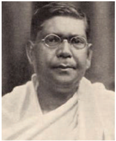

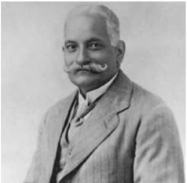

*மோதிலால் நேரு*

அரசுடன் ஒத்துழைக்க விரும்பபாததால் இந்தியர்களுக்கு என மாற்றப்பட்ட துறைகளில் பொறுப்பபேற்க அவர்கள் மறுத்துவிட்டனர். காலனி அரசின் உண்மமையான இயல்பபை அவர்கள் வெளிக்கொணர்ந்தனர். எனினும் 1925இல் அக்கட்சியின் தலைவர் சி.ஆர். தாஸ் மறைந்த பிறகு சுயராஜ்ஜிய கட்சி வீழ்ச்சி காணத் தொடங்கியது.

1919ஆம் ஆண்டின் இந்திய அரசுச் சட்டம் மூலமாக இரட்டடை ஆட்சி என்பது அறிமுகம் செய்யப்பட்டது. இதன் மூலம் மாகாண அரசின் அதிகாரங்கள் ஒதுக்கப்பட்ட மற்றும் மாற்றப்பட்ட துறைகள் என இரண்டு வகைகளாகப் பிரிக்கப்பட்டன. நிதி, பாதுகாப்பு, காவல்துறை, நீதித்துறை, நிலவருவாய், மற்றும் நீர்ப்பபாசனம் ஆகிய துறைகள் ஆங்கிலேயர்கள் வசம் ஒதுக்கப்பட்டன. மாற்றப்பட்ட துறைகளில் உள்ளளாட்சி, கல்வி, பொதுசுகாதாரம், பொதுப்பணி, வேளாண்மமை, வனங்கள், மற்றும் மீன்வளத்துறை ஆகியன இந்திய அமைச்சர்களின் கட்டுப்பபாட்டின் கீழ் விடப்பட்டன. 1935ஆம் ஆண்டு மாகாண சுயாட்சி அறிமுகம் செய்யப்பட்ட பிறகு இந்த முறை முடிவுக்கு வந்தது.

**(இ) காந்தியடிகளின் ஆக்கப்பூர்வத் திட்டம்**

சௌரி சௌரா நிகழ்வுக்குப் பிறகு ஆர்வலர்களும் மக்களும் அகிம்சசை போராட்டம் குறித்த பயிற்சியை மேற்கொள்ள வேண்டும் என்று கா ந்தியடிகள் உணர்ந்ததார். அதன் ஒருபகுதியாக கா தி இயக்க மேம்பபாடு, இந்து-முஸ்லீம் ஒற்றுமை , தீண்டடாமை ஒழிப்பு ஆகியவற்றில் அவர் கவனம் செலுத்தினார். "உங்கள் மாவட்டங்களுக்குச் செல்லுங்கள். கதர், இந்து-முஸ்லீம் ஒற்றுமை , தீண்டடாமை ஒழிப்பு ஆகியன பற்றிய செய்திகளைப் ப ரப்புங்கள். இளைஞர்களை ஒன்றுதிரட்டி அவர்களை சுயராஜ்யத்தின் உண்மமையான வீரர்களாக உருமாற்றுங்கள்." என்று கா ந்தியடிகள் காங்கிரசாருக்கு அறிவுறுத்தினார். கா ங்கிரஸ் உறுப்பினர்கள் கதர் உடுப்பதை அவர் கட்டடாயமாக்கினார். அகில இந்திய நெசவாளர் அமைப்பு உருவாக்கப்பட்டது.

**(ஈ) சைமன் குழு புறக்கணிப்பு**

1927 நவம்பர் 8ஆம் நாள் இந்திய அரசியல் சாச ன சீர்திருத்தங்களுக்ககான இந்திய சட்டபூர்வ ஆணையத்ததை (Indian Statutory Commission) நியமிப்பதாக ஆங்கிலேய அரசு அறிவித்தது. சர் ஜான் சைமன் தலைமையிலான இந்தக் குழுவில் ஏழு உறுப்பினர்கள் இடம்பபெற்றனர். இது 'சைமன் குழு' என்றறே அழைக்கப்பட்டது. இந்தியர்கள் எவரும் இடம்பபெறாமல் அனைவரும் வெள்ளளையர்களாக

தேசியம்: காந்திய காலகட்டம்

இந்தக் குழுவில் இடம்பபெற்றனர். இந்தியர் ஒருவர் கூட உறுப்பினராக இல்லலாத காரணத்ததால் இந்தியர்கள் ஆத்திரமும் அவமானமும் அடைந்தனர். தங்கள் அரசியல் சாசனத்ததை நிர்ணயிக்க தங்களுக்கு உரிமை இல்லலாத நிலைகண்டு கொதித்தனர். காங்கிரஸ் மற்றும் முஸ்லீம் லீக் உள்ளிட்ட அனைத்து இந்திய பிரிவுகளும் இந்த சைமன் குழுவினைப் புறக்கணிப்பது என முடிவு செய்தன. இந்தக் குழு சென்ற இடங்களில் எல்லலாம் ஆர்ப்பபாட்டங்களும், கருப்புக்கொடி ஏந்தியபடி 'சைமனே திரும்பிப் போ' எனும் முழக்கங்களும் இடம்பபெற்றன. போராட்டக்ககாரர்கள் காவல்துறையினரால் கொ டூரமாக தாக்கப்பட்டனர். அவ்வவாறு நடந்த ஒரு கடுமையான தாக்குதலில் லாலா லஜபதி ராய் மிக மோசமாக காயமடைந்து பின்னர் சில நாள்களில் உயிரிழந்ததார்.

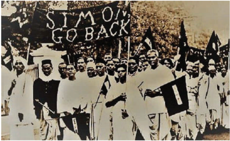

**(உ) நேரு அறிக்ககை**

இந்தியாவில் இருந்த பல்வவேறு அரசியல் கட்சிகளை சைமன் குழு புறக்கணிப்பு ஒன்றிணைத்தது. சைமன் குழு முன்மொழிவுகளுக்கு மாற்றறாக இந்தியாவுக்கு அரசியல் சாசனம் உருவாக்குவதை குறிக்கோளாகக் கொண்டு 1928இல் அனைத்துக் கட்சி மாநாடு நடைபெற்றது. இந்த கொ ள்ககைகளின் அடிப்படையில் அரசியல் சாசன வரைவுக்ககாக திட்டம் வகுக்க மோதிலால் நேரு தலைமையிலான கமிட்டி அமைக்கப்பட்டது. அந்தக் கமிட்டியின் அறிக்ககை ' நேரு அறிக்ககை' என்று அழைக்கப்பட்டது. அதில் ப ரிந்துரை செய்யப்பட்டவை:

- இந்தியாவுக்கு தன்னனாட்சி அந்தஸ்து என்ற டொமினியன் தகுதி.
- மத்திய சட்டப் பேரவை மற்றும் மாகாண சட்டப் பேரவைகளுக்கு கூட்டு மற்றும் கலவையான வாக்ககாளர் தொகுதிகளுடன் தேர்தல் நடைபெறுவது.

தேசியம்: காந்திய காலகட்டம்

- மத்திய சட்டப் பேரவை மற்றும் முஸ்லீம்கள் சிறுபான்மமையினராக உள்ள மாகாண சட்ட பேரவைகளில் முஸ்லீம்களுக்கு இடஒதுக்கீடு அதேபோல் இந்துக்களுக்கு அவர்கள் சிறுபான்மமையினராக உள்ள வடமேற்கு எல்லலை மாகாணத்தில் இடஒதுக்கீடு.
- பொது வாக்களிப்பு முறையும் அடிப்படை உரிமைகளும் வழங்கப்படுவது.

மத்திய சட்டப்பபேரவையில் இடஒதுக்கீடு வழங்குவது குறித்து ஜின்னனா சட்டத்திருத்தத்ததைக் கொ ண்டு வந்ததார். மூன்றில் ஒருபங்கு இடங்கள் முஸ்லீம்களுக்கு ஒதுக்கப்பட வேண்டும் என்று அவர் கோரினார். அவரை ஆதரித்த தேஜ்

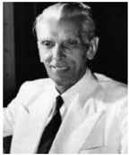

ப ஹதூர் சாப்ரூ இது பெரும் மாற்றத்ததைத் தராது என்று வேண்டினார். எனினும், அனைத்துக் கட்சி மாநாட்டில் இவை அனைத்தும் தோல்வி கண்டன. பின்னர், ஜின்னனாவின் 14 அம்சங்கள் என்று அழைக்கப்பட்ட தீர்மமானத்ததை முன்மொழிந்ததார். எனினும் அதுவும் நிராகரிக்கப்பட்டது. இந்து- முஸ்லீம் ஒற்றுமையின் தூதராக பாராட்டப்பட்ட ஜின்னனா பின்னர் தனது நிலைப்பபாட்டடை மா ற்றிக்கொண்டு முஸ்லீம்களுக்கு தனிநாடு என வலியுறுத்த ஆரம்பித்ததார்.

### 8.4 முழுமையான சுயராஜ்ஜியத்துக்ககான போராட்டம் மற்றும் சட்டமறுப்பு இயக்கத் தொடக்கம்

இதனிடையே டொமினியன் அந்தஸ்து வழங்கப்பட்டது குறித்து திருப்தி அடையாத கா ங்கிரசார் சிலர், முழுமையான சுதந்திரம் வேண்டி கோரிக்ககை வைத்தனர். 1929இல் டிசம்பர் மாதம் லாகூரில் ஜவகர்லலால் நேரு தலைமையில் காங்கிரஸ் அமர்வு நடந்தது. அதில் முழுமையான சுதந்திரம் என்பது இலக்ககாக அறிவிக்கப்பட்டது. வட்டமேசை மாநாட்டடை புறக்கணிப்பது என்று முடிவு செய்யப்பட்டதுடன், ச ட்டமறுப்பு இயக்கத்ததைத் தொடங்கவும் முடிவு செய்யப்பட்டது. 1930 ஜனவரி 26ஆம் நாள் சுதந்திரத் திருநாளாக அறிவிக்கப்பட்டு வரிகொடா இயக்கம் உள்ளிட்ட சட்டமறுப்பு இயக்கம் மூலமாகவும் வன்முறையற்ற முறையில் முழுமையான சுதந்திரத்ததை அடைவது குறித்தும் நாடு முழுவதும் உறுதிமொழி ஏற்கப்பட்டது. இந்த இயக்கத்ததைத் தொடங்க இந்திய தேசிய கா ங்கிரஸ் காந்தியடிகளுக்கு அங்கீகாரம் அளித்தது.

**(அ) உப்பு சத்தியாகிரகம்**

1930 ஜனவரி 31ஆம் நாளுக்குள் நிறைவேற்ற வேண்டும் என்ற காலக்ககெடுவுடன் அரசப்பிரதிநிதி (Viceroy) இர்வின் பிரபுவிடம் கோரிக்ககைகள் அட ங்கிய மனு கொடுக்கப்பட்டது. அவை கீழ்க்கண்டவையாகும்:

- இராணுவம் மற்றும் ஆட்சிப்பணி சேவைகளுக்ககான செலவுகளை 50 சதவிகிதம் வரை குறைப்பது.
- பூரண மதுவிலக்ககை அறிமுகம் செய்வது.
- அனைத்து அரசியல் கைதிகளையும் விடுதலை செய்வது.
- நிலவருவாயை 50 சதவிகிதமாக குறைப்பது.
- உப்பு வரியை ரத்துசெய்வது.

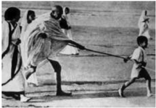

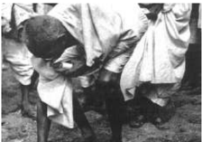

கோரிக்ககை மனுவுக்கு அரசப்பிரதிநிதி பதில் தெரிவிக்ககாத நிலையில் காந்தியடிகள் சட்டமறுப்பு இயக்கத்ததை தொடங்கினார். உப்பு மீதான வரியை ரத்துசெய்ய வேண்டும் என்ற கோரிக்ககை ஒரு அறிவுபூர்வமான முடிவாகும். காந்தியடிகள் 1930 மார்ச் மாதம் 12ஆம் நாள் 78 பேர்களுடன் சப ர்மதி ஆசிரமத்திலிருந்து தனது புகழ்பபெற்ற தண்டி யாத்திரையைத் தொடங்கினார். இந்த யா த்திரையில் நூற்றுக்கணக்ககானோர் சேரச்சசேர அது நீண்டுகொண்டடே போனது. காந்தியடிகள் தனது 61 ஆவது வயதில் 24 நாள்களில் 241 மைல் தொலைவு யாத்திரையாக நடந்து சென்று 1930 ஏப்ரல் 5ஆம் நாள் மாலை தண்டி கடற்கரையை அடைந்ததார். அடுத்த நாள் காலை ஒரு கைப்பிடி உப்பபைக் கையில் எடுத்து உப்புச்சட்டத்ததை மீறினார்.

**மாக ணங்களில் உப்பு சத்தியாகிரகம்**

தமிழ்நநாட்டில் திருச்சிராப்பள்ளியில் இருந்து வேதாரண்யம் வரை இதேபோன்ற ஒரு யா த்திரையை சி. ராஜாஜி மேற்கொண்டடார். கேரளா, ஆந்திரா மற்றும் வங்ககாளத்திலும் உப்பு ச த்தியாகிரக யாத்திரைகள் நடந்தன. வடமேற்கு எல்லலை மாகாணத்தில் கான் அப்துல் கஃபார்ககான் என்பவர் இந்த இயக்கத்திற்குத் தலைமை ஏற்றறார். செஞ்சட்டடைகள் என்றழைக்கப்பட்ட 'குடை கிட்மட்கர்' இயக்கத்ததை அவர் நடத்தினார்.

கா ந்தியடிகள் நள்ளிரவில் கைது செய்யப்பட்டு எரவாடா சிறையில் அடைக்கப்பட்டடார்.

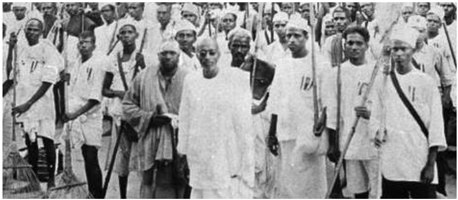

ஜவகர்லலால் நேரு, கான் அப்துல் கஃபார் கா ன் மற்றும் இதர தலைவர்கள் விரைவாக கைதானார்கள். அந்நிய துணிகள் புறக்கணிப்பு, மதுக்கடைகள் முன் ஆர்ப்பபாட்டங்கள், வரி கொடா இயக்கம், வனச்சட்டங்களை பின்பற்ற மறுப்பது ஆகியன உள்ளிட்ட பல ஆர்ப்பபாட்ட வடிவங்கள் பின்பற்றப்பட்டன. பெண்கள், விவசாயிகள், பழங்குடியினர், மாணவர்கள் மற்றும் குழந்ததைகளும் என சமூகத்தின் அனைத்துப் பிரிவு மக்களும் நாடு தழுவிய போராட்டத்தில் பங்ககேற்றனர். இந்தியா ச ந்தித்த மக்கள் இயக்கங்களிலேயே இது மிகப் பெரியது.

ஆங்கிலேயர்கள் 1865ஆம் ஆண்டு முதலாவது வனச்சட்டத்ததை நிறைவேற்றினார்கள். சுள்ளி எடுப்பது, கால்நடைத் தீவனம், தேன், விதைகள், மருத்துவ மூலிகைகள், கொட்டடைகள் ஆகிய சிறிய அளவிலான வன உற்பத்திப் பொருள்களையும் வனப்பகுதிகளில் இருந்து சேகரிக்க இந்தச் சட்டம் வனத்தில் வாழ்வோருக்கு தடைவிதித்தது. 1878ஆம் ஆண்டின் இந்திய வனங்கள் சட்டத்தின் படி வனங்களின் உரிமை அரசிடம் இருந்தது. நன்சசெய் மற்றும் தரிசு நிலங்களும் வனங்களாக கருதப்பட்டன. பழங்குடியினர் பயன்படுத்திய சுழற்சி முறை விவசாயம் தடைசெய்யப்பட்டது. உள்ளூர் மக்களின் கட்டுப்பபாட்டில் இருந்து வனப்பகுதிகளை தள்ளி வைப்பதற்கு பாதிக்கப்பட்ட ஆதிவாசிகளும் தேசியவாதிகளும் கடும் எதிர்ப்பு தெரிவித்தனர்.

பழங்குடியினர் நடத்திய தொடர் ஆர்ப்பபாட்டங்களுக்கு மிக முக்கிய ஆதாரமாக ராம்பபாவில் அல்லூரி சீதாராம ராஜு தலைமையிலான ஆர்ப்பபாட்டத்ததைக் குறிப்பிடலாம். ராம்பபா பகுதி ஆதிவாசிகளின் நலன் காப்பதற்ககாக ஊழல் அதிகாரிகளுடன் அல்லூரி சீதாராம ராஜு போராடியதால் அவரது உயிரைக் குறிவைத்து ஆங்கிலேய அரசு நடவடிக்ககை எடுக்கத் தொடங்கியது. ராம்பபா ஆதிவாசிகளின் கிளர்ச்சியை அடக்குவதற்ககாக (1922-24) மலபார் காவல்துறையின் சிறப்புக்குழு அனுப்பி வைக்கப்பட்டது. வனவாசிகளின் நலனுக்ககாகப் போராடிய அல்லூரி சீதாராம ராஜு சுட்டுக் கொல்லப்பட்டடார்.

தேசியம்: காந்திய காலகட்டம்

**(ஆ) வட்டமேசை மாநாடு**

இந்த இயக்கத்தின் மத்தியில் 1930ஆம் ஆண்டு நவம்பர் மாதம் லண்டனில் முதலாவது வட்ட மேசை மாநாடு நடந்தது. பிரிட்டிஷ் பிரதமர் ராம்சசே மெக்டொனால்டு மாகாண சுயாட்சியுடன் கூடிய மத்திய அரசு பற்றிய யோசனையை அறிவித்ததார். காங்கிரசின் தலைவர்கள் சிறைகளில் அடைக்கப்பட்டிருந்ததால் இந்த வட்டமேசை மாநாட்டில் காங்கிரஸ் கட்சி கலந்து கொள்ளவில்லலை . இந்தப் பிரச்சனை குறித்து எந்தவித முடிவும் எட்டப்படாமலேயே மாநாடு நிறைவடைந்தது.

**(இ) காந்தி-இர்வின் ஒப்பந்தம்**

கா ந்தியடிகளுடன் அரசப்பிரதிநிதி இர்வின் பிரபு பேச்சுவார்த்ததைகளை நடத்தியதையடுத்து 1931 மார்ச் 5ஆம் நாள் காந்தி-இர்வின் ஒப்பந்தம் ஏற்பட்டது. வன்முறையில் ஈடுபடாத அனைத்து அரசியல் கைதிகளையும் உடனடியாக விடுதலை செய்வது, கைப்பற்றப்பட்ட நிலத்ததைத் திரும்பத் தருவது, பதவி விலகிய அரசு ஊழியர்கள் விஷயத்தில் நீக்குபோக்ககாக நடந்துகொள்வது ஆகிய கோரிக்ககைகளை ஆங்கிலேய அரசு ஏற்றுக்கொண்டது. கடலோர கிராமங்களைச் சேர்ந்த மக்கள் தங்கள் பயன்பபாட்டுக்ககாக உப்புக் கா ய்ச்சவும் வன்முறை இல்லலாமல் ஆர்ப்பபாட்டங்கள் செய்யவும் இந்த ஒப்பந்தம் வகைசெய்தது. சட்டமறுப்பு இயக்கத்ததை ரத்து செய்துவிட்டு இரண்டடாவது வட்டமேசை மாநாட்டில் கலந்துகொள்ள கா ங்கிரஸ் கட்சி ஒப்புக்கொண்டது. 1931 செப்டம்பர் 7ஆம் நாள் நடந்த இரண்டடாவது வட்டமேசை மாநாட்டில் காந்தியடிகள் கலந்துகொண்டடார். சிறுபான்மமையினருக்குத் தனித்தொகுதிகள் வழங்குவதை காந்தியடிகள் ஏற்கவில்லலை. இதன் விளைவாக, இரண்டடாவது வட்டமேசை மாநாடு எந்தவித முடிவும் எட்டப்படாமல் முடிவடைந்தது.

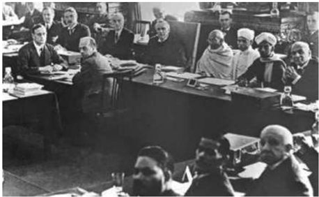

**(ஈ) சட்டமறுப்பு இயக்கத்திற்கு புத்துயிரூட்டல்**

இந்தியா திரும்பிய பிறகு காந்தியடிகள் ச ட்டமறுப்பு இயக்கத்திற்கு மீண்டும் புத்துயிரூட்டினார்.

தேசியம்: காந்திய காலகட்டம்

இந்தமுறை அரசு எதிர்ப்பபை சமாளிக்க ஆயத்தமாக இருந்தது. படைத்துறைச் சட்டம் அமல்படுத்தப்பட்டு 1932 ஜனவரி 4ஆம் நாள் காந்தியடிகள் கைது செய்யப்பட்டடார். விரைவில் அனைத்து காங்கிரஸ் தலைவர்களும் கைது செய்யப்பட்டனர். ஆர்ப்பபாட்டங்கள் மற்றும் மறியல் செய்த மக்கள் படைகொ ண்டு அடக்கப்பட்டனர்.

இதனிடையே, 1932ஆம் ஆண்டு நவம்பர் 17ஆம் நாள் முதல் டிசம்பர் 24ஆம் நாள் வரை மூன்றறாவது வட்டமேசை மாநாடு நடத்தப்பட்டது. ச ட்டமறுப்பு இயக்கத்திற்கு புத்துயிரூட்டியதால் கா ங்கிரஸ் கட்சி இந்த மாநாட்டில் பங்ககேற்கவில்லலை .

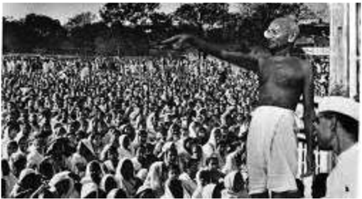

**(உ) வகுப்புவாரி ஒதுக்கீடு மற்றும் பூனா ஒப்பந்தம்**

1932 ஆகஸ்டு 16ஆம் நாள் வகுப்புவாரி ஒதுக்கீட்டடை ராம்சசே மெக்டொனால்டு அறிவித்ததார். முஸ்லீம்கள், சீக்கியர்கள், இந்திய கிறித்தவர்கள், ஆங்கிலோ இந்தியர்கள் மற்றும் பெண்கள் மற்றும் ஒடுக்கப்பட்ட மக்களின் தலைவராகிய B.R. அம்பபேத்கர், தமது கருத்துப்படி தனித்தொகுதிகள் ஒடுக்கப்பட்ட மக்களுக்கு அரசியல் பிரதிநிதித்துவம் மற்றும் அதிகாரத்ததை வழங்கும் என்று வாதிட்டடார். 1932 செப்டம்பர் 20ஆம் நாள் காந்தியடிகள் ஒடுக்கப்பட்ட மக்களுக்கு தனித்தொகுதிகள் ஒதுக்கீட்டிற்கு எதிராக சாகும்வரை உண்ணணாவிரதம் இருக்கும் போராட்டத்ததை தொடங்கினார். மதன் மோகன் மாளவியா, ராஜேந்திர பிரசாத் மற்றும் பல தலைவர்கள் B.R. அம்பபேத்கர் மற்றும் M.C. ராஜா மற்றும் இதர ஒடுக்கப்பட்ட வகுப்பினரின் தலைவர்களுடன் பேச்சுவார்த்ததைகள் நடத்தினர். தீவிரப் பேச்சுவார்த்ததைகளுக்குப் பிறகு காந்தியடிகள் மற்றும் அம்பபேத்கர் இடையே ஒப்பந்தம் ஒன்று எட்டப்பட்டது. இதுவே பூனா ஒப்பந்தம் என்று அழைக்கப்பட்டது.

**அதன் முக்கிய விதிமுறைகள்:**

- தனித்தொகுதிகள் பற்றிய கொள்ககைகள் கைவிடப்பட்டன. மாறாக, ஒடுக்கப்பட்ட வகுப்பு மக்களுக்கு இடஒதுக்கீடு வழங்கும் கூட்டுத்தொகுதிகள் பற்றிய யோசனை ஏற்கப்பட்டது.

- ஒடுக்கப்பட்ட வகுப்பினருக்ககான இடங்கள் 71 லிருந்து 148 ஆக அதிகரிக்கப்பட்டது. மத்திய ச ட்டப் பேரவையில் 18 சதவிகித இடங்கள் ஒதுக்கப்பட்டன.

**(ஊ) தீண்டடாமைக்கு எதிரான பிரச்சசாரம்**

அடுத்த சில ஆண்டுகள் தீண்டடாமையை ஒழிப்பதற்கு கா ந்தியடிகள் செலவிட்டடார். அம்பபேத்கர் உடனான அவரது தொடர்புகள் சாதி அமைப்புகள் ப ற்றிய காந்தியடிகளின் கருத்துக் க ளி ல் பெரிய தாக்கத்ததை ஏற்படுத்தியது. அவர் தமது இருப்பிடத்ததை வார்ததாவில் இருந்த சத்தியாகிரக ஆசிரமத்துக்கு மாற்றினார். அரிஜனர்களுக்ககான பயணம்

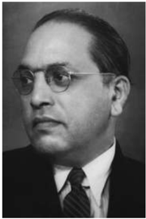

என்ற நாடுதழுவிய பயணத்ததை காந்தியடிகள் மேற்கொண்டடார். அரிஜனர் சேவை சங்கத்ததை அமைத்து சமூகத்தில் உள்ள பாகுபாடுகளை முழுமையாக அவர் அகற்றுவதற்குப் பணியாற்றத் தொடங்கினார். கல்வி, சுத்தம் மற்றும் சுகாதாரம் ஆகியவற்றறை மேம்படுத்தவும் ஒடுக்கப்பட்ட மக்களிடையே மதுப் பழக்கத்ததை கைவிடவும் அவர் பணியாற்றினார். கோயில் நுழைவுப் போராட்டம் என்பது இந்தப்பிரச்சசாரத்தின் முக்கியமான ப குதியாகும். 1933 ஜனவரி 8ஆம் நாள் 'கோவில் நுழைவு நா ள்' என அனுசரிக்கப்பட்டது.

### 8.5 பொதுவுடைமை (சோஷியலிஸ்ட்) இயக்கங்களின் தொடக்கங்கள்

1917ஆம் ஆண்டின் ரஷ்யப் புரட்சியால் ஈர்க்கப்பட்ட இந்திய பொதுவுடைமை (Communist) கட்சி (CPI), 1920 அக்டோபர் மா தம் உஸ்பபெகிஸ்ததானின் தாஷ்கண்டில் நிறுவப்பட்டது. M.N. ராய், அபானி முகர்ஜி, M.P.T. ஆச்சசார்யயா ஆகியோர் அதன் நிறுவன உறுப்பினர்களாவர்.

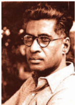

1920களில் அடுத்தடுத்து வழக்குகளைத் தொடுத்து கம்யூனிச இயக்கத்ததை அடக்குவதற்கு இந்தியாவில் இருந்த ஆங்கிலேய அரசு பல்வவேறு முயற்சிகளை மேற்கொண்டது. மேலும், கம்யூனிசம் தொடர்பபான அச்சுறுத்தலை அடக்கும் மற்றொரு முயற்சியாக M.N. ராய், S.A. டாங்ககே, முசாஃபர் அஹமது, M. சிங்ககாரவேலர் ஆகிய தலைவர்கள் கைது செய்யப்பட்டதோடு, 1924ஆம் ஆண்டின் கான்பூர் ச தித்திட்ட வழக்கிலும் விசாரிக்கப்பட்டனர்.

**(அ) பொதுவுடைமை (Communism) க ட்சி நிறுவப்படுதல்**

தங்கள் கருத்துக்களை பரப்பவும், 'இந்தியாவில் ஆங்கிலேய ஆட்சியின் உண்மமையான முகத்ததை' எடுத்துக்ககாட்டவும் பொதுவுடைமைவாதிகள்

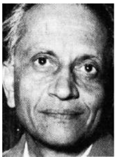

பொதுவுடைமைக் கட்சியை ஆரம்பிக்க அது வழிவகுத்தது. முயற்சிகளின் 1928ஆம் ஆண்டு நிறுவப்பட்டது.

*இதனை ஒரு மேடையாகப் ப யன்படுத்திக் கொண்டனர். ஒரு கட்சியை ஆரம்பிக்கும் முயற்சியாக 1925ஆம் ஆண்டு கா ன்பூரில் அகில இந்திய பொதுவுடைமை மாநாடு நடந்தது. அதில் சிங்ககாரவேலர் தலைமை உரையாற்றினார். இந்திய மண்ணில் இந்திய பல்வவேறு பலனாக 'அகில இந்திய தொழிலாளர்கள் மற்றும் விவசாயிகள் கட்சி' S.A. டாங்ககே*

**(ஆ) புரட்சிகர நடவடிக்ககைகள்**

ஒத்துழையாமை இயக்கத்ததை காந்தியடிகள் திடீரென திரும்பப்பபெற்றதால் குழப்பமடைந்த இளைஞர்கள் வன்முறையைக் கையில் எடுத்தனர். காலனி ஆட்சியை ஆயுதக்கிளர்ச்சி மூலம் அகற்றும் நோக்கில் 1924இல் இந்துஸ்ததான் குடியரசு இராணுவம் (HRA) கான்பூரில் உருவாக்கப்பட்டது. 1925ஆம் ஆண்டு ராம்பிரசாத் பிஸ்மில், அஷ்ஃபாகுல்லலா கான் மற்றும் பலர் லக்னோ அருகே காகோரி என்ற கிராமத்தில் அரசுப்பணத்ததை கொ ண்டுச்சசென்ற ஒரு இரயில்வண்டியை நிறுத்திக் கொ ள்ளளையடித்தனர். அவர்கள் காகோரி சதி வழக்கில் கைது செய்யப்பட்டு விசாரிக்கப்பட்டனர். அவர்களில் நான்கு பேருக்கு மரணதண்டனையும் மற்றவர்களுக்கு சிறைத்தண்டனையும் விதிக்கப்பட்டன.

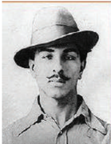

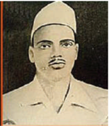

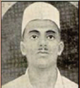

ப ஞ்சசாபில் பகத்சிங், சுக்ததேவ், மற்றும் அவர்களது தோழர்கள் இந்துஸ்ததான் குடியரசு இராணுவத்ததை மீண்டும் அமைத்தனர். பொதுவுடைமை கருத்துக்களால் ஈர்க்கப்பட்டு அந்த அமைப்புக்கு இந்துஸ்ததான் பொதுவுடைமைவாத

தேசியம்: காந்திய காலகட்டம்

குடியரசு அமைப்பு என்று 1928இல் பெயர் மாற்றம் செய்தனர். லாலா லஜபதி ராயின் உயிரிழப்புக்குக் காரணமான தடியடியை நடத்திய ஆங்கிலேய கா வல்துறை அதிகாரி சாண்டர்ஸ் படுகொலை செய்யப்பட்டடார். 1929இல் மத்திய சட்டப் பேரவையில் புகைக்குண்டு ஒன்றறை பகத்சிங்கும் B.K. தத்தும் வீசினார்கள். அவர்கள் "இன்குலாப் ஜிந்ததாபாத்" " பா ட்டடாளி வர்க்கம் வாழ்க" ஆகிய முழக்கங்களை எழுப்பினார்கள்.

ராஜகுருவும் பகத்சிங்கும் கைது செய்யப்பட்டு மரணதண்டனை விதிக்கப்பட்டன. பகத்சிங்கின் அசாத்தியமான துணிச்சல் இந்தியா முழுவதும் வாழ்ந்த இளைஞர்களின் கவனத்ததை ஈர்த்ததை அடுத்து அவர் இந்தியா முழுவதும் பிரபலம் அடைந்ததார்.

1930 ஏப்ரலில் சிட்டகாங் ஆயுதக்கிடங்கு மீதான தாக்குதல் சூர்யயாசென் மற்றும் அவரது நண்பர்களால் மேற்கொள்ளப்பட்டது. சிட்டகாங்கில் இருந்த ஆயுதக்

கிடங்குகளைக் கைப்பற்றிய அவர்கள் அங்கு புரட்சிகர அரசை நிறுவினார்கள். அரசு நிறுவனங்களைக் குறிவைத்து அடுத்த மூன்று ஆண்டுகளுக்கு அவர்கள் தாக்குதல்களை நடத்தினார்கள். 1933ஆம் ஆண்டு கைது செய்யப்பட்ட சூர்யயா சென் ஓராண்டுக்குப் பிறகு தூக்கிலிடப்பட்டடார்.

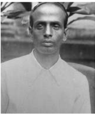

**(இ) 1930களில் இடதுசாரி இயக்கங்கள்**

உலகம் முழுவதும் நிலவிய பொருளாதார மந்தநிலை உருவாக்கிய பொருளாதார நெருக்கடிகளை அடுத்து, 1930களில் இந்திய பொதுவுடைமை கட்சி வலுப்பபெற்றது. பிரிட்டனில் இருந்த மந்தநிலை அதன்கீழ் இருந்த காலனிகளிலும் பா திப்புக்களை ஏற்படுத்தியது. இந்த பொருளாதார வீழ்ச்சியின் விளைவாக வர்த்தக லாபங்களிலும் வேளாண் பொருள்களின் விலைகளிலும் ச ரிவு ஏற்பட்டன. ஏற்கனவே சரிந்திருந்த வேளாண் பொருள்களின் ஐம்பது சதவிகித விலை வீழ்ச்சி காரணமாக கட்டடாயமாக செய்யப்பட்ட அரசின் நிலவருவாய் வசூல் இருமடங்ககாக அதிகரித்தது.

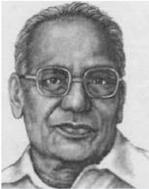

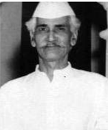

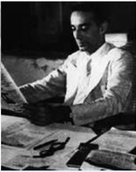

*ஆச்சசார்ய நரேந்திரதேவ்*

தேசியம்: காந்திய காலகட்டம்

புழக்கத்தில் இருந்த பணம் திரும்பப்பபெறப்படுவது, வளர்ச்சிப் பணிகளுக்ககான பணியாளர்கள் எண்ணிக்ககையும் செலவுகளையும் குறைப்பது ஆகியன அரசின் இதர நடவடிக்ககைகளாக இருந்தன. இந்தச்சூழலில் வருவாய் மற்றும் ஊதியக்குறைபாட்டடால் பாதிக்கப்பட்ட விவசாயிகள் மற்றும் தொழிலாளர்களின் நலன், வேலையில்லலாத் திண்டடாட்டம் ஆகியவற்றுக்ககாகப் போராடிய பொதுவுடைமை கட்சி முக்கியத்துவம் பெற்றதையடுத்து 1934ஆம் ஆண்டு அக்கட்சி தடைசெய்யப்பட்டது. தீவிர இடதுசாரி ஆதரவு முதல் தீவிர வலதுசாரி ஆதரவு வரையான அகன்ற அரசியல் சார்பு பெற்ற ஓர் இயக்கமாக சுயராஜ்ஜியம் என்ற குறிக்கோளுடன் காங்கிரஸ் கட்சி வலுவான அமைப்பபாக உருவெடுத்தது. 1934ஆம் ஆண்டில் ஜெயப்பிரகாஷ்நநாராயண், ஆச்சசார்ய நரேந்திரதேவ் மற்றும் மினுமசானி ஆகியோரின் முன்முயற்சியால் காங்கிரஸ் பொதுவுடைமை (சோஷலிஷ) கட்சி உருவானது. தேசியவாதம் தான் பொதுவுடைமைக்ககான பாதை என்று நம்பிய அவர்கள் அதற்ககாக காங்கிரசுக்குள் இருந்து உழைக்க விரும்பினார்கள்.

ஒருசிலர் அதிகாரத்துக்கு வருவதால் உண்மமையான சுயராஜ்ஜியம் கிடைத்துவிடாது, ஆனால், தாங்கள் பெற்ற அதிகாரத்ததை தவறாகப் ப யன்படுத்தப்படும்போது நிருவாகத்தினரை எதிர்க்கும் திறனை அனைவரும் பெறச்சசெய்வதே சுயராஜ்ஜியமாகும்.

- க ந்தியடிகள்

8.6 1935ஆம் ஆண்டு இந்திய அரசுச் ச ட்டத்தின் கீழ் அமைந்த முதல் காங்கிரஸ் அமைச்சரவைகள்

ச ட்டமறுப்பு இயக்கத்தின் ஆக்கப்பூர்வ வெளிப்பபாடுகளில் 1935ஆம் ஆண்டு இந்திய அரசுச் ச ட்டமும் ஒன்றறாகும். மாகாணங்களுக்கு தன்னனாட்சி அதிகாரம், மத்தியில் இரட்டடையாட்சி ஆகியன இந்தச்சட்டத்தின் முக்கிய அம்சங்களாகும். அகில இந்திய கூட்டமைப்பு ஏற்பட வேண்டும் என்று இந்த ச ட்டம் வலியுறுத்துகிறது. அதன்படி, 11 மாகாணங்கள், 6 தலைமை ஆணையரக மாகாணங்கள் மற்றும் இந்தக் கூட்டமைப்பில் சேர விரும்பிய அனைத்து சிற்றரசுகளும் இக்கூட்டமைப்பில் இடம்பபெற்றன. மாகாணங்களின் தன்னனாட்சிக்கும் இந்த சட்டம் வகைசெய்தது. அனைத்து துறைகளும் இந்திய அமைச்சர்களின் கட்டுப்பபாட்டிற்குள் கொண்டு வரப்பட்டன. மாகாணங்களில் நடைமுறையில் இருந்து வந்த இரட்டடை ஆட்சி மத்திய அரசுக்கும் விரிவாக்கப்பட்டது. வாக்குரிமையானது

சொத்தின் அடிப்படையில் நீட்டிக்கப்பட்டதால் மக்கள் தொகையில் பத்து சதவிகித மக்கள் மட்டுமே வாக்களிக்கும் தகுதிபெற்றனர். இந்தச் ச ட்டத்தின்படி, பர்மமா இந்தியாவில் இருந்து பிரிக்கப்பட்டது.

**(அ) காங்கிரஸ் அமைச்சரவைகளும் அவற்றின் ப ணியும்**

1937ஆம் ஆண்டு தேர்தல்கள் அறிவிக்கப்பட்டதுடன் 1935ஆம் ஆண்டின் இந்திய அரசுச் சட்டம் அமல்படுத்தப்பட்டது. ச ட்டமறுப்பு இயக்கத்ததால் காங்கிரஸ் பெரிதும் பலன்பபெற்றது. சட்டப்பபேரவை புறக்கணிப்பபைக் கை விட்ட காங்கிரஸ் தேர்தல்களில் போட்டியிட்டது. ப தினோரு மாகாணங்களில் போட்டியிட்டு ஏழு மாகாணங்களில் காங்கிரஸ் வெற்றிபெற்றது. மதராஸ், பம்பபாய், மத்திய மாகாணங்கள், ஒடிசா , பீகார், ஐக்கிய மாகாணங்கள், வடமேற்கு எல்லலை மாகாணம், சர் முஹம்மது சாதுல்லலா தலைமையிலான அசாம் பள்ளத்ததாக்கு முஸ்லீம் கட்சியுடன் இணைந்து கூட்டணி அரசு உட்பட எட்டு மாகாணங்களில் அது ஆட்சி அமைத்தது. காங்கிரஸ் அரசுகள் பிரபலமான அரசுகளாக செயல்பட்டன. மக்களின் தேவைகளை அவை நிறைவேற்றின. அமைச்சர்களின் ஊதியம் மாதம் ஒன்றுக்கு 2 ஆயிரம் ரூபாயில் இருந்து 500 ரூபாயாக குறைக்கப்பட்டது. தேசியவாதிகளுக்கு எதிராக எடுக்கப்பட்ட முந்ததைய நடவடிக்ககைகள் ரத்துசெய்யப்பட்டன. அரசிடம் அவசரகால அதிகாரங்களை தந்த சட்டங்களை அவர்கள் திரும்பப்பபெற்றனர். கம்யூனிஸ்ட் கட்சி தவிர இதர கட்சிகள் மீது விதிக்கப்பட்ட தடைகளை ரத்துசெய்தனர். தேச அளவில் பத்திரிகைகள் மீது விதிக்கப்பட்டிருந்த கட்டுப்பபாடுகளை அவர்கள் அகற்றிவிட்டனர். காவல்துறை அதிகாரங்கள் கட்டுப்படுத்தப்பட்டன. அரசியல் பேச்சுக்கள் பற்றி சி.ஐ.டி. சார்பபாக அறிக்ககை தருவது விலக்கிக் கொ ள்ளப்பட்டது. விவசாயிகளின் கடன்கள் குறையவும் தொழிலக தொழிலாளர்களின் பணிநிலைமை மேம்படவும் சட்டபூர்வ நடவடிக்ககைகள் மேற்கொள்ளப்பட்டன. கோயில் நுழைவுச் சட்டம் நிறைவேற்றப்பட்டது. கல்வி மற்றும் பொது சுகாதாரத்துக்கு சிறப்புக் கவனம் செலுத்தப்பட்டது.

**(ஆ) காங்கிரஸ் அமைச்சரவையின் பதவி விலகல்**

1939இல் இரண்டடாம் உலகபோர் மூண்டது. கா ங்கிரஸ் அமைச்சரவைகளை ஆலோசிக்ககாமல் கூட்டணிப் படைகள் சார்பபாக இந்த போரில் இந்தியாவின் காலனி ஆதிக்க அரசு நுழைந்தது. எனவே, அதற்கு எதிர்ப்பு தெரிவித்து காங்கிரஸ் அமைச்சரவைகள் பதவி விலகின. ஜின்னனா

1940ஆம் ஆண்டு வாக்கில் முஸ்லீம்களுக்கு தனிநாடு வேண்டும் என்று வலியுறுத்தினார்.

**(இ) இரண்டடாம் உலகப் போரின் போது தேசிய இயக்கம், 1939-45**

க ந் தி ய டி க ளி ன் வேட்பபாளரான பட்டடாபி சீதாராமய்யயாவை வீழ்த்தி 1939இல் சுபாஷ் சந்திர போஸ் கா ங்கிரஸ் தலைவரானார். கா ந்தியடிகள் ஒத்துழைக்க மறுத்ததை அடுத்து, சுபாஷ் சந்திர போஸ் அப்பதவியிலிருந்து விலகி பா ர்வர்டு பிளாக் கட்சியைத் தொடங்கினார்.

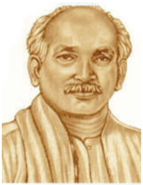

8.7 வெள்ளளையனே வெளியேறு இயக்கத்துக்கு வழிவகுத்த நடவடிக்ககைகள்

**(அ) தனி நபர் சத்தியாகிரகம்**

1940 ஆகஸ்டு மாதம், கா ங்கிரஸ் இரண்டடாம் உலகப்போரின் போது இந்தியர்களின் ஆதரவைப் பெறுவதற்ககாக அரசப்பிரதிநிதி லின்லித்கோ ஒரு சலுகையை வழங்க முன்வந்ததார். எனினும் குறிப்பிடப்படாத எதிர்ககாலத்தில் தன்னனாட்சி (Dominion) தகுதி என்ற சலுகை, காங்கிரசுக்கு

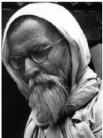

ஏற்றுக்கொள்ளக்கூடியதாக இல்லலை. எனவே , வரையறைக்கு உட்பட்ட சத்தியாகிரகப் போராட்டத்ததை காந்தியடிகள் அறிவித்ததார் இதில் ஒருசிலர் மட்டுமே கலந்துகொண்டனர். 1940 அக்டோபர் 17ஆம் நாள் வினோ பா பாவே ச த்தியாகிரகப் போராட்டத்ததை முதன் முதலாக ஆரம்பித்ததார். அந்த ஆண்டின் இறுதிவரை ச த்தியாகிரகம் தொடர்ந்தது. இந்த காலகட்டத்தில் 25,000க்கும் அதிகமான மக்கள் கைது செய்யப்பட்டனர்.

**(ஆ) கிரிப்ஸ் தூதுக்குழு**

1942 மார்ச் 22ஆம் நாள் அமைச்சரவை (Cabinet) அமைச்சர் சர் ஸ்டட்ரராஃபோர்டு கிரிப்ஸ் தலைமையில் ஒரு தூதுக்குழுவை பிரிட்டிஷ் அரசு அனுப்பியது. உரிய அதிகாரத்ததை உடனடியாக மாற்றித்தர பிரிட்டன் விருப்பப்படாத நிலையில் காங்கிரஸ் மற்றும் கிரிப்ஸ் தூதுக்குழு

தேசியம்: காந்திய காலகட்டம்

இடையேயான பேச்சுகள் தோல்வி அடைந்தன. கிரிப்ஸ் தூதுக்குழு கீழ்க்ககாண்பனவற்றறை வழங்க முன்வந்தது.

- போருக்குப் பிறகு தன்னனாட்சி (Dominion Status) வழங்குவது.
- பாகிஸ்ததான் உருவாக்க கோரிக்ககையை ஏற்கும் விதமாக இந்திய இளவரசர்கள் பிரிட்டிஷாருடன் தனி ஒப்பந்தத்ததைக் கையெழுத்திடலாம்.
- போரின் போது பாதுகாப்புத் துறை பிரிட்டிஷாரின் கட்டுப்பபாட்டில் இருப்பது.

கா ங்கிரஸ், முஸ்லீம் லீக் இரண்டுமே இந்தத் திட்ட அறிக்ககையை நிராகரித்து விட்டன. திவாலாகும் வங்கியில் பின் தேதியிட்ட காசோலை என காந்தியடிகள் இந்த திட்டங்களை அழைத்ததார்.

**(இ) காந்தியடிகளின் "செய் அல்லது செத்து மடி" முழக்கம்**

கிரிப்ஸ் தூதுக்குழுவின் வெளிப்பபாடு மிகுந்த ஏமாற்றத்ததைக் கொடுத்தது. போர்க்ககால ப ற்றறாக்குறைகளினால் விலைகள் பெரிதும் அதிகரித்து அதிருப்தி தீவிரமடைந்தது. பம்பபாயில் 1942 ஆகஸ்டு மாதம் 8ஆம் நாள் கூடிய அகில இந்திய காங்கிரஸ் கமிட்டி வெள்ளளையனே வெளியேறு தீர்மமானத்திற்கு வித்திட்டதுடன் இந்தியாவில் ஆங்கிலேய ஆட்சிக்கு உடனடியாக முடிவு கட்ட கோரிக்ககை வைத்தது. செய் அல்லது செத்து மடி என்ற முழக்கத்ததை காந்தியடிகள் வெளியிட்டடார். "நாம் நமது முயற்சியின் விளைவாக இந்தியாவுக்கு சுதந்திரம் பெற்றுத் தருவோம், அல்லது நாம் நமது அடிமைத்தனத்ததைக் காண உயிருடன் இருக்கமாட்டோம்", என்று காந்தியடிகள் கூறினார். காந்தியடிகளின் தலைமையின் கீழ் அகிம்சசையான மக்கள் போராட்டம் தொடங்கப்பட இருந்தது. ஆனால் அடுத்த நாள் காலை அதாவது 9 ஆகஸ்டு 1942 அன்று காந்தியடிகளும் காங்கிரஸ் தலைவர்கள் அனைவரும் கைது செய்யப்பட்டனர்.

**(ஈ) பொதுவுடைமைவாத (Socialism) தலைவர்களின் பங்குபணி**

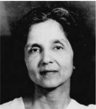

கா ந்தியடிகள் மற்றும் இதர முக்கிய காங்கிரஸ் தலைவர்கள் சிறையில் அ டைப ட்ட தை ய டு த் து இந்த இயக்கத்துக்கு பொதுவுடைமைவாதிகள் தலைமை தாங்கினார்கள். சிறையில் இருந்து தப்பிய ஜெயபிரகாஷ் நாராயண், ராமாநந்த் மிஷ்ரரா ஆகியோர் அருணா ஆசப் அலி

தேசியம்: காந்திய காலகட்டம்

திரைமறைவு வேலைகளில் ஈடுபட்டனர். அருணா ஆசப் அலி போன்ற பெண் தலைவர்கள் முக்கியப் பணி ஆற்றினார்கள். உஷா மேத்ததா நிறுவிய காங்கிரஸ் வானொலி திரைமறைவில் இருந்தபடியே 1942 நவம்பர் மாதம் வரை வெற்றிகரமாகச் செயல்பட்டது.

**(ஊ) மக்களின் வெளிப்பபாடு**

இந்தியாவின் பல பகுதிகளுக்கும் இந்தச் செய்தி பரவியதை அடுத்து அனைத்து இடங்களிலும் ஆங்ககாங்ககே வன்முறை ஆர்ப்பபாட்டங்கள் வெடித்தன. வேலைநிறுத்தங்கள், ஆர்ப்பபாட்டங்கள் மறியல் என தாங்கள் அறிந்த வகைகளில் மக்கள் போராட்டங்களை நடத்தினார்கள். இரும்புக் கரம் கொண்டு அரசு இந்த இயக்கத்ததைக் கட்டுப்படுத்தியது. அரசுக் கட்டடங்கள், ரயில் நிலையங்கள், தொலைபேசி மற்றும் தந்தி கம்பிகள், மற்றும் பிரிட்டிஷ் அதிகாரத்தின் அடையாளங்களாக நின்ற அனைத்தின் மீதும் மக்கள் தாக்குதல்களை நடத்தினார்கள். மதராஸில் இது முக்கியமாக தீவிரமாகப் பரவியது. சதாரா, ஒரிஸா (தற்போதைய ஒடிசா), பீகார், ஐக்கிய மாகாணங்கள், வங்ககாளம் ஆகிய இடங்களில் இணை அரசுகள் நிறுவப்பட்டன.

**(எ) சுபாஷ் சந்திர போஸ் மற்றும் இந்திய தேசிய இராணுவம்**

கா ங்கிரசை விட்டு விலகிய சுபாஷ் சந்திர போஸ்

வீட்டுக்ககாவலில் வைக்கப்பட்டடார். பிரிட்டிஷாரின் எதிரிகளோடு கைகோர்த்து பிரிட்டிஷ் அரசுக்கு எதிராக தாக்குதல் நடத்த அவர் விரும்பினார். 1941 மார்ச் மா தம், அவர் தனது இல்லத்தில் இருந்து நாடகத்தனமாக

(மாறுவேடமணிந்து) தப்பித்து ஆப்ககானிஸ்ததான் சென்றடைந்ததார். முதலில் அவர் சோவியத் யூனியனின் ஆதரவைப் பெற விரும்பினார். ஆனால் பிரிட்டன் உள்ளிட்ட கூட்டணிப் படைகளுடன் சோவியத் யூனியன் அரசு சேர்ந்ததால் அவர் ஜெர்மனிக்கு சென்றறார். 1943 பிப்ரவரி மாதம், நீர்மூழ்கிக் கப்பல் மூலமாக ஜப்பபான் சென்ற அவர், இந்திய தேசிய இராணுவத்தின் கட்டுப்பபாட்டடைக் கை யில் எடுத்ததார். இந்தியப் போர்க்ககைதிகளைக் கொ ண்டு மலாயா மற்றும் பர்மமாவில் இருந்த ஜப்பபானியர்களின் ஆதரவோடு இந்திய தேசிய இராணுவத்ததை (ஆசாத் ஹிந்த் ஃபாஜ்) ஜெனரல் மோகன் சிங் உருவாக்கினார், அதன்பிறகு இது கேப்டன் லட்சுமி செகல் என்பவரால் நடத்தப்பட்டது. இது காந்தி பிரிகேட், நேரு பிரிகேட், பெண்கள் பிரிவாக ராணி லக்ஷ்மி பாய் பிரிகேட் என மூன்று படையணிகளாக சுபாஷ் சந்திர போஸ் மறுசீரமைத்ததார். சுபாஷ் சந்திர போஸ், சிங்கப்பூரில்

சுதந்திர இந்தியாவின் தற்ககாலிக அரசாங்கத்ததை நிறுவினார். 'தில்லிக்கு புறப்படு' (தில்லி சலோ) என்ற முழக்கத்ததை சுபாஷ் வெளியிட்டடார். ஜப்பபானிய படைகளின் ஒரு பகுதியாக இந்திய தேசிய இராணுவம் பணியில் ஈடுபடுத்தப்பட்டது. எனினும் ஜப்பபான் தோல்வி அடைந்த பிறகு இந்திய தேசிய இராணுவம் முன்னனேறுவது தடைபட்டது. சுபாஷ் சந்திர போஸ் பயணம் செய்த விமானம் விபத்துக்குள்ளளானதால் சுதந்திரத்துக்ககாக போராடிய அவரது தீவிரப்பணிகள் முடிவுக்கு வந்தன.

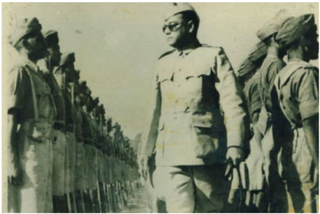

பிரிட்டிஷ் அரசு இந்திய தேசிய இராணுவ அதிகாரிகளை கைது செய்து செங்கோட்டடையில் அவர்களை விசாரணைக்ககாக வைத்தது. தேசியவாத பிரச்சசாரத்துக்கு ஒரு மேடையாக இந்த விசாரணை அமைந்தது. காங்கிரஸ் அமைத்த பா துகாப்புத்துறை கமிட்டி ஜவகர்லலால் நேரு, தேஜ் பஹதூர் சாப்ரூ, புலாபாய் தேசாய், ஆசப் அலி ஆகியோரை உள்ளடக்கியதாக இருந்தது. இந்திய தேசிய இராணுவத்தின் அதிகாரிகளுக்கு எதிரான குற்றம் நிரூபிக்கப்பட்டடாலும் பொதுமக்கள் அழுத்தம் கொ டுத்ததன் காரணமாக அவர்கள் விடுதலை செய்யப்பட்டனர். இந்திய தேசிய இராணுவத்தின் தாக்குதல்களும் அதனை அடுத்த வழக்கு விசாரணைகளும் இந்தியர்களுக்கு ஊக்கமாக அமைந்தது.

### 8.8 விடுதலையை நோக்கி

**(அ) ராயல் இந்திய கடற்படைக் கிளர்ச்சி**

1946ஆம் ஆண்டு பிப்ரவரி மாதம் பம்பபாயில் ராயல் இந்திய கடற்படை மாலுமிகள் கிளர்ச்சி செய்தனர். விரைவில் அங்கிருந்து வேறு நிலையங்களுக்கும் பரவிய இந்த கிளர்ச்சியில் சுமா ர் 20,000க்கும் மேற்பட்ட மாலுமிகள் ஈடுபட்டனர். இதேபோன்று ஜபல்பூரில் இருந்த இந்திய விமானப்படை, இந்திய சமிக்ஞஞை (Signal) படை ஆகியவற்றிலும் வேலைநிறுத்தங்கள்

நடந்தன. இவ்வவாறு ஆயுதப்படைகளிலும் கூட பிரிட்டிஷாரின் மேலாதிக்க கட்டுப்பபாடு இல்லலை .

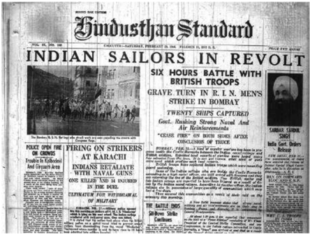

**(ஆ) சுதந்திரம் பற்றிய பேச்சுவார்த்ததை: சிம்லலா மாநாடு**

1945ஆம் ஆண்டு ஜூன் 14ஆம் நாள் வேவல் திட்டம் அறிவிக்கப்பட்டது. இந்ததிட்டம் மூலமாக அரசப்பிரதிநிதியின் செயற்குழுவில் இந்துக்களும் முஸ்லீம்களும் சம எண்ணிக்ககையில் இடம்பபெற்ற ஓர் இடைக்ககால அரசுக்கு வகை செய்யப்பட்டது. போர் தொடர்பபான துறை தவிர்த்து அனைத்து இதர துறைகளும் இந்திய அமைச்சர்கள் வசம் கொ டுக்கப்பட இருந்தன. எனினும் சிம்லலா மாநாட்டில் காங்கிரசும் முஸ்லீம்லீக்கும் ஓர் ஒப்பந்தத்ததை எட்டமுடியவில்லலை. அனைத்து முஸ்லீம் உறுப்பினர்களும் முஸ்லீம் லீக்கில் இருந்துதான் இடம்பபெற வேண்டும் மற்றும் அவர்கள் அனைத்து முக்கிய விஷயங்களிலும் வீட்டோ அதிகாரங்களையும் பெறவேண்டும் என்று ஜின்னனா கோரினார். 1946ஆம் ஆண்டு தொடக்கத்தில் நடந்த மாகாணத் தேர்தல்களில் பொதுத்தொகுதிகளில் பெரும்பபாலானவையை காங்கிரஸ் வென்றது. முஸ்லீம்களுக்கு ஒதுக்கப்பட்ட தொகுதிகளில் முஸ்லீம் லீக் வென்று தனது கோரிக்ககைக்கு வலுசேர்த்தது.

**(இ) அமைச்சரவைத் தூதுக்குழு**

பிரிட்டனில் தொழிற்கட்சி மிகப்பபெரிய வெற்றியை பெற்று கிளெமன்ட் அட்லி பிரதம மந்திரியாகப் பொறுப்பபேற்றறார். உடனடியாக ஆட்சி மா ற்றம் வேண்டும் என்று விரும்பினார். அவர் பெதிக் லாரன்ஸ், சர் ஸ்டராஃபோர்ட் கிரிப்ஸ், A.V. அலெக்ஸஸாண்டர் ஆகியோர் அடங்கிய அமைச்சர்கள் தூதுக்குழுவை இந்தியாவுக்கு அனுப்பினார். பாகிஸ்ததானை தனிநாடாக உருவாக்க வேண்டும் என்ற கோரிக்ககையை நிராகரித்த அக்குழுவினர் பாதுகாப்பு, தகவல்

தேசியம்: காந்திய காலகட்டம்

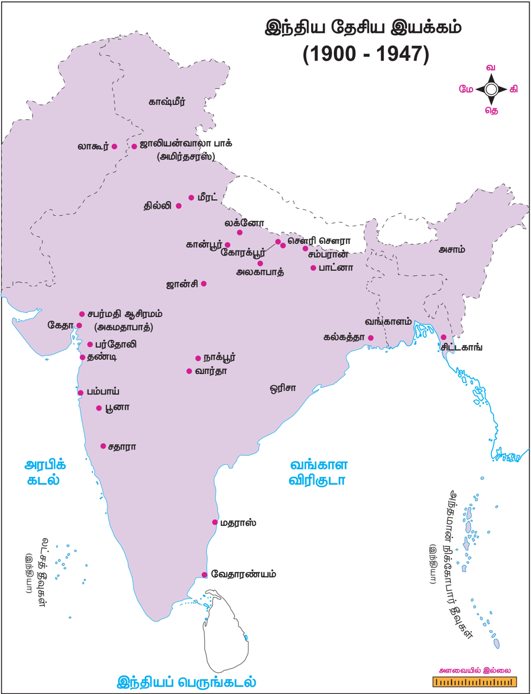

தேசியம்: காந்திய காலகட்டம்

தொடர்பு மற்றும் வெளியுறவு ஆகிய துறைகளில் கட்டுப்பபாட்டுடன் கூடிய மத்திய அரசை நிறுவ வகைசெய்தது. முஸ்லீம்கள் பெரும்பபான்மமையாக இல்லலாத மாகாணங்கள், வடமேற்கில் முஸ்லீம்கள் பெரும்பபான்மமையாக உள்ள மாகாணங்கள், மற்றும் வடகிழக்கில் முஸ்லீம்கள் பெரும்பபான்மமையாக உள்ள மாகாணங்கள் என மூன்றுவகையாக மாகாணங்கள் பிரிக்கப்பட்டன. இந்திய அரசியல் சாசன நிர்ணயமன்றம் தேர்ந்ததெடுக்கப்பட்டு அனைத்து சமூகங்களில் இருந்தும் பிரதிநிதித்துவம் கொண்ட இடைக்ககால அரசு நிறுவப்பட வேண்டும். இந்த திட்டத்ததை கா ங்கிரசும் முஸ்லீம் லீக்கும் ஏற்றுக்கொண்டன. எனினும் இரண்டு கட்சிகளுமே தங்களுக்கு சாதகமாக இந்த திட்டம் குறித்து விவரித்தன.

**(ஈ) நேரடி நடவடிக்ககை நாளுக்கு முஸ்லீம் லீக் அழைப்பு விடுத்தல்**

கா ங்கிரஸ் ஒரு முஸ்லீம் உறுப்பினரை நியமித்ததை அடுத்து காங்கிரஸ் மற்றும் முஸ்லீம் லீக் கட்சிகள் இடையே கருத்து வேறுபாடுகள் நிலவின. தான் மட்டுமே முஸ்லீம்களின் பிரதிநிதியாக இருக்கவேண்டும் என்று வாதிட்ட முஸ்லீம் லீக் தனது ஆதரவை விலக்கிக்கொண்டது. 1946ஆம் ஆண்டு ஆகஸ்டு 16ஆம் நாளை ' நேரடி நடவடிக்ககை நாளாக' ஜின்னனா அறிவித்ததார். ஆர்ப்பபாட்டங்களும் கடையடைப்பு போராட்டங்களும் நடந்தது விரைவில் அது இந்து-முஸ்லீம் மோதலாக உருவெடுத்தது. இது வங்ககாளத்தின் இதர மாவட்டங்களுக்கும் ப ரவியது. நவகாளி மாவட்டம் மிகமோசமாகப் பா திக்கப்பட்டது.

**(உ) மவுண்ட்பபேட்டன் திட்டம்**

ஜவகர்லலால் நேரு தலைமையில் இடைக்ககால அரசு 1946ஆம் ஆண்டு செப்டம்பர் மாதம் அமைக்கப்பட்டது. சில தயக்கங்களுக்குப் பிறகு முஸ்லீம் லீக் இந்த இடைக்ககால அரசில் 1946ஆம் ஆண்டு அக்டோபர் மாதம் இணைந்தது. அதன் பிரதிநிதி லியாகத் அலிகான் நிதி உறுப்பினராக ஆக்கப்பட்டடார். 1948ஆம் ஆண்டு ஜூன் மாதவாக்கில் அதிகாரமாற்றம் ஏற்படும் என்று 1947ஆம் ஆண்டு பிப்ரவரி மாதம் கிளெமன்ட் அட்லி அறிவித்ததார். இந்த ஆட்சி மாற்றத்ததை உறுதி செய்யும் பொறுப்புடன் மவுண்ட்பபேட்டன் பிரபு இந்தியாவுக்கு அரசுப் பிரதிநிதியாக அனுப்பப்பட்டடார். 1947ஆம் ஆண்டு ஜூன் மாதம் 3ஆம் நாள் மவுண்ட்பபேட்டன் திட்டம் அறிவிக்கப்பட்டது. கீழ்க்ககாண்பவை அதில் கூறப்பட்ட அம்சங்கள்:

- இந்தியா மற்றும் பாகிஸ்ததானுக்கு, பிரிட்டனின் தன்னனாட்சிப் பகுதி (Dominion) என்ற தகுதியுடன் அதிகாரமாற்றம் நடைபெறும்.
- சிற்றரசுகள் இந்தியா அல்லது பாகிஸ்ததானில் சேரவேண்டும்.
- ராட்கிளிஃப் தலைமையில் எல்லலைகளை நிர்ணயிக்கும் ஆணையம் அமைக்கப்பட்டு அதிகாரமாற்றத்துக்குப் பிறகு இந்த ஆணையத்தின் முடிவு அறிவிக்கப்படும்.
- பஞ்சசாப் மற்றும் வங்ககாள சட்டப்பபேரவைகள் அவைகள் பிரிக்கப்படவேண்டுமா என்பது பற்றி வாக்ககெடுப்பு நடத்தும்.

**(ஊ) விடுதலையும் பிரிவினையும்**

1947ஆம் ஆண்டு ஜூலை 18ஆம் நாள் பிரிட்டிஷ் நாடாளுமன்றம் இந்திய விடுதலைச் ச ட்டத்ததை இயற்றியதையடுத்து மவுண்பபேட்டன் திட்டத்துக்கு செயல்வடிவம் தரப்பட்டது. இந்தியாவின் மீதான ஆங்கில ஏகாதிபத்தியத்தின் இறையாண்மமையை இந்தச் சட்டம் ரத்து செய்தது. இந்தியா மற்றும் பாகிஸ்ததான் என இரண்டு ப குதிகளாக இந்தியா பிரிக்கப்பட்டது. 1947ஆம் ஆண்டு ஆகஸ்டு 15ஆம் நாள் இந்தியா விடுதலை அடைந்தது.

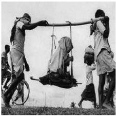

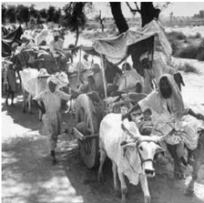

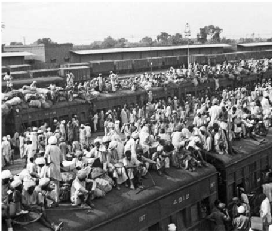

தேசியம்: காந்திய காலகட்டம்

**பாட ச்சுருக்கம்**

- காந்தியடிகள் தென்னனாப்பிரிக்ககாவில் உண்மமை, அகிம்சசை, சத்தியாகிரகம் ஆகியவற்றுடன் மேற்கொண்ட சோதனைகள் மற்றும் அவர் ஒரு மக்கள் தலைவராக உருவெடுத்தது விவரிக்கப்பட்டுள்ளது.
- ஒத்துழையாமை , ச ட்டமறுப்பு, வெள்ளளையனே வெளியேறு ஆகிய இயக்கங்களுக்ககான அவரது அழைப்பும் இந்த இயக்கங்கள் 1919ஆம் ஆண்டின் இந்திய அரசுச் சட்டம், 1935ஆம் ஆண்டின் இந்திய அரசுச் சட்டம், 1947ஆம் ஆண்டின் விடுதலைச் சட்டம் ஆகியவற்றுக்கு வழிவகுத்தது குறித்து விவரிக்கப்பட்டுள்ளது.
- பொதுவுடைமைத் தலைவர்கள் மற்றும் பகத்சிங், சுபாஷ் சந்திரபோஸ் போன்ற புரட்சிகரத் தலைவர்கள் ஆகியோரின் பங்கு, அவர்களின் செயல்பபாடுகளால் ஏற்பட்ட விளைவுகள் ஆகியன விவரிக்கப்பட்டுள்ளன.
- இந்து மகா சபை மற்றும் முஸ்லீம் லீக் ஆகியவை அரசியல் காரணங்களுக்ககாக மதத்ததைப் ப யன்படுத்தியதும் பிரிவினைக்கு வழிவகுத்ததும் விவரிக்கப்பட்டுள்ளன.
