**அலகு - 1**

முதல் உலகப்போரின் வெடிப்பும் அதன் பின்விளைவுகளும்

**க ற்றலின் நோக்கங்கள்**

**கீழ்க்ககாண்பனவற்றோடு அறிமுகமாதல்**

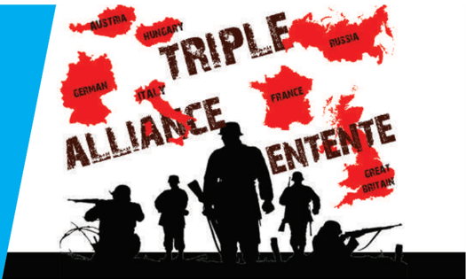

- ஐரோப்பிய வல்லரசுகளிடையே பகைமையும் மோதல்களும் ஏற்படுவதற்கு இட்டுச் சென்ற காலனியாதிக்கப் போட்டி
- கிழக்கு ஆசியாவில் ஜப்பபான் அதிக வலிமை மிகுந்த நாடாகவும் ஆக்கிரமிப்பு செய்யும் தன்மமை கொண்ட நாடாகவும் மேலெழுதல்
- காலனியாதிக்கம் ஆப்பிரிக்ககாவின் மீது தாக்கத்ததை ஏற்படுத்துதல்
- முதல் உலகப்போருக்ககான காரணங்கள், போரின் போக்கு, விளைவுகள்
- வெர்சசெய்ல்ஸ் உடன்படிக்ககையும் அதன் சரத்துக்களும்
- ரஷ்யப் புரட்சிக்ககான காரணங்கள், அதன் போக்கு மற்றும் விளைவுகள்
- பன்னனாட்டுச் சங்கம் உருவாக்கம், அதன் செயல்பபாடுகள் மற்றும் அதன் தோல்வி

**அறிமுகம்**

உலக வரலாற்றில் கி.பி. (பொ.ஆ.) 1914ஆம் ஆண்டு ஒரு திருப்பு முனையாகும். 1789ஆம் ஆண்டில் தொடங்கிய அரசியல் சமூகசெயல்பபாடுகள் , 1914இல் வெடித்த முதல் உலகப்போரில் உச்சத்ததை அடைந்து இருபதாம் நூற்றறாண்டின் போக்ககைத் தீர்மமானித்தன . ஆகையால், வரலாற்றறாசிரியர்கள் இதனை "நீண்ட பத்தொன்பதாம் நூற்றறாண்டு" என அழைத்தனர் . இப்போரே ஒட்டுமொத்த உலகின் செல்வவாதாரங்களின் மீது தொடுக்கப்பட்ட முதல் தொழிற்சசாலைகள் சார்ந்த போராகும் . மேலும், இப்போர் குடிமக்களின் பெரும்பகுதியினரைப் ப தித்தப் போராகும் . இப்போரால் உலக அரசியல் வரைபடம் மீண்டும் வரையப்பட்டது . போரின் முடிவில் மூன்று பேரரசுகள் சிதறுண்டு கிடந்தன . அவை ஜெர்மனி , ஆஸ்திரிய-ஹங்ககேரி , உதுமானியப் பேரரசு ஆகியனவாகும் . இப்போரின் மிகப்பபெரும் விளைவு ரஷ்யப் புரட்சியாகும் . அது உலக வரலாற்றில் தனித்துவம் பெற்றதும் , அது போன்ற புரட்சிகளில் முதலாவதும் ஆகும் . முதன்முறையாக உலக நாடுகள் பன்னனாட்டுச் சங்கத்தின் மூலமாக உலக அமைதியை ஏற்படுத்த முயன்றன . இப்பபாடத்தில் நாம் , முதல் உலகப்போர் வெடிப்பதற்கு

இட்டுச்சசென்ற சூழல்கள் குறித்தும் , ரஷ்யப் புரட்சி , ப ன்னனாட்டுச் சங்கம் எனப்பட்ட பன்னனாட்டு அமைதி நிறுவனம் உருவாக்கப்பட்டது குறித்தும் அதன் விளைவுகள் பற்றியும் விவாதிப்போம் .

### 1.1 காலனிகளுக்ககான போட்டி

**முதலாளித்துவ நாடுகளின் சந்ததைகளுக்ககான போட்டி**

முதலாளித்துவம் சார்ந்த தொழில்களின் நோக்கம் மிகை உற்பத்தி செய்வதாகும் . இவ்வவாறு உற்பத்தி செய்யப்பட்ட உபரிச் செல்வம் மென்மமேலும் தொழிற்சசாலைகள் அமைக்கவும் இருப்புப்பபாதை அமைக்கவும் நீராவிக்கப்பல்கள் கட்டவும் அல்லது இவை போன்ற பிறவற்றிற்கும் பயன்படுத்தப்பட்டது . பத்தொன்பதாம் நூற்றறாண்டின் பிற்பகுதியில் தகவல்பரிமாற்றம், போக்குவரத்து ஆகிய துறைகளில் ஏற்பட்ட புரட்சியானது ஆப்பிரிக்ககாவிலும் ஏனைய ப குதிகளிலும் ஐரோப்பிய விரிவாக்கம் அரங்ககேறத் துணைபுரிந்தன .

பத்தொன்பதாம் நூற்றறாண்டின் கருத்ததைக் கவரும்ஒருஅம்சம்யாதெனில்ஐரோப்பபா , ம மேலாதிக்க சக்தியாக உருப்பபெற்றதும் ஆசியாவும் ஆப்பிரிக்ககாவும் காலனிகளாக்கப்பட்டு சுரண்டப்பட்டதுமாகும் . ஐரோப்பிய நாடுகளிடையே இங்கிலாந்து

ஒப்புயர்வற்ற இடத்ததை வகித்ததோடு உலக முதலாளித்துவத்துக்குத் தலைமையாகவும் விளங்கியது. சந்ததை , கச்சசாப்பொருள் ஆகியவற்றுக்ககான தேவைகள் வளர்ந்து கொண்டடேயிருந்ததால் சுரண்டுவதற்ககாகத் தங்கள் பேரரசை விரிவாக்கம் செய்ய முதலாளித்துவ நாடுகள் உலகத்ததைச் சுற்றிப் போட்டியில் இறங்கின .

**முற்றுரிமை முதலாளித்துவத்தின் எழுச்சி**

1870ஆம் ஆண்டிற்குப் பின்னர் சுதந்திரப்போட்டி முதலாளித்துவமானது முற்றுரிமைகளின் முதலாளித்துவமாக மாறியது . ஏகாதிபத்தியத்தின் ஒரு முக்கியப் பண்புக்கூறான தொழில், நிதி ஆகிய இரண்டும் அணிசேர்ந்து சந்ததைகளில் தங்களின் பொருள்கள் மற்றும் மூலதனத்திற்ககான லாபத்ததைத் தேடுமென்பது பத்தொன்பதாம் நூற்றறாண்டின் பிற்பகுதியில் தெளிவாக உணரப்பட்டது . சுதந்திரவணிகம் எனும் பழ யக்கோட்பபாடுசரிந்துவீழ்ந்தது . அ அமெரிக்ககாவில் கூட்டு நிறுவனங்களும் ஜெர்மனியில் வணிகக் கூட்டிணைப்புகளும் உருவாயின .

கூட்டு நிறுவனம் என்பது பொருள்களை உற்பத்தி செய்து விநியோகத்தில் ஈடுபட்டிருக்கும் ஒரு தொழில்சசார் நிறுவனமாகும். தனக்கு நன்மமை ப யக்கும் விதத்தில் பொருள்களின் விநியோகம், விலை ஆகியவற்றின் மீது அந்நிறுவனம் அதிகக் கட்டுப்பபாட்டினைக் கொண்டிருக்கும்.

**ஏகாதிபத்தியமும்அதன்முக்கியப் பண்புக்கூறுகளும்**

முதலாளித்துவம் தவிர்க்க இயலாமல் ஏகாதிபத்தியத்திற்கு இட்டுச் செல்கிறது . "மு "முதலாளித்துவத்தின் உச்சகட்டமே ஏகாதிபத்தியம்" என லெனின் கூறுகிறார் . மிகப்பபெருமளவிலான உற்பத்தி செய்யப்பட்ட பொருட்களுக்குச் சந்ததைகள் மட்டுமல்லலாமல் பெருமளவிலான கச்சசாப்பொருள்களும் தேவைப்பட்டன . ஏகாதிபத்தியம் என்பது காலனிகளைப்பற்றியது ம ட்டுமல்ல , அது ஒரு முழுமையான இராணுவமயமாக்கத்திற்கும் முழுமையான போருக்கும் இட்டுச்சசென்றது.

### 1.2 வல்லரசுகளின் போட்டி

**ஐரோப்பபா**

பத்தொன்பதாம் நூற்றறாண்டில் , ஐரோப்பிய சக்திகள் உலகின் ஏனைய பெரிய , சிறிய நாடுகளைக் காலனியப்படுத்தி , தங்களின் நலனுக்ககாக அவற்றறைச் சுரண்டின . 1880 காலப்பகுதியில் பெரும்பபாலான ஆசிய நாடுகள் காலனிமயமாக்கப் பட்டுவிட்டன .

முதல் உலகப்போரின் வெடிப்பும் அதன் பின்விளைவுகளும்

ஆப்பிரிக்ககா மட்டுமே விடுபட்டிருந்தது . 1881-1914ஆம் ஆண்டுகளுக்கு இடையே ஆப்பிரிக்ககாவும் கைப்பற்றப்பட்டு , பிரிக்கப்பட்டு , காலனிகளாகஆக்கப்பட்டது . ஐ ஐரோப்பபாவில் 1870ஆம் ஆண்டிற்குப் பின்னர் இங்கிலாந்து , பிரான்ஸ் , பெல்ஜியம் , இத்ததாலி , ஜெர்மனி ஆகிய நாடுகள் காலனியாதிக்கப் போட்டியில் கலந்துகொண்டன .

**வல்லரசுகளுக்கு இடையிலான மோதல்கள்**

தொழில்வளர்ச்சியில் முதன்மமை இடத்ததை வகித்ததாலும் பரந்துவிரிந்த பேரரசைக் கட்டுப்படுத்தினாலும் இங்கிலாந்திற்கு மனநிறைவு ஏற்படவில்லலை . இங்கிலாந்து ஜெர்மனியோடும் அமெரிக்ககாவோடும் போட்டியிட வேண்டியிருந்தது . ஏனெனில் அந்நநாடுகள் விலைமலிவானப் பண்டங்களை உற்பத்தி செய்து அதன்மூலம் இங்கிலாந்தின் சந்ததையையும் கைப்பற்றின . நாடுகளுக்கிடையிலான இப்போட்டி , ஆசியாவிலும் ஆப்பிரிக்ககாவிலும் ஐரோப்பபாவிலும் வல்லரசுகளுக்கிடையே அடிக்கடி மோதல்கள் ஏற்படக்ககாரணமாயிற்று .

**ஆசியா: ஜப்பபானின் எழுச்சி**

ஆசியாவில் , ஜப்பபான் இக்ககாலப்பகுதியில் (மெய்ஜி சகாப்தம் 1867-1912), மேற்கத்திய நாடுகளைப் பின்பற்றிப் பலதுறைகளில் அவற்றுக்கு நிகராக மாறியது . ஜப்பபான் தொழில்துறையில் சிறந்த நாடாகவும் அதேசமயத்தில் ஒரு ஏகாதிபத்திய சக்தியாகவும் ஆகியது . ஆட்சியாளர்கள் நிலமானியமுறை சிந்தனைகளைக் கொண்டிருந்ததாலும் ஜப்பபான் மேலைநாட்டுக் கல்வியையும் இயந்திரத் தொழில்நுட்பத்ததையும் ஏற்றுக்கொண்டது . நவீன இராணுவம் , கப்பற்படை ஆகியவற்றுடன் தொழில்துறையில் முன்னனேறிய நாடாக ஜப்பபான் மேலெழுந்தது. 1894இல் ஜப்பபான் சீனாவின் மீது வலுக்கட்டடாயமாக ஒரு போரை மேற்கொண்டது . இச்சீன - ஜப்பபானியப் போரில் (1894-1895) சீனாவைச் சிறியநாடான ஜப்பபான் தோற்கடித்தது உலகை வியக்கவைத்தது . தொடர்ந்து ரஷ்யயா , ஜெர்மனி , பிரான்ஸ் ஆகிய வல்லரசுகளின் எச்சரிக்ககையை மீறி ஜப்பபான் லியோடங் தீபகற்பத்ததை ஆர்தர் துறைமுகத்துடன் சேர்த்து இணைத்துக்கொண்டது . இந்நடவடிக்ககை மூலம் கிழக்கு ஆசியாவில் தானே வலிமை மிகுந்த அரசு என ஜப்பபான் மெய்ப்பித்தது .

ஐரோப்பிய அரசுகள் கொடுத்த அதிகமான அழுத்தத்தின் காரணமாக ஜப்பபான் ஆர்தர் துறைமுகத்தின் மீதான தனது கோரிக்ககையை விட்டுக்கொடுத்தது . இச்சூழலை தனக்குச் சாதகமாகப் பயன்படுத்திய ரஷ்யயா

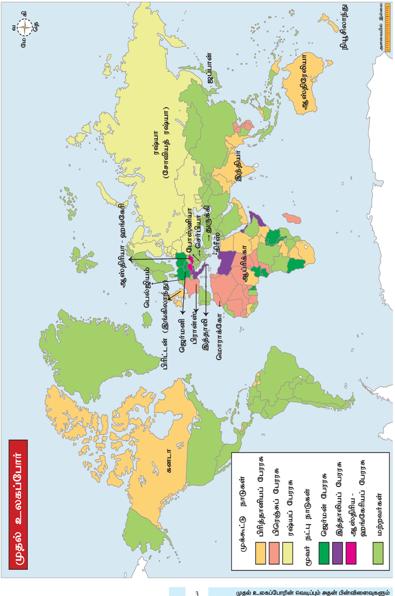

பெரும்படையொன்றறை மஞ்சூரியாவுக்குள் அனுப்பியது. 1902இல் இங்கிலாந்துடன் உடன்பபாடு ஒன்றறை மேற்கொண்ட ஜப்பபான் , ரஷ்யயா தனது படைகளை மஞ்சூரியாவிலிருந்து திரும்ப அழைத்துக்கொள்ளக் கோரியது . ரஷ்யயா ஜப்பபானைக் குறைத்து மதிப்பிட்டது . இரு நாடுகளுக்குமிடையே 1904இல் போர் தொடங்கியது . இந்த ரஷ்யயா ஜப்பபானியப் போரில் ரஷ்யயாவைத் தோற்கடித்த ஜப்பபான் , ஆர்தர் துறைமுகத்ததை மீண்டும் பெற்றது . இப்போருக்குப் பின் ஜப்பபான் வல்லரசு நாடுகளின் நிலையை அடைந்தது .

**ஜப்பபானின் முரட்டு அரச தந்திரமும் விவேகமும்**

1905க்குப் பின்வந்த ஆண்டுகளில் கொரியாவின் உள்நநாட்டு, அயல்நநாட்டுக் கொள்ககைகளை ஜப்பபான் கட்டுப்படுத்தியது . ஜப்பபானியத் தூதரக உயர் அதிகாரி கொல்லப்பட்டதைக்காரணமாகக்கொண்டு 1910இல் கொரியாவை ஜப்பபான் இணைத்துக்கொண்டது . 1912இல் மஞ்சு அரசவம்சம் வீழ்ச்சியுற்றதைத் தொடர்ந்து சீனாவில் நிலவிய குழப்பம் மறுபடியும் விரிவாக்கத்திற்ககான வாய்ப்பபை ஜப்பபானுக்கு அளித்தது . சீனாவில் ஷான்டுங் பகுதியின் மீது ஜெர்மனி கொண்டிருக்கும் உரிமைகள் தனக்கு மாற்றி வழங்கப்படவேண்டும் , என்ற கோரிக்ககையை முன்வவைத்தது . இ இவ்வலிய அரசியல் விவேகம் ஜப்பபான் சீனாவோடும் ஐரோப்பிய நாடுகளோடும் பகையை மூட்டிவிட்டது . ஆனால், ஜப்பபானை எதிர்க்கும் நிலையில் யாரும் இல்லலை .

**கா லனிகள் அமைக்கப்படுதலும், அதன் விளைவுகளும்**

1876இல் ஆப்பிரிக்ககாவின் பத்து சதவீதப் பகுதிகள் மட்டுமே ஐரோப்பபாவின் ஆட்சியின் கீழிருந்தன. 1900இல் ஒட்டுமொத்த ஆப்பிரிக்ககாவும் காலனியாக ஆக்கப்பட்டிருந்தது . இங்கிலாந்து , பிரான்ஸ், பெல்ஜியம் ஆகிய நாடுகள் கண்டத்ததை தங்களுக்குள்ளளே ப கிர்ந்துகொண்டன . ஒரு சில இடங்கள் ஜெர்மனிக்கும் இத்ததாலிக்கும் விட்டுத்தரப்பட்டன . இங்கிலாந்து, பிரான்ஸ் , ரஷ்யயா , ஜெர்மனி ஆகியன சீனாவில் தங்களுக்ககென 'செல்வவாக்கு ம ண்டலங்களை' (Spheres of Influence) நிறுவின . ஜப்பபான் கொரியாவையும் தைவானையும் தன்வசப்படுத்திக் கொண்டது . இந்தோ-சீனாவை பிரான்ஸ் கைப்பற்றிக் கொண்டது . ஸ்பபெயினிடமிருந்து பிலிப்பபைன்ஸஸை அமெரிக்ககா பெற்றுக்கொண்டது . இங்கிலாந்தும் ரஷ்யயாவும் ஈரானைப் பிரித்துக்கொள்ளச் சம்மதித்தன .

முதல் உலகப்போரின் வெடிப்பும் அதன் பின்விளைவுகளும்

4

ஆப்பிரிக்ககாவில் காலனிகளை நிறுவ ஐரோப்பியர் மேற்கொண்ட தொடக்ககால முயற்சிகள் ரத்தக் களரியான போர்களில் முடிந்தன . அல்ஜீரியாவையும் செனகலையும் கைப்பற்ற பிரான்ஸ் ஒரு நெடிய , கடுமையான போரைச் செய்யவேண்டியதாயிற்று . இங்கிலாந்து 1879இல் ஜூலுக்களாலும் 1884இல் சூடான் படைகளாலும் தோற்கடிக்கப்பட்டது . இத்ததாலியப்படை 1896ஆம் ஆண்டு அடோவா போர்க்களத்தில் எத்தியோப்பியப் படை களிடம் பெருத்த சேதத்துடன் கூடிய தோல்வியைச் சந்தித்த போதிலும் ஐரோப்பியப் படைகளே இறுதியில் வெற்றி பெற்றன .

1.3 முதல் உலகப்போருக்ககான காரணங்களும் போக்கும் விளைவுகளும்

**(அ) காரணங்கள்**

**ஐரோப்பிய நாடுகளின் அணி சேர்க்ககைகளும் எதிர் அணி சேர்க்ககைகளும்**

1900இல் ஐரோப்பிய வல்லரசுகளில் ஐந்து அரசுகள் , இரண்டு ஆயுதமேந்திய முகாம்களாகப் பிரிந்தன . ஒரு முகாம் மையநாடுகளான ஜெர்மனி , ஆஸ்திரிய-ஹங்ககேரி , இத்ததாலி ஆகியவற்றறைக் கொண்டிருந்தது . பிஸ்மமார்க்கின் வழிகாட்டுதலில் அவை 1882இல் மூவர் உடன்படிக்ககையை மேற்கொண்டன . இதன்படி ஜெர்மனியும் ஆஸ்திரியாவும் பரஸ்பரம் உதவிகள் செய்துகொள்ளும் . மற்றொரு முகாமில் பிரான்சும் ரஷ்யயாவும் அங்கம் வகித்தன. 1894இல் மேற்கொண்ட உடன்படிக்ககையின்படி இவ்விரு நாடுகளில் ஏதாவதொன்று ஜெர்மனியால் தாக்கப்படும்பட்சத்தில் ப ரஸ்பரம் துணைநிற்கும் என உறுதிசெய்யப்பட்டது . இப்படியாக இங்கிலாந்து தனிமைப்படுத்தப்பட்டது . தன்னுடைய தனித்திருத்தலிலிருந்து வெளிவரும் பொருட்டு இங்கிலாந்து இருமுறை ஜெர்மனியை அணுகித் தோல்வி கண்டது . ரஷ்யயாவின் மீதான ஜப்பபானின் பகைமை அதிகமானபோது பிரான்ஸ் ரஷ்யயாவின் நட்புநாடாக இருந்ததால் ஜப்பபான் இங்கிலாந்துடன் இணைய விரும்பியது (1902). ஆங்கிலோ-ஜப்பபான் உடன்படிக்ககை பிரான்சசை இங்கிலாந்தோடு உடன்படிக்ககை செய்துகொள்ளத் தூண்டியது . அதன் மூலம் மொராக்கோ , எகிப்து ஆகிய காலனிகள் தொடர்பபான பிரச்சனைகளைத் தீர்த்துக்கொள்ள விரும்பியது . இதன் விளைவாக 1904இல் இருநாடுகளிடையே நட்புறவு ஒப்பந்தம் ஏற்பட்டது . மொராக்கோவில் பிரான்ஸ் சுதந்திரமாகச் செயல்பட அனுமதிக்கப்படும் பட்சத்தில் எகிப்ததை இங்கிலாந்து கைப்பற்றியதை அங்கீகரிக்க பிரான்ஸ் உடன்பட்டது . இதனைத் தொடர்ந்து பாரசீகம் ,

ஆப்ககானிஸ்ததான் , திபெத் தொடர்பபாக ரஷ்யயாவுடன் இங்கிலாந்து ஒப்பந்தம் மேற்கொண்டது . இவ்வவாறு இங்கிலாந்து , பிரான்ஸ் , ரஷ்யயா ஆகிய மூவரைக் கொண்ட மூவர் கூட்டு 1907இல் உருவாக்கப்பட்டது .

**வன்முறை சார்ந்த தேசியம்**

தேசப்பற்றின் வளர்ச்சியோடு "எனது நாடு சரியோ தவறோ நான் அதை ஆதரிப்பபேன்" என்ற மனப்பபாங்கும் வளர்ந்தது . ஒரு நாட்டின் மீதான ப ற்று மற்றொரு நாட்டடை வெறுக்கும் தேவையை ஏற்படுத்தியது . இங்கிலாந்தின் ஆரவாரமான நாட்டுப்பற்று (jingoism), பிரான்சின் அதி தீவிரப்பற்று (chauvinism), ஜெர்மனியின் வெறிகொண்ட நாட்டுப்பற்று (kultur) ஆகிய அனைத்தும் தீவிர தேசியமாக போர்வவெடிப்பதற்கு தீர்மமானமாக ப ங்ககாற்றியது .

**ஜெர்மன் பேரரசின் ஆக்கிரமிப்பு மனப்பபாங்கு**

ஜெர்மன் பேரரசரான இரண்டடாம் கெய்சர் வில்லியம் "ஜெர்மனியே உலகத்தின் தலைவன்" எனப் பிரகடனம் செய்ததார் . ஜெர்மனியின் கப்பற்படை விரிவு ப டுத் த ப் ப ட் ட து . 1805இல் டிரபால்கர் போரில் ல் நெப்போலியனின் தோல்வியைத்தொடர்ந்துகடல்

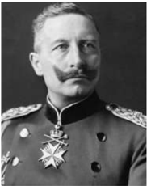

இங்கிலாந்தின் தனியுரிமை எனக்கருதப்பட்டு வந்தது. இந்நிலையில் ஜெர்மனியின் ஆக்கிரமிப்பு இயல்பு கொண்ட அரசியல் விவேகத்ததையும், விரைவாகக் கட்டப்படும் அதன் கப்பற்படை தளங்களையும் கண்ணுற்ற இங்கிலாந்து , ஜெர்மன் கப்பற்படை தனக்கு எதிரானதே என முடிவு செய்தது . ஆகவே இங்கிலாந்தும் கப்பற்படை விரிவாக்கப் போட்டியில் இறங்கவே இரு நாடுகளுக்குமிடையிலான பதற்றம் மேலும் அதிகரித்தது .

**பிரான்ஸ் ஜெர்மனியோடு கொண்ட பகை**

பிரான்சும் ஜெர்மனியும் பழைய பகை வர்களாவர். 1871இல் ஜெர்மனியால் தோற்கடிக்கப்பட்ட பிரான்ஸ் அல்சசேஸ், லொரைன் ப குதிகளை ஜெர்மனியிடம் இழக்க நேரிட்டது குறித்த கசப்பபான நினைவுகளை பிரெஞ்சு ம க்கள் ஜெர்மனியின் மீது கொண்டிருந்தனர் . மொராக்கோ விவகாரத்தில் ஜெர்மனியின் தலையீடு இக்கசப்புணர்வவை மேலும் அதிகரித்தது . மொராக்கோவில் பிரான்சின் நலன்கள் சார்ந்து , இங்கிலாந்து பிரான்சோடு மேற்கொண்ட ஒப்பந்தத்ததை ஜெர்மனிஎதிர்த்தது.எனவே , ஜெர்மன் பேரரசர் இரண்டடாம்கெய்சர்வில்லியம்மொராக்கோ

சுல்ததானின் சுதந்திரத்ததை அங்கீகரித்ததோடு மொராக்கோவின் எதிர்ககாலம் குறித்து முடிவு செய்யப் பன்னனாட்டு மாநாடு ஒன்றறைக் கூட்டும்படி கோரினார் .

**பா ல்கன் பகுதியில் ஏகாதிபத்திய அரசியல் அதிகாரத்திற்ககான வாய்ப்பு**

1908இல் துருக்கியில் ஒரு வலுவான , நவீனஅரசை உருவாக்கும் முயற்சியாக இளம்துருக்கியர் புரட்சி நடைபெற்றது . இது ஆஸ்திரியாவுக்கும் ரஷ்யயாவிற்கும் பால்கன் ப குதிகளில் தங்கள் நடவடிக்ககைகளை மீண்டும் தொடங்கும் வாய்ப்பினை வழங்கியது . இது தொடர்பபாக ஆஸ்திரியாவும் ரஷ்யயாவும் சந்தித்துப் பேசின . அதன்படி பாஸ்னியா, ஹெர்சகோவினா ஆகிய இரண்டடையும் ஆஸ்திரியா இணைத்துக்கொள்வதென்றும் , ரஷ்யயா தனது போர்க்கப்பல்களைச் சுதந்திரமாக டார்டனெல்ஸ் , போஸ்பொரஸ் துறைமுகங்கள் வழியாக மத்தியதரைக்கடல் பகுதிக்குள் கொண்டு செல்லலாமென்றும் ஒப்பந்தமாயிற்று . இதனைத்தொடர்ந்து பாஸ்னியாவையும் ஹெர்சகோவினாவையும் தான் இணைத்துக் கொண்டதாக ஆஸ்திரியா அறிவித்தது . ஆஸ்திரியாவின் இவ்வறிவிப்பு செர்பியாவில் தீவிரமான எதிர்ப்பபைத் தூண்டியது . இதன் தொடர்பில் ஜெர்மனி ஆஸ்திரியாவிற்கு உறுதியான ஆதரவை நல்கியது . மேலும், ஆஸ்திரியா செர்பியாவின் மீது படையெடுக்கும்போது அதன் விளைவாக செர்பியாவிற்கு ரஷ்யயா உதவுமானால் ஆஸ்திரியாவிற்குஆதரவாகநான்களமிறங்குவேன் என அறிவிக்கும் அளவிற்கு ஜெர்மனி சென்றது . ஆஸ்திரியாவிற்கும் செர்பியாவிற்குமான இப்பகை 1914இல் போர் வெடிக்கக் காரணமாயிற்று .

**பா ல்கன் போர்கள்**

ப தினெட்டடாம் நூற்றறாண்டின் முதல்பபாதியில் தென்மமேற்குஐரோப்பபாவில்துருக்கிவலிமைவாய்ந்த நாடாகத் திகழ்ந்தது . அதன் பேரரசு பால்கனிலும் , ஹங்ககேரியின் குறுக்ககாகப் போலந்து வரையிலும் ப ரவியிருந்தது . துருக்கியப் பேரரசு பால்கன் ப குதிகளில் பல துருக்கியர் அல்லலாத மக்களையும் கொண்டிருந்தது . ப ல்கன் பகுதியைச் சேர்ந்த துருக்கியரும் துருக்கியர் அல்லலாத பல்வவேறு தேசிய இனங்களைச் சேர்ந்த மக்களும் பயங்கரமான படுகொலைகளிலும் அட்டூழியங்களிலும்ஈடுபட்டனர் . ஆர்மீனிய இனப்படுகொலைகள் இதற்கு ஒரு ப யங்கரமான எடுத்துக்ககாட்டு ஆகும் .

ப தினெட்டடாம் நூற்றறாண்டின் பிற்பபாதியில் துருக்கியப் பேரரசின் உறுதியற்ற அரசியல் பொருளாதாரச் சூழலைச் சாதகமாகக் கொண்டு

முதல் உலகப்போரின் வெடிப்பும் அதன் பின்விளைவுகளும்

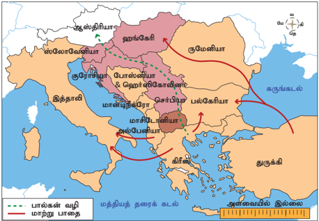

கிரீசும் அதனைத் தொடர்ந்து ஏனைய நாடுகளும் ஒன்றன் பின் ஒன்றறாகத் தங்களைத் துருக்கியின் கட்டுப்பபாட்டிலிருந்து விடுவித்துக் கொண்டன . மாசிடோனியா பல்வவேறு இனங்களைச் சேர்ந்த மக்களைக் கொண்டிருந்தது . எனவே மாசிடோனியாவைத் தங்கள் கட்டுப்பபாட்டுக்குள் கொண்டுவருவதில் கிரீஸ் , செர்பியா , ப ல்ககேரியா பின்னர் மாண்டிநீக்ரோ ஆகிய நாடுகளிடையே போட்டிகள் நிலவின. 1912ஆம் ஆண்டு மார்ச் திங்களில்அவைபால்கன்கழகம்எனும்அமைப்பபை உருவாக்கின . இக்கழகம் முதல் பால்கன் போரில் (1912-1913) துருக்கியப் படைகளைத் தாக்கித் தோற்கடித்தன . தொடர்ந்து , கைப்பற்றிய ப குதிகளைப் பிரித்துக்கொள்வதில் பிரச்சனை எழுந்தது. 1913 மே திங்களில் கையெழுத்ததான இலண்டன் உடன்படிக்ககையின்படி அல்பபேனியா எனும் புதிய நாடு உருவாக்கப்பட்டது . மாசிடோனியாவை ஏனைய பால்கன் நாடுகள் தங்களுக்குள் பகிர்ந்து கொண்டன . துருக்கி , கான்ஸ்டடாண்டிநோபிளைச் சுற்றியுள்ள பகுதிகளை ம ட்டும் கொண்ட அரசாகச் சுருக்கப்பட்டது .

இருந்தபோதிலும் மாசிடோனியாவைப் பிரித்தளித்ததில் செர்பியாவையும் கிரீஸையும் ப ல்ககேரியா தாக்கியது . ஆனால், பல்ககேரியா எளிதாகத் தோற்கடிக்கப்பட்டது. 1913 ஆகஸ்டு திங்களில் கையெழுத்திடப்பட்ட புகாரெஸ்ட் உடன்படிக்ககையோடு இரண்டடாம் பால்கன் போர் முடிவடைந்தது .

**உடனடிக் காரணம்**

ப ல்கனில் நடைபெற்ற இந்நிகழ்வுகளில் உச்சகட்டம் பாஸ்னியாவிலுள்ள செராஜிவோ என்னுமிடத்தில் அரங்ககேறியது. 1914 ஜூன் 28ஆம் நாள் ஆஸ்திரியப் பேரரசரின் மகனும் வாரிசுமான பிரான்சிஸ் பெர்டினாண்டு (Francis Ferdinand) , பிரின்ஸப் என்ற பாஸ்னிய செர்பியனால் படுகொலை செய்யப்பட்டடார் . ஆஸ்திரியா இதனை செர்பியாவைக் கைப்பற்றுவதற்ககான வாய்ப்பபாக எண்ணியது . செர்பியாவிற்கு ஆதரவாகத் தலையிட ரஷ்யயா படைகளைத்

முதல் உலகப்போரின் வெடிப்பும் அதன் பின்விளைவுகளும்

6

திரட்டுகிறது என்னும் வதந்தியால் ஜெர்மனி முதல் தாக்குதலைத் தானே தொடுப்பது என முடிவு செய்தது . ஆகஸ்டு திங்கள் முதல்நநாள் ஜெர்மனி ரஷ்யயாவிற்கு எதிராகப் போர்அறிவிப்பு செய்தது . ஜெர்மனிக்கும் பிரான்சுக்குமிடையே சச்சரவுகள் ஏதும் இல்லலாவிட்டடாலும் , பிரான்சுக்கும் ரஷ்யயாவுக்குமிடையே ஏற்ககெனவே கூட்டணி இருந்ததால் ஜெர்மனி , பிரான்ஸ், ரஷ்யயா ஆகிய இரு நாடுகளுக்கும் எதிராகப் போர்சசெய்யத் திட்டமிட்டது . மேலும், இச்சூழலைத் தனக்குச் சாதகமாகப் பயன்படுத்திக்கொள்ளவும் ஜெர்மனி விரும்பியது . பெல்ஜியத்தின் நடுநிலைமையை ம தியாது அதனை ஜெர்மனி தாக்கவே இப்போரில் இங்கிலாந்து பங்ககேற்பது கட்டடாயமாயிற்று .

**(ஆ) போரின் போக்கு**

**இரண்டு போரிடும் முகாம்கள் மைய நாடுகள்**

போரிடும் நாடுகள் இரண்டு அணிகளாகப் பிரிந்திருந்தன . ம மைய நாடுகள் அணியில் ஜெர்மனி, ஆஸ்திரியா,ஹங்ககேரி , து துருக்கி மற்றும் பல்ககேரியா ஆகிய நாடுகள் அங்கம் வகித்தன . தொடக்கத்தில் ஜெர்மனியோடும் ஆஸ்திரியாவோடும் அணிவகுத்திருந்த இத்ததாலி பின்னர் விலகியது . டிரன்டினோ நகர் வடகிழக்கு இத்ததாலியில் அமைந்திருந்தது . ஆனால், ஆஸ்திரியஹங்ககேரி அரசின் ஆளுகைக்குட்பட்டிருந்த , இத்ததாலிய மக்கள் அதிகம் வாழும் டிரன்டினோ எனும் நகரை மீட்க இத்ததாலி மேற்கொண்ட முயற்சியை ஜெர்மனி ஆதரிக்கவில்லலை என்பதே இத்ததாலியின் விலகலுக்குக் காரணமாகும். அதனால் போர் வெடித்தபோது இத்ததாலி நடுநிலைமை வகித்தது . ஆ ஆனால், வடகிழக்கிலுள்ள ப குதியைப் பெறவேண்டும் எனும் நோக்கத்தில் போரில் கலந்துகொள்ள முடிவுசெய்தது. 1915 ஏப்ரலில் பிரான்ஸ் , இங்கிலாந்து , இத்ததாலி ஆகியவற்றிக்கிடையே லண்டனில் ரகசிய ஒப்பந்தமொன்று கையெழுத்ததாயிற்று . அதன்படி போருக்குப் பின்னர் தான் விரும்பிய பகுதி தனக்கு வழங்கப்படும் என்பதன் அடிப்படையில் இத்ததாலி மை யநாடுகளுக்கு எதிராகப் போரில் பங்ககேற்க இசைந்தது .

**நேசநாடுகள்**

மையநாடுகளை எதிர்த்த நேசநாடுகள் ரஷ்யயா , பிரான்ஸ் , பி பிரிட்டன் , இ இத்ததாலி , அ அமெரிக்ககா , ப பெல்ஜியம் ருமேனியா , செர்பியா மற்றும் கிரீஸ் ஆகிய ஒன்பது நாடுகளாகும் . ருமேனியாவும் கிரீசும் முறையே 1916, 1917 ஆகிய ஆண்டுகளில் மைய நாடுகளுக்கு எதிராகப் போர் அறிவிப்புச்சசெய்தன . ஆனால், அவை

இப்போரில் சிறிதளவே பங்ககேற்றன . பெரும்பபாலான அமெரிக்கர்கள் தங்கள் நாடு நடுநிலைவகிக்க வேண்டுமென விரும்பியதால் அமெரிக்ககா முதல் மூன்று ஆண்டுகளுக்கு நேசநாடுகளுக்குத் தார்மீக ஆதரவை நல்கியதோடு இங்கிலாந்திற்கும் பிரான்சுக்கும் பெருமளவில் பொருளுதவி வழங்கியது .

**சா ரின் தோல்வியுற்ற அமைதி முயற்சிகள்**

ரஷ்யப் பேரரசர் இரண்டடாம் நிக்கோலஸ் நாடுகளனைத்தும் கூடிப்பபேசி உலக அமைதிக்ககான சூழ்நிலையை ஏற்படுத்த வேண்டுமென ஆலோசனை வழங்கினார் . அவருடைய அழைப்பிற்கிணங்க 1899, 1907 ஆகியஆண்டுகளில் ஹாலந்து நாட்டின் தி ஹேக் (The Hague) நகரில் இரண்டு அமைதி மாநாடுகள் கூட்டப்பட்டன . ஆனால், எந்த விளைவும் ஏற்படவில்லலை .

**மேற்கு அல்லது பிரெஞ்சு முனைப் போர்**

பெல்ஜியம் மக்களின் எதிர்ப்பபை ஜெர்மனி தகர்த்ததெறிந்தது . நேசநாடுகளின் அணியில் போர் செய்யவேண்டிய சுமை பிரெஞ்சுப்படைகளின் தோள்களின்மமேல் விழுந்தது . ஒரு மாதத்திற்குள் ஏறத்ததாழ பாரீஸ்நகர் வீழ்ந்துவிடும் என்ற நிலை ஏற்பட்டது .

**டானென்பர்க் , மா ர்ன் போர்கள்**

இதேசமயத்தில் ரஷ்யப் படைகள் கிழக்குப் பிரஷ்யயாவின் மீது படையெடுத்தன . டானென்பர்க் போரில் ஜெர்மனியிடம் ரஷ்யயா பேரிழப்புகளைச்

**பதுங்குக் குழிப்போர்**

போர்வீரர்களால் தோண்டப்படும் பதுங்குக் குழிகள் எதிரிகளின் சுடுதலில் இருந்து தங்களைக் காத்துக்கொண்டு பாதுகாப்பபாக நிற்க உதவின. பிரதானப் பதுங்குக் குழிகள் ஒன்றோடொன்றும் பின்புறமுள்ள குழிகளோடும் இணைக்கப்பட்டிருக்கும். அவற்றின் வழியாக உணவு, ஆயுதங்கள், கடிதங்கள், ஆணைகள் ஆகியவை வந்துசேரும். புதிய வீரர்களும் வந்து சேர்வர்.

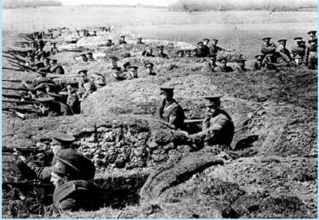

7

சந்தித்தது . இருந்தபோதிலும் மார்னன்பபோரில் (1914 செப்டம்பர் தொடக்கத்தில்) பிரெஞ்சுப்படைகள் ஜெர்மமானியரை வெற்றிபெற்றன . இப்படியாகப் ப ரிஸ் காப்பபாற்றப்பட்டது . ம ர்ன் போரானது ப துங்குக் குழிப்போரின் தொடக்கமாகும்.

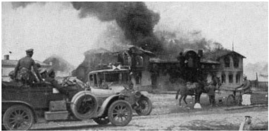

**வெர்டன் போர்**

1916ஆம் ஆண்டு பிப்ரவரிக்கும் ஜூலைக்குமிடையே ஜெர்மமானியர் பிரான்சின் முக்கியக் கோட்டடையான வெர்டனைத் தாக்கினர் . ஐந்துமாத காலம் நடைபெற்ற வெர்டன் போரில் இரண்டு மில்லியன் வீரர்கள் பங்ககெடுத்தனர் . அவர்களில் சரிபாதிவீரர்கள் கொல்லப்பட்டனர் . ஜெர்மமானியருக்கு எதிரான இங்கிலாந்தின் தாக்குதல் சோம்மி நதிக்கரை அருகே நடைபெற்றது . நான்குமாத காலம் நடைபெற்ற போரின் முதல்நநாளில் இங்கிலாந்து 20,000 வீரர்களை இழந்தது . இருந்தபோதிலும் வெர்டன்போர் முதல் உலகப்போரில் நேசநாடுகளே வெற்றி பெறும் என்பதைத் தீர்மமானித்தது .

**கிழக்குமுனை அல்லது ரஷ்யமுனைப்போர்**

கிழக்கு முனையில் ரஷ்யப் படைகள் ஆஸ்திரியப் படைகளை மீண்டும் மீண்டும் தோற்கடித்தன. அதே சமயம் ரஷ்யப் படைகள் ஜெர்மன் படைகளால் தோற்கடிக்கப்பட்டன. ரஷ்ய இராணுவம் மோசமாகப் பயிற்றுவிக்கப்பட்டிருந்ததாலும் போதுமான போர்த்தளவாட முன்னனேற்பபாடுகள் இல்லலாமலிருந்ததாலும் பெருமளவு இழப்பபைச் சந்தித்தது. 1917இல் சார் மன்னருடைய ஆட்சி மாபெரும் அக்டோபர் புரட்சியின் மூலமாகத் தூக்கி வீசப்பட்டது. ரஷ்யயாவிற்கு அமைதி தேவைப்பட்டதால் ஜெர்மனியோடு 1918 மார்ச் 3ஆம் நாள் பிரெஸ்ட்-லிடோவஸ்க் உடன்படிக்ககையில் கையெழுத்திட்டுப் போரிலிருந்து விலகியது.

**சிறிய போர் அரங்குகள் மத்திய கிழக்கு**

மை ய நாடுகளுடன் சேர்ந்து துருக்கி . தொடக்கத்தில் வெற்றிகளைப்

போரிட்டது

முதல் உலகப்போரின் வெடிப்பும் அதன் பின்விளைவுகளும்

பெற்றறாலும் , நேசநாடுகள் பின்னடைவுகளைச் (குறிப்பபாக மெசபடோமியா , காலிபோலி ஆகிய இடங்களில்) சந்தித்ததாலும் இறுதியில் துருக்கி தோற்கடிக்கப்பட்டது . துருக்கியர் சூயஸ் கால்வவாயைத் தாக்க முயன்றனர் . ஆனால், அது முறியடிக்கப்பட்டு துரத்தப்பட்டனர் . இங்கிலாந்து முதலில் ஈராக்கிலும் பின்னர் பாலஸ்தீனத்திலும் சிரியாவிலும் துருக்கியப் படைகளுடன் போரிட்டது .

**தூரக்கிழக்கு**

சீனா நேசநாடுகள் அணியில் சேர்ந்திருந்தது . ஷான்டுங் மாகாணத்தில் சீனாவிற்கு ஜெர்மனி வழங்கிய கியாச்சவ் பகுதியை ஜப்பபான் கைப்பற்றிக்கொண்டது . தூரக் கிழக்குப் ப குதியில் வேறு போர்களில்லலை . இச்சூழலைத் தனக்குப் பயனுள்ளதாக மாற்றிய ஜப்பபான் சீனாவைக் கட்டடாயப்படுத்தியும் அச்சுறுத்தியும் அதிகப் பயனளிக்கக்கூடிய சலுகைகளையும் உரிமைகளையும் பெற்றுக்கொண்டது .

**பா ல்கன் பகுதி**

ஆஸ்திரியா-ஜெர்மமானியப் படைகள் ப ல்ககேரியாவின்ஒருங்கிணைப்போடுசெர்பியாவை முற்றிலுமாக நசுக்கின . செர்பியா ஜெர்மனியின் ஆட்சியின்கீழ் வந்தது . போரின் போக்ககைக் கண்ககாணித்த ருமேனியா 1916 ஆகஸ்டில் நேசநாடுகள் அணியில் இணைந்தது . ஆனால், ருமேனியாவும் ஆஸ்திரியா-ஜெர்மன் படைகளால் கைப்பற்றப்பட்டது .

**ஆப்பிரிக்ககாவில் ஜெர்மன் காலனிகளின் நிலை**

கிழக்கு மற்றும் மேற்கு ஆப்பிரிக்ககாவிலிருந்த ஜெர்மன் காலனிகளும் நேசநாடுகளால் தாக்கப்பட்டன . இக்ககாலனிகளனைத்தும் ஜெர்மனியிலிருந்து தொலைதூரத்தில் இருந்ததாலும் அவற்றறால் உடனடியாக எவ்வித உதவியையும் பெறமுடியாமல் போனதாலும் நேசநாடுகளிடம் சரணடையும் நிலை ஏற்பட்டது .

**ஆஸ்திரியத் தாக்குதலை எதிர்கொள்ள முடியாத இத்ததாலி**

இத்ததாலி 1916 மே திங்களில் நேசநாடுகள் அணியில் இணைந்தது . ஆஸ்திரியாவை எதிர்த்துப் போரிட்ட இத்ததாலியர் தொடர்ந்து தங்கள் எதிர்ப்பபை நீட்டித்தனர் . ஆனால்,ஆஸ்திரியாவிற்குஉதவியாகஜெர்மமானியர் களமிறங்கியபோது இத்ததாலி நிலைகுலைந்தது .

**மையநாடுகள் வெற்றி பெற்ற இடங்கள்**

மை யநாடுகள் வெற்றிகரமாகபெல்ஜியத்ததையும் பிரான்சின் வடகிழக்குப் பகுதியையும் , போலந்து , செர்பியா , ரு ருமேனியாஆகியவற்றறையும்கைப்பற்றின .

முதல் உலகப்போரின் வெடிப்பும் அதன் பின்விளைவுகளும்

போரின் மையமானது மேற்கு முனையிலும் கடல்களிலும் நிலை கொண்டிருந்தது . கடல்களில் நேசநாடுகளே ஒப்புயர்வற்ற இடத்ததை வகித்தன . கடல் பயணப்பபாதைகளை நேசநாடுகள் கட்டுப்படுத்தியதால் மைய நாடுகளுக்குச் செல்லவேண்டிய உணவு , ஏனைய பொருள்கள் ஆகியவற்றறை அவர்களால் தடுத்துநிறுத்த முடிந்தது . இதனால் ஜெர்மனியிலும் ஆஸ்திரியாவிலும் பெண்களும் குழந்ததைகளும் ப ட்டினியாலும் வறுமையினாலும் துயருற்றனர் . ஜெர்மனி இங்கிலாந்தின்மீது வான்வழித் தாக்குதலை மேற்கொண்டது . லண்டன் மீதும் , தொழிற்சசாலைகள் அமைந்திருந்தபகுதிகளின்மீதும் குண்டுகள் வீசப்பட்டன . பின்னர் பொதுமக்களை இலக்ககாகக் கொண்டு குண்டுகள் வீசப்பட்டன . ஜெர்மனி விஷவாயுவை அறிமுகம் செய்தது . பின்னர் இரு தரப்பினருமே விஷவாயுவைப் ப யன்படுத்தலாயினர் .

**கட ற்போர்களும் போரில் அமெரிக்ககா பங்ககேற்றலும்**

1916இல் வடகடலில் கடற்போர் (ஜூட்லலேண்டு போர்) நடைபெற்றது . இங்கிலாந்து இப்போரில் வெற்றிபெற்றது . இதன் பின்னர் ஜெர்மமானியர் தங்களின் நீர்மூழ்கிப்போரைத் தொடங்கினர் . அவை நேசநாடுகளின் கப்பல்களுக்கு இடையூறு செய்தன . புகழ்பபெற்ற எம்டன் கப்பல் சென்னனைமீது குண்டுகளை வீசியது . தங்கள் கப்பல்களின் போக்குவரத்ததை இடைமறித்துத் தடை செய்த நடவடிக்ககைகளுக்கு எதிர்நடவடிக்ககையாக 1917 ஜனவரி திங்களில் நடுநிலை நாடுகளின் கப்பல்களையும் மூழ்கடிக்கப்போவதாக ஜெர்மனி அறிவித்தது . லூசிடானியா என்னும் அமெரிக்கக்கப்பல் ஜெர்மனியால் தாக்கப்பட்டு மூழ்கடிக்கப்பட்டது . இதன் விளைவாகப் அதில் ப யணித்த பல அமெரிக்கர்கள் உயிரிழந்தனர் . அதனால் அமெரிக்ககா பெருங்கோபமும் சீற்றமும் அடைந்தது . குடியரசுத்தலைவர் உட்ரோ வில்சன் ஜெர்மனிக்கு எதிராக 1917 ஏப்ரல் திங்களில் போர்ப்பிரகடனம் செய்ததார் . மாபெரும் பொருளாதார

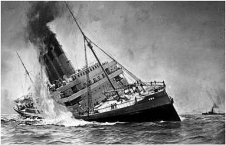

பலத்தோடு அமெரிக்ககா போரில் இறங்கியது . அது நேசநாடுகளின் வெற்றியை முன்னரே எழுதப்பட்ட முடிவுரையாக்கிற்று .

**(இ) போர்நிறுத்தமும் வெர்சசெய்ல்ஸ் உடன்படிக்ககையும்**

சிறப்பபான முயற்சிகளை மேற்கொண்ட போதிலும் எதிர்த்து நிற்க இயலாத நிலையில் ஜெர்மனி இறுதியில் 1918 நவம்பரில் சரணடைந்தது. போர் நிறுத்தம் நவம்பர் 11 முதல் நடைமுறைக்கு வந்தது. ஜெர்மமானிய அரசர் கெய்சர் இரண்டடாம் வில்லியம் பதவி விலகியதைத் தொடர்ந்து ஜெர்மனியில் ஏற்பட்ட அரசியல் நெருக்கடியின் காரணமாக ஜெர்மனி கடுமையான நிபந்தனைகளை ஒத்துக்கொள்ளும் கட்டடாயம் ஏற்பட்டது.

**பாரிஸ் அமைதி மாநாடு**

ப ரிஸ் அமைதி மாநாடு , போர்நிறுத்த ஒப்பந்தம் கையெழுத்ததான இரண்டு மாதங்களுக்குப் பின்னர் 1919 ஜனவரி திங்களில் தொடங்கியது . உட்ரோ வில்சன் (அமெரிக்க அதிபர்), லாயிட் ஜார்ஜ் (இங்கிலாந்துப் பிரதமர்), கிளமென்சோ (பிரான்சின் பிரதமர்) ஆகிய மூவரும்

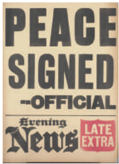

கலந்ததாய்வில் முக்கியப் பங்குவகித்தனர் .

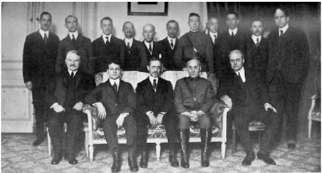

**பாரிஸ் அமைதி மாநாடு**

ம ற்றுமொரு போரைச் சந்திக்க நேரிடும் என்ற அச்சத்தில் ஜெர்மனிய அரசு உடன்படிக்ககையை ஒத்துக்கொள்ளும்படிநிர்ப்பந்திக்கப்பட்டது. 1919 ஜூன் 28ஆம் நாள் அமைதி உடன்படிக்ககை வெர்சசெய்ல்ஸ் கண்ணணாடி மாளிகையில் கையெழுத்திடப்பட்டது .

**உடன்படிக்ககையின் சரத்துக்கள்**

- போரைத் தொடங்கிய குற்றத்ததைச் செய்தது ஜெர்மனி என்பதால் போர் இழப்புகளுக்கு ஜெர்மனி இழப்பீடு வழங்கவேண்டும் எனவும் மைய நாடுகள் அனைத்தும் போர் இழப்பீட்டுத்தொகையை வழங்கவும் வலியுறுத்தப்பட்டன .
- ஜெர்மன் படை 1,00,000 வீரர்களை மட்டுமே கொண்டதாக அளவில் சுருக்கப்பட்டது . சிறிய கப்பற்படையொன்றறை மட்டுமே வைத்துக்கொள்ள அனுமதிக்கப்பட்டது.
- ஆஸ்திரியா, ஜெர்மனி ஆகிய இரண்டின் ஒருங்கிணைப்பு தடைசெய்யப்பட்டது.
- ஜெர்மனியின் அனைத்துக் காலனிகளும் ப ன்னனாட்டுச் சங்கத்தின் பாதுகாப்பு நாடுகளாக ஆக்கப்பட்டன .
- ரஷ்யயாவுடன் செய்துகொள்ளப்பட்ட பிரெஸ்ட்-லிடோவஸ்க் உடன்படிக்ககையையும் ப ல்ககேரியாவுடன் மேற்கொள்ளப்பட்ட புகாரெஸ்ட் உடன்படிக்ககையையும் திரும்பப் பெற்றுக்கொள்ள ஜெர்மனி வற்புறுத்தப்பட்டது.
- அல்சசேஸ்-லொரைன் பகுதிகள் பிரான்சுக்குத் திருப்பித் தரப்பட்டன .
- முன்னர் ரஷ்யயாவின் பகுதிகளாக இருந்த பின்லலாந்து, எஸ்தோனியா, லாட்வியா, லிதுவேனியா ஆகியன சுதந்திரநாடுகளாகச் செயல்பட அனுமதிக்கப்பட்டது.
- வடக்கு ஷ்லலெஸ்விக் டென்மமார்க்கிற்கும் சிறிய ம வட்டங்கள் பெல்ஜியத்திற்கும் வழங்கப்பட்டன .
- போலந்து மீண்டும் உருவாக்கப்பட்டது.
- நேசநாடுகளின் ஆக்கிரமிப்பின்கீழ் ரைன்லலாந்து இருக்கும் என்றும், ரைன்நதியின் கிழக்குக்கரைப் பகுதி படை நீக்கம் செய்யப்பட்டப் பகுதியாக்கப்படும் என்றும் அறிவிக்கப்பட்டது.

அமெரிக்க குடியரசுத் தலைவர் உட்ரோ வில்சன் தனது பதினான்கு அம்சத் திட்டத்ததைநேசநாடுகள் பின்பற்றுவதற்ககாக முன்வவைத்ததார். அவற்றில் மிகமுக்கியமானதாக அவர் கோடிட்டுக்ககாட்டியது "மிகப்பபெரும் நாடுகள் சிறிய நாடுகள் எனும் பேதமில்லலாமல் அனைத்து நாடுகளின் அரசியல் சுதந்திரத்திற்கும் அந்நநாடுகளின் நிலப்பரப்பின் ஒருமைப்பபாட்டிற்கும் எல்லலைகளின் உறுதிப்பபாட்டிற்கும் பரஸ்பரம் உத்தரவாதம் அளிக்கக்கூடிய நாடுகளைக் கொண்ட பொதுஅமைப்பபை உருவாக்க வேண்டும்" என்பதாகும்.

ஆஸ்திரியா, ஹங்ககேரி, பல்ககேரியா, துருக்கி ஆகிய நாடுகளுடன் தனித்தனியாக உடன்படிக்ககைகளில் கையெழுத்திட்டன . துருக்கியோடு மேற்கொள்ளப்பட்ட செவ்ரஸ் உடன்படிக்ககையைச் சுல்ததான் ஏற்றுக்கொண்டடாலும் அது முஸ்தபா கமால் பாட்சசாவும் அவரைப் பின்பற்றுவோரும் எதிர்த்ததால் தோற்றுப்போனது.

முதல் உலகப்போரின் வெடிப்பும் அதன் பின்விளைவுகளும்

**முதல் உலகப்போரின் விளைவுகள்**

முதல் உலகப்போர், ஐரோப்பிய சமூக மற்றும் அரசியல் ஆகியவற்றின் மீது ஆழமான தாக்கத்ததை ஏற்படுத்தியது. கட்டடாய இராணுவசேவை மூலமாகவும், வான்வழித்ததாக்குதல்கள் மூலமாகவும் கடந்தகாலங்களைக் காட்டிலும் அதிகமான மக்களைப் போரில் பங்ககேற்கச் செய்து அதிகமான பாதிப்புகளையும் ஏற்படுத்தியது. நான்கு ஆண்டுகளில் 8 மில்லியன் மக்கள் மாண்டனர். அதைப் போன்று இரண்டு மடங்கு மக்கள் காயமடை ந்தனர். பலர் வாழ்நநாள் முழுவதும் செயல்பட இயலாதவர்கள் ஆயினர். இதனைத் தொடர்ந்து 1918இல் இன்ஃப்ளூயன்ஸஸா (influenza) நோயில் பல மில்லியன் மக்கள் மாண்டனர். இதன்விளைவாக அனைத்து நாடுகளிலும் ஆண் பெண் எண்ணிக்ககையில் சமநிலை குலைந்து ஆண்களுக்குப் பற்றறாக்குறை ஏற்பட்டது. போர்வீரர்கள் பொதுமக்களைக் காட்டிலும் உயரிய நிலையில் வைக்கப்பட்டனர்.

முதல் உலகப் போரும் அதன் பின்விளைவுகளும் வரலாற்றில் அனைத்ததையும் புரட்டிப்போட்ட காலமாக அமைந்தது. அவையனைத்திலும் கருத்ததைக் கவர்வதாக அமைந்தது U.S.S.R அல்லது ஐக்கிய சோசலிஸ்ட் சோவியத் குடியரசுகள் என்றழைக்கப்பட்ட சோவியத் ரஷ்யயாவின் எழுச்சியும் அதன் ஒருங்கிணைப்புமாகும். கடன்பட்ட ஒரு நாடாகப் போரில் நுழைந்த அமெரிக்ககா போருக்குப் பின்னர் உலகத்திற்ககே கடன் கொடுக்கும் நாடாக மேலெழுந்தது.

இக்ககாலகட்டத்தில் பிற முதன்மமையான நிகழ்வுகள் காலனிநாடுகளின் முழுமையான விழிப்புணர்வும், விடுதலை பெறுவதற்ககாக அவை மேற்கொண்ட தீவிர முயற்சிகளுமாகும்.

துருக்கி மீண்டும் ஒரு நாடாக மறுபிறவி எடுப்பதற்கு முஸ்தபா கமால் பாட்சசா முக்கிய ப ங்கு வகித்ததார். கமால் பாட்சசா அந்நநாட்டிற்கு விடுதலையை மட்டும் பெற்றுத்தரவில்லலை . அவர் துருக்கியை நவீனமயமாக்கி, அதற்ககான அங்கீகாரத்ததையும் பெற்றுத்தந்ததார்.

**இந்தியாவின் மீதான தாக்கம்**

முதல் உலகப்போர் இந்தியாவின்மீது குறிப்பிடத்தக்க தாக்கத்ததை ஏற்படுத்தியது. ஐரோப்பபா, ஆப்பிரிக்ககா , மேற்கு ஆசியா ஆகிய ப குதிகளில் போர்ப்பணி செய்வதற்ககாக ஆங்கிலேயர் இந்தியர்களைக் கொண்ட பெரும்படையைத் திரட்டினர். போர் முடிந்த பின்னர் இவ்வீரர்கள் புதிய சிந்தனைகளோடு

முதல் உலகப்போரின் வெடிப்பும் அதன் பின்விளைவுகளும்

தாயகம் திரும்பினர். அச்சிந்தனைகள் இந்திய சமூகத்தின்மீது தாக்கத்ததை ஏற்படுத்தின . போர் செலவுக்ககாக இந்தியா 230 மில்லியன் ப வுண்டுகளை ரொக்கமாகவும், 125 மில்லியன் ப வுண்டுகளைக் கடனாகவும் வழங்கியது. மேலும், 250 மில்லியன் பவுண்டுகள் மதிப்புள்ள போர்முனைக்குத் தேவையான பொருள்களையும் இந்தியா அனுப்பிவைத்தது. இதன் விளைவாக இந்தியாவில் பெருமளவிலான பொருளாதார இன்னல்கள் ஏற்பட்டன. உணவுதானியப் ப ற்றறாக்குறையால் கலவரங்கள் ஏற்பட்டு ஏழைமக்கள் கடைகளைக் கொள்ளளையடித்தனர். போர் முடிவடையுந் தருவாயில் உலகம் முழுதும் பரவிய விஷக்ககாய்ச்சலால் இந்தியாவும் பெருந்துயருக்குள்ளளானது.

போர்நிலைமைகள் இந்திய அரசியலில் தன்னனாட்சி இயக்கம் உதயமாக வழிகோலியது. பிளவுபட்டிருந்த காங்கிரஸ் இயக்கம் போரின்போது மீண்டும் இணைந்தது.

இங்கிலாந்து இந்தியாவின் விசுவாசத்ததைப் ப ராட்டிப் பரிசளிக்கும் என்ற நம்பிக்ககையோடு இந்தியர்களும் இந்தியாவும் இப்போரில் செயலூக்கத்துடன் பங்ககேற்றனர். ஆனால், ஏமாற்றமே காத்திருந்தது. இவ்வவாறு முதல் உலகப்போர் இந்தியச் சமூகம், பொருளாதாரம், அரசியல் ஆகியவற்றின்மமேல் பல தாக்கங்களை ஏற்படுத்தியது.

### 1.4 ரஷ்யப்புரட்சியும் அதன் தாக்கமும்

**அறிமுகம்**

முதல் உலகப்போரின் மாபெரும் விளைவு உலக வரலாற்றில் தனித்தன்மமை கொண்ட ரஷ்யப் புரட்சியாகும். முதல் உலகப்

போரின் காரணமாக ஏற்பட்ட பேரிழப்புகளும் பெருந்துயரங்களும் ரஷ்யயாவில் நிலவிய மோசமான சமூக, அரசியல், பொருளாதார நிலைகளை அவற்றின் உச்சத்திற்கு இட்டுச்சசென்றன. 1917இல் மார்ச் மாதத்தில் ஒன்றும் நவம்பர் மாதத்தில் மற்றொன்றும் என இரண்டு புரட்சிகள் நடைபெற்றன . சார் (Tsar) மன்னர் பதவிவிலகியதைத் தொடர்ந்து ஆட்சிப் பொறுப்பபேற்ற பூர்ஷ்வவாக்கள் போரைத் தொடர விரும்பினர். ஆனால், மக்கள் அதற்கு எதிராக இருந்தனர். எனவே, அவர்களின் தலைவர் லெனின் வழிகாட்டுதலின்படி இரண்டடாவது மாபெரும் புரட்சி மேற்கொண்டனர். ஆட்சியைக் கைப்பற்றிய லெனின் ரஷ்யயாவில் கம்யூனிச அரசை நிறுவினார்.

**புரட்சிக்ககான காரணங்கள்**

**சமூகக்ககாரணம்**

ரஷ்யயாவில் மகா பீட்டரும், இரண்டடாம் கேதரினும் சமூக நிலைமையை மாற்றறாமல் ஐரோப்பிய மயமாக்கலை மேற்கொண்டனர். ரஷ்ய விவசாயிகள் நிலக்கிழார்களுக்குச் சொந்தமான நிலங்களில் பண்ணணை அடிமைகளாகக் கட்டுண்டு கிடந்தனர். கிரிமியப்போரில் ரஷ்யயா தோல்வியடைந்த பின்னர் சில சீர்திருத்தங்கள் அறிமுகம் செய்யப்பட்டன. 1861இல் சார் இரண்டடாம் அலெக்ஸஸாண்டர் பண்ணணை அடிமை முறையை ஒழித்து அவர்களை மீட்டடார். ஆனால், அவர்கள் வாழ்வதற்குப் போதுமான நிலங்கள் வழங்கப்படவில்லலை. இந்த விவசாயிகளே புரட்சியின் வெடிமருந்துக் கிடங்ககாயினர். நாடு தொழில்மயம் ஆனதின் விளைவாகத் தொழிலாளர்களின் எண்ணிக்ககையும் பெருகியிருந்தது. அவர்கள் மிகக் குறைவான ஊதியம் பெற்றதால் மனக்குறையுடன் இருந்தனர்.

**புரட்சிவாதிகளின் பங்கு**

இதே சமயத்தில் அறிவுஜீவிகளிடையே புரட்சிகரக் கருத்துக்கள் பரவியதும் அவர்களை சார் மன்னர் ஒடுக்கியதும், சமதர்மக் கொள்ககையின்பபால் பற்றுக் கொண்ட மாணவர்கள் தங்கள் கருத்துக்களை விவசாயிகளிடையே ப ரப்புரை செய்ய வைத்தது. விரைவில் மார்க்ஸிய சித்ததாந்தத்தின் அடிப்படையில் புதிய கருத்துக்கள் வடிவம் கொண்டன . மேலும் சோசலிச ஜனநாயக தொழிலாளர் கட்சியும் உருவானது.

**சா ர் மன்னரின் எதேச்சதிகாரம்**

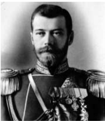

ரோமனோவ் வம்சத்ததைச் சேர்ந்த சார் இரண்டடாம் நிக்கோலஸ் அரசு நிருவாகத்தில் குறைவான அனுபவமே கொண்டிருந்ததார். அவருடைய மனைவி சாரினா அலெக்ஸஸாண்டிரா ஆதிக்க மனோபாவம் கொண்ட ஆளுமையாக இருந்ததால் நிக்கோலஸ் அவ்வம்மமையாரின் செல்வவாக்கிற்கு உட்பட்டிருந்ததார்.

காலனிகளைக் கைப்பற்றும் போட்டியில் விடுபட்டு போய்விடக்கூடாது என்பதற்ககாக மஞ்சூரியாவில் ரஷ்யயாவின் விரிவாக்கத்ததை ஊக்குவித்ததார். இது 1904இல் ஜப்பபானோடு போரிடத் தூண்டியது. இந்தப் போரில் ரஷ்யயா அடைந்த தோல்வி வேலை நிறுத்தங்களுக்கும், கலகங்களுக்கும்

இட்டுச்சசென்றது. சார் எதிர்ப்பு மேலும் வளர்ந்தது. 1905 ஜனவரி 22ஆம் நாளன்று கபான் எனும் ப திரியார் ஆண்கள், பெண்கள், குழந்ததைகள் ப ங்ககேற்ற பேரணியைப் புனிதபீட்டர்ஸ்பர்க் நகரிலுள்ள அரசரின் குளிர்ககால அரண்மனையை நோக்கி நடத்திச்சசென்றறார். மக்கள் பிரதிநிதிகளைக் கொண்ட தேசியச் சட்டமன்றம், வேளாண், தொழில் துறைகளில் சீர்திருத்தங்கள் என்பவையே அவர்களின் கோரிக்ககைகளாய் இருந்தன . ஆனால், காவல்துறையும், இராணுவமும் துப்பபாக்கிச்சூடு நடத்தியது. நூற்றுக்கணக்ககானோர் கொல்லப்பட்டனர். பல்லலாயிரக்கணக்ககானோர் காயமடை ந்தனர். 'குருதிஞாயிறு' என்றழைக்கப்பட்ட இந்நநாளில் நடந்த நிகழ்வுகள் வேலை நிறுத்தம், கலகம், வன்முறை ஆகியவற்றிற்கு இட்டுச்சசென்றது. சார் நிக்கோலஸ் ஒரு அரசியல்அமைப்பபை வழங்கி, டூமா எனும் நாடாளுமன்றத்ததை நிறுவும் கட்டடாயத்திற்குள்ளளானார். ஆனால், இடதுசாரிக் கட்சிகளுக்கு இது மனநிறைவு அளிப்பதாயில்லலை . அவர்கள் தொழிலாளர்களின் பிரதிநிதிகள் அடங்கிய சோவியத் (குழு) எனும் அமைப்பபை பீட்டஸ்பர்க்கில் நிறுவினர். டிராட்ஸ்கி அதன் தலைவர் ஆவார்.

**சா ர் மன்னருக்கு எதிர்ப்பு, டூமா கலைக்கப்படுதல்**

முதல் உலகப்போர் வெடித்ததுடன் ரஷ்யயா பிரான்ஸ், இங்கிலாந்து ஆகிய நாடுகளுடன் அணி சேர்ந்ததால் ரஷ்ய முடியாட்சி தற்ககாலிகமாக வலுப்பபெற்றது. சாரை (Tsar) மாற்றும் நோக்கமுடன் அரண்மனைப் புரட்சியொன்று நடைபெறப்போவதாக வதந்தி பரவியதால் நிக்கோலஸ் தன்னனைப் படை களின் தலைமைத் தளபதியாக அறிவித்துக் கொண்டடார். 1916ஆம் ஆண்டு முடிவடைவதற்குச் சில நாள்களுக்கு முன்னர் சார்மன்னர், பேரரசி ஆகியோரிடம் செல்வவாக்குமிக்க அதிகாரம் கொண்ட ரஸ்புட்டின் என்பவர், சார் மன்னரின் குடும்பத்ததைச் சேர்ந்த ஒருவரால் கொலை செய்யப்பட்டடார். பீட்டர்ஸ்பர்க் நகரத்தின் சோவியத் உறுப்பினர்கள் கைது செய்யப்பட்டனர். சார் மன்னரின் நோக்கங்களை எப்போதெல்லலாம் டூமா எதிர்த்ததோ அப்போதெல்லலாம் டூமா கலைக்கப்பட்டுப் புதிய தேர்தல்கள் நடத்தப்பட்டன. அரசின் கொள்ககைகளில் ம ற்றம் எதுவும் இல்லலாமல் 1917 புரட்சியுடன் நான்ககாவது டூமா முடிவுக்கு வந்தது.

**பொதுமக்களின் எழுச்சிகள்**

இந்நிலையில் நூற்பபாலைகளில் பணியாற்றிய பெண்களிடையே (அவர்களின் கணவர்கள் படை களில் பணியாற்றினர்) ரொட்டிக்கு ஏற்பட்ட பெருந்தட்டுப்பபாடு அவர்களை வேலைநிறுத்தம்

முதல் உலகப்போரின் வெடிப்பும் அதன் பின்விளைவுகளும்

செய்யக் கட்டடாயப்படுத்தியது. ரஷ்யப்பபேரரசின் தலைநகரான பெட்ரோகிரேடில் தொழிற்சசாலைகள் அதிகமிருந்த பகுதிகள் வழியாக அவர்கள் ஊர்வலம் சென்றனர். பெருமளவிலான பெண்உழைப்பபாளர்கள் போர்க்குணத்துடன் "உழைப்போர்க்கு ரொட்டி" எனக் கோரிக்ககை முழக்கமிட்டனர். தொழிற்கூடங்களில் பணியாற்றும் தொழிலாளர்களை நோக்கிக் கையசைத்த அவர்கள், "வெளியே வாருங்கள்" "வேலையை நிறுத்துங்கள்" எனக் கூற நகரின் 4,00,000 தொழிலாளர்கள் அடுத்த நாளே (பிப்ரவரி-24) போராட்டத்தில் இணைந்தனர்.

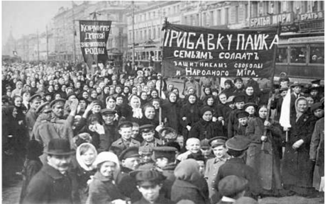

**சா ர் பதவிவிலகல்**

வேலைநிறுத்தத்ததை உடைப்பதற்கு அரசு தனது துருப்புகளைப் பயன்படுத்தியது. ஆனால், வேலைநிறுத்தத்தின் நான்ககாம்நநாள் பாசறைகளில் இராணுவவீரர்களின் கலகங்கள் வெடித்தன. சார் தொலைதூரத்தில் தலைமைத்தளபதியாக தனது இராணுவத்ததை வழிநடத்திக் கொண்டிருந்ததார். அவருடைய ஆணை நகரத்தில் ஒலிபரப்பப்படவில்லலை. அப்பணியைச் செய்ய அங்கு யாருமில்லலை. இதன்பின்னர் சார் பெட்ரோகிரேடு திரும்ப முயற்சித்ததார். இருப்புப்பபாதை ஊழியர்கள் அவர் பயணம்சசெய்த புகைவண்டியை

ரஷ்யப் புரட்சி நடந்து சார் மன்னன் வீழ்ச்சியுற்றபோது நம் தேசியக்கவி பாரதியார் எழுதிய உணர்ச்சிமிக்க கவிதை:

புதிய ரஷ்யயா

மாகாளி பராசக்தி உருசியநாட்

டினிற் கடைக்கண் வைத்ததாள், அங்ககே

ஆகாவென் றெழுந்ததுபார் யுகப்புரட்சி;

கொடுங்ககாலன் அலறி வீழ்ந்ததான்; வாகான தோள்புடைத்ததார் வானமரர்; பேய்களெலாம் வருந்திக் கண்ணீர்

போகாமற் கண்புகைந்து மடிந்தனவாம்; வை யகத்தீர், புதுமை காணீர்!

முதல் உலகப்போரின் வெடிப்பும் அதன் பின்விளைவுகளும்

வரும்வழியில் நிறுத்திவிட்டனர். இத்தகைய நிகழ்வுகளால் திகைத்துப்போன சில தளபதிகளும் பெட்ரோகிரேடிலிருந்த சில தலைவர்களும் சாரைப் பதவிவிலகுமாறு கெஞ்சிக்ககேட்டனர். மக்களின் பேரெழுச்சிகளுக்கு சிறிது காலத்திற்குப்பின் மார்ச் 15இல் சார் இரண்டடாம் நிக்கோலஸ் பதவி விலகினார்.

**தற்ககாலிக அரசு**

அரசு நிருவாகப்பணிகளை மேற்கொள்ள ஒன்றுக்கொன்று இணையான இரண்டு அமைப்புகள் இருந்தன. ஒன்று பழைய டூமா அமைப்பின், உடைமை வர்க்கத்ததைச் சேர்ந்த பூர்ஷ்வவா அரசியல்வவாதிகளைக்கொண்ட அமைப்பு. மற்றொன்று தொழிலாளர்களின் பிரதிநிதிகள் அங்கம்வகித்தக் குழு அல்லது சோவியத். சோவியத் அமைப்புகளின் ஒப்புதலோடு டூமாவால் ஒரு தற்ககாலிகஅரசை நிறுவ முடிந்தது. சோவியத்துகளில் மென்ஷ்விக்குகள் ஆதிக்கம்சசெலுத்த, சிறுபான்மமையினராக இருந்த போல்ஷ்விக்குகள் அச்சமுற்றவர்களாகவும் முடிவெடுக்க முடியாதவர்களாகவும் இருந்தனர். லெனினின் வருகையால் இச்சூழல் மாறியது.

**தற்ககாலிக அரசின் தோல்வி**

புரட்சி வெடித்தபோது லெனின் சுவிட்சர்லலாந்தில் இருந்ததார். புரட்சி தொடர்ந்து நடைபெற வேண்டுமென அவர் விரும்பினார். "அனைத்து அதிகாரங்களும் சோவியத்திற்ககே" என்ற அவரது முழக்கம் தொழிலாளர்களையும் தலைவர்களையும் கவர்ந்தது. போர்க்ககாலத்தில் ஏற்பட்டிருந்த ப ற்றறாக்குறைகளால் பெருந்துயரங்களுக்கு உள்ளளாகியிருந்த மக்கள் "ரொட்டி, அமைதி, நிலம்" எனும் முழக்கத்ததால் கவரப்பட்டனர். ஆனால், தற்ககாலிகஅரசு இரண்டு முக்கியத் தவறுகளைச் செய்தது. ஒன்று நிலங்களின் மறுவிநியோகம் குறித்த கோரிக்ககையின்மீது எடுக்கப்பட வேண்டிய முடிவைத் தள்ளிவைத்தது. மற்றொன்று போரைத்தொடர்வதென எடுக்கப்பட்ட முடிவு. ஏமாற்றமடைந்த விவசாய இராணுவவீரர்கள் தங்கள் பொறுப்புகளைக் கைவிட்டு நிலஅபகரிப்பில் ஈடுபடலாயினர். இந்நிகழ்வு பெட்ரோகிரேடில் போல்ஷ்விக்குகளின் தலைமையில் நடைபெற்ற எழுச்சியை மேலும் தீவிரப்படுத்தியது. அரசு 'பிரவ்ததா' வை தடை செய்து போல்ஷ்விக்குகளைக் கைதுசெய்தது. டிராட்ஸ்கியும் கைதுசெய்யப்பட்டடார்.

**லெனின் தலைமையில் போல்ஷ்விக் கட்சி ஆட்சியைக் கைப்பற்றுதல்**

அக்டோபர் திங்களில், லெனின் போல்ஷ்விக் கட்சியின் மத்தியக்குழுவை உடனடிப் புரட்சி குறித்து முடிவுசெய்யக் கேட்டுக்கொண்டடார். டிராட்ஸ்கி ஒரு விரிவானதிட்டத்ததைத் தயாரித்ததார்.

1870இல் மத்திய வோல்ககா ப குதி அருகே கற்றறிந்த பெற்றோர்க்கு லெனின் பிறந்ததார். கார்ல் மார்க்ஸின் சிந்தனைகளால் கவரப்பட்ட அவர், விடுதலைக்ககான வழி, பெருந்திரளான ம க்களின்

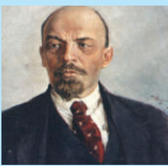

போராட்டமே என நம்பினார். பெரும்பபாலானோரின் (போல்ஷின்ஸஸ்ட்வவோ) ஆதரவைப் பெற்ற லெனினும் அவரது ஆதரவாளர்களும் போல்ஷ்விக் கட்சியினர் என்று அறியப்பட்டனர். இவருக்கு எதிரான சிறுபான்மமையினர் (மென்ஷின்ஸஸ்ட்வவோ) மென்ஷ்விக்குகள் என்றும் அழைக்கப்பட்டனர்.

நவம்பர் 7இல் முக்கியமான அரசுக்கட்டடங்கள், குளிர்ககால அரண்மனை, பிரதமமந்திரியின் தலைமை அலுவலகங்கள் ஆகியவை அனைத்தும் ஆயுதமேந்திய ஆலைத்தொழிலாளர்களாலும், புரட்சிப்படையினராலும் கைப்பற்றப்பட்டன. 1917 நவம்பர் 8இல் ரஷ்யயாவில் புதிய கம்யூனிஸ்ட் அரசு ஆட்சிப் பொறுப்பபேற்றது. போல்ஷ்விக் கட்சிக்கு ரஷ்யக் கம்யூனிஸ்ட் கட்சி எனப்புதுப் பெயரிடப்பட்டது.

**புரட்சியின் விளைவுகள்**

ரஷ்யக் கம்யூனிஸ்ட் கட்சியால் குறுகிய காலத்தில் ரஷ்யயாவில் எழுத்தறிவின்மமையையும் வறுமையையும் ஒழிக்க முடிந்தது. ரஷ்யயாவின் தொழில்துறையும் வேளாண்மமையும் உன்னதமான வளர்ச்சியைப் பெற்றன. வாக்குரிமை முதலாகப் பெண்களுக்கு சமஉரிமைகள் வழங்கப்பட்டன . தொழிற்சசாலைகளும் வங்கிகளும் தேசியமயமாக்கப்பட்டன. நிலம் சமுதாயத்தின் சொத்ததாக அறிவிக்கப்பட்டது. ஏழை விவசாயிகளுக்கு நிலங்கள் பகிர்ந்தளிக்கப்பட்டன . போரிலிருந்து விலகாமலிருந்ததே தற்ககாலிக அரசின் வீழ்ச்சிக்கு முக்கியக்ககாரணமென , ல லெனின் நினைத்ததார். எனவே , அவர் உடனடியாக அமைதிக்ககான முயற்சிகளை மேற்கொண்டடார். மையநாடுகளின் கடுமையான நிபந்தனைகள் குறித்துக் கவலைகொள்ளளாமல், புதிய அரசை உருவாக்குவதில் கவனம் செலுத்துவதற்ககாக அவர் போரிலிருந்து விலகினார். 1918இல் பிரெஸ்ட்- லிடோவஸ்க் உடன்படிக்ககை கையெழுத்திடப்பட்டது. ரஷ்யப்புரட்சியின் உலகளாவியத் தாக்கத்தின் விளைவுகள்

ரஷ்யப்புரட்சி உலக மக்களின் கற்பனையைத் தூண்டியது. பல நாடுகளில் கம்யூனிஸ்ட் கட்சிகள் உருவாக்கப்பட்டன. ரஷ்ய கம்யூனிஸ்ட் அரசு காலனி நாடுகளை விடுதலைக்ககாக போராட ஊக்குவித்து

அவர்களுக்கு முழுமையாக ஆதரவையும் நல்கியது. நிலச்சீர்திருத்தம், சமூகநலன், தொழிலாளர் உரிமைகள், பாலின சமத்துவம் போன்ற இன்றியமையாதவை குறித்த விவாதங்கள் உலகஅளவில் நடைபெறத் தொடங்கின .

பிரவ்ததா என்பது ஒரு ரஷ்யமொழிச் சொல். அதன் பொ ருள் "உண்மமை" என்பதாகும். இது 1918 முதல் 1991 வரை சோவியத்யூனியனின் கம்யூனிஸக் கட்சியினுடைய அதிகாரபூர்வ நாளேடாகும்.

### 1.5 பன்னனாட்டுச் சங்கம்

**அமைப்பும் உறுப்புகளும்**

ப ன்னனாட்டுச் சங்கத்திற்ககான கூட்டு ஒப்பந்த ஆவணம் பாரிஸ் அமைதி மாநாட்டில் தயார் செய்யப்பட்டு முதல் உலகப்போருக்குப்பின் மேற்கொள்ளப்பட்ட ஒவ்வொரு உடன்படிக்ககையிலும் சேர்க்கப்பட்டது. சவால்கள் நிறைந்த இப்பணி அமெரிக்க அதிபர் உட்ரோவில்சன் கொடுத்த அழுத்தத்ததால் நிறைவேறியது. இவ்வமைப்புக்ககான அரசியல் அமைப்பு விதிகளை உருவாக்குவதில் இங்கிலாந்து, அமெரிக்ககா ஆகியநாடுகளின் ஆலோசனைகள் மேலோங்கியிருந்தன .

1920இல் தொடங்கப்பட்ட இச்சங்கம் ஐந்து உறுப்புகளைக் கொண்டிருந்தது. அவை பொதுச்சபை , செயற்குழு, செயலகம், பன்னனாட்டு நீதிமன்றம், ம ற்றும் பன்னனாட்டுத் தொழிலாளர் அமைப்பு என்பனவாகும். ஒவ்வொரு உறுப்புநாடும் பொதுச்சபையில் பிரதிநிதித்துவப்படுத்தப்பட்டது. செயற்குழுவே முடிவுகளைச் செயல்படுத்தும் அமைப்பபாகும். பிரிட்டன், பிரான்ஸ், இத்ததாலி, ஜப்பபான், அமெரிக்ககா ஆகிய நாடுகளே தொடக்கத்தில் இச்சபையின் நிரந்தர உறுப்பினர்கள் என அறிவிக்கப்பட்டது. ஒவ்வொரு உறுப்பினருக்கும் ஒரு வாக்கு அளிக்கும் உரிமை உண்டு. மேலும், அனைத்து முடிவுகளும் ஒருமனதாகத் தீர்மமானிக்கப்படவேண்டும் என்பதால் சிறு நாடுகளும் மறுப்பபாணை அதிகாரத்ததைப் (Veto Power) பெற்றிருந்தன .

ப ன்னனாட்டுச் சங்கத்தின் செயலகம் ஜெனீவாவில் அமைந்து இருந்தது. அதன் முதல் பொதுச்சசெயலாளர் பிரிட்டனைச் சேர்ந்த சர் எரிக் டிரம்மமாண்ட் ஆவார். செயலகப் பணியாளர்களைப் பொதுச்சசெயலாளர் செயற்குழுவின் ஆலோசனையின்படி பணியமர்த்துவார். பன்னனாட்டு நீதிமன்றமானது தி ஹேக் நகரில் அமைக்கப்பட்டது. இந்நீதிமன்றம் பதினைந்து நீதிபதிகளைக் கொண்டிருந்தது. பன்னனாட்டுத் தொழிலாளர் அமை ப்பு, ஒரு செயலகத்ததையும் அதன் பொது

முதல் உலகப்போரின் வெடிப்பும் அதன் பின்விளைவுகளும்

ம நாட்டில் ஒவ்வொரு உறுப்பு நாட்டிலிருந்தும் நான்கு உறுப்பினர்கள் பங்ககேற்றனர்.

**ப ன்னனாட்டுச் சங்கத்தின் குறிக்கோள்கள்**

ப ன்னனாட்டுச் சங்கத்தின் இரண்டு குறிக்கோள்களில் ஒன்று போர்களைத்தவிர்த்து உலகில் அமைதியை நிலைநாட்டுவது. மற்றொன்று சமூகப் பொருளாதார விசயங்களில் ப ன்னனாட்டு ஒத்துழைப்பபை மேம்படுத்துவது என்பனவாகும். பன்னனாட்டுச் சங்கம் நடுவராகவும், சமாதானம் செய்பவராகவும் இருந்து அதன் மூலம் பிரச்சனைகளைத் தொடக்கத்திலேயே தீர்த்துவைக்க விரும்பியது. நடுவர் தீர்ப்பபையும் மீறி போர்கள் வெடித்ததால் போருக்குக் காரணமான நாட்டின்மீது சங்கம் முதலில் பொருளாதாரத் தடைகளையும் பின்னர் இராணுவ ரீதியிலானத் தடைகளையும் விதிக்கவேண்டும்.

அமெரிக்ககா (சங்கத்தில் உறுப்பினராகாத நாடு), ஜெர்மனி (தோல்வியுற்ற நாடு), மற்றும் ரஷ்யயா ஆகிய மூன்று வல்லரசுகள் இவ்வமைப்பில் அங்கம் வகிக்ககாததால், இக்குறிக்கோள்களை எட்டுவதில் சிரமங்கள் மேலும் அதிகரித்தன . ஜெர்மனியும் ரஷ்யயாவும் முறையே 1926, 1934 ஆகிய ஆண்டுகளில் சங்கத்தில் சேர்ந்தன . 1933இல் ஜெர்மனி விலகியது. 1939இல் ரஷ்யயா வெளியேற்றப்பட்டது.

**சங்கத்தின் செயல்பபாடுகள்**

1920-1925 ஆகிய ஆண்டுகளிடையே ப ன்னனாட்டுச் சங்கம் பல சிக்கல்களைத் தீர்த்துவைக்க அழைக்கப்பட்டது. மூன்று பிரச்சனைகளைத் தீர்த்துவைப்பதில் சங்கம் வெற்றிபெற்றது. 1920இல் பின்லலாந்தின் மேற்குக்கடற்கரைக்கும் சுவீடனின் கிழக்குக்கடற்கரைக்கும் இடையில் அமைந்திருந்த ஆலேண்டு தீவுகள் யாருக்குச் சொந்தம் என்பதில் பின்லலாந்திற்கும் சுவீடனுக்குமிடையே பிரச்சனை ஏற்பட்டது. பன்னனாட்டுச் சங்கம் அத்தீவுகள் பின்லலாந்திற்ககே உரியது எனத் தீர்ப்பளித்தது. அடுத்த ஆண்டில் போலந்திற்கும் ஜெர்மனிக்குமிடையே மேலை சைலேஷியா பகுதியில் எல்லலைப்பிரச்சனை ஏற்பட்டு, பிரச்சனையைத் தீர்த்துவைக்கச் சங்கம் அழைக்கப்பட்டபோது அப்பிரச்சனையைச் சங்கம் வெற்றிகரமாகத் தீர்த்துவைத்தது. 1925இல் மூன்றறாவது பிரச்சனை கிரீஸ், பல்ககேரியா நாடுகளிடையே ஏற்பட்டதாகும். கிரீஸ் பல்ககேரியாவின் மீது படையெடுத்தபோது ப ன்னனாட்டுச் சங்கம் போர் நிறுத்தம் செய்ய உத்தரவிட்டது. விசாரணைக்குப்பின் சங்கம் கிரீஸின் மீது குற்றஞ்சசாட்டி, கிரீஸ் போர் இழப்பீடு வழங்கவேண்டுமெனத் தீர்மமானித்தது. ஆகவே 1925இல் லொக்கர்னோ உடன்படிக்ககை

முதல் உலகப்போரின் வெடிப்பும் அதன் பின்விளைவுகளும்

கையெழுத்ததாகின்றவரை பன்னனாட்டுச் சங்கம் வெற்றிகரமாகவே செயலாற்றியது. லொக்ககார்னோ உடன்படிக்ககையின்படி ஜெர்மனி, பிரான்ஸ், பெல்ஜியம், இங்கிலாந்து, இத்ததாலி ஆகிய நாடுகள் மேற்கு ஐரோப்பபாவில் பரஸ்பரம் அமைதிக்கு உத்தரவாதமளித்தன. இதன்பின்னர் ஜெர்மனி பன்னனாட்டுச் சங்கத்தில் இணைந்தது. ப துகாப்புக்குழுவிலும் நிரந்தர இடமளிக்கப்பட்டது. இரண்டு ஆண்டுகளுக்குப் பின்னர் அமெரிக்ககாவும் ரஷ்யயாவும் சங்கத்தினுடைய அரசியல் அல்லலாத நடவடிக்ககைகளில் பங்ககேற்கத் தொடங்கின .

**கட்டுப்பபாடு மீறல்**

ஐரோப்பிய சக்திகள் எதிர்கொண்ட பெரும் பிரச்சனைகளிலொன்று எவ்வவாறு ஆயுதக் குறைப்பபை சாத்தியமாக்குவது என்பதாகும். 1925இல் சங்கத்தின் பாதுகாப்புக் குழுவானது ஏற்பபாடு செய்த ஆயுதக்குறைப்புப் பிரச்சனை தொடர்பபான மாநாடு, 1932 பிப்ரவரியில்ததான் கூடியது. இம்மமாநாட்டில் பிரான்சுக்கு நிகராகத் தானும் ஆயுதங்களை வைத்துக்கொள்ள ஜெர்மனி அனுமதி கோரியபோது அது மறுக்கப்பட்டது. அக்டோபர் திங்களில் ஹிட்லர் ஜெர்மனியை மாநாட்டிலிருந்தும் பன்னனாட்டுச் சங்கத்திலிருந்தும் விலக்கிக்கொண்டடார்.

1931இல் ஜப்பபான் மஞ்சூரியாவைத் தாக்கியது. சங்கம் ஜப்பபானைக் கண்டனம் செய்யவே ஜெர்மனியின் நடவடிக்ககையைப் பின்பற்றி ஜப்பபானும் சங்கத்திலிருந்து வெளியேறியது. இத்ததாலி எத்தியோப்பியாவைத் தாக்கிய விசயத்தில் சங்கம் இத்ததாலிக்கு எதிராகத் தடைகளை விதித்தது. தடைகள் நடைமுறைக்கு வந்தபோது, அதை எதிர்த்து இத்ததாலி 1937இல் விலகியது. இதன்பின்னர் ஏற்பட்ட ரைன்லலாந்து, ஆஸ்திரியா, செக்கோஸ்லோவாக்கியா, போலந்து ஆகிய பிரச்சனைகளில் சங்கம் தலையிடாமல் நடைபெற்ற நிகழ்வுகளுக்கு மௌன சாட்சியாய் விளங்கியது. 1939 டிசம்பர் திங்கள் பின்லலாந்ததைத் தாக்கியதற்ககாக ரஷ்யயாவை வெளியேற்றியதே சங்கத்தின் இறுதியான உறுதியான நடவடிக்ககையாகும். சங்கத்தின் பொதுச்சபை அதன்பின்னர் கூட்டப்படவில்லலை. இறுதியாக 1946இல் பன்னனாட்டுச் சங்கம் கலைக்கப்பட்டது.

**தோல்விக்ககானக் காரணங்கள்**

ப ன்னனாட்டுச் சங்கம் முதல் உலகப்போரில் வெற்றிபெற்ற நாடுகளின் அமைப்பபாகவே காணப்பட்டது. சங்கத்திற்ககென்று இராணுவம் இல்லலை என்பதால் தான் எடுத்த முடிவுகளை நடைமுறைப்படுத்த அதனால் இயலவில்லலை .

அமைதிக்ககான இவ்வமைப்பபை உருவாக்கியவர்கள் தேசியவாதத்தின் உள்ளளார்ந்த ஆற்றலை உணர்ந்திருக்கவில்லலை. 'கூட்டுப்பபாதுகாப்பு' எனும் கோட்பபாட்டடை நடைமுறையில் செயல்படுத்தவே முடியவில்லலை .

சர்வவாதிகாரிகளால் தலைமையேற்கப்பட்ட இத்ததாலி, ஜப்பபான், ஜெர்மனி ஆகிய நாடுகள் சங்கத்தின் ஆணைகளுக்குக் கட்டுப்பட ம றுத்தபோது, இங்கிலாந்து, பிரான்ஸ் ஆகிய நாடுகள் மட்டுமே உறுதியாகச் செயல்படும் நிலையிலிருந்தன .

**பாட ச்சுருக்கம்**

- முதலாளித்துவ நாடுகளின் வளர்ந்துகொண்டடேயிருந்த, கச்சசாப்பொருட்களுக்கும் சந்ததைக்குமானத் தேவைகள் எவ்வவாறு காலனியாதிக்கப் போட்டிக்கு இட்டுச்சசென்றதென்பதும் அதன் விளைவாக ஐரோப்பிய வல்லரசுகளிடையே ஏற்பட்ட மோதல்களும் விவாதிக்கப்பட்டுள்ளன .
- ஆசியாவில் ஜப்பபான் ஒரு ஏகாதிபத்திய சக்தியாக எழுச்சி பெற்றது கோடிட்டுக் காட்டப்பட்டுள்ளது.
- ஐரோப்பபா இரு போர்முகாம்களாகப் பிரிந்ததும் அதன் விளைவாக ஏற்பட்ட அணி சேர்க்ககைகளும், எதிரணி சேர்க்ககைகளும் விவரிக்கப்பட்டுள்ளன .
- முதல் உலகப்போர் வெடிப்பதற்குக் காரணங்களான வன்முறை வடிவங்களிலான தேசியம், ஜெர்மனியின் ஆக்கிரமிப்பு மனப்பபான்மமை, அல்சசேஸ், லொரைன் பகுதிகளை இழந்ததனால் பிரான்சுக்கு ஜெர்மனியோடு ஏற்பட்டப் பகைமை , ப ல்கன் பகுதியில் ஏற்பட்ட அதிகாரஅரசியல் போன்றவை விளக்கப்பட்டுள்ளன .
- நீர்மூழ்கிக்கப்பல் போரினை ஜெர்மன் தொடுத்ததைத் தொடர்ந்து போரில் அமெரிக்ககா பங்ககேற்றதும், நேசநாடுகள் பெற்ற இறுதி வெற்றியும் சுருக்கமாக விளக்கப்பட்டுள்ளன .
- பாரிஸ் அமைதிமாநாடும், வெர்சசெய்ல்ஸ்ஸ் உடன்படிக்ககையின் சரத்துக்களும் பகுத்ததாய்வு செய்யப்பட்டுள்ளன .
- முதல் உலகப்போரின் பின்விளைவுகள், குறிப்பபாக ரஷ்யப்புரட்சி, அதற்ககான காரணங்கள், போக்கு, விளைவுகள் ஆகியவை விரிவாக விவரிக்கப்பட்டுள்ளன .
- உலகஅமைதிக்ககாக உருவாக்கப்பட்ட முதல் அமைப்பபான பன்னனாட்டுச் சங்கமும் போர்களைத் தடுப்பதிலும் அமைதியை மேம்படுத்தியதிலும் அது வகித்தப் பங்கும் விமர்சன பூர்வமாக ஆய்வு செய்யப்பட்டுள்ளன .

**க லைச்சொற்கள்**

|  |  |  |
| --- | --- | --- |
| முற்றுரிமை | Monopoly | exclusive possession or control |
| பேரழிவு | Devastating | highly destructive or damage |
| கண்மூடித்தனமான நாட்டுப்பற்று | Jingoism | blind patriotism, especially in the pursuit of aggressive foreign policy |
| அதிதீவிரப்பற்று | Chauvinism | extreme patriotism |
| ஜெர்மானியக் கலாச்சாரத்தை மிக உயர்வாக நினைப்பது உயர்வாக நினைப்பது உயர்வாக நினைப்பது உயர்வாக நினைப்பது | Kultur | thinking highly of German civilization and culture |
| எதிரியை விரட்டிஅடித்தல் | Repulse | drive back |
| மூழ்கடி | Torpedo | attack or sink (a ship) with a torpedo |
| முதலாளித்துவம் | Bourgeois | characteristic of the middle class, typically with reference to its perceived materialistic values or conventional attitudes |
| அறிவுஜீவிகள், நுண்ணறிவாளர்கள் | Intelligentsia | intellectuals or highly educated people as a a group, especially when regarded as possessing culture and political influence |
