**அலகு - 5**

**19ஆம் நூற்றறாண்டில் சமூக, சமய சீர்திருத்த இயக்கங்கள்**

**கற்றலின் நோக்கங்கள்**

**கீழ்க்ககாண்பனவற்றோடு அறிமுகமாதல்**

- 19ஆம் நூற்றறாண்டு பிரிட்டிஷ் இந்தியாவில் புதிய விழிப்புணர்ச்சியை உருவாக்கியதில் மேற்கத்தியச் சிந்தனைகள் மற்றும் கிறித்தவ மதத்தின் செல்வவாக்கு
- சமுதாய மற்றும் சமயத்துறைகளில் ஏற்பட்ட போட்டிகள், உடன்கட்டடை ஏறுதல் (சதி), அடிமைமுறை, தீண்டடாமை, குழந்ததைத்திருமணம் போன்ற பழக்கங்களுக்கு எதிர்ப்பு
- உருவவழிபாடு, சடங்குகள், மூடநம்பிக்ககைகள் ஆகியனவற்றிற்கு எதிர்ப்பு

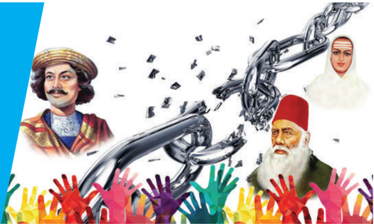

- இந்தியா புத்துயிர் பெற்றதில் பிரம்ம சமாஜம், ஆரிய சமாஜம், இராமகிருஷ்ணணா மிஷன், பிரம்மஞானசபை , அலிகார் இயக்கம் ஆகியவற்றின் பங்களிப்பு
- பார்சிகள், சீக்கியர்கள் ஆகிய சமூகங்களில் விழிப்புணர்வவை ஏற்படுத்தியதில் முக்கிய ஆளுமைகளின் ப ங்கு
- ஜோதிபா புலேயின் சமூகஇயக்கமும், கேரளா, தமிழ்நநாட்டில் தோன்றிய சீர்திருத்த இயக்கங்களும்

**அறிமுகம்**

எழுத்தர்களை உருவாக்கும் நோக்கில் அறிமுகம் செய்யப்பட்ட ஆங்கிலக் கல்வி ஒரு புதிய ஆங்கிலக் க ல்வி பயின்ற நடுத்தரவர்க்கத்ததை உருவாக்கியது. இவ்வர்க்கம் மேற்கத்தியக் கருத்துக்களின், சிந்தனைகளின் தாக்கங்களுக்குள்ளளானது. க ல்வியறிவு பெற்ற இந்நடுத்தர வர்க்கம் எண்ணிக்ககையில் சிறிதாக இருந்ததாலும் அரசியலிலும், சீர்திருத்த இயக்கங்களிலும் தலைமைவகிக்கத் தொடங்கியது. இருந்தபோதிலும் இந்தியச் சீர்திருத்தவாதிகள் தங்களுடையப் பழைய க ருத்துக்களையும் பழக்கவழக்கங்களையும் விமர்சனபூர்வமான ஆய்வுக்கு உட்படுத்தப் பெரிதும் தயங்கினர். அதற்குப்பதிலாக அவர்கள் இந்தியப் ப ண்பபாட்டிற்கும் மேலைப் பண்பபாடுகளுக்குமிடையே இணக்கத்ததை ஏற்படுத்த முயன்றனர். இருந்தபோதிலும் அவர்களுடைய கருத்துகளும் செயல்பபாடுகளும் உடன்கட்டடை ஏறுதல் (சதி), பெண் சிசுக்கொலை, குழந்ததைத் திருமணம் போன்ற அனைத்து வகையான க ண்மூடித்தனமான மதநம்பிக்ககைகள் மற்றும் சமூகத்தீமைகளை கட்டுப்படுத்த உதவியன .

பத்தொன்பதாம் நூற்றறாண்டின் சமயம் சார்ந்த சீர்திருத்த இயக்கங்களை இரண்டடாக வகைப்படுத்தலாம். பிரம்ம சமாஜம், பிரார்த்தனை சம ஜம், அலிகார் இயக்கம் போன்ற சீர்திருத்த இயக்கங்கள் ஒருவகை, ஆரியசமாஜம், இராமகிருஷ்ணணா மிஷன், தியோபந்த் இயக்கம் போன்ற சமயப் புத்ததெழுச்சி மீட்டடெடுப்பு இயக்கங்கள் மற்றொருவகை. இவைகளைத்தவிர ஒடுக்குமுறைப்பபாங்குடைய சமூகக்கட்டமைப்பபை எதிர்க்கும் முயற்சிகளும் மேற்கொள்ளப்பட்டன . புனேயில் ஜோதிபா புலே , கேரளாவில் நாராயணகுரு, அய்யங்ககாளி, தமிழகத்தில் இராமலிங்க அடிகள், அயோத்திதாசர் ஆகியோர் இவ்வகைப்பட்டோராவர்.

### 5.1 வங்ககாளத்தில் தொடக்கக் கால சீர்திருத்த இயக்கங்கள்

**(அ) இராஜா ராம்மோகன் ராயும் பிரம்ம சமாஜமும்**

இராஜா ராம்மோகன் ராய் (1772-1833) மேலைநாட்டுக் கருத்துக்களால் கவரப்பட்டு, சீர்திருத்தப்பணிகளை முன்னனெடுத்த தொடக்ககாலச் சீர்திருத்த வாதிகளில் ஒருவராவார். பெரும் அறிஞரான அவர், தனது தாய்மொழியான வங்ககாள மொழியில்

புலமை பெற்றிருந்ததோடு சமஸ்கிருதம், அரபி, பாரசீகம், ஆங்கிலம் ஆகிய மொழிகளிலும் புலமை பெற்றிருந்ததார். இராஜா ராம்மோகன் ராய் பொருளற்ற சமய ச் சட ங்கு க ள யு ம் , கேடுகளை விளைவிக்கும் சமூக மரபுகளையும் எதிர்த்ததார். இருந்த போதிலும் கட ந்த காலத்துடனான

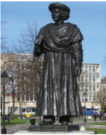

தொடர்பபை அவர் பாதுகாக்க விரும்பினார். தன்னுடைய சமய , தத்துவ சமூகப்பபார்வவையில் அவர் ஒருகடவுள் கோட்பபாடு, உருவவழிபாடு எதிர்ப்பு போன்ற கருத்துக்களின் தாக்கத்ததைப் பெற்றிருந்ததார். உபநிடதங்களுக்குத் தான்கொடுத்த விளக்கங்களின் அடிப்படையில் இந்துக்களின். மறைநூல்கள் அன த்தும் ஒருகடவுள் கோட்பபாட்டடை அல்லது ஒரு கட வுளை வணங்குவதை உபதேசிப்பதாகக் கூறினார்.

சமூகத்தில் நிலவிவரும் உடன்கட்டடை ஏறுதல் (சதி), குழந்ததைத் திருமணம், பலதார மணம் போன்ற மரபு சார்ந்த சமூகக் கொடுமைகள் குறித்து பெரிதும் கவலை கொண்ட அவர் சிற்றறேடுகளை வெளியிட்டடார். மேலும் அவற்றிற்கு எதிராகச் ச ட்டங்கள் இயற்றும்படி ஆங்கில அரசாங்கத்திற்கு விண்ணப்பித்ததார். விதவைப்பபெண்கள் மறுமணம் செய்துகொள்ள உரிமை உடையவர்கள் எனும் க ருத்ததை முன்வவைத்ததார். பலதார மணத்திற்கு முற்றுப்புள்ளி வைக்கப்பட வேண்டுமென்றறார். ம க்களைப் பகுத்தறிவோடும், பரிவோடும், மனிதப் பண்போடும் இருக்கும்படி வேண்டுகோள் விடுத்ததார். 1829இல் தலைமை ஆளுநர் வில்லியம் பெண்டிங் 'சதி' எனும் உடன்கட்டடையேறும் பழக்கத்ததை ஒழித்துச் சட்டம் இயற்றியதில் இராஜா ராம்மோகன் ராய் முக்கிய பங்கு வகித்ததார்.

ராம்மோகன் ராய் பெண்ணடிமைத்தனத்ததைக் க ண்டனம் செய்ததார். ஆண்கள் பெண்களை கீழானவர்களாக நடத்தும் அன்றறைய கால நடைமுறையை எதிர்த்ததார். பெண்களுக்குக் கல்வி வழங்கப்படவேண்டும் எனும் கருத்ததை வலுவாக முன்வவைத்ததார். பள்ளிகளிலும் கல்லூரிகளிலும் ஆங்கிலக்கல்வியும் மேலை நாட்டு அறிவியலும் அறிமுகம் செய்யப்படுவதை முழுமையாக ஆதரித்ததார்.

இராஜா ராம்மோகன் ராய் 1828இல் பிரம்ம சம ஜத்ததை நிறுவி ஆகஸ்டு 20ஆம் நாள் க ல்கத்ததாவில் (கொல்கத்ததா) ஒரு கோவிலை நிறுவினார். அக்கோவிலில் திருவுருவச் சிலைகள் எதுவும் வைக்கப்படவில்லலை . இங்கு எந்த ஒரு மதத்ததையும் ஏளனமாகவோ , அவமானமாகவோ பேசக்கூடாது அல்லது மறைமுகமாகக் குறிப்பிடப்படலாகாது என

எழுதிவைத்ததார். பிரம்ம சமாஜம் உருவவழிபாட்டடை தவிர்த்ததோடு பொருளற்ற சமயச் சடங்குகளையும் ச ம்பிரதாயங்களையும் எதிர்த்தது. இருந்தபோதிலும் தொடக்கம் முதலாக பிரம்ம சமாஜத்தின் க ருத்துக்கள் கற்றறிந்த மேதைகள், கல்வியறிவு பெற்ற வங்ககாளிகள் என்ற அளவில் மட்டுமே செயல்பட்டது. சமூகத்தின் கீழ்த்தட்டு மக்களைத் தன்பபால் ஈர்ப்பதில் சமாஜம் தோல்வியடைந்ததாலும், நவீன வங்ககாளப் பண்பபாட்டு மற்றும் நடுத்தர வர்க்கத்தின் மீதான அதனுடைய தாக்கம் மிகவும் போற்றுதலுக்குரியதாகும்.

**(ஆ) மகரிஷி தேவேந்திரநாத் தாகூர்**

இராஜா ராம்மோகன் ராய் 1833இல் இயற்ககையெய்திய பின்னர் அவர் விட்டுச்சசென்றப் பணிகளை, கவிஞர் இரவீந்திரநாத் தாகூரின் தந்ததையரான தேவேந்திரநாத் தாகூர் (1817-1905) தொடர்ந்ததார். அவர் நம்பிக்ககை பற்றிய நான்கு கொள்ககைக்கூறுகளை முன்வவைத்ததார்.

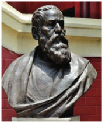

- தொடக்கத்தில் எதுவுமில்லலை, எல்லலாம் வல்ல ஒரு கடவுள் மட்டுமே உள்ளளார். அவரே இவ்வுலகத்ததைப் படைத்ததார்.
- அவர் ஒருவரே உண்மமையின், எல்லலையற்ற ஞானத்தின், நற்பண்பின், ச க்தியின் கடவுளாவார். அவரே நிலையானவர், எங்கும் நிறைந்திருப்பவர், அவருக்கிணையாருமில்லலை .
- நம்முடைய வீடுபேறு, இப்பிறவியிலும் அடுத்தபிறவியிலும் அவரை நம்புபவரையும் அவரை வணங்குவதையும் சார்ந்துள்ளது.
- அவரை நம்புவதென்பது, அவரை நேசிப்பதிலும் அவர் விருப்பத்ததைச் செயல்படுத்துவதிலும் அடங்கியுள்ளது.
- (இ) கேசவ் சந்திர சென்னும் இந்தியாவின் பிரம்ம சமாஜமும்

தேவேந்திரநாத்

சீர்திருத்தவாதியாவார். ஆனால்,

மிதவாதச் சமாஜத்தில்

பணியாற்றிய இளையவர்கள்

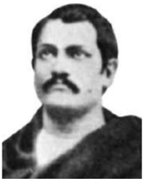

அவருடன் விரைவான மாற்றங்களையே விரும்பினர். அவர்களுள் மிக முக்கியமானவரான கேசவ் ச ந்திர சென் (1838-84), 1857இல் சபை யில் இணைந்ததார். 1866இல் பிரம்மசமாஜத்தின் உறுப்பினர்களிடையே பிளவு ஏற்பட்டதால் கேசவ் சந்திர சென் சமாஜத்திலிருந்து விலகி புதிய அமைப்பபான

19ஆம் நூற்றறாண்டில் சமூக, சமய சீர்திருத்த இயக்கங்கள்

"இந்திய பிரம்ம சமாஜத்ததை" உருவாக்கினார். இதன்பின்னர் தேவேந்திரநாத் தாகூரின் அமைப்பு 'ஆதி பிரம்ம சமாஜம்' என அழைக்கப்படலாயிற்று. குழந்ததைத் திருமணத்ததை சமாஜம் கண்டனம் செய்திருந்தபோதும் அதற்குமாறாக கேசவ் சந்திர சென் தன் பதினான்குவயது மகளை இந்திய இளவரசன் ஒருவருக்குத் திருமணம் செய்து கொடுத்தபோது, குழந்ததைத் திருமணத்ததை எதிர்தத்ததோர் இந்திய பிரம்ம சம ஜத்திலிருந்து விலகி 'சாதாரண சமாஜ்' (சதாரன் சம ஜ்) எனும் அமைப்பபை நிறுவினர்.

**(ஈ) ஈஸ்வர் சந்திர வித்யயாசாகர்**

வங்ககாளத்ததைச் சேர்ந்த மற்றொரு முதன்மமையான சீர்திருத்தவாதி ஈஸ்வர் சந்திர வித்யயாசாகர் (1820-1891) ஆவார். இராஜா ராம்மோகன் ராயும் மற்றவர்களும் சமூகத்ததைத் திருத்துவதற்கு மேலைநாட்டுப் பகுத்தறிவுச் சிந்தனைகளின் துணையை நாடியபோது வித்யயாசாகர் இந்து மறை நூல்களே

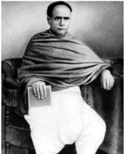

முற்போக்ககானவை என வாதிட்டடார். விதவைகளை எரிப்பதும் விதவை மறுமணத்ததைத் தடைசெய்வதும் ஏற்றுக் கொள்ளப்படவில்லலை என்பதற்கு மறை நூல்களிலிருந்ததே சான்றுகளை முன்வவைத்ததார். அவர் தனது கருத்துக்களுக்கு ஆதரவான வாதங்களைக் கொண்ட சிறுநூல்களை வெளியிட்டடார். அவர் நவீன வங்ககாள உரைநடையின் முன்னோடியாவார். பெண்கல்வியை மேம்படுத்துவதில் முக்கியப்பங்ககாற்றிய அவர் பெண்களுக்ககானபள்ளிகள் நிறுவப்பட உதவிகள் செய்ததார். இந்து சமூகத்தில் குழந்ததைப் பருவத்திலேயே விதவைகளான சிறுமிகளின் வாழ்வவை மேம்படுத்துவதற்ககாகவே தனது முழுவாழ்வவையும் அர்ப்பணித்ததார். பண்டித ஈஸ்வர் ச ந்திர வித்யயாசாகர் தலைமையேற்ற இயக்கத்தின் விளைவாய் 1856இல் மறுமண சீர்திருத்தச் சட்டம் (விதவைகள் மறுமணச் சட்டம்) இயற்றப்பட்டது.

1860இல் முதன்முைறயாக திருமண வயதுச் சட்டம் இயற்றப்பட்டது. அப்பபெருமை ஈஸ்வர் சந்திர வித்யயாசாகரையேச் சாரும். திருமணத்திற்ககான வயது பத்து என்று நிர்ணயம் செய்யப்பட்டது. அது 1891இல் பன்னிரெண்டடாகவும், 1925இல் பதிமூன்றறாகவும் உயர்த்தப்பட்டது. ஆனால் கவலைக்குரிய விதத்தில் திருமண வய து ஒப்புதல் கமிட்டி (1929) கூறியபடி இச்சட்டம் காகிதத்தில் மட்டுமேயிருந்தது. நீதிபதிகளும், வழக்கறிஞர்களும் ஒருசில படித்த மனிதர்களுமே அதனைப்பற்றிய அறிவைப் பெற்றிருந்தனர்.

19ஆம் நூற்றறாண்டில் சமூக, சமய சீர்திருத்த இயக்கங்கள்

இச்சட்டம் குழந்ததை விதவைகளின் நிலையை மேம்படுத்துவதையும் நிரந்தரமாக விதவையாய் இருக்கவேண்டிய ஆபத்திலிருந்து அவர்களைக் க ப்பபாற்றுவதையும் நோக்கமாகக் கொண்டிருந்தது.

**(உ) பிரார்த்தனை சமாஜம்**

மகாராஷ்டிரா பகுதியானது சீர்திருத்த நடவடிக்ககைகளுக்கு ஆதரவு கிடைக்கப்பபெற்ற மற்றொரு பகுதியாகும். பிரம்ம சமாஜத்துக்கிணையாக ப ம்பபாயில் 1867இல் நிறுவப்பட்ட அமைப்பபே பிரார்த்தனை சமாஜம். இதனை நிறுவியவர் ஆத்மராம் பாண்டுரங் (1825-1898) ஆவார். இந்த சம ஜத்தின் இரண்டு மேன்மமைமிக்க உறுப்பினர்கள் R.C. பண்டர்கர், நீதிபதி மகாதேவ் கோவிந்த் ரானடே ஆகிய இருவருமாவர். இவ்விருவரும் சாதிமறுப்பு, சமப ந்தி, சாதிமறுப்புத் திருமணம், விதவை ம றுமணம், பெண்கள் மற்றும் ஒடுக்கப்பட்ட மக்களின் முன்னனேற்றம் போன்ற நடவடிக்ககைகளுக்ககாகத் தங்களை அர்ப்பணித்துக் கொண்டவர்களாவர். மகாதேவ் கோவிந்த் ரானடே (1842-1901) விதவை ம றுமணச் சங்கம் (1861), புனே சர்வஜனிக் சபா (1870), தக்ககாணக் கல்விக்கழகம் (1884) ஆகிய அமைப்புகளை நிறுவினார்.

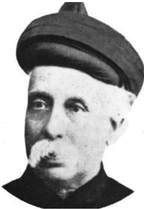

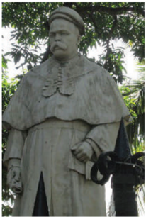

*M.G. ரானடே*

### 5.2 இந்து புத்ததெழுச்சி இயக்கம்

**(அ) சுவாமி தயானந்த சரஸ்வதி மற்றும்**

**ஆரியசமாஜம், 1875**

ப ஞ்சசாபில், ஆரியசமாஜம் சீர்திருத்த இயக்கங்களுக்குத் தலைமையேற்றது. இது 1875இல் நிறுவப்பட்டது, இவ்வமைப்பபை நிறுவியவர் மேலைகங்ககைச்சமவெளியில் அலைந்துதிரிந்து கொண்டிருந்த சுவாமி தயானந்த சரஸ்வதி

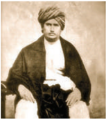

(1824-83) ஆவார். சுவாமி தயானந்தர் பின்னர் தனது கருத்துகளைப் போதிப்பதற்ககாகப் பஞ்சசாபில் தங்கினார். அவருடைய நூலான 'சத்யயார்த்தபிரகாஷ்'

பெரும்பபாலோரால் படிக்கப்பட்டது. குழந்ததைத் திருமணம், விதவை மறுமணத்திற்கு மறுப்பு போன்ற பழக்கங்களும் அயல் நாட்டிற்கு சென்றறால் தீட்டு என்று சொல்லப்படுதலும் மறைநூல்களால் ஏற்றுக்கொள்ளப்படவில்லலை என அறிவித்ததார். அவர் முன்வவைத்த நேர்மறையான கொள்ககைகள் க ட்டுப்பபாடான ஒருகடவுள் வழிபாடு, உருவ வழிபாட்டடை நிராகரித்தல், பிராமணர் மேலாதிக்கம் செலுத்தும் சடங்குகள், சமூக நடைமுறைகள் ஆகியவற்றறைமறுத்தல் என்பனவாகும். ஆரியசமாஜம் இந்துமதத்திலிருந்த மூடநம்பிக்ககைகளை ம றுத்தது. அதனுடைய முழக்கம் 'வேதங்களுக்குத் திரும்புவோம்' என்பதாகும்.

ஆரியசமாஜம் பிரிட்டிஷ் இந்தியாவில் நடைபெற்றுக் கொண்டிருந்த மதமாற்ற நடவடிக்ககைகளை நிறுத்துவதற்ககான முயற்சிகளை மேற்கொண்டது. அதன் முக்கியக் குறிக்கோள் 'எதிர்மத ம ற்றம் என்பதாகும்.' ஏற்கனவே இஸ்லலாமுக்கும் கிறித்தவ மதத்திற்கும் மாறிய இந்துக்களை மீண்டும் இந்துக்களாகமாற்ற 'சுத்தி (Suddhi)' எனும் சுத்திகரிப்புச் சட ங்ககை சமாஜம் வகுத்துக்கொடுத்தது.

ஆரியசமாஜம் சமூக சீர்திருத்தக்களத்திலும் க ல்வியைப்பரப்பும் பணியிலும் முக்கிய சாதனைகள் புரிந்தது. சமாஜம் பல தயானந்ததா ஆங்கில-வேதப் ப ள்ளிகளையும் கல்லூரிகளையும் உருவாக்கியது.

**(ஆ) இராமகிருஷ்ண பரமஹம்சர்**

க ல்கத்ததாவுக்கு அருகேயிருந்த தட்சிணேசுவரம் என்னும் ஊரைச்சசார்ந்த எளிய அர்ச்சகரான இராமகிருஷ்ண பரமஹம்சர் (1836-1886) பஜனைப்பபாடல்களை மனமுருகிப் பாடுவதைப்போன்ற வழிமுறைகள் மூலம் பேரின்ப நிலையை அடைந்து அந்நிலையில் ஆன்மரீதியாக கடவுளோடு ஒன்றிணைவதற்கு முக்கியத்துவம் கொடுத்ததார். புனிதத்ததாயான கடவுள் க ளியின் தீவிர பக்தரான அவர் அக்கடவுளின் திருவிளையாடல்கள் முடிவற்றவை என அறிவித்ததார். அவருடைய கருத்தின்படி அனைத்து மதங்களும் உலகளாவிய, எல்லோருக்குமான மூலக்கூறுகளைக் கொண்டுள்ளன. அவற்றறைப் பின்பற்றினால் அவை வீடுபேற்றுக்கு இட்டுச்சசெல்லும். 'ஜீவன்' என்பதே

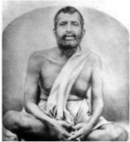

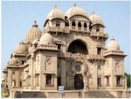

'சிவன்' எனவும் அவர் கூறினார் (வாழ்கின்ற அனைத்து உயிர்களும் இறைவனே). மனிதர்களுக்குச் செய்யப்படும் சேவையே கடவுளுக்குச் செய்யப்படும் சேவையாகும் என்றறார்.

**இராமகிருஷ்ணணா மிஷன்**

இராமகிருஷ்ணருடைய முதன்மமையான சாதனையே, பிரம்மசமாஜம் போன்ற சீர்திருத்த அமைப்புகள் முன்வவைத்தப் பகுத்தறிவுக் க ருத்துகளின்பபால் அதிருப்தியுற்ற கல்வியறிவு பெற்ற இளைஞர்களைத் தன்பபால் ஈர்த்ததுதான். 1886இல் அவர் இயற்ககை எய்திய பின்னர் அவருடைய சீடர்கள் தங்களை ஒரு மதம்சசார்ந்த சமூகமாக அமைத்துக்கொண்டு இராமகிருஷ்ணரையும் அவரின் போதனைகளையும் இந்தியாவிலும் உலகின் ஏனைய பகுதிகளிலும் பரப்பும் பெரும்பணியை மேற்கொண்டனர். இப்பபெரும்பணியின் பின்புலமாய் இருந்தவர் சுவாமி விவேகானந்தர். கிறித்தவசமயப் ப ரப்பு நிறுவனங்களின் நிருவாகக் கட்டமைப்பபைப் பின்பற்றி விவேகானந்தர் இராமகிருஷ்ணணா மிஷனை நிறுவினார். இராமகிருஷ்ணணா மிஷன் சமய ச் செயல்பபாடுகளோடு மட்டும் தனதுப் பணிகளை நிறுத்திக்கொள்ளவில்லலை . ம க்களுக்குக் கல்வியறிவு வழங்குவது, மருத்துவ உதவி, இயற்ககைச் சீற்றங்களின்போது நிவாரணப்பணிகளை மேற்கொள்வது போன்ற சமூகப்பணிகளிலும் செயலூக்கத்துடன் ஈடுபட்டது.

**(இ) சுவாமி விவேகானந்தர்**

பின்னனாளில் சுவாமி விவேகானந்தர் என்றழைக்கப்பட்ட நரேந்திரநாத் தத்ததா (1863-1902) இராமகிருஷ்ண பரமஹம்சருடைய முதன்மமைச்சீடராவார். படித்த இளைஞரான அவர் இராமகிருஷ்ணரின் கருத்துகளால் கவரப்பட்டடார். மரபுசார்ந்த தத்துவ நிலைப்பபாடுகளில் மனநிறைவு பெறாத அவர், நடைமுறை வேதாந்தமான மனிதகுலத்திற்குத் தொண்டுசெய்தல் எனும்

கோட்பபாட்டடைப் பரிந்துரைத்ததார். மதத்தோடு தொடர்புடையது எனும் ஒரே காரணத்திற்ககாக அனைத்து நிறுவனங்களையும் ப துகாக்கும் மனப்பபாங்கினை அவர் கண்டனம் செய்ததார். ப ண்பபாட்டுத் தேசியத்திற்கு முக்கியத்துவம் கொடுத்த அவர் இந்து சமூகத்திற்குப் புத்துயிரளிக்க இந்திய இளைஞர்களுக்கு அறைகூவல்

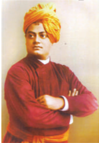

விடுத்ததார். அவருடைய சிந்தனைகள், பொருள் உற்பத்தியில் மேலைநாடுகள் செய்திருந்த சாதனைகளைக் கண்டு தாழ்வுமனப்பபான்மமை கொண்டிருந்த இந்தியர்களுக்கு தன்னம்பிக்ககை

19ஆம் நூற்றறாண்டில் சமூக, சமய சீர்திருத்த இயக்கங்கள்

ஊட்டுவதாய் அமைந்தது. 1893இல் சிக்ககாகோவில் நடைபெற்ற உலக சமய மாநாட்டில் இந்து சமயம் ப ற்றியும் பக்திமார்க்கத் தத்துவம் குறித்தும் அவராற்றிய சொற்பொழிவுகள் அவருக்குப் பெரும்புகழ் சேர்த்தது. இந்து சமயச்சடங்குகளில் க லந்துகொள்ளக்கூடாதென ஒடுக்கப்பட்ட மக்களும் அதுபோன்ற சடங்குகளில் கலந்துகொள்ளக் க ட்டடாயம் அனுமதிக்கப்படவேண்டும் என்றறார். விவேகானந்தரின் செயலாக்கமிக்க கருத்துகள் மேற்கத்தியக் கல்வி பயின்ற வங்ககாள இளைஞர்களிடையே அரசியல் மாற்றங்களுக்ககான நாட்டத்ததை ஏற்படுத்தியது. வங்கப்பிரிவினையைத் தொடர்ந்து நடைபெற்ற சுதேசி இயக்கத்தின் போது இளைஞர்களில் பலர் விவேகானந்தரால் ஊக்கம் பெற்றனர்.

**(ஈ) பிரம்மஞான சபை**

மேடம் H.P. பிளாவட்ஸ்கி (1831-1891) மற்றும் க ர்னல் H.S. ஆல்ககாட் (1832-1907) ஆகியோரால் பிரம்மஞானசபை 1875இல் அமெரிக்ககாவில் நிறுவப்பட்டது. இவ்வமைப்புப் பின்னர் 1886இல் இந்தியாவில் சென்னனையில் உள்ள அடையாறுக்கு ம ற்றப்பட்டது.

பிரம்மஞானசபை இந்து செவ்வியல் நூல்களைக் குறிப்பபாக உபநிடதங்கள், பகவத்கீதை ஆகியவற்றறைப் படிப்பதற்கு உற்சசாகமூட்டியது. இந்தியாவில் பௌத்தம் புத்துயிர் பெறுவதில் பிரம்மஞானசபை முக்கியப் பங்ககாற்றியது. இந்து மறைநூல்களின் மீது மேலைநாட்டவர் காட்டிய ஆர்வம், படித்த இந்தியர்களிடையே தங்கள் ப ரம்பரியம், பண்பபாடு குறித்த அளப்பரியப் பெருமிதத்ததை ஏற்படுத்தியது.

**அன்னிபெசன்ட்டின் பங்களிப்பு**

ஆல்ககாட்டின் மறைவுக்குப் பின்னர் இவ்வமைப்பின் தலைவராக அன்னிபெசன்ட் (1847-1933) தேர்ந்ததெடுக்கப்பட்டதைத் தொடர்ந்து இவ்வியக்கம் மேலும் செல்வவாக்குப் பெற்றது. இந்திய தேசிய அரசியலில் முக்கியத்துவம் பெற்ற அவர் தன்னனாட்சி இயக்கச் சங்கத்ததை அமைத்து

அயர்லலாந்திற்கு வழங்கப்பட்டதைப் போல இந்தியாவிற்கும் தன்னனாட்சி வழங்கப்பட வேண்டுமென்று கோரிக்ககை வைத்ததார். அன்னிபெசன்ட் பிரம்மஞானக் கருத்துக்களைத் தன்னுடைய நியூ இந்தியா (New India), காமன்வீல் (Commonweal) எனும் செய்தித்ததாள்களின் மூலம் ப ரப்பினார்.

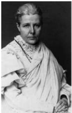

19ஆம் நூற்றறாண்டில் சமூக, சமய சீர்திருத்த இயக்கங்கள்

### 5.3 சாதி எதிர்ப்பு இயக்கங்கள்

**(அ) ஜோதிபா புலே**

ஜோதிபா கோவிந்தராவ் புலே 1827இல் மக ராஷ்டிராவில் பிறந்ததார். அவர் 1852ஆம் ஆண்டு ஒடுக்கப்பட்டோருக்ககான முதல் பள்ளியை புனேயில் திறந்ததார். சத்தியசோதக் சமாஜ் (உண்மமையை நாடுவோர் சங்கம், Truth Seekers Society) எனும் அமைப்பபை, பிராமணரல்லலாத ம க்களும் சுயமரியாதையோடும், குறிக்கோளோடும் வாழத் தூண்டுவதற்ககாய் நிறுவினார். புலே குழந்ததைத் திருமணத்ததை எதிர்த்ததார். விதவை ம றுமணத்ததை ஆதரித்ததார். ஜோதிபாவும் அவருடைய மனைவி சாவித்திரிபாயும் ஒடுக்கப்பட்ட ம க்களின், பெண்களின் முன்னனேற்றத்திற்ககாகத் தங்கள் வாழ்க்ககையை அர்ப்பணித்தனர். ஜோதிபா பெற்றோரில்லலா குழந்ததைகளுக்ககென்று விடுதிகளையும் விதவைகளுக்ககென க ப்பகங்களையும் உருவாக்கினார். அவர் எழுதிய நூலான 'குலாம்கிரி' (அடிமைத்தனம்) அவருடையப் பெரும்பபாலான தீவிரக்கருத்துக்களைச் சுருக்கிக் கூறுகிறது.

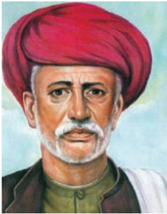

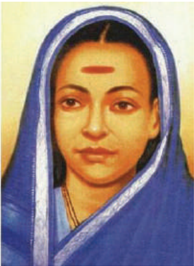

*சாவித்திரிபா புலே*

**(ஆ) நாராயண குரு**

கேரளாவில் ஏழைப்பபெற்றோர்க்கு மகனாகப் பிறந்த நாராயண குரு (1854-1928) மலையாளம், சமஸ்கிருதம், தமிழ் ஆகியமொழிகளில் அறிஞராகவும் கவிஞராகவும் திகழ்ந்ததார். பயங்கரமான சாதிக் கொடுமைகளையும், ஒடுக்கப்பட்ட மக்கள்படும் துயரங்களையும் கண்டு மனம்வவெதும்பிய அவர் அம்மக்களின் மேம்பபாட்டிற்ககாகத் தனது வாழ்க்ககை

முழுவதையும் அர்ப்பணித்ததார். அவர்களின் மேம்பபாட்டிற்குப் பணியாற்றுவதற்ககாக ஸ்ரீ நாராயண தர்ம பரிபாலன யோகம் எனும் அமைப்பபை உருவாக்கினார். அருவிபுரம் எனும் ஊரில் ஒரு பெரிய கோவிலைக்கட்டிய அவர் அதை அனைவருக்கும்

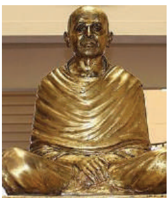

அர்ப்பணித்ததார். குமாரன் ஆசான், டாக்டர் பால்பு போன்ற சிந்தனையாளர்களும் எழுத்ததாளார்களும் இவருடைய சிந்தனைகளால் தூண்டப்பபெற்று இயக்கத்ததை முன்னனெடுத்துச் சென்றனர்.

**(இ) அய்யன்ககாளி**

அய்யன்ககாளி 1863இல் திருவனந்தபுரத்தில் உள்ள வெங்கனூரில் பிறந்ததார். அப்போது அப்பகுதி திருவிதாங்கூர் அரசரின் ஆட்சிப்பகுதியாகும். குழந்ததையாய் இருக்கும்போதே அவர் சந்தித்த

சாதியப்பபாகுபாடு அவரை ச தி எதிர்ப்பியக்கத்தின் தலைவராக மாற்றியது. பின்னர் அவர் பொது இடங்களுக்குச் செல்லுதல், ப ள்ளிகளில் கல்வி கற்க இடம்பபெறுதல் போன்ற அடிப்படை உரிமைகளுக்ககாகப் போராடினார்.

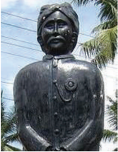

ஸ்ரீநாராயணகுருவால் ஊக்கம்பபெற்ற அய்யன்ககாளி 1907இல் சாது ஜன பரிபாலன சங்கம் (ஏழை மக்கள் பாதுகாப்புச் சங்கம் - Association for the Protection of the Poor) எனும் அமைப்பபை நிறுவினார்.

### 5.4 இஸ்லலாமிய சீர்திருத்தங்கள்

1857ஆம் ஆண்டுப் பெரும்புரட்சி ஒடுக்கப்பட்ட பின்னர் இந்திய முஸ்லீம்கள் மேற்கத்தியப் ப ண்பபாட்டடைச் சந்ததேகக் கண்கொண்டு பார்த்தனர். மேற்கத்தியக் கல்வி, பண்பபாடு, மேற்கத்திய சிந்தனைகள் ஆகியவை தங்கள் மதத்திற்கு ஆபத்ததாய் அமையுமோ என அச்சமூகம் அஞ்சியது. ஆகையால் முஸ்லீம்களில் ஒரு சிறிய பிரிவினரே மேற்கத்தியக் க ல்விபயில முன்வந்தனர்.

**சர் சையத் அகமத்ககான்**

டெல்லியில் உயர்குடி

முஸ்லீம்

குடும்பத்தில்

பிறந்த

சையத் அகமத்ககான்

ப

டிப்பறிவின்மமையே குறிப்பபாக

நவீன

கல்வியறிவின்மமையே

இஸ்லலாமியர்களுக்குப்

பெருந்தீங்கு

விளைவித்து, அவர்களைக்

கீழ்நிலையில்

வைத்துவிட்டது

எனக்கருதினார்.

மேலைநாட்டு

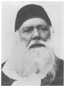

அறிவியலையும், அரசுப்பணிகளையும் ஏற்றுக்கொள்ளும்படி அவர் இஸ்லலாமியர்களை வற்புறுத்தினார். அறிவியல்கழகமொன்றறை நிறுவிய அவர் ஆங்கிலநூல்களைக் குறிப்பபாக அறிவியல் நூல்களை உருதுமொழியில் மொழியாக்கம் செய்ததார். மேலெழுந்துவரும் தேசியஇயக்கத்தில்

இணைவதைக் காட்டிலும் ஆங்கில அரசுடன் நல்லுறவு மேற்கொண்டடால் இஸ்லலாமியர் நலன்கள் பேணப்படும் என அவர் நம்பினார். எனவே , அவர் இஸ்லலாமியருக்கு ஆங்கிலக்கல்வியைப் ப யிலும்படியும் அதில் கவனம் செலுத்தும்படியும் அறிவுரை கூறினார்.

**அலிகார் இயக்கம்**

ச ர் சையத் அகமத்ககான் 1875ஆம் ஆண்டு அலிகார் நகரில் அலிகார் முகமதிய ஆங்கிலோ-ஓரியண்டல் க ல்லூரியை (Aligarh Mohammedan Anglo-Oriental College) நிறுவினார். 'அலிகார் இயக்கம்' எனப்பட்ட அவரது இயக்கம் இக்கல்லூரியை மையப்படுத்தி நடைபெற்றதால் அப்பபெயரைப் பெற்றது. இந்திய முஸ்லீம்களின் கல்விவரலாற்றில் இக்கல்லூரி ஒரு மைல் கல்லலாகும். 1920இல் இக்கல்லூரி தரம் உயர்த்தப்பட்டு பல்கலைக்கழகமானது.

**தியோபந்த் இயக்கம்**

ஒரு மீட்பியக்கமாகும். இவ்வியக்கம் பழமைவாத முஸ்லீம் உலேமாக்களால், தொடங்கப்பபெற்றது. இவ்வுலேமாக்கள் முகமது குவாசிம் நானோதவி (1832-1880), ரஷித் அகமத் கங்கோத்ரி (18261905) ஆகியோரின் தலைமையில் 1866இல் உத்தரப்பிரதேசத்தில் சகரன்பூரில் ஒரு பள்ளியை நிறுவினர். இப்பள்ளியின் பாடத்திட்டம் ஆங்கிலக்கல்வியையும் மேலைநாட்டுப் ப ண்பபாட்டடையும் புறக்கணித்தது. இப்பள்ளியில் உண்மமையான இஸ்லலாமியமதம் கற்றுத்தரப்பட்டது. இதன் நோக்கம் இஸ்லலாமிய சமூகத்தின் ஒழுக்கத்ததையும் மதத்ததையும் மீட்டடெடுப்பதாய் அமைந்தது.

மௌலானா முகமத்-உல்-ஹசன் தியோபந்தின் புதிய தலைவரானார். அவரின் தலைமையில் இயங்கிய ஜமைத்-உல்-உலேமா (இறையியலாளர்களின் அவை) ஹசனுடைய க ருத்துக்களான, இந்திய ஒற்றுமை எனும் ஒட்டுமொத்தச் சூழலில் முஸ்லீம்களின் அரசியல், சமய உரிமைகளின் பாதுகாப்பு என்பது குறித்த உறுதியான வடிவத்ததை முன்வவைத்தது.

### 5.5 பார்சி சீர்திருத்த இயக்கம்

பத்தொன்பதாம் நூற்றறாண்டின் இடைப்பகுதியில் ப ர்சி சீர்திருத்த இயக்கம் பம்பபாயில் தொடங்கப்பட்டது. 1851இல் பர்துன்ஜி நௌரோஜி என்பபார் "ரஹ்னுமாய் ம ஜ்தயாஸ்னன் சபா" (பார்சிகளின் சீர்திருத்தச் ச ங்கம்) எனும் அமைப்பபை ஏற்படுத்தினார். ராஸ்ட் கோப்ததார் (உண்மமை விளம்பி) என்பதே அதன் தாரகமந்திரமாக இருந்தது. பெர்ரம்ஜி மல்பபாரி என்பபார் குழந்ததைத் திருமணப் பழக்கத்திற்கு எதிரான சட்டம்

19ஆம் நூற்றறாண்டில் சமூக, சமய சீர்திருத்த இயக்கங்கள்

இயற்றப்பட வேண்டுமென இயக்கம் நடத்தினார். இச்சமூகம் பெரோசா மேத்ததா, தீன்சசா வாச்சசா போன்ற சிறந்த தலைவர்களை உருவாக்கியது. அவர்கள் தொடக்ககால காங்கிரசில் முக்கியப் ப ங்குபணியாற்றினர்.

5.6

**சீக்கியர் சீர்திருத்த இயக்கம் (நிரங்ககாரிகள், நாம்ததாரிகள்)**

ப ஞ்சசாப் சீக்கியச் சமூகத்திலும் சீர்திருத்த முயற்சிகள் மேற்கொள்ளப்பட்டன. நிரங்ககாரி இயக்கத்தின் நிறுவனரான பாபா தயாள்ததாஸ் நிரங்ககாரி (உருவமற்ற) இறைவனை வழிபட வேண்டுமென வலியுறுத்தினார். சிலைவழிபாடு, சிலைவழிபாட்டோடு தொடர்புடைய சடங்குகள் ஆகியவற்றறை மறுத்தல், குருநானக்கின் தலைமையையும் ஆதிகிரந்தத்ததையும் மதித்தல் ஆகியன அவருடைய போதனைகளின் சாரமாக விளங்கின . ம து அருந்துவதையும், மாமிசம் உண்பதையும் கைவிடும்படி வலியுறுத்திக் கூறினார்.

பாப ராம் சிங் என்பவரால் தொடங்கப் பெற்ற நாம்ததாரி இயக்கம் சீக்கியரிடையே நடைபெற்ற மற்றுமொரு சமூக , சமய ச் சீர்திருத்த இயக்கமாகும். நாம்ததாரி இயக்கம் சீக்கியர்களின் அடையாளங்களை (கிர்பபான் - வாளைத் தவிர) அணிய வற்புறுத்தியது. வாளுக்குப் பதிலாகத் தன் சீடர்களை லத்தியை வைத்துக் கொள்ளும்படி ராம்சிங் கூறினார். இவ்வியக்கம் ஆணும் பெண்ணும் சம ம் எனக் கருதியது. விதவை மறுமணத்ததை ஆதரித்தது. வரதட்சணை முறையையும் குழந்ததைத் திருமணத்ததையும் தடைசெய்தது.

ஆரியசமாஜம், கிறித்தவ சமயப்பரப்பு நிறுவனங்கள் ஆகியவற்றின் செல்வவாக்கு வளர்ந்து கொண்டிருந்த ஒரு சூழலில் சிங்சபா எனும் அமைப்பு அமிர்தசரசில் நிறுவப்பட்டது. சீக்கியமதத்தின் புனிதத்ததை மீட்டடெடுப்பதே சபாவின் முக்கியக் குறிக்கோளாக அமைந்தது. ஆங்கிலேயரின் ஆதரவுடன் அமிர்தரஸில் சீக்கியர்களுக்ககென க ல்சசா கல்லூரி உருவாக்கப்பட்டது. சிங்சபாவே அகாலி இயக்கத்தின் முன்னோடி அமைப்பபாகும்.

5.7

**தமிழ்நநாட்டின் சமூக சீர்திருத்தவாதிகள்**

**(அ) இராமலிங்க சுவாமிகள்**

வள்ளலார் எனப் பிரபலமாக அறியப்பட்ட, இராமலிங்க சுவாமிகள் அல்லது இராமலிங்க அடிகள் (1823 - 1874) சிதம்பரத்திற்கு

19ஆம் நூற்றறாண்டில் சமூக, சமய சீர்திருத்த இயக்கங்கள்

அருகேயுள்ள மருதூர் எனும் கிராமத்தில் பிறந்ததார். தந்ததையாரின் மறைவுக்குப்பின்னர் அவரது குடும்பம் சென்னனையிலிருந்த அவருடைய சகோதரரின் இல்லத்திற்குக் குடிபெயர்ந்தது. முறையான கல்வியை அவர் பெற்றிராவிட்டடாலும் அளப்பரியப் புலமையைப் பெற்றிருந்ததார். உயிர்களிடையே நம்பிக்ககை, இரக்கம் எனும் பிணைப்புகள் இருக்கவேண்டுமென்றறார். "துயரப்படும் உயிரினங்களைப் பார்த்து இரக்கம் கொள்ளளாதவர்கள் கல் நெஞ்சக்ககாரர்கள், அவர்களின் ஞானம் மேகங்களால் மூடப்பட்டிருக்கும்" எனும் க ருத்தினை முன்வவைத்ததார். அவர் தன்னுடைய அன்பபையும் இரக்கத்ததையும் செடிகொடிகள் உட்பட அனைத்து உயிரினங்களிடமும் காட்டினார். இதை அவர் ஜீவகாருண்யம் என்றறார். 1865இல் சமரச வேத ச ன்மமார்க்க சங்கம் எனும் அமைப்பபை நிறுவினார். பின்னர் அது சமரசசுத்த சன்மமார்க்க சத்ய சங்கம் எனப் பெயர் மாற்றம் செய்யப்பட்டது. 1866இல் தென்னிந்தியாவில் ஏற்பட்ட கொடிய பஞ்சத்ததைக் க ணக்கில் கொண்டு 1867இல் சாதி எல்லலைகளைத் தாண்டி அனைத்து மக்களுக்குமான இலவச உணவகத்ததை வடலூரில் நிறுவினார். அவர் இயற்றிய ஏராளமான பாடல்கள் திருவருட்பபா என்ற தலைப்பில் தொகுக்கப்பட்டன .

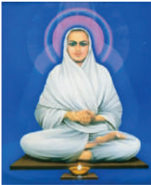

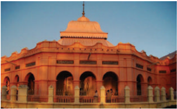

நாட்டில் நிலவிய பசிக்கும் வறுமைக்கும் இராமலிங்கர் சாட்சியாய் இருந்ததார். "பசியினால் இளைத்துப்போன, மிகவும் சோர்வுற்ற ஏழைமக்கள் ஒவ்வொரு வீட்டிற்கும் செல்லுவதை நான் பார்த்ததேன். இருந்தும் அவர்களின் பசி போக்கப்படவில்லலை என் இதயம் கடுமையாக வேதனைப்படுகிறது. கடுமையான நோயினால் வேதனைப்படுபவர்களை எனக்கு முன்பபாகப் ப ர்க்கிறேன். எனது இதயம் நடுங்குகிறது. ஏழைகளாகவும் இணையில்லலா நன்மதிப்பபையும் க ளைப்படைந்த இதயத்ததையும் கொண்டுள்ள அம்மக்களை நான் பார்க்கிறேன், நான் பலவீனம் அடைகிறேன்."

**ஆ) அயோத்தி தாசர்**

ப ண்டிதர் அயோத்தி தாசர் (1845-1914) ஒரு தீவிரத் தமிழ்அறிஞரும் சித்தமருத்துவரும்

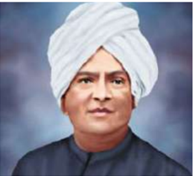

ப த்திரிக்ககையாளரும் சமூக அரசியல் செயல்பபாட்டடாளரும் ஆவார். சென்னனையில் பிறந்த அவர் தமிழ், ஆங்கிலம், சமஸ்கிருதம், பாலி ஆகிய மொழிகளில் புலமை பெற்றவர். சரளமாகப் பேசக் கூடியவர். சமூகநீதிக்ககாக இயக்கம் நடத்திய அவர், சாதியத்தின் கொடிய பிடியிலிருந்து அI அIyothithassar யோத்தி தாசர்

ஒடுக்கப்பட்டோர் விடுதலைபெறப் பாடுபட்டடார். சாதிகளற்ற அடையாளத்ததை நிறுவமுயன்ற அவர் சாதிய மேலாதிக்கத்திற்கும் தீண்டடாமைக்கும் எதிராகக் கண்டனக்குரல் எழுப்பினார். கல்வியை வலிமை பெறுவதற்ககான கருவியாகக் கருதிய அவர் தமிழகத்தில் ஒடுக்கப்பட்டோருக்ககென பல பள்ளிகள் உருவாக்கப்படுவதற்கு உந்துசக்தியாகத் திகழ்ந்ததார்.

ஒடுக்கப்பட்டோரின் கோவில்நுழைவுக்கு ஆதரவாகக் குரல் எழுப்புவதற்ககாகப் பண்டிதர்

**பாட ச்சுருக்கம்**

அயோத்திதாசர் அத்வவைதானந்ததா சபா எனும் அமைப்பபை நிறுவினார். 1882இல் அயோத்தி தாசரும் ஜான் ரத்தினம் என்பவரும் "திராவிடர்க் கழக ம்" எனும் அமைப்பபை நிறுவினர். மேலும் 1885இல் "திராவிட பாண்டியன்" எனும் இதழையும் தொடங்கினார். "திராவிட மகாஜனசபை" என்ற அமைப்பபை 1891இல் நிறுவிய அவர் அவ்வமைப்பின் முதல் மாநாட்டடை நீலகிரியில் நடத்தினார்.

பிரம்மஞான சபையை நிறுவியவர்களில் ஒருவரான கர்னல் H.S. ஆல்ககாட் ஏற்படுத்தியத் தாக்கத்தின் விளைவாக 1898இல் இலங்ககை சென்ற அவர் அங்ககே பௌத்தத்ததைத் தழுவினார். அதே ஆண்டில் பௌத்தமதத்தின் வழியே பகுத்தறிவின் அடிப்படையிலான சமயத்தத்துவத்ததைக் க ட்டமைப்பதற்ககாக "சாக்கிய பௌத்த சங்கம்" எனும் அமைப்பபை சென்னனையில் நிறுவினார்.

1907இல் "ஒரு பைசாத் தமிழன்" என்ற பெயரில் ஒரு வாராந்திரப் பத்திரிக்ககையைத் தொடங்கி அதை 1914இல் அவர் காலமாகும் வரையிலும் தொடர்ந்து வெளியிட்டடார்.

- இராஜா ராம்மோகன் ராயால், பிரம்மசமாஜம் நிறுவப்பபெற்றதும், அவருடைய இறப்பிற்குப் பின்னர் சம ஜத்தின் செயல்பபாடுகளை முன்னனெடுத்துச் செல்வதில் மகரிஷி தேவேந்திரநாத் தாகூரும் கேசவ் ச ந்திர சென்னும் வகித்த பங்கு குறித்தும் விவாதிக்கப்பட்டுள்ளது.
- M.G. ரானடேயின் பங்களிப்பும், அவர் இணைந்து செயல்பட்ட பிரார்த்தனை சமாஜத்தின் பங்களிப்பும் ஆய்வு செய்யப்பட்டுள்ளது.
- சுவாமி தயானந்த சரஸ்வதியின் ஆதரவில், இந்துமதத்ததைச் சீர்திருத்த ஆரிய சமாஜம் மேற்கொண்ட முயற்சிகளும், மதம் மாறியவர்களை மீண்டும் இந்து மதத்திற்குள் கொண்டு வருவதற்கு எடுக்கப்பட்ட நடவடிக்ககைகளும் கோடிட்டுக் காட்டப்பட்டுள்ளன .
- தீவிர சீர்திருத்தவாதியான ஈஸ்வர் சந்திர வித்யயாசாகர் குறித்தும், பெண்களின் மேம்பபாட்டிற்ககான அவரின் முயற்சிகளும் விளக்கப்பட்டுள்ளன .
- இந்துமதத்ததை மாற்றியமைப்பதில் இராமகிருஷ்ண பரமஹம்சர், அவருடைய சீடர் விவேகானந்தர் ஆகியோரின் பங்கு விவரிக்கப்பட்டுள்ளது.
- மகாராஷ்டிராவில் ஜோதிபா புலே ஒடுக்கப்பட்ட, உரிமை மறுக்கப்பட்ட மக்கள் பகுதியினர்க்குச் சமூகநீதியைப் பெற்றுத்தர மேற்கொண்ட பணிகள் மதிப்பீடு செய்யப்பட்டுள்ளன .

**கலைச்சொற்கள்**

| சொல்லப்படும் | Alleged | stated but not proved |
| --- | --- | --- |
| பரவசமான | Ecstatic | in a state of extreme happiness |
| அதிகப் பரிமாணமுள்ள | Voluminous | bulky |
| வலியுறுத்துதல் | Reiterated | repeat a statement for emphasis |
| உருவ வழிபாடு | Idolatry | the practice of worshipping idols |
| சிறு நூல் | Tract | a small booklet |
| திருவெளிப்பபாடு | Revelation | disclosure |
