**அலகு - 10**

**தமிழ்நநாட்டில் சமூக ம ற்றங்கள்**

**க ற்றலின் நோக்கங்கள்**

**கீழ்க்ககாண்பனவற்றோடு அறிமுகமாதல்**

- நவீனத் தமிழ்நநாட்டின் சமூக மாற்றங்கள் குறித்த அறிவினைப் பெறுதல்
- தமிழ்நநாட்டின் பல்வவேறு சமூக சீர்திருத்த இயக்கங்களை அறிதல்
- சமூக சீர்திருத்தவாதிகளின் கருத்துக்களைப் புரிந்து கொள்ளல்

**அறிமுகம்**

பதினெட்டடாம் நூற்றறாண்டின் பிற்பபாதியில் ஐரோப்பியர்கள் இந்தியத் துணைத் கண்டத்தின் மீது தங்கள் அரசியல் அதிகாரத்ததை நிறுவினர். ப த்தொன்பதாம் நூற்றறாண்டின் தொடக்கத்தில் இந்தியாவை இணைப்பதில் அக்கறை செலுத்திய அவர்கள் இந்தியச் சமூகத்ததை மறு ஒழுங்கமைவு செய்தனர். புதிய வருவாய்த் திட்டங்கள் உருவாக்கப்பட்டன. ஆங்கிலேயரின் பயன்பபாட்டுக் கோட்பபாடுகள், கிறித்தவ சமய நெறிகள் ஆகியவற்றின் செல்வவாக்கிற்கு உட்பட்டிருந்த அவர்கள், இந்திய மக்களின் மீது தங்களது பண்பபாட்டு மேலாதிக்கத்ததைத் திணிக்கவும் முயன்றனர்.

இந்நிலை இந்தியர்களிடையே எதிர்விளைவினை ஏற்படுத்தியது. பத்தொன்பதாம் நூற்றறாண்டில், நாட்டின் பல்வவேறு பகுதிகளைச் சேர்ந்த கல்வியறிவு பெற்ற இந்தியர்கள் இந்த அவமானத்ததை உணர்ந்தனர். இதற்குப் பதிலளிக்கும் வகையில் தங்கள் சமூகப் பண்பபாட்டு அடையாளங்களைக் கடந்த காலத்தினுள் தேடினர். இருந்தபோதிலும் காலனிய விவாதங்களில் சில நியாயங்கள் இருப்பதை உணர்ந்த அவர்கள் சீர்திருத்திக் கொள்ளவும் தயாராயினர். இதன் விளைவே நவீன இந்தியாவின் சமய, சமூக சீர்திருத்த இயக்கங்களுக்கு வழிகோலியது. இக்குறிப்பிட்ட வரலாற்று வளர்ச்சி நிகழ்வு "இந்திய மறுமல ர்ச்சி" என அடையாளப்படுத்தப்பட்டது.

மறுமலர்ச்சியானது ஒரு கருத்தியல் பண்பபாட்டு நிகழ்வவாகும். அது நவீனம், பகுத்தறிவு, சமூகத்தின் முற்போக்ககான இயக்கம் ஆகியவற்றுடன் நெருக்கமாகப் பிணைக்கப்பட்டுள்ளது. திறனாய்வுச் சிந்தனை அதன் வேர்களில் உள்ளது. மனிதநேயம் எனும் இச்சித்ததாந்தம், சமூக வாழ்வு மற்றும் அறிவு ஆகிய துறைகளோடு மொழி, இலக்கியம், தத்துவம், இசை, ஓவியம், கட்டடக்கலை போன்ற அனைத்துத் துறைகளிலும் படைப்பபாற்றலைத் தூண்டி எழுப்பியது.

### 10.1 தமிழ் மறுமலர்ச்சி

காலனியத்தின் பண்பபாட்டு ஆதிக்கமும் மனிதநேயத்தின் எழுச்சியும் இந்தியத் துணைக் க ண்டத்தின் சமூகப் – பண்பபாட்டு வாழ்வில் பல மாற்றங்களைக் கொண்டு வந்தது. நவீன தமிழ்நநாடும் அத்தகைய வரலாற்று மாற்றத்ததை அனுபவித்தது. தமிழ் மொழி மற்றும் கலாச்சசாரம் அவர்களின் அடையாள கட்டுமானத்தில் குறிப்பிடத்தக்க பங்ககைக் கொண்டிருந்தன. அச்சு இயந்திரத்தின் அறிமுகமும், திராவிட மொழிகளின் மீது மேற்கொள்ளப்பட்ட மொழியியல் ஆய்வுகளும் மற்றும் பலவும் தமிழ் மறுமலர்ச்சி செயல்பபாடுகளுக்கு அடியுரமாய் விளங்கின. அச்சு இயந்திரத்தின் வருகைக்குப் பின்னர் வந்த தொடக்க ஆண்டுகளில் ச மயம் சார்ந்த நூல்களை வெளியிடும் முயற்சிகளே பெருமளவில் மேற்கொள்ளப்பட்டன . நாளடைவில் படிப்படியாக நிலைமைகள் மாறின . ச மயச்சசார்பற்ற

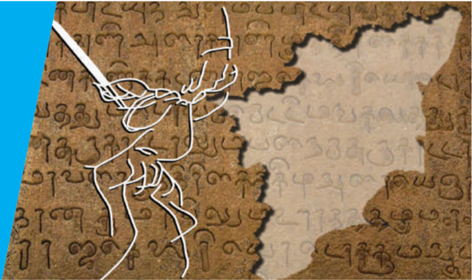

எனச் சொல்லத்தகுந்த நூல்களும் வெளியிடுவதற்கு எடுத்துக் கொள்ளப்பட்டன .

**அச்சுத் தொழில்நுட்பத்தின் வருகை**

ஐரோப்பிய மொழிகள், தவிர்த்து அச்சில் ஏறிய மொழிகளில் முதல் மொழி தமிழ் மொழியாகும். மிக முன்னதாக 1578இல் தம்பிரான் வண க்கம் எனும் தமிழ் புத்தகம் கோவாவில் வெளியிடப்பட்டது. 1709இல் முழுமையான அச்சகம் சீகன்பபால்கு என்பவரால்

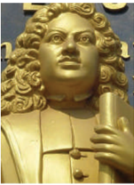

தரங்கம்பாடியில் நிறுவப்பட்டது. தொடக்ககால தமிழ் இலக்கிய நூல்களில் ஒன்றறான திருக்குறள் 1812இல் வெளியிடப்பட்டது. இதன் விளைவாக இக்ககாலப் பகுதியில் மிகவும் பழமையான செவ்வியல் தமிழ் இலக்கியங்களை வெளியிடுவதில் தமிழ் அறிஞர்களிடையே புத்ததெழுச்சி ஏற்பட்டது.

ப த்தொன்பதாம் நூற்றறாண்டில் தமிழ் அறிஞர்களான சி.வை. தாமோதரனார் (1832-1901), உ.வே . சாமிநாதர் (1855-1942) போன்றவர்கள் தமிழ்ச்சசெவ்வியல் இலக்கியங்களை மீண்டும் க ண்டறிவதற்ககாகத் தங்கள் வாழ்நநாள் முழுவதையும் செலவழித்தனர். சி.வை. தாமோதரனார் பனையோலைகளில் கையால் எழுதப் பெற்றிருந்த பல தமிழ் இலக்கண, இலக்கிய நூல்களைப் பதிப்பித்ததார். அவர் பதிப்பித்த நூல்களில் தொல்ககாப்பியம், வீரசோழியம், இறையனார் அகப்பொருள், இலக்கண விளக்கம், கலித்தொகை மற்றும் சூளாமணி ஆகியவை அடங்கும். தமிழறிஞர் மீனாட்சி சுந்தரனாரின் மாணவரான உ.வே . சாமிநாதர் செவ்வியல் தமிழ் இலக்கிய நூல்களான சீவகசிந்ததாமணி (1887), பத்துப்பபாட்டு (1889), சிலப்பதிகாரம் (1892), புறநானூறு (1894), புறப்பொருள் வெண்பபா மாலை (1895), மணிமேகலை (1898), ஐங்குறுநூறு (1903), பதிற்றுப்பத்து (1904) ஆகியவற்றறை வெளியிடும் முயற்சிகளை மேற்கொண்டடார்.

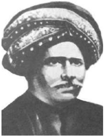

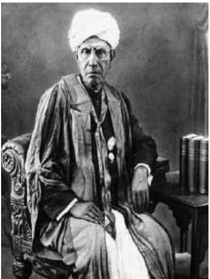

இவ்வவாறு பழம்பபெரும் நூல்கள் வெளியிடப்பட்டது தமிழ் மக்களிடையே தங்கள் வரலாற்று மரபு, மொழி, இலக்கியம் மற்றும் சமயம் ஆகியவை குறித்த விழிப்புணர்வவை ஏற்படுத்தியது. நவீனத் தமிழர்கள் தங்களது சமூகப் பண்பபாட்டு அடையாளங்களை, பண்டடைய தமிழ் செவ்வியல் இலக்கியங்கள் வாயிலாக கண்டறிந்தனர். அவை மொத்தத்தில் சங்க இலக்கியங்கள் என்றழைக்கப்படுகின்றன .

நெருக்கமான ஒப்புமை இருப்பதையும் அப்படியான ஒப்புமை சமஸ்கிருதத்துடன் இல்லலை என்பதையும் நிறுவினார். மேலும், தமிழின் தொன்மமையையும் நிலைநாட்டினார்.

இக்ககாலகட்டத்ததைச் சேர்ந்த அறிவார்ந்த தமிழர்கள் தமிழ் / திராவிட / சமத்துவம் மற்றும் சமஸ்கிருதம் / ஆரியம் / பிராமணியம் ஆகிய இரண்டுக்குமிடையேயுள்ள அடிப்படை வேறுபாடுகளை அடையாளம் கண்டுகொண்டனர்.

மொழியே திராவிடர்களின்

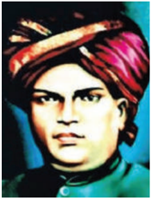

அவர்கள் தமிழ் மொழியென்றும் தமிழர்கள் பிராமணர்கள் அல்லர் என்றும் அவர்களின் சமூக வாழ்வில் சாதிகளில்லலை , பாலின வேறுபாடில்லலை , ச மத்துவம் நிலவியது எனவும் வாதிட்டனர். தமிழ்நநாட்டில் திராவிட உணர்வு தோன்றி வளர்வதற்கு தமிழ் மறுமலர்ச்சி பங்களிப்பபைச் செய்தது.

இச்சிந்தனைகள் பெ . சுந்தரனாரால் (1855-1897) எழுதப்பபெற்ற மனோன்மணீயம் எனும் நாடக நூலில் இடம் பெற்றுள்ள தமிழ்மொழி வாழ்த்துப் பாட லில் மெய்பிக்கப்பட்டுள்ளது.

வள்ளலார் எனப் பிரபலமாக அறியப்பட்ட இராமலிங்க அடிகள் (1823-1874)

தமிழ்நநாட்டில் சமூக மாற்றங்கள்

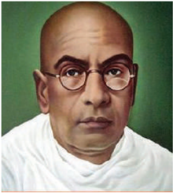

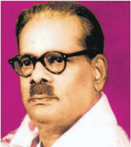

*பாரதிதாசன்*

நடைமுறையிலிருந்த இந்து சமய பழமைவாதத்ததை கேள்விக்குள்ளளாக்கினார். ஆபிரகாம் பண்டிதர் (1859-1919) தமிழ் இசைக்குச் சிறப்புச் செய்ததோடு தமிழ் இசை வரலாறு குறித்து நூல்களையும் வெளியிட்டடார். சி.வை. தாமோதரனார், உ.வே . சாமிநாதர், திரு.வி. கல்யயாண சுந்தரம் (1883-1953), பரிதிமாற் கலைஞர் (18701903), மறைமலையடிகள் (1876-1950), சுப்பிரமணிய பாரதி (1882-1921), ச . வையாபுரி (1891-1956), கவிஞர் பாரதிதாசன் (18911964) ஆகியோர் தங்களுக்ககே உரித்ததான வழிகளில், தங்களின் எழுத்துக்கள் மூலம் தமிழ் இலக்கியத்தின் புத்ததெழுச்சிக்குப் பங்களிப்பு செய்தனர். இதே சமயத்தில், பௌத்தத்திற்குப் புத்துயிரளித்த ஒரு தொடக்ககால முன்னோடியான M. சிங்ககாரவேலர் (1860-1946) காலனிய சக்தியை எதிர்கொள்வதற்ககாக பொதுவுடமைவாதத்ததையும் ச மத்துவத்ததையும் வளர்த்ததார். பண்டிதர் அயோத்திதாசரும் (1845-1914) பெரியார் ஈ.வெ . ராமசாமியும் (1879-1973) சமூகரீதியாக உரிமைகள் மறுக்கப்பட்ட, ஒதுக்கப்பட்ட மக்கள் பிரிவினரின் உரிமைகளுக்ககாகப் பகுத்தறிவுச் சித்ததாந்தத்ததை உயர்த்திப் பிடித்தனர்.

**வி.கோ . சூரிய நாராயண சாஸ்திரி (பரிதிமாற் கலைஞர்)**

வி.கோ . சூரிய நாராயண சாஸ்திரி (18701903) மதுரை அருகே பிறந்ததார். சென்னனை கிறித்தவக் கல்லூரியில் தமிழ்ப் பேராசிரியராகப் பணியாற்றினார். தமிழின் மீது சமஸ்கிருதம்

கொ ண்டிருந் த செல்வவாக்ககை அடையாளம் க ண்ட தொடக்கக் காலத் தமிழ் அறிஞர்களில் ஒருவர். அதனால் தனக்ககே பரிதிமாற் கலைஞர் என தூய தமிழ்ப் பெயரைச் சூடிக் கொண்டவர். தமிழ் மொழி ஒரு செம்மொழி என்றும், எனவே சென்னனைப் பல்கலைக்கழகம் தமிழை

தமிழ்நநாட்டில் சமூக மாற்றங்கள்

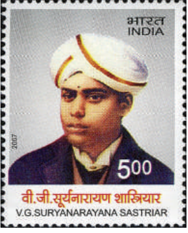

ஒரு வட்டடாரமொழியென அழைக்கக் கூடாதென முதன்முதலாக வாதாடியவர் அவரே . மேற்கத்திய இலக்கிய மாதிரிகள் மீது இவர் கொண்டிருந்த தாக்கத்தின் விளைவாக 14 வரிச்சசெய்யுள் வடிவத்ததை தமிழுக்கு அறிமுகம் செய்ததார். மேலும் இவர் நாவல்களையும் நாடகங்களையும் அதிக எண்ணிக்ககையிலான அறிவியல் கட்டுரைகளையும் எழுதினார். ஆனால் வருந்தத்தக்க முறையில் 33 ஆண்டுகளே நிறைவு பெற்றிருந்த அவர் இளம் வயதில் இயற்ககை எய்தினார்.

**மறைமலை அடிகள்**

(1876-1950) தமிழ் மொழியியல் தூய்மமைவாதத்தின் தந்ததை என்றும் தனித்தமிழ் இயக்கத்ததை (தூய தமிழ் இயக்கம்) உருவாக்கியவர் எனவும் கருதப்படுகின்றறார். ச ங்க இலக்கிய நூல்களான பட்டினப்பபாலை , முல்லலைப்பபாட்டு ஆகியவற்றிற்கு விளக்கவுரை

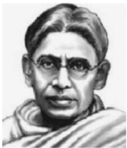

பற்றுக்கொண்டடார். அவருடைய ஆசிரியர்களான செலுத்தியோராவர்.

**தனித்தமிழ் இயக்கம்**

தூய தமிழ் வார்த்ததைகளைப் பயன்படுத்துவதையும் சமஸ்கிருதத்தின் செல்வவாக்கு தமிழ் மொழியிலிருந்து அகற்றப்படுவதையும் மறைமலை அடிகள் ஊக்குவித்ததார். இவ்வியக்கம் தமிழ்ப் பண்பபாட்டின் மீது குறிப்பபாக தமிழ் மொழி, இலக்கியம் ஆகியவை மீது பெரும் தாக்கத்ததை ஏற்படுத்தியது. மறைமலை அடிகளாரின் மகள் நீலாம்பிகை இவ்வியக்கம் உருவாக்கப்பட்டதில் முக்கியப் பங்கு வகித்ததார். வேதாச்சலம் என்ற தனது பெயரை அவர் தூய தமிழில் மறைமலை அடிகள் என மாற்றிக்கொண்டடார். அவருடைய ஞானசாகரம் எனும் பத்திரிக்ககை அறிவுக்கடல் எனப் பெயர் மாற்றம் செய்யப்பட்டது. அவருடைய சமரச சன்மமார்க்க சங்கம் எனும் நிறுவனம் பொது நிலைக் கழகம் என்று பெயரிடப்பட்டது. தமிழ் சொற்களுக்குள் புகுந்துவிட்ட ச மஸ்கிருதச் சொற்களுக்கு இணையான பொருள்தரக்கூடிய தமிழ் சொற்களடங்கிய அகராதி ஒன்றறை நீலாம்பிகை தொகுத்ததார்.

### 10.2 திராவிட இயக்கத்தின் எழுச்சி

திராவிட இயக்கம் பிராமண மேலாதிக்கத்திற்கு எதிராகப் பிராமணர் அல்லலாதவர்களைப் பாதுகாக்கும் இயக்கமாக உதயமானது. 1909இல் பிராமணர் அல்லலாத மாணவர்களுக்கு உதவி செய்வதற்ககாக மதராஸ் பிராமணரல்லலாதோர் சங்கம் என்ற அமைப்பு உருவாக்கப்பட்டது. 1912இல் டாக்டர் சி. நடேசனார்

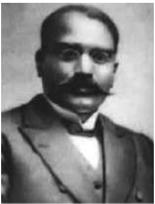

எனும் மருத்துவர் மதராஸ் ஐக்கியக் கழகம் எனும் அமைப்பபை உருவாக்கினார் இது பின்னனாளில் மதராஸ் திராவிடர் சங்கம் என்று மா றியபின் திராவிடர்களின் மேம்பபாட்டிற்ககான உதவிகளைச் செய்தது. பிராமணர் அல்லலாத பட்டதாரிகளுக்கு உதவுவது அவர்களைக் கற்கவைப்பது ஆகியவற்றோடு அவர்களது குறைபாடுகள் டாக்டர் சி. நடேசனார்

குறித்து விவாதிக்க முறையான கூட்டங்களையும் நடத்தியது. இதே சமயத்தில் நடேசனார் தங்கும் விடுதி வசதியில்லலாததால் பிராமணரல்லலாத மாணவர்களின் கல்வி பாதிக்கப்பட்டதால் அதைச் சரிசெய்யும் வகையில் திருவல்லிக்ககேணியில் (சென்னனை) ஜூலை 1916இல் திராவிடர் இல்லம் என்ற பெயரில் ஒரு தங்கும் விடுதியை நிறுவினார். மேலும் பிராமணர் அல்லலாத மாணவர்களின் நலன் க ருதி இவ்வில்லம் ஒரு இலக்கிய அமைப்பபையும் கொண்டிருந்தது.

### 10.3 தென்னிந்திய நல உரிமைச்சங்கம் (நீதிக்கட்சி)

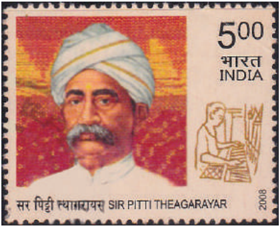

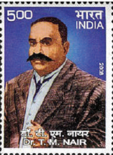

*டி.எம். நாயர்*

1916 நவம்பர் 20இல் டாக்டர் நடேசனார், ச ர் பிட்டி தியாகராயர், டி.எம். நாயர் மற்றும் அலமேலுமங்ககை தாயாரம்மமாள் உட்பட 30 முக்கிய பிராமணர் அல்லலாத தலைவர்கள் தென்னிந்திய நல உரிமைச் சங்கத்ததை (South Indian Liberal Federation) உருவாக்க ஒருங்கிணைந்தனர். இதே ச மயம் 1916 டிசம்பரில், விக்டோரியா பொது அரங்கில் நடைபெற்ற கூட்டமொன்றில் பிராமணரல்லலாதோர்

அறிக்ககை வெளியிடப்பட்டது. இவ்வறிக்ககை பிராமணரல்லலாத சமூகங்களின் கருத்துக்களைத் தெளிவுபடக்கூறியது.

இவ்வமைப்பு தொடங்கி வெளியிட்ட மூன்று செய்தித்ததாள்களாவன; கட்சியின் கொள்ககைகளைப் பரப்புரை செய்வதற்ககாகத் தமிழில் திராவிடன், ஆங்கிலத்தில் ஜஸ்டிஸ், தெலுங்கில் ஆந்திர பிரகாசிகா ஆகிய பத்திரிக்ககைகளை வெளியிட்டது.

மாகாண அரசுகளில் இரட்டடையாட்சி முறையை அறிமுகம் செய்த பின்னர் மாண்டடேகு செம்ஸஸ்பபோர்டு சீர்திருத்தங்களின் அடிப்படையில் 1920இல் முதல் தேர்தல் நடைபெற்றது. நீதிக்கட்சி தேர்தலில் வெற்றிபெற்று இந்தியாவின் முதல் அமைச்சரவையை சென்னனையில் அமைத்தது. A. சுப்பராயலு சென்னனை மாகாணத்தின் முதலமைச்சரானார். மேலும், நீதிக்கட்சி 19201923 மற்றும் 1923-1926 ஆகிய ஆண்டுகளில் அரசமைத்தது. காங்கிரஸ் கட்சி சட்டமன்றத்ததைப் புறக்கணித்த சூழலில் நீதிக்கட்சி 1937இல் தேர்தல் நடைபெறும் வரை ஆட்சியில் தொடர்ந்து நீடித்தது. 1937 தேர்தல்களில், முதன்முதலாகப் பங்ககேற்ற இந்திய தேசிய காங்கிரஸ் நீதிக்கட்சியை படுதோல்வி அடையச் செய்தது.

**திட்டங்களும் செயல்பபாடுகளும்**

நீதிக்கட்சியே நாட்டில் பிராமணர் அல்லலாதவர்களின் மூலாதாரமாய் விளங்கிற்று. நீதிக்கட்சி அரசாங்கம் மக்கள் தொகையில் பெரும்பபாலானவர்களுக்கு கல்வி மற்றும் வேலை வாய்ப்புகளை விரிவுபடுத்தி அரசியல் தளத்தில் அவர்களுக்ககென இடத்ததை உருவாக்கியது.

சா தி மறுப்புத் திருமணங்களைக் க ட்டுப்படுத்திய சட்டச் சிக்கல்களை நீதிக் கட்சியினர் அகற்றியதோடு பொதுக் கிணறுகளையும் நீர் நிலைகளையும் ஒடுக்கப்பட்ட பிரிவு மக்கள் பயன்படுத்துவதை தடுத்த தடைகளைத் தகர்த்தனர். ஒடுக்கப்பட்ட பிரிவு குழந்ததைகள் பொதுப்பள்ளிகளில் சேர்த்துக்கொள்ளப்படவேண்டுமென நீதிக்கட்சியின் அரசு ஆணை பிறப்பித்தது. இச்சமூகக் குழுக்களைச் சேர்ந்த மாணவர்களுக்ககென 1923இல் தங்கும் விடுதிகள் உருவாக்கப்பட்டன. நீதிக்கட்சியின் கீழிருந்த சட்டமன்றம்ததான் முதன் முதலாக

தேர்தல் அரசியலில் பெண்கள் பங்ககேற்பதை 1921இல் அங்கீகரித்தது. இத்தீர்மமானம் பெண்களுக்ககென இடத்ததை ஏற்படுத்தியதால் 1926இல் முத்துலட்சுமி அம்மமையார் இந்தியாவின் முதல் பெண் ச ட்டமன்ற உறுப்பினராக முடிந்தது.

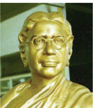

தமிழ்நநாட்டில் சமூக மாற்றங்கள்

பல்வவேறு சமூகங்களுக்ககான இட ஒதுக்கீட்டடை ஏற்படுத்திக் கொடுப்பதற்ககாக நீதிக்கட்சி வகுப்புவாரி பிரதிநிதித்துவம் தொடர்பபான சட்டங்களை இயற்றும் பணிகளை மேற்கொண்டது. சமூக நீதியை நிலைநாட்டுவதின் ஒரு பகுதியாக பல்வவேறு சாதிகளையும் சமூகங்களையும் சார்ந்தவர்களுக்கு அரசுப் பணிகளில் சேர்வதற்கு சமமானவாய்ப்புகளை உறுதி செய்யும் பொருட்டு இரண்டு வகுப்புவாரி அரசாணைகள் (1921 செப்டம்பர் 16 மற்றும் 1922 ஆகஸ்ட் 15) இயற்றப்பட்டன. நிருவாக அதிகாரங்களை அனைத்து சமூகத்தினரும் பங்கிட்டுக் கொள்வதை ஊக்குவிக்கும் வண்ணம், அரசு அதிகாரிகளைத் தேர்வு செய்ய 1924இல் பணியாளர் தேர்வு வாரியத்ததை நீதிக்கட்சி அமைத்தது. இம்முறையைப் பின்பற்றி பிரிட்டிஷ் இந்திய அரசு 1929இல் பொதுப் பணியாளர் தேர்வவாணையத்ததை உருவாக்கியது.

இவைகள் தவிர சமய நிறுவனங்களை சீர்திருத்துவதிலும் நீதிக்கட்சி கவனம் செலுத்தியது. நீதிக்கட்சி 1926இல் இந்து சமய அறநிலையச் ச ட்டத்ததை இயற்றியது. அதன்படி எந்தவொரு தனிநபரும், சாதிவேறுபாடின்றி கோவில்களின் நிருவாகக் குழுக்களில் உறுப்பினராகவும் கோவிலின் சொத்துக்களை நிர்வகிக்கவும் வழிவகை செய்யப்பட்டது.

### 10.4 சுயமரியாதை இயக்கம்

சுயமரியாதை இயக்கம் (Self Respect Movement) சடங்குகளும் சம்பிரதாயங்களும் இல்லலாத சாதிகளற்ற பிறப்பின் அடிப்படையிலான பாகுபாடற்ற ஒரு சமூகத்ததை இவ்வியக்கம் ஆதரித்தது. பகுத்தறிவும் சுயமரியாதையும் அனைத்து மனிதர்களின் பிறப்புரிமை எனப் பிரகடனம் செய்த இவ்வியக்கம் சுயாட்சியைக் காட்டிலும் இவை முக்கியமானவை எனும் கருத்ததை உயர்த்திப் பிடித்தது. பெண்களின் தாழ்வவான நிலைக்கு எழுத்தறிவின்மமையே காரணம் என அறிவித்த அவ்வியக்கம் அனைவருக்கும் கட்டடாயத் தொடக்கக் க ல்வியை வழங்கும் பணிகளை மேற்கொண்டது.

இவ்வியக்கம் பெண் விடுதலை கோருதல், மூடநம்பிக்ககைகளை நீக்குதல், பகுத்தறிவை வ லியுறுத்துதல் போன்ற கோரிக்ககைகளை கோரியது. மேலும், இவ்வியக்கம் சீர்திருத்தத் திருமணம் அல்லது சுயமரியாதைத் திருமணங்களை ஆதரித்தது.

சுயமரியாதை இயக்கம் பிராமணர் அல்லலாத இந்துக்களின் நலன்களுக்ககாக மட்டுமல்லலாமல் இஸ்லலாமியர்களின் நலனுக்ககாகவும் போராடியது. இஸ்லலாமின் மேன்மமை மிகுந்த கோட்பபாடுகளான ச மத்துவம், சகோதரத்துவம் ஆகியவற்றறை சுயமரியாதை இயக்கம் பாராட்டியது.

தமிழ்நநாட்டில் சமூக மாற்றங்கள்

**பெரியார் ஈ.வெ.ரா**

பெரியார் ஈ.வெ . ராமசாமி (1879-1973) சுயமரியாதை இயக்கத்ததை தோற்றுவித்தவர் ஆவார். இவர் ஈரோட்டடை சேர்ந்த செல்வந்தரும் வணிகருமான வெங்கடப்பர், சின்னத்ததாயம்மமாள்

ஆகியோரின் மகனாவார். ஓரளவு முறையான க ல்வியைக் கற்றிருந்ததாலும் தன் தந்ததையால் ஆதரிக்கப்பட்ட அறிஞர்களுடன் விமர்சன விவாதங்களில் ஈடுபடுவதை வழக்கமாகக் கொண்டிருந்ததார். இளைஞராக இருந்தபோது ஒருமுறை வீட்டடைவிட்டு

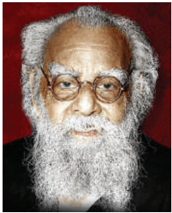

பெரியார் ஈ.வெ.ரா

வெளியேறிய அவர் பல மாதங்கள் வாரணாசியிலும் ஏனைய சமயம் சார்ந்த மையங்களிலும் தங்கியிருந்ததார். வைதீக இந்து சமயத்துடன் ஏற்பட்ட நேரடி அனுபவங்கள் இந்து சமயத்தின் மீது அவர் கொண்டிருந்த நம்பிக்ககைகளைத் தகர்த்தன. வீடு திரும்பிய அவர் சில காலம் குடும்பத் தொழிலான வணிகத்ததை கவனித்து வந்ததார். அவருடைய சுயநலமற்ற பொதுச் சேவைகளும், தொலைநோக்குப் பார்வவையும் அவரை புகழ்பபெற்ற ஆளுமை ஆக்கின. ஈரோட்டின் நகரசபைத் தலைவர் பதவி (1918-1919) உட்பட பல பதவிகளையும் அவர் வகித்ததார்.

தமிழ்நநாடு காங்கிரஸ் கமிட்டியின் தலைவராக

பெரியார் பதவி வகித்தபோது ஒடுக்கப்பட்ட மக்களின் கோவில் நுழைவு உரிமை குறித்த தீர்மமானம் ஒன்றறை முன்மொழிந்ததார். சாதி தர்மம் என்ற பெயரில் ஒடுக்கப்பட்ட பிரிவுகளைச் சேர்ந்தவர்கள்

கோவிலுக்குள்ளும் அதைச் சுற்றியுள்ள வீதிகளிளும் நுழைவது மறுக்கப்பட்டிருந்தது. இப்படிப்பட்ட நடைமுறையினை வைக்கம் (திருவாங்கூர் சமஸ்ததானத்தின் ஒரு சுதேசி அரசு, தற்போதைய கேரள மாநிலத்திலுள்ள ஒரு நகரம்) மக்கள் எதிர்த்தனர். எதிர்ப்பின் தொடக்கக் கட்டங்களில் மதுரையைச் சேர்ந்த ஜார்ஜ் ஜோசப் பெரும்பங்கு வகித்ததார். உள்ளூர் தலைவர்கள் கைது செய்யப்பட்ட பின்னர் பெரியார் இந்த இயக்கத்திற்கு தலைமையேற்றதால் சிறையிலடைக்கப்பட்டடார். மக்கள் அவரை 'வைக்கம் வீரர்' எனப் பாராட்டினர். இதே சமயத்தில் சேரன்மமாதேவி குருகுலப் பள்ளியில், உணவு உண்ணும் அறையில் சா தி அடிப்படையிலான பாகுபாடு நிலவுவதைக் கேள்வியுற்று மனவருத்தமடைந்ததார். இக்குருகுலம் தமிழ்நநாடு காங்கிரஸ் கமிட்டியின் நிதியுதவியில்

வ . வே . சுப்பிரமணியம் எனும் காங்கிரஸ் தலைவரால் நடத்தப் பெற்றது. இதனைப் பெரியார் க ண்டித்து எதிர்த்த பின்னரும், குருகுலத்தில் நடைபெறும் சாதிப்பபாகுபாட்டடை காங்கிரஸ் தொடர்ந்து ஆதரித்ததால் மனமுடைந்ததார்.

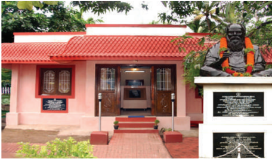

பெரியார் 1925இல் சுயமரியாதை இயக்கத்ததைத் தொடங்கினார். பகுத்தறிவுக் க ருத்துகளை மக்களிடையே பரப்புவதில் மக்கள் தொடர்புச் சாதனங்களின் முக்கியத்துவத்ததைப் பெரியார் புரிந்து கொண்டடார். குடிஅரசு (1925), ரிவோல்ட் (1928), புரட்சி (1933), பகுத்தறிவு (1934), விடுதலை (1935) போன்ற பலசெய்தித்ததாள்களையும் இதழ்களையும் பெரியார் தொடங்கினார். சுயமரியாதை இயக்கத்தின் அதிகாரபூர்வ செய்தித்ததாள் குடிஅரசு ஆகும். ஒவ்வொரு இதழிலும் சமூகப் பிரச்சனைகள் தொடர்பபான தனது க ருத்துகளைப் பெரியார் வழக்கமான கட்டுரையாக எழுதினார். அவ்வப்போது சித்திரபுத்திரன் எனும் புனைப் பெயரில் கட்டுரைகளை எழுதினார்.

பௌத்த சமய முன்னோடியும், தென்னிந்தியாவின் முதல் பொதுவுடமைவாதியுமான சிங்ககாரவேலருடன் நெருக்கமான உறவு கொண்டிருந்ததார். B.R. அம்பபேத்கர் எழுதிய சாதி ஒழிப்பு (Annihilation of Caste) எனும் நூலை, அந்நூல் வெளிவந்தவுடன் 1936இல் தமிழில் பதிப்பித்ததார். B.R. அம்பபேத்கர் அவ ர்களின் ஒடுக்கப்பட்ட மக்களுக்ககான தனித்ததேர்தல் தொகுதிக் கோரிக்ககையை பெரியாரும் ஆதரித்ததார்.

1937இல் இராஜாஜியின் தலைமையிலான அரசின் செயல்பபாட்டினை எதிர்க்கும் விதமாக , பள்ளிகளில் இந்தியைக் கட்டடாயப் பாடமாக அறிமுகம் செய்ததற்கு எதிராகப் பெரியார் மக்கள் செல்வவாக்கு பெற்ற இயக்கத்ததை நடத்தினார். இந்தி எதிர்ப்புப் போராட்டமானது (1937-39) தமிழ்நநாட்டு அரசியலில் மிகப் பெரும் தாக்கத்ததை ஏற்படுத்தியது. இந்தப் போராட்டத்துக்ககாக பெரியார் சிறையில் அடைக்கப்பட்டடார். பெரியார் சிறையில் இருந்தபோதே நீதிக்கட்சியின் தலைவராகத் தேர்ந்ததெடுக்கப்பட்டடார்.

இதன் பின்னர் நீதிக்கட்சி சுயமரியாதை இயக்கத்துடன் இணைந்தது. அதற்கு 1944இல் திராவிடர் கழகம் (திக) எனப் புதுப்பபெயர் சூட்டப்பபெற்றது.

சென்னனை மாகாணத்தின் முதலமைச்சராக இருந்த இராஜாஜி (1952-54) பள்ளிக் குழந்ததைகளுக்கு அறிமுகப்படுத்திய தொழிற் கல்வி பயிற்சித் திட்டமானது, மாணவர்களுக்கு அவர்களின் தந்ததையர்கள் செய்து வந்த தொழில்களில் பயிற்சியளிப்பதாக அமைந்தது. இதை குலக்கல்வித் திட்டம் (சாதியை அடிப்படையாகக் கொண்ட கல்வி முறை) என விமர்சித்த பெரியார் இத்திட்டத்ததை முழுமையாக எதிர்த்ததார். இதற்கு எதிராகப் பெரியார் மேற்கொண்ட போராட்டங்கள் இராஜாஜியின் பதவி விலகலுக்கு இட்டுச் சென்றது. கு. காமராஜ் சென்னனை மாநிலத்தின் முதலமைச்சரானார். பெரியார் தன்னுடைய தொண்ணூற்று நான்ககாவது வயதில் (1973) இயற்ககை எய்தினார். அவரது உடல் சென்னனையில் பெரியார் திடலில் நல்லடக்கம் செய்யப்பட்டது.

**பெரியார், ஒரு பெண்ணியவாதி**

பெரியார் ஆணாதிக்க சமூகத்ததை விமர்சித்ததார். குழந்ததைத் திருமணத்ததையும் தேவதாசி முறையையும் கண்டனம் செய்ததார். 1929 முதல் சுயமரியாதை மாநாடுகளில், பெண்களின் மோசமான நிலை குறித்து குரல் கொடுக்கத் தொடங்கியதிலிருந்து, பெண்களுக்கு விவாகரத்து பெறுவதற்கும் சொத்தில் பங்கு பெறுவதற்கும் உரிமை உண்டு என ஆணித்தரமாக வ லியுறுத்தினார். "திருமணம் செய்து கொடுப்பது" எனும் வார்த்ததைகளை மறுத்த அவர் அவை பெண்களைப் பொருட்களாக நடத்துகின்றன என்றறார். அவைகளுக்கு மாற்றறாக திருக்குறளில் இருந்து எடுக்கப்பட்ட வாழ்க்ககைத் துணை என்ற வார்த்ததையைப் பயன்படுத்த வேண்டினார். பெண்ணியம் குறித்து பெரியார் எழுதிய மிக முக்கியமான நூல் பெண் ஏன் அடிமையானாள்? என்பதாகும்.

பெண்களுக்குச் சொத்துரிமை வழங்கப்படுவது அவர்களுக்குச் சமூகத்தில் நன்மதிப்பபையும், பா துகாப்பபையும் வழங்கும் என பெரியார் நம்பினார். 1989இல் தமிழக அரசு, மாற்றங்களை விரும்பிய சீர்திருத்தவாதிகளின் கனவை நனவாக்கும் வகையில் தமிழ்நநாடு இந்து வாரிசுரிமைச் சீர்திருத்தச் சட்டத்ததை (1989) அறிமுகம் செய்தது. அச்சட்டம் முன்னோர்களின் சொத்துகளை உடைமையாகப் பெறுவதில் பெண்களுக்குச் சம உரிமை உண்டடென்பதை உறுதிப்படுத்தியது. முன்மமாதிரியாக அமைந்த

தமிழ்நநாட்டில் சமூக மாற்றங்கள்

இந்தச்சட்டம் தேசிய அளவிலும் இது போன்ற ச ட்டங்கள் இயற்றப்படுவதற்கு அடிப்படையாக அமைந்தது.

**இரட்டடைமலை சீனிவாசன்**

(1859-1945) 1859ஆம் ஆண்டு காஞ்சிபுரத்தில் பிறந்ததார். சா திப்படிநிலைகளில் ஒடுக்கப்பட்ட மக்களின் சமூக நீதி, சமத்துவம், சமூக உரிமைகள் ஆகியவற்றுக்ககாகப் போராடினார். அவருடைய

தன்னலமற்ற சேவைக்ககாக ராவ்சசாகிப் (1926), ராவ் பகதூர் (1930), திவான் பகதூர் (1936) ஆகிய பட்டங்களால் அவர் சிறப்புச் செய்யப்பட்டடார். அவரது சுயசரிதையான ஜீவிய ச ரித்திர சுருக்கம் 1939இல் வெளியிடப்பட்டது. இந்நூல் முதன்முதலாக எழுதப்பபெற்ற சுயசரிதை நூல்களில் ஒன்றறாகும்.

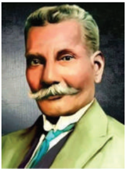

தீண்டடாமையின் கொடுமைகளை அனுபவித்த இரட்டடைமலை சீனிவாசன் உரிமைகள் மறுக்கப்பட்ட மக்களின் முன்னனேற்றத்திற்ககாக உழைத்ததார். 1893இல் ஆதிதிராவிட மகாஜன சபை எனும் அமைப்பபை உருவாக்கினார். ஒடுக்கப்பட்ட மக்களின் கூட்டமைப்பு மற்றும் சென்னனை மாகாண ஒடுக்கப்பட்ட வகுப்பினரின் கூட்டமைப்பு ஆகிய அமைப்புகளின் தலைவராகப் பணியாற்றினார்.

B.R. அம்பபேத்கரின் நெருக்கமானவரான அவர், லண்டனில் (1930 மற்றும் 1931) நடைபெற்ற முதல், இரண்டடாம் வட்டமேஜை மாநாடுகளில் கலந்து கொண்டு சமூகத்தின் விளிம்புநிலை மக்களின் கருத்துக்களுக்ககாகக் குரல் கொடுத்ததார். 1932இல் செய்துகொள்ளப்பட்ட பூனா ஒப்பந்தத்தில் கையெழுத்திட்டவர்களுள் இவரும் ஒருவர்.

**மயிலை சின்னதம்பி ராஜா**

(1883-1943) மக்களால் எம்.சி. ராஜா என அழைக்கப்பட்ட அவ ர் ஒடுக்கப்பட்ட வகுப்பபைச் சேர்ந்த தலைவர்களில் முக்கியமானவர். ஒரு ஆசிரியராகத் தனது பணியைத் தொடங்கிய அவர் பள்ளிகள், க ல்லூரிகள் ஆகியவற்றுக்ககான பல்வவேறு பாடப்புத்தகங்களை எழுதினார். தென்னிந்திய நல உரிமைச் ச ங்கத்ததை (நீதிக்கட்சி) உருவாக்கியவர்களில் ஒருவர். சென்னனை மாகாணத்தில் எம். சி. ராஜா

தமிழ்நநாட்டில் சமூக மாற்றங்கள்

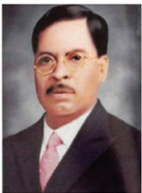

ஒடுக்கப்பட்ட வகுப்பிலிருந்து சட்டமேலவைக்கு தேர்ததெடுக்கப்பட்ட முதல் உறுப்பினர் (1920-1926). சென்னனை சட்ட சபையில் நீதிக்கட்சியின் துணைத் தலைவராகச் செயல்பட்டடார்.

1928இல் அகில இந்திய ஒடுக்கப்பட்டோர் ச ங்கம் எனும் அமைப்பபை உருவாக்கி அதன் தலைவராக நீண்டகாலம் பணியாற்றினார்.

### 10.5 தமிழ்நநாட்டில் தொழிலாளர் இயக்கங்கள்

இந்தியாவில் தொழில்கள் வளர முதல் உலகப்போர் (1914-1918) உத்வவேகம் அளித்தது. போர்க்ககாலத்ததேவைகளை நிறைவு செய்துவந்த இத்தொழிற்சசாலைகள் மிக அதிக எண்ணிக்ககையில் தொழிலாளர்களைப் பணியில் அமர்த்தியிருந்தன . போர் முடிவடைந்ததால் போர்ககாலத் தேவைகளும் குறைந்தன. எனவே, அனைத்து தொழிற்சசாலைகளிலும் ஆட்குறைப்பு செய்யப்பட்டன . இத்துடன் ஏற்பட்ட விலைவாசி ஏற்றமும் தொழிலாளர் இயக்கங்கள் தோன்றுவதற்கு உந்து சக்தியாக அமைந்தன . ச சென்னனை மாகாணத்தில் பி.பி. வாடியா , ம. சிங்ககாரவேலர், திரு.வி. கல்யயாணசுந்தரம் போன்றவர்கள் தொழிலாளர் சங்கங்களை அமைப்பதில் முன்முயற்சி மேற்கொண்டனர். 1918இல் இந்தியாவின் முதல் தொழில் சங்கமான சென்னனை தொழிலாளர் சங்கம் (Madras Labour Union) உருவாக்கப்பட்டது.

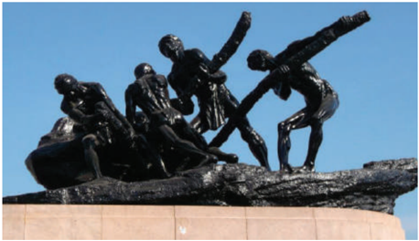

**உழைப்பபாளர் சிலை மெரினா கடற்கரை**

அகில இந்திய தொழிலாளர் சங்கத்தின் முதல் மாநாடு 1920 அக்டோபர் 31இல் பம்பபாயில் நடைபெற்றது. பல தீர்மமானங்கள் குறித்து பிரதிநிதிகள் விவாதித்தனர். தொழிலாளர்களின் பிரச்சனைகளில் காவல்துறை தலையிடுவதிலிருந்து பா துகாப்பு, வேலையில்லலாதவர்களுக்ககென ஒரு பதிவேட்டடைப் பராமரித்தல், உணவுப் பண்டங்களின் ஏற்றுமதி மீதான கட்டுப்பபாடு, காயம டைந்தோர்க்கு ஈட்டுத்தொகை மற்றும் உடல்நலக் காப்பீடு ஆகியவை இவற்றில் அடங்கும். சென்னனை மாகாண தொழிலாளர் இயக்க நடவடிக்ககைகளில் ஒரு முன்னோடியாகத்

திகழ்ந்தவர் ம. சிங்ககாரவேலர் (1860-1946). சென்னனையில் பிறந்த இவர் சென்னனைப் பல்கலைக்கழகத்ததைச் சார்ந்த மாநிலக் கல்லூரியில்

பயின்று பட்டம் பெற்றறார். இளமைக் காலத்தில் பௌத்தத்ததைப் பரிந்துரை செய்ததார். அவர் தமிழ், ஆங்கிலம், உருது, இந்தி, ஜெர்மன், பிரெஞ்ச் மற்றும் ரஷ்யன் எனப் பலமொழிகள் அறிந்திருந்ததோடு காரல் மா ர்க்ஸ், சார்லஸ் டார்வின், ஹெர்பர்ட் ஸ்பபென்சர்,

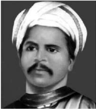

ஆல்பர்ட் ஐன்ஸ்டின் ஆகியோரின் கருத்துக்களைத் தமிழில் வடித்தவர். 1923இல் முதன் முதலாக மே தின விழாவை ஏற்பபாடு செய்தவரும் அவரே. இவர் இந்திய பொதுவுைடமைக் (கம்யூனிஸ்ட்) கட்சியின் ஆரம்பகால தலைவர்களில் ஒருவராக இருந்ததார். தொழிலாளி வர்க்கத்தின் பிரச்சனைகளை வெளிப்படுத்துவதற்ககாக தொழிலாளன் (Worker) என்ற பத்திரிக்ககையை வெளியிட்டடார். பெரியாரோடும் சுயமரியாதை இயக்கத்தோடும் நெருக்கமாக இருந்ததார்.

### 10.6 இந்திய விடுதலைக்கு முன்பு மொழிப் போராட்டம்

பொதுவாக , மொழி என்பது அடையாளத்தின் வலிமையான குறியீடாகும். மேலும், இது ஒரு சமூகத்தின் பண்பபாடு மற்றும் உணர்வுகளுடன் இயைந்து நிற்பது. தமிழ்மொழி பத்தொன்பதாம் நூற்றறாண்டின் பிற்பபாதியிலும் இருபதாம் நூற்றறாண்டின் தொடக்கத்திலும் தனது மேன்மமையை மீட்டுப் பெற்றது. மறைமலை அடிகளின் தனித்தமிழ் இயக்கம், பெரியாரின் மொழிச் சீர்திருத்தம் மற்றும் தமிழிசை இயக்கம் ஆகியவை தமிழுக்கு வலுச்சசேர்த்தன. திராவிட உணர்வுக்கு இட்டுச் சென்ற தமிழ் மறுமலர்ச்சி நவீனத் தமிழ் மொழியின் வளர்ச்சியிலும் அதன் கலை வடிவங்களுடைய வளர்ச்சியிலும் பெரும் பங்களிப்பபைச் செய்தது. ஆகம கோவில்களில் செய்யப்படும் சடங்குகள் தமிழில் செய்யப்படுவதில்லலை. இசை நிகழ்ச்சிகளிலும் தமிழ்ப் பாடல்கள் ஓரளவிலான இடத்ததையே பெற்றிருந்தன. ஆபிரகாம் பண்டிதர் தமிழ் இசை வரலாற்றறை முறையாகக் கற்றறாய்ந்து, பழந்தமிழர் இசை முறையை மீட்டுருவாக்கம் செய்ய முயன்றறார். 1912இல் தஞ்சசாவூர் 'சங்கீத வித்யயா மகாஜன சங்கம்' என்ற அமைப்பபை ஏற்படுத்தினார். அதுவே தமிழிசை இயக்கத்தின் கருமூலமானது. இசை நிகழ்வுகளில் தமிழில் பாடல்கள் பாடப்படுவதற்கு இவ்வியக்கம்

முக்கியத்துவம் வழங்கியது. தமிழிசையின் நிலை குறித்து விவாதிக்க 1943இல் முதல் தமிழிசை மாநாடு நடத்தப்பட்டது.

தமிழ்நநாட்டில் வெவ்வவேறு காலப்பகுதிகளில் இந்தி கட்டடாயமொழியாகநடைமுறைப்படுத்தப்பட்டது தமிழ்மொழிக்கும், பண்பபாட்டிற்குமான அச்சுறுத்தலாகவே கருதப்பட்டது. தமிழுக்கு மேலாக இந்தியை அறிமுகம் செய்வது திராவிடர்களுக்ககான வேலைவாய்ப்புகளை மறுப்பதாக அமையுமென பெரியார் அறிவித்ததார். இந்திமொழி அறிமுகம் செய்யப்பட்டடால் தமிழ்மொழி பாதிப்புக்குள்ளளாகும் என மறைமலை அடிகள் சுட்டிக் காட்டினார். இந்தி எதிர்ப்பு இயக்கத்ததைச் சேர்ந்தவர்கள் தங்கள் போராட்டத்ததை பிராமணியத்திற்கும் தமிழின் மீதான சமஸ்கிருதத்தின் ஆதிக்கத்திற்கும் எதிரான க ருத்தியல் போராகவே கருதினர்.

### 10.7 பெண்கள் இயக்கங்கள்

இருபதாம் நூற்றறாண்டின் தொடக்கத்தில், சென்னனை மாகாணத்தில் பெண்களை வலிமையுள்ளவர்களாக மாற்றுதல் எனும் நோக்கத்துடன் பல பெண்ணிய இயக்கங்கள் நிறுவப்பபெற்றன. அவைகளுள் தமிழ் நாட்டில் உருவான இந்தியப் பெண்கள் சங்கம் (Women's India Association – WIA), அகில இந்தியப் பெண்கள் மாநாடு (All India Women's Conference – ALWC) ஆகியவை முக்கியமானவையாகும். இந்தியப் பெண்கள் சங்கம் (WIA) என்பது 1917இல் அன்னிபெசன்ட், டோரதி ஜினராஜதாசா, மார்கரெட் க சின்ஸ் ஆகியோர்களால் சென்னனை அடையாறு பகுதியில் தொடங்கப்பபெற்றது. இவ்வமைப்பு தனிநபர் சுகாதாரம், திருமணச் சட்டங்கள், வாக்குரிமை, குழந்ததை வளர்ப்பு மற்றும் பொது வாழ்வில் பெண்களின் பங்கு ஆகியவை குறித்து பல்வவேறு மொழிகளில் துண்டுப்பிரசுரங்களையும் செய்தி மடல்களையும் வெளியிட்டன. இதே ச மயத்தில் இந்தியப் பெண்கள் சங்கம், பெண்கல்வி குறித்த பிரச்சனைகளைக் கையாள்வதற்ககாக 1927இல் அகில இந்திய பெண்கள் மாநாட்டடைக் கூட்டியது. மேலும், பெண்களின் மேம்பபாட்டிற்ககாகப் பல கொள்ககைகளை அரசு நடைமுறைப்படுத்த வேண்டுமெனப் பரிந்துரை செய்தது.

பெண்களின் விடுதலை என்பது சுயமரியாதை இயக்கத்தின் முக்கிய நோக்கங்களில் ஒன்றறாகும். பெரியாரின் தலைமையிலான சுயமரியாதை இயக்கத்ததைச் சேர்நந்ததோர், பாலின ச மத்துவம் மற்றும் பாலினம் குறித்த சமூகத்தின் உணர்வுகளை மேம்படுத்துதல் ஆகியவற்றுக்ககாகப் பணியாற்றினர். தங்களுடைய கருத்துகளைப்

தமிழ்நநாட்டில் சமூக மாற்றங்கள்

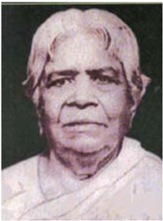

பங்கிட்டு கொள்வதற்ககான ஓர் இடத்ததைப் பெண்களுக்கு இவ்வியக்கம் ஏற்படுத்திக் கொடுத்தது. இவ்வியக்கத்தில் தீவிரமாகப் பணியாற்றிய பெண்கள் பலர் இருந்தனர். முத்துலட்சுமி அம்மமையார், நாகம்மமை , க ண்ணம்மமா , நீலாவதி, மூவலூர் இராமாமிர்தம், ருக்மணி அம்மமாள், அலமேலு

கட வுளுக்கு இறைப்பணி செய்யும் சேவகர்களாக இளம் பெண்களை இந்து கோவில்களுக்கு அர்ப்பணிக்கும் வழக்கம் இருந்தது அவ்வவாறு அர்ப்பணிக்கப்பட்டோர் தேவதாசி என்று அறியப்பட்டனர். கடவுளுக்குச் செய்யப்படும் சேவை எனும் நோக்கில் அமைந்திருந்ததாலும் நாளடைவில் இம்முறை பெரும் ஒழுக்கக்ககேட்டிற்கும் பெண்களைத் தவறாகப் பயன்படுத்துவதற்கும் இட்டுச்சசென்றது. இத்ததேவதாசி முறையை ஒழிப்பதற்ககாகச் சட்டம் இயற்றப்பட வேண்டும் என்பதற்ககாக நடைபெற்ற இயக்கத்தில் டாக்டர். முத்துலட்சுமி அம்மமையார் முதலிடம் வகித்ததார். 'மதராஸ் (அர்பணிப்பபைத் தடுத்தல்) தேவதாசி சட்டம் 1947' எனும் சட்டம் அரசால் இயற்றப்பட்டது.

மங்ககை தாயாரம்மமாள், நீலாம்பிகை மற்றும் சிவகாமி சிதம்பரனார் ஆகியோர் அவர்களுள் முக்கியமானவர்கள் ஆவர்.

1930இல் சென்னனை சட்டமன்றத்தில் முத்துலட்சுமி அம்மமையார் "சென்னனை மாகாணத்தில் இந்து கோவில்களுக்குப் பெண்கள் அர்பணிக்கப்படுவதை தடுப்பது" எனும் மசோதாவை அறிமுகப்படுத்தினார். பின்னர் தேவதாசி ஒழிப்புச் சட்டமாக மாறிய இம் மசோதா, இந்து கோவில் வளாகங்களிலோ அல்லது வேறு வழிபாட்டு இடங்களிலோ "பொட்டுக் கட்டும் சடங்கு" நடத்துவது சட்டத்திற்குப் புறம்பபானதாகும் என அறிவித்தது. தேவதாசிகள் திருமணம் செய்து கொள்வதற்கு சட்டபூர்வமான அனுமதியை வழங்கியது. மேலும், தேவதாசி முறைக்கு உதவிசெய்கிற, தூண்டிவிடுகிற குற்றத்ததை செய்வோர்க்கு குறைந்த பட்சம் ஐந்ததாண்டு சிறை தண்டனை என ஆணையிட்டது. இம்மசோதா சட்டமாக மாறுவதற்கு 17 ஆண்டுகள் காத்திருந்தது.

**பாட ச்சுருக்கம்**

- காலனியத்தின் தலையீட்டினாலும் பகுத்தறிவு இயக்கத்தின் எழுச்சியினாலும் இந்திய அறிவுஜீவிகளிடையே தன்னனைத்ததானே உள்ளளாய்வு செய்து கொள்ளும் உள்முகச் சிந்தனைச் செயல்படுவதை பத்தொன்பதாம் நூற்றறாண்டு இந்தியா எதிர்கொண்டது. இது இந்திய மறுமலர்ச்சிக்கு இட்டுச் சென்றது.
- தமிழ்நநாட்டில், அச்சுக் கூடங்களின் வளர்ச்சி, பழம்பபெரும் சமயச் சார்பற்ற தமிழ் இலக்கியங்கள் வெளியிடப்பட்டு பரவுவதற்கு செயலூக்கியாய் அமைந்தது.
- பத்தொன்பதாம் நூற்றறாண்டில் தமிழறிஞர்கள் தமிழ் செவ்வியல் இலக்கியங்களை வெளியிடுவதற்கு அயராது உழைத்தனர்.
- இம்மமாற்றம் தமிழ்மொழி, இலக்கியம் ஆகியவற்றுக்கு மட்டும் புத்தூக்கம் அளிக்கவில்லலை . நடைமுறையிலிருந்த சாதிப்படிநிலைகளுக்குச் சவாலாக அமைந்தது.
- 1916இல் நிறுவப் பெற்ற நீதிக்கட்சி, சென்னனை மாகாணத்தில் இருந்த பிராமணர் அல்லலாதவர்களின் பிரச்சனைகளுக்ககாகக் குரல் கொடுத்தது.
- சுயமரியாதை இயக்கத்தின் முன்னோடியாக விளங்கிய பெரியார் ஈ.வெ . ர ராமசாமி, அடிப்படைவாதத்ததை விமர்சனத்துக்குள்ளளாக்கி, மக்களிடையே பகுத்தறிவுக் கொள்ககைகளை ஊக்குவித்ததார்.
- இறுதியாகத் தமிழ் நாட்டின் பகுத்தறிவுச் சிந்தனைகள் நவீன இந்திய அரசின் ஆக்கபூர்வமான வளர்ச்சிகளுக்கு மாதிரியாய் அமைந்தன .

**க லைச்சொற்கள்**

|  |  |  |
| --- | --- | --- |
| சுவிசேஷர்கள், நற்செய்தியாளர் | evangelical | Christian groups that believe that the teaching of the Bible and persuading others to join them is extremely important |
| மேலாதிக்கம் | hegemony | leadership or dominance, especially by one country or social group over others |
| எழுச்சி | resurgence | renewal, revival |

தமிழ்நநாட்டில் சமூக மாற்றங்கள்

|  |  |  |
| --- | --- | --- |
| மொழியியலாளர்கள் | linguists | a person skilled in languages |
| ஒதுக்கப்பட்ட | marginalised | a person, group concept treated as insignificant or sidelined |
| எரிச்சலூட்டும் | irked | irritated, annoyed |
| ஒழித்துக்கட்டும் | debunking | expose the falseness or hollowness of (a myth, idea or belief) |
| பருதோல்வியுறச் செய்தல் பருதோல்வியுறச் செய்தல் பருதோல்வியுறச் செய்தல் பருதோல்வியுறச் செய்தல் பருதோல்வியுறச் செய்தல் பருதோல்வியுறச் செய்தல் | trounced | defeat heavily in a contest |
| விமர்சிப்பது | critiquing | evaluate in a detailed and analytical way |
| அநீதியான | iniquitous | grossly unfair and morally wrong |
| புனைபெயர் | pseudonym | a fictitious name, especially one used by an author |
| பெயரிடப்பட்டு | rechristened | give a new name to |
