**அலகு - 4**

**இரண்டடாம் உலகப்போருக்குப் பிந்ததைய உலகம்**

**க ற்றலின் நோக்கங்கள்**

**கீழ்க்ககாண்பனவற்றோடு அறிமுகமாதல்**

- சீனாவின் பொதுவுடைமைப் புரட்சி
- பனிப்போரும் அணிசேரா இயக்கமும்
- கொரியப் போரும் கியூபாவின் ஏவுகணைச் சிக்கலும்
- இஸ்ரரேலியப் போரும் வியட்நநாம் போரும்
- ஐரோப்பியப் பொருளாதாரக் குழுமம் மற்றும் ஐரோப்பிய ஒருங்கிணைப்பு
- பெர்லின் சுவர் வீழ்ச்சியும் பனிப்போர் யுகமுடிவும்

**அறிமுகம்**

இரண்டடாம் உலகப்போருக்குப் பின் ஒரு புதியகாலம் உருவாகியது. இக்ககாலம் ஐரோப்பிய காலனியப் பேரரசின் வீழ்ச்சியையும் ஆசியஆப்பிரிக்க காலனிய ஆட்சிக்குட்பட்ட நாடுகளின் சுதந்திரத்ததையும் தொடக்கமாகக் கொண்டிருந்தது. முதலாம் உலகப்போர் ரஷ்யயாவில் ஒரு பொதுவுடைமைப் புரட்சியை ஏற்படுத்தியதென்றறால் இரண்டடாம் உலகப்போர் சீனாவில் ஒரு கம்யூனிசப் புரட்சி ஏற்படக் காரணமாக இருந்தது. அமெரிக்க ஐக்கிய நாடும் ஐக்கிய சோஷலிச சோவியத் குடியரசு நாடும் வல்லரசுகளாக உருவானதோடு அவை எதிரெதிர் இருதுருவங்களாய் பிரிந்து நின்றன. இப்பின்னணியில் உருவான பனிப்போரானது கொரியா, கியூபா, வியட்நநாம், மேற்கு ஆசியா போன்ற பகுதிகளில் கடும் மோதல்களுக்கு இட்டுச்சசென்றது.

போரினால் பாதிக்கப்பட்ட ஐரோப்பபாவின் மறுசீரமைப்பபை முன்னிறுத்திய மார்ஷல் திட்டத்தின் மூலமாக அமெரிக்க ஐக்கிய நாடு ஐரோப்பபாவின் நம்பிக்ககையை வென்றது. சோவியத் ரஷ்யயாவோ ஆசிய–ஆப்பிரிக்க நாடுகளின் விடுதலைப் போராட்டத்திற்கு ஆதரவளித்து அதன் மூலமாக அந்நநாடுகளின் நல்லலெண்ணத்ததைப் பெற்றது.

அணிசேரா நாடுகளின் அமைப்பு இரு வல்லரசுகளுக்கிடையே ஏற்பட்ட முரண்பபாட்டடைக்

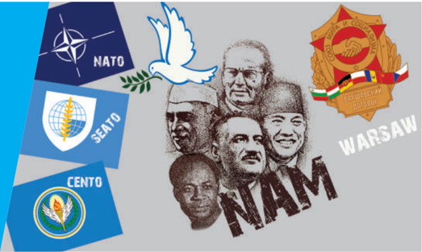

கட்டுக்குள்வவைக்க ஓரளவு பங்ககாற்றியது. அமெரிக்கக் கட்டுப்பபாட்டிற்குள்ளிருந்து வெளிவரும் பொருட்டு ஐரோப்பிய நாடுகள் ஒரு குழுமத்ததை இயக்கவடிவில் முன்னனெடுத்துச் சென்றன. இதுவே ஐரோப்பியப் பொதுச்சந்ததை என்று மாற்றங் கொண்டு இப்போதுள்ள ஐக்கிய ஐரோப்பபாவாக உருப்பபெற்றது. பெர்லின் சுவர் உடைக்கப்பட்டதோடு பனிப்போர் கா லம் முடிவுக்கு வந்தது.

### 4.1 சீனப்புரட்சி

**(அ) போருக்கு முன்பபான சீனா**

நீண்ட வரலாற்றறைக் கொண்ட சீன நாகரிகம் ஐரோப்பபாவைவிட மேம்பட்டதாகும். ஆனால் ப த்தொன்பதாம் நூற்றறாண்டின் கடைசியில் அதன் வளர்ச்சி தேங்கியது. அதன் அரசர்களான மஞ்சுக்கள் சீனாவை ஏறக்குறைய 1650 ஆண்டுகள் ஆட்சி புரிந்திருந்தனர். ஆட்சியதிகாரமானது அறிவுமிக்க அதிகாரிகளாக கருதப்பட்ட மாண்டரின்கள் எனும் நிலவுடைமையாளர் வசம் இருந்தது. சாதாரண விவசாயிகள் அதிகமான வரிவிதிப்பினாலும் மிதமிஞ்சிய குத்தகை வசூலிப்பபாலும் குறைந்த நிலம் கொண்டவர்களாக விளங்கியதாலும் கடுமையான பா திப்புகளுக்குட்பட்டு வறுமையின் பிடியில் சிக்கித் தவித்தனர். சில இருப்புப்பபாதைப் பணிகளும் பொறியியல் நிபுணத்துவம் கொண்ட சில பணிகளும் நடைபெற்றிருந்ததாலும் தொழிற்சசாலைகள் போதிய எண்ணிக்ககையில் உருவாகவில்லலை .

அரசியல் - பொருளாதார அதிருப்தி பல இடங்களில் விவசாயிகளை எழுச்சியடையச் செய்தது. தைபிங் கலகம் (1850-64) இங்கு ஒரு முக்கிய எழுச்சியாகும். முறையே 1832லும் 1848லும் நடந்த அபினிப்போர்களில் தோல்வியைச் சந்தித்த சீனா முதன்முறையாக மேற்கத்திய ஏகாதிபத்திய சக்திகளுக்கு தனது துறைமுகங்களைத் திறந்துவிட்டது. இம்முடிவினால் பொருளாதாரச் சுரண்டலும் சீனமக்கள் மேலும் வறுமைக்குத் தள்ளப்பட்டதும் நடந்ததேறியது.

ஐரோப்பியர்களின் வருகை வெளிநாட்டினர் மீது கடும்வவெறுப்பு ஏற்படக் காரணமாக இருந்தது. இவற்றோடு போரில் ஏற்பட்ட தோல்வி மேற்கத்திய கல்வியறிவு பெற்ற அறிஞர்களிடம் சீர்திருத்தங்களை அறிமுகப்படுத்த கோரிக்ககை வைக்கத் தூண்டியது. மேற்கத்திய கல்வியறிவு பெற்ற அறிவுஜீவிகளின் வழிகாட்டுதலினால் சிறுவயதினரான பேரரசர் 1898இல் நூறுநாள்கள் சீர்திருத்தம் என்ற பெயரில் வரிசையாக சில சீர்திருத்தங்களைத் தொடங்கினார். இச்சீர்திருத்தங்கள் பழமைவாதிகளிடமிருந்தும் அரசரின் பா துகாவலராகத் திகழ்ந்த பேரரசியான சூ சி யிடமிருந்து கடும் எதிர்ப்பினைக் கிளப்பின. பேரரசியார் பேரரசரை சிறையில் தள்ளியதோடு சீர்திருத்தங்களைப் புறந்தள்ளினார்.

**(ஆ) 1911ஆம் ஆண்டு சீனப்புரட்சி**

மஞ்சு வம்சத்தின் சிதைவு 1908ஆம் ஆண்டு பேரரசின் பாதுகாவலராயிருந்த பேரரசியார் தாவேகரின் மரணத்தோடுத் தொடங்கியது. புதிய பேரரசர் இரண்டு வயதே நிரம்பியவர் என்ற நிலையில் மாகாண

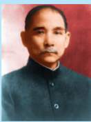

டா க்டர் சன் யாட் சென் (1866-1925)

ஓர் ஏழ்மமையான குடும்பத்தில் காண்டன் நகரத்தின் அருகே பிறந்த டாக்டர் சன்யயாட் சென், நவீன சீனாவின் தந்ததை, ஒரு கிறித்தவப் பள்ளியில்

கல்வி பெற்றதோடு கிறித்தவராகவும் மாறினார். ஹாங்ககாங் நகரில் மருத்துவப் பயிற்சி பெற்றறார். அரசியலில் ஆர்வம் கொண்டிருந்த அவர் 1895இல் மஞ்சுக்களுக்கு எதிரான கிளர்ச்சியில் ஈடுபட்டடார். அவர் 1905ஆம் ஆண்டு டோக்கியோவில் ஓர் அரசியல் கட்சியைத் துவக்கினார். அதுவே 1912இல் கோமின்டடாங் என்றும் தேசிய மக்கள் கட்சி என்றும் உருவெடுத்தது. தேசியம், ஜனநாயகம், மக்களின் வாழ்க்ககை முறை ஆகிய மூன்று கூறுகளைக் கொண்ட அவர்தம் கொள்ககை சோஷியலிஸச் சிந்தனையையே உச்சமாகக் கருத்தில் கொண்டது.

ஆளுநர்கள் சுதந்திரமாகச் செயல்படலாயினர். உள்ளூர் இராணுவக் கிளர்ச்சி 1911ஆம் ஆண்டு அக்டோபரில் ஏற்பட்டு அதன் பாதிப்பு பலமட்டங்களில் பரவியது. மாகாண ஆளுநர்கள் மஞ்சு அரசின் பிரதிநிதித்துவங்களை உதறித் தங்கள் சுதந்திரத்ததைப் பிரகடனப்படுத்தலாயினர் . இக்ககாலக் கட்டத்தில் நடுத்தர வர்க்கத்திலிருந்து சில தலைவர்கள் உருவாகியிருந்தனர். அவர்களில் டா க்டர் சன் யாட் சென்னும் ஒருவர். சீனாவில் ஏற்பட்ட எழுச்சியைப் பற்றி அமெரிக்க நாளிதழ்களின் மூலமாக அறிந்து கொண்ட டாக்டர் சன் யாட் சென் ஷாங்ககாய் நகரை வந்தடைந்ததும் அங்ககே அவர் சீனக் குடியரசின் தற்ககாலிக குடியரசுத்தலைவராகத் தேர்ந்ததெடுக்கப்பட்டடார்.

**இ) யுவான் ஷி-கேயும் அதன் பின்னரும்**

யுவான் ஷி கேயின் கீழ் சீனா நான்கு வருடம் ஒருமைப்பபாட்டுடன் விளங்கியது. 1916ஆம் ஆண்டு

அவரது மரணத்திற்குப்பின் அடுத்தப் பன்னிரெண்டு ஆண்டுகளுக்கு ஒரு குடியரசுத் தலைவர் நியமிக்கப்பட்டிருந்ததாலு ம் அவ்வரசு பெயரளவில் மட்டுமே நடுவண் தன்மமையைக் கொண்டிருந்தது.

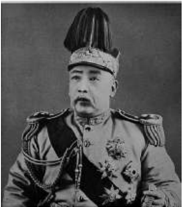

**ஈ) சீனப் பொதுவுடைமைக் கட்சி**

புரட்சியோடு இணைந்து சீனப் பழமைவாதிகளின் வீழ்ச்சிக்குப் பின்னர் கன்பூசியசின் சிந்தனைகள் புறந்தள்ளப்பட்டு

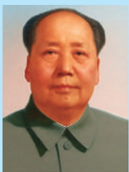

மா சே –துங் ( 1893 – 1976) தென்கிழக்குச் சீனாவில் உள்ள ஹுனான் நகரில் மா சே-துங் பிறந்ததார். அவரது தந்ததையார் செல்வச்சசெழிப்பபான விவசாயிகளில் ஒருவர் என்பதோடு மஞ்சுக்களின்

ஆட்சியை ஆதரித்தவராவார். வாசிப்பதில் மிகுந்த ஆர்வங்கொண்ட மா சே-துங் தனது திறமையால் சாங்ஸியாவிலிருந்த இளையோர் கல்லூரியில் இடம்பிடித்ததார். அதே ஆண்டு (1911) சீனாவில் புரட்சி வெடித்தது. புரட்சிப்படை ஒன்றறை உருவாக்கிய போதும் விரைவில் அதிலிருந்து விலகி சாங்ஸியாவிலிருந்த ஆசிரியர் பயிற்சிக் கல்லூரியில் சேர்ந்ததார். பின்னர் ஹூனான் நகரை மையமாகக் கொண்டு தனது அரசியல் வாழ்க்ககையைத் தொடங்கிய அவர் ஒரு முழு பொதுவுடைமைவாதியாக மாறினார்.

இரண்டடாம் உலகப்போருக்குப் பிந்ததைய உலகம்

1917இல் ஏற்பட்ட ரஷ்யப் புரட்சியோடு மார்க்ஸ், லெனின் போன்றவர்களின் சிந்தனை வலுப்பபெற்றது. மார்க்சியத்ததை கற்கும் விதமாக 1918இல் பீகிங் பல்கலைக்கழகத்தில் ஓர் அமைப்பு உருவாக்கப்பட்டது. இவ்வமைப்பால் நடத்தப்பட்ட கூட்டங்களில் கலந்துகொண்டவருள் மா சே-துங்கும் ஒருவர் ஆவார்.

**கோமின்டடாங்கும் ஷியாங் கே-ஷேக்கும்**

சன் யாட் சென் இறந்தபின் கோமின்டடாங் கட்சியின் தலைவராக ஷியாங்ககே – ஷேக்கும், பொதுவுடைமைக்கட்சியின் தலைவர்களாக சூ-யென்-லாயும் மா சே–துங்கும் விளங்கினர். பொதுவுடைமைவாதத்தின் தீவிர விமர்சகரான ஷியாங் தனது கட்சிக்குள்ளிருந்த பொதுவுடைமைவாதிகளை முக்கிய பொறுப்புகளிலிருந்து விடுவித்ததார். பொதுவுடைமைவாதிகளின் செல்வவாக்கோ பெருகத் தொடங்கி அவர்கள் தொழிலாளர்களையும் விவசாயிகளையும் தங்கள் இராணுவத்தில் பெருமளவில் சேர்க்கும் நிலை ஏற்பட்டது. மேலும் வெற்றிகரமாக அவர் 1928ஆம் ஆண்டு பீகிங்நகரைக் கைப்பற்றினார். மீண்டும் சீனாவில் ஒரு நடுவண் அரசு உருவானது.

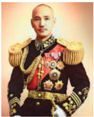

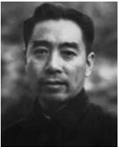

**விவசாயிகளை வழிநடத்திய மாவோ**

கோமின்டடாங்கின் கட்டுப்பபாடு நகரங்களின் மீது கடுமையாக இருந்ததை மாவோ (மா சே –துங்) உணர்ந்ததார். அதனால் அவர் விவசாயிகளை ஒருங்கிணைக்க முயற்சி செய்ததார். மாவோவின் தலைமையில் சில நூறு கம்யூனிஸ்டுகள் காடுகள் சூழ்ந்த மலைப்பகுதிகளில் ஏழு ஆண்டுகள் பதுங்கியிருந்தனர். கோமின்டடாங்ககால் அக்ககாட்டு மலைப்பகுதியில் நுழைய முடியாத அதேவேளையில் மாவோவின் படை பெருகிக்கொண்டடே சென்றது. இவர்களை அழித்தொழிக்கும் முயற்சியின் போது ஷியாங் கே–ஷேக் ஜப்பபானிடமிருந்தும் வேறு சில போர்ப்படைத் தளபதிகளிடமிருந்தும் அச்சுறுத்தலை எதிர்கொள்ள வேண்டியிருந்ததால் அவரது வேகம் குறைந்தது .

**1934இல் நீண்ட பயணம்**

ஷியாங் கே - ஷேக் பொதுவுடைமை வாதிகளைச் சுற்றி முற்றுகையிடும் விதமாக ஆங்ககாங்ககே பல பா துகாக்கப்பட்ட அரண்களை அமைத்திருந்ததார்.

இரண்ட டா ம் உலகப்போருக்குப் பிந்ததைய உலகம்

மாவோவும் ஹுனான் பகுதியை விட்டு அகன்று பாதுகாப்பபான ஒரு பகுதிக்குச் செல்ல நினைத்ததார். ஏறத்ததாழ 1933ஆம் ஆண்டு வாக்கில் சீன பொதுவுடைமை கட்சியின் மீதான முழுக் கட்டுப்பபாடும் மாவோ வசம் வந்து சேர்ந்தது. ஒரு நீண்ட பயணத்ததை முன்னனெடுத்து 100,000 பொதுவுடைமை இராணுவத்தினர் 1934இல் கிளம்பினர். அப்பயணம் ஒரு சகாப்தமாக மாறியது. இவ்வவாறு கிளம்பிய 1,00,000 பேரில் வெறும் 20,000 பேர் மட்டும் 1935இன் பிற்பகுதியில் 6,000 மை ல்களைக் கடந்து வடக்கு ஷேனிப் பகுதியை சென்றடைந்தனர். மேற்கொண்டு அவர்களோடு மற்ற பொதுவுடைமைவாதப் படைகளும் சேர்ந்து கொண்டன. 1937ஆம் ஆண்டில் ஏறக்குறைய ஒரு கோடி மக்களின் தலைவராக மாவோ அங்கீகரிக்கப்பட்டடார்.

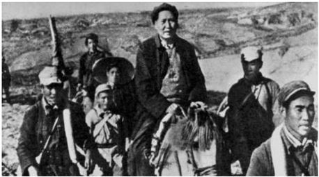

**ஜப்பபானிய ஆக்கிரமிப்பு**

வடபுறசீனப் பகுதிகளை தொடர்ச்சியாக ஆக்கிரமித்து வந்த ஜப்பபான் மஞ்சூரியாவைத் தனது இராணுவத் தளமாகப் பயன்படுத்தியது. மாவோ ஜப்பபானுக்கு எதிராக போரிட ஷியாங் கே-ஷேக் தேவை என்றும் அவர் கோமின்டடாங் மீது சிறிது கா லத்திற்ககாவது கட்டுப்பபாடு கொண்டிருப்பது அவசியம் என்றும் நினைத்ததார். இத்தகைய நெறிப்படுத்தப்பட்ட சிந்தனையால் பொதுவுடைமைவாதிகளின் மீதானத் தாக்குதல் சிறிது சிறிதாகக் குறைக்கப்பட்டது.

**பொதுவுடைமைவாதிகளின் வெற்றி**

ஜப்பபான் சரணடைவதாக அறிவித்த 1945இல் பொதுவுடைமைவாதிகளும் கோமின்டடாங் கட்சியினரும் போட்டி போட்டுக் கொண்டு ஜப்பபானின் பகுதிகளை ஆக்கிரமிக்கலாயினர். இப்போட்டியில் கோமின்டடாங்ககே வெற்றி பெற்றது. ஜப்பபானிய நகரங்களும் இருப்புப்பபாதைப் போக்குவரத்தும் அதன் கட்டுப்பபாட்டுக்குள் வந்தன. அமெரிக்க ஐக்கிய நாடு இராணுவரீதியாக உதவியதால் ஷியாங் கே - ஷேக்கின் படைகள் பீகிங்ககை சுற்றியமைந்திருந்த பகுதிகளைத் தங்களின் கட்டுப்பபாட்டுக்குள் கொண்டு வந்தனர்.

அமெரிக்க ஐக்கிய நாட்டின் அமோக ஆதரவால் கோமின்டடாங் அரசு நிருவாகத்ததையும், துறைமுகங்களையும் தகவல் தொடர்பபையும் தன்வசப்படுத்திக் கொண்டது. ஆனால் பெரும்பபான்மமையாக விவசாயிகளை உள்ளடக்கியப் போர்வீரர்களின் எதிர்பபார்ப்புகளை பூர்த்தி செய்யயாததால் அவர்களின் அதிருப்தியையும் சம்பபாதித்தது. நடுத்தர வர்க்கத்தின் ஆதரவைப் பெற மாவோ கடுமையாக முயற்சித்ததார். அதனால் கம்யூனிஸ்டுகள் மக்களாட்சியைத்ததான் விரும்புவதாகவும் சர்வவாதிகார ஆட்சியை அல்ல என்றும், சுரண்டலை முடிவுக்கு கொண்டுவரவே முனைவதாகவும் முழுமையான சமத்துவத்ததை நிறுவ அல்ல என்றும் பிரகடனப்படுத்தினார்.

**தேசிய மக்கள் காங்கிரஸ்**

தென் சீனாவில் சச்சரவுகள் முடிவடையும் முன்பபே செப்டம்பர் 1949இல் மக்கள் அரசியல் கலந்ததாய்வு மாநாடு பீகிங் நகரில் கூடியது. பொதுவுடைமைக் கட்சியிலிருந்தும் பிற இடதுசாரி அமைப்புகளில் இருந்தும் 650 பிரதிநிதிகள் கலந்து கொண்ட இம்மமாநாடு நடுவண் ஆட்சிக்குழுவைத் தேர்ந்ததெடுத்து அதற்கு மா சே துங்ககை தலைவராக நியமித்தது. இக்குழு ஐந்ததாண்டுகளுக்குச் சீனாவை ஆட்சி செய்தது.

மா சே துங்கின் (மாவோ) தலைமையில் உருவான சீன மக்கள் குடியரசு ஆட்சியின் செயல்பபாடுகள் உலகையே திரும்பிப் பார்க்க வைத்தன. உலகின் இரு பெரும் பொதுவுடைமை சக்திகளாய் சோவியத் ரஷ்யயாவும் சீன மக்கள் குடியரசும் உருவெடுத்தன.

**ஐ.நா . சபையில் உறுப்பினராக மறுக்கப்படல்**

அமெரிக்க ஐக்கிய நாடு ஏறத்ததாழ இருபது ஆண்டுகளுக்கு மேலாக சீன மக்கள் குடியரசை அங்கீகரிக்க மறுத்ததால் ஐ.நா. சபையில் உறுப்பினராக தாமதமானது.

4.2

பனிப்போர்: அமெரிக்க ஐக்கிய நாட்டிற்கும் சோவியத் ஐக்கியத்திற்கும் இடையே ஏற்பட்ட எதிர்ப்பு

## 1. பொதுவுடைமையைக் ட்ரூமெனின் வரையறை

கட்டுக்குள் வைக்க

கிழக்கு ஐரோப்பபாவில் நாசிக்கள் கட்டுப்பபாட்டில் இருந்து விடுவிக்கப்பட்ட நாடுகளில், சோவியத் இராணுவத்ததால் 1948 முதல் பொதுவுடைமை அரசுகள் ஏற்படுத்தப்பட்டன. அமெரிக்க ஐக்கிய நாட்டின் குடியரசுத் தலைவரான ட்ரூமென்

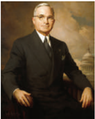

பனிப்போர்: இரண்டடாம் உலகப்போருக்குப் பின்னர் அமெரிக்க ஐக்கிய நாட்டிற்கும் சோவியத் நாட்டிற்கும் இவற்றின் நட்பு நாடுகளுக்குமிடையே மூண்ட விரோதம், பரபரப்பபையே பனிப்போர் என்கின்றனர். அவை நேரடியாக ஆயுதங்களைக் கொண்டு தாக்குதல் நடத்தவில்லலை. மாறாக, அவர்கள் அரசியல் பொருளாதார சிந்தனைத் தளங்களைத் தெரிவு செய்து தாக்கிக்கொண்டனர்.

பொதுவுடைமையை கட்டுக்குள் வைக்க ஒரு வரைவை முன் மொழிந்ததார். சோவியத் நாடோ கிழக்கு ஐரோப்பபா மட்டுமல்லலாமல் உலகம் முழுதும் பொதுவுடைமைக் கருத்ததைப் பரப்ப தீர்மமானமாக இருந்தது.

## 2. மார்ஷல் திட்டம்

மேற்கு ஐரோப்பிய நாடுகளை தனது செல்வவாக்கினுள் வைத்துக் கொள்ள அமெரிக்க ஐக்கிய நாடு மார்ஷல் திட்டத்ததை உருவாக்கியது. இத்திட்டம் இரண்டடாம் உலகப்போரின் பா திப்புகளில் இருந்து மீண்டு வருவதற்ககாக அமெரிக்க டாலர்களைப் பயன்படுத்திக் கொள்ள வழிவகை செய்தது.

இரண்டடாம் உலகப் போருக்கு பிறகு ஏற்பட்ட வறுமை , வேலையில்லலாத் திண்டடாட்டம், இடப் பெயர்வு போன்ற பிரச்சனைகளே மேற்கு ஐரோப்பபாவிற்குள் பொதுவுடைமைக் கருத்து வளரக் காரணமாய் அமையும்

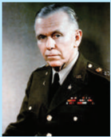

என்று அமெரிக்க ஐக்கிய நாடு கருதியது. அமெரிக்க ஐக்கிய நாட்டின் செயலாளர் ஜார்ஜ் சி.மார்ஷல் ஐரோப்பபாவின் சுய முன்னனேற்ற முயற்சிக்குத் தம் நாடு பணஉதவி செய்யுமென்று அறிவித்ததார். பதினாறு நாடுகள் இத்திட்டத்தின் மூலம் பயனடைந்தன. நிருவாக மற்றும் தொழில்நுட்ப உதவிகளும் அமெரிக்க ஐக்கியப் பொருளாதார ஒத்துழைப்பு நிருவாகத்தின் கீழ் வழங்கப்பட்டன. நிதியுதவி வழங்கும் மார்ஷலின் திட்டமானது 1951இல் முடிவுக்கு வந்தது.

இராணுவ ஒப்பந்தங்களின்

### 4.3 உருவாக்கம்

**(அ) நேட்டோ (NATO)**

அமெரிக்க ஐக்கிய நாடும் அதன் ஐரோப்பியத் தோழமை நாடுகளும் சேர்ந்து வடக்கு அட்லலாண்டிக் ஒப்பந்த அமைப்பபை 1949இல் ஏற்படுத்தி சோவியத்

இரண்டடாம் உலகப்போருக்குப் பிந்ததைய உலகம்

நாட்டின் ஆக்கிரமிப்புப் போக்ககை ஐரோப்பபாவிற்குள் தடைசெய்ய முற்பட்டன. இவ்வொப்பந்தம் வடக்கு அமெரிக்ககா மற்றும் ஐரோப்பபாவின் நாடுகளுக்கிடையே ஏற்படுத்தப்பட்ட இராணுவக் கூட்டுஒப்பந்தமாகும். இதன் முக்கிய உறுப்பு நாடுகள் கனடா , ப பெல்ஜியம், டென்மமார்க், பிரான்ஸ், ஐஸ்லலாந்து, இத்ததாலி, லக்ஸம்பர்க், நெதர்லலாந்து, நார்வவே , போர்ச்சுகல் மற்றும் இங்கிலாந்து ஆகியன. பின்னர் 1952இல் துருக்கியும் கிரீசும் இவ்வொப்பந்தத்தில் தங்களை இணைத்துக் கொண்டன. ஜெர்மனி 1955ஆம் ஆண்டு இவ்வொப்பந்தத்தில் இணைந்தது. நேட்டோ ஒப்பந்தத்தின் முக்கிய அம்சமானது வடக்கு அட்லலாண்டிக் பகுதியில் அமைதியையும் பா துகாப்பபையும் உறுதி செய்வதாகும்.

**(ஆ) சீட்டோ (SEATO) அல்லது மணிலா ஒப்பந்தம்**

தென்கிழக்கு ஆசிய ஒப்பந்த அமைவு என்பது தென்கிழக்கு ஆசிய நாடுகளின் கூட்டுப் பாதுகாப்பபை முன்னிறுத்தியதாகும். மணிலா ஒப்பந்தம் (1954), அமெரிக்க ஐக்கிய நாடு, பிரான்ஸ், இங்கிலாந்து, நியூஸிலாந்து, ஆஸ்திரேலியா, பிலிப்பபைன்ஸ், தாய்லலாந்து மற்றும் பாகிஸ்ததான் போன்ற நாடுகளால் கையெழுத்திடப்பட்டது. இவ்வொப்பந்தத்தின் உறுப்புநாடுகள் இப்பகுதியில் பொதுவுடைமைச் சிந்தனை பரவுவதையும் அக்கொள்ககை செல்வவாக்குப் பெறுவதையும் தடுப்பதற்ககாக ஏற்படுத்தப்பட்டது. ஆனால், நேட்டோ கூட்டமைப்பில் இருந்தது போன்று நிரந்தரப் படைகளையோ , ஒருங்கிணைந்த கட்டுப்பபாட்டடையோ சீட்டோ கொண்டிருக்கவில்லலை .

**(இ) வார்சசா ஒப்பந்தம் (Warsaw Pact)**

நேட்டோவிற்கு எதிராக சோவியத் நாடு தன் ஆதரவு நாடுகளைக் கொண்டு உருவாக்கியதே வார்சசா ஒப்பந்தமாகும். ஐரோப்பபாவை சேர்ந்த எட்டு முக்கிய நாடுகளான அல்பபேனியா, பல்ககேரியா , ஹங்ககேரி, செக்கோஸ்லோவியா, கிழக்கு ஜெர்மனி, போலந்து, ருமேனியா மற்றும் ரஷ்யயா ஆகியவை டிசம்பர் 1954இல் மாஸ்கோவில் கூடி ஒரு கலந்துரையாடலை நடத்தின. இவை மீண்டும் மே 14, 1955இல் கூடி ஓர் ஒப்பந்தத்ததை ஏற்படுத்தின. இதுவே 'வார்சசா உடன்படிக்ககை' என்று அழைக்கப்படுகிறது. இந்நநாடுகள் மாஸ்கோவைத் தலைமையிடமாகக் கொண்டு ஒரு கூட்டு இராணுவப் படைகளை நிறுவின. 1991இல் வார்சசா ஒப்பந்தத்ததை சோவியத்தின் பிளவு முடிவுக்குக் கொண்டு வந்தது.

**(ஈ) சென்டோ (CENTO) அல்லது பாக்ததாத் ஒப்பந்தம்**

துருக்கி, ஈராக், பிரிட்டன், பாகிஸ்ததான், ஈரான் ஆகிய நாடுகள் 1955இல் ஏற்படுத்திய ஒப்பந்தமே பா க்ததாத் ஒப்பந்தம் என்றழைக்கப்படுகிறது. அமெரிக்க ஐக்கிய நாடு இவ்வுடன்படிக்ககையில்

இரண்டடாம் உலகப்ப ருக்குப் பிந்ததைய உலகம்

1958இல் இணைந்ததோடு, இவ்வொப்பந்தம் 'மத்திய உடன்படிக்ககை அமைப்பு' என்று அறியப்பட்டது. இவ்வொப்பந்தம் அமைதியையும் பா துகாப்பபையும் விரும்பும் அனைத்து அரபு நாடுகளுக்கும் திறந்ததே இருப்பதாக அறிவிக்கப்பட்டதெனினும் இவ்வொப்பந்தம் 1979இல் கலைக்கப்பட்டது.

### 4.4 கொரியப்போர்

கொரியப்போர் பனிப்போரை மேலும் சூடுபிடிக்க வைத்தது. கொரிய நாடு வடக்கு தெற்கு என இருபிரிவுகளாக 1945இல் பிரிக்கப்பட்டபின் உருவான இருபிரிவுகளும் நாட்டினை ஒருங்கிணைத்து ஆட்சி புரியும் அதிகாரத்ததை கோர விரும்பின. வடகொரிய அதிபரான இரண்டடாம் கிம் (கொரிய மக்கள் குடியரசு) தென்பகுதி எதிரியாகக் கருதிய சிங்மமென் ரீ-க்கு (கொரியக் குடியரசு) ஒரு வாய்ப்புக்கிடைக்கும் முன்பபே செயல்பட முடிவெடுத்ததார். ஸ்டடாலினின் பின்புலத்தில், ஜூன் 1950இல் அவர் படையெடுப்பபைத் தொடங்கினார். கிம்மும் ஸ்டடாலினும் இப்பிரச்சனையில் அமெரிக்க நாடு தலையிடும் என்று எதிர்பபார்க்கவில்லலை . இப்போர் மூன்று ஆண்டுகள் வரை நீடித்தது இப்போரால் ஏற்பட்ட மனித உயிரிழப்பு எண்ணிக்ககையில் அளவிட முடியாததாய் இருந்தது. இதனால் கொரிய மக்களுக்கு எந்த லாபமும் ஏற்படவில்லலை .

**மூன்றறாம் உலக நாடுகள்**

அமெரிக்க ஐக்கிய நாட்டின் தலைமையில் கூடிய முதலாளித்துவ நாடுகள் உலக அரசியலில் முதலாம் உலக நாடுகள் என்றும் சோவியத் நாட்டின் தலைமையில் கூடிய பொதுவுடைமை நாடுகள் இரண்டடாம் உலக நாடுகள் என்றும் அழைக்கப்பட்டன. இவ்விரு பிரிவிலும் சேராமல் வெளியிலிருந்த நாடுகள் மூன்றறாம் உலக நாடுகள் என்று அழைக்கப்பட்டன.

### 4.5 அணிசேரா இயக்கம்

இரண்டடாம் உலகப்போருக்குப் பின் ஏற்பட்ட காலனியாதிக்க வெளியேற்றத்தின் பின்னணியில் அணிசேரா இயக்கம் உருப்பபெற்றது. புதிதாக அரசியல் சுதந்திரம் பெற்ற ஆசிய, ஆப்பிரிக்க நாடுகள் 1955இல் பாண்டுங்கில் (இந்தோனேசியா) கூடி இரு வல்லரசுகளின் அணிகளிலும் சேரக்கூடாது என்பதைத் தீவிரமாக வலியுறுத்தின. மேலும், அவை கா லனிய ஆதிக்கமும் ஏகாதிபத்தியமும் எவ்வடிவம் எடுத்ததாலும் அதை எதிர்த்து நிற்பது என்று முடிவு செய்தன.

அணிசேரா இயக்கம் 1961இல் டிட்டோ (யுகோஸ்லோவியா), நாசர் (எகிப்து), நேரு (இந்தியா),

நுக்ருமா (கானா), சுகர்ணோ (இந்தோனேசியா) ஆகிய தலைவர்களை முன்னிறுத்தி பெல்கிரேடில் ஒரு மாநாட்டடைக் கூட்டியது. பெல்கிரேட் மாநாட்டில் வெளியிடப்பட்ட அறிக்ககை அதன் அடிப்படைக் கொள்ககைகளாகக் கூறுவதாவது: அமைதியோடு இணைந்திருத்தல், அமைதியையும் பாதுகாப்பபையும் முன்னிறுத்தப் பாடுபடல், எந்த அணியோடும் இராணுவக் கூட்டுறவுக் கொள்ளளாமல் இருத்தல், எந்த வல்லரசுக்கும் தத்தம் நாட்டிற்குள் இராணுவ நிலைகள் ஏற்படுத்த அனுமதி வழங்ககாமல் இருத்தல் போன்றவையே ஆகும். சோவியத்தின் வீழ்ச்சிக்குப் பிறகு அணிசேரா இயக்கத்தின் தேவை மங்கியது.

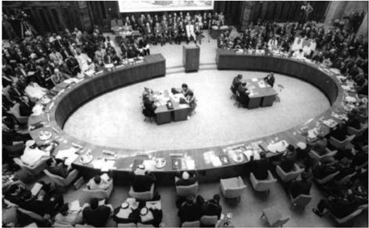

### 4.6 கியூபாவின் புரட்சி

அமெரிக்க ஐக்கிய நாடு மத்திய அமெரிக்ககாவிலும் (ஹோண்டுரஸ், எல் சல்வதோ , நிகரகுவா, பனாமா, க்வவாத்தமாலா) கரீபியப் பகுதியிலும் (கியூபா , டோமினியக் குடியரசு, ஹைதி) கிழக்கு ஆசியாவிலும் (பிலிப்பபைன்ஸ், தென் கொரியா ,

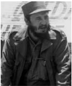

தெற்கு வியட்நநாம், தாய்லலாந்து) தனக்கு துணைக் கோள்களாகச் சுற்றிச் செயல்படும் நாடுகளைக் கொண்டிருந்தது. இந்நநாடுகள் இராணுவ அதிகாரிகளாலும் பெரும் நிலச்சுவான்ததாரர்களாலும் சில சூழ்நிலைகளில் பெருமுதலாளிகளாலும் ஆட்சி செய்யப்பட்டு வந்தன.

காஸ்டட்ரரோ பதவியேற்ற பின் கியூபாவிலிருந்த அமெரிக்க ஐக்கிய நாட்டிற்குச் சொந்தமான எண்ணணெய்ச் சுத்திகரிப்பு ஆலைகள் ரஷ்யயாவிலிருந்து இறக்குமதி செய்யப்பட்ட எண்ணணெய்களைச் சுத்திகரிக்க மறுத்தன. ஆகவே காஸ்டட்ரரோ எண்ணணெய் ஆலைகளை தேசியமயமாக்கினார். அதற்குப் பதிலடியாக அமெரிக்க ஐக்கிய நாடு அதுவரை கியூபாவிலிருந்து மொத்தமாக சர்க்கரைக் கொள்முதல் செய்து வந்ததை நிறுத்திக் கொண்டது. காஸ்டட்ரரோ

நாட்டிலிருந்த அமெரிக்க ஐக்கிய நாட்டின் சர்க்கரை ஆலைகளை தேசியமயமாக்கியதன் மூலம் மின்சசார விநியோகத்திலும் தொலைபேசி வசதிகள் ஏற்படுத்துவதிலும் அமெரிக்க ஐக்கிய நாட்டிற்கிருந்த ஏகபோக உரிமையை முடிவுக்குக் கொண்டு வந்ததார். இதனால் அமெரிக்கப் பொருளாதாரத்திற்கு அச்சுறுத்தல் ஏற்பட்டது.

**கியூபாவின் ஏவுகணைச் சிக்கல்**

கியூபாவிலிருந்து வெளியேற்றப்பட்டிருந்த மக்களைக் கொண்ட ஒரு படையை பிக்ஸ் வளைகுடாவில் ஏப்ரல் 1961இல் இறக்கிய அதே வேளையில் காஸ்டட்ரரோவின் ஆட்சியை முடிவுக்குக் கொண்டுவரும் நோக்கோடு அதன் விமானத் தளங்களை அமெரிக்க ஐக்கிய நாடுகள் குண்டு வீசித் தாக்கியது. அமெரிக்ககாவின் போர்க் கப்பல்கள் கியூபாவைச் சுற்றிவளைத்தன. சோவியத்நநாடு கியூபாவில் அணுசக்தியோடு இணைக்கப்பட்ட ஏவுகணைகளை இரகசியமாக நிறுவப்போவதாய் கென்னடி தலைமையிலான அமெரிக்க அரசிற்கு உளவுத்துறை தகவல் கொடுத்தது. இறுதியாக சோவியத்நநாட்டின் குடியரசுத்தலைவர் குருசேவ் ஏவுகணைகளைத் திரும்பப்பபெற உறுதியளித்ததால் பிரச்சனைக்கு முற்றுப்புள்ளி வைக்கப்பட்டது.

மேற்கொண்டு இருதரப்பினரும் ஓர் உடன்படிக்ககையை ஏற்படுத்த முன்வந்தனர். அதன்படி அமெரிக்கநாடு கியூபா மீது எப்போதும் போர்தொடுப்பதில்லலை என்ற நிலைப்பபாட்டடை உறுதி செய்ததால் சோவியத் நாடு ஏவுகணைகளைக் கியூபாவிலிருந்து அகற்றியது .

### 4.7 அரபு-இஸ்ரரேல் போர்

வெர்சசெய்ல்ஸ் உடன்படிக்ககையின் (1919) மூலம் 'துருக்கிய அரபுப் பேரரசை' உருவாக்க நிர்ப்பந்திக்கப்பட்டது. பிரான்ஸ் நாடு சிரியாவையும் லெபனானையும் ஒருங்கிணைக்கவும் பிரிட்டன் நாடு ஈராக், பாலஸ்தீன், ஜோர்டடான் ஆகிய நாடுகளை ஒருங்கிணைக்கவும் ஏற்பபாடானது. முதலாம் உலகப்போருக்குப்பின் சுதந்திரத்ததை எதிர்பபார்த்த அரேபியர்கள் இவ்வவேற்பபாட்டடால் அதிர்ச்சியடைந்தனர். சீயோனிய இயக்கத் தலைவர்களுக்கு பிரிட்டன் நாடு பாலஸ்தீனத்தின் பகுதிகளை யூதக்குடியிருப்புகளுக்கு வழங்க உறுதியளித்தது. யூதர்கள் அரேபியரின் எந்த ஒரு கிளர்ச்சியையும் பிரிட்டனுடன் சேர்ந்து ஒடுக்க உறுதியளித்தனர். வசதியான அரேபியரிடம் நிலங்களை விலைபேசிப் பெற்றுக்கொண்ட யூதர்கள் அங்ககே பல தலைமுறைகளாக வேளாண்மமை செய்து வந்தவர்களை விரட்டியதால் அரேபியர்களின் வெறுப்புணர்ச்சியும் எதிர்ப்பும் மிகுந்தது.

இரண்டடாம் உலகப்போருக்குப் பிந்ததைய உலகம்

1945 அக்டோபர் இறுதியில் யூதத் திரைமறைவு அமைப்புகளான இர்கூன் ஸ்வவாய் லூமி (சீயோனியத் துணை இராணுவ அமைப்பு) ஸ்டடென் காங்கும் (சீயோனிய பயங்கரவாத அமைப்பு) தொடர்ச்சியாக பயங்கரவாதத் தாக்குதல்களை பெருமளவில் தொடுத்தன. இருப்புப்பபாதைகள், பா லங்கள், விமானத்தளங்கள், அரசு அலுவலகங்கள் போன்றவை வெடிவைத்துத் தகர்க்கப்பட்டன. பிரிட்டிஷ் அரசு பிரச்சனையை ஐ.நா. சபைக்கு எடுத்துச் சென்று தீர்வு கோரியது. ஐ.நா. சபையும் அதற்கு உடன்பட்டு பிரிவினைக்குச் சம்மதித்தது. பிரிட்டன் தனது துருப்புகளை விலக்கிக்கொள்ள முடிவு செய்த போது அங்கு மீண்டும் சண்டடை மூண்டது.

பிரிட்டிஷ் நாட்டின் யோசனையை வல்லரசுகள் ஆதரித்ததால் ஐ.நா. சபையும் அதற்கு உடன்பட்டு பாலஸ்தீனத்ததை யூத நாடாகவும் அரேபிய நாடாகவும் (29 நவம்பர் 1947) இரு பிரிவுகளாகப் பிரித்தது. இதனால் யூதர்களுக்கும் அரேபியர்களுக்கும் பாலஸ்தீனத்தில் உடனடியாக சண்டடை மூண்டது.

சீயோனிய இயக்கம் : யூதர்களின் பூர்வீகப்பகுதியான பாலஸ்தீனத்தில் 1900இல் ஆயிரம் யூதர்களே குடியிருந்தனர். இவ்வினத்தின் பதினைந்து மில்லியன் மக்கள் ஐரோப்பபாவிலும் வடக்கு அமெரிக்ககாவிலும் பரவிக்கிடந்தனர் (இதுவே 'புலம்பபெயர்' சமூகம் என்று குறிக்கப்படுகிறது). வியன்னனாவில் பத்திரிகையாளராக இருந்த தோடோர் ஹெர்சல் யூத நாடு என்ற பெயரில் 1896ஆம் ஆண்டு ஒரு துண்டுப்பிரசுரத்ததை வெளியிட்டடார். அதற்கு அடுத்த ஆண்டு (1897) உலக சீயோனிய அமைப்பு உருவாக்கப்பட்டது.

இஸ்ரரேலியர்கள் ஜெருசலேமுக்குச் செல்லும் முக்கிய சாலையைக் கைப்பற்றிய பின் அதை மீட்க அரேபியர்கள் மேற்கொண்ட பல முயற்சிகளையும் வெற்றிகரமாக முறியடித்தனர். இஸ்ரரேலுடன் அரபு நாடுகள் தனித்தனியாக 1947 பிப்ரவரி முதல் ஜூன் வரை ஏற்படுத்திக் கொண்ட அமைதி உடன்படிக்ககைகளின் கீழ் இஸ்ரரேலுக்கும் அதன் பக்கத்து நாடுகளுக்குமிடையே தற்ககாலிகமான எல்லலை நிர்ணயம் செய்யப்பட்டது. இஸ்ரரேலைப் பொறுத்தவரை இக்ககாலகட்டத்தில் நிகழ்ந்த போர்கள் யாவும் அதன் சுதந்திரவேட்ககையின் வெளிப்பபாடாகவும் சுதந்திரப் போராகவுமே நினைவு கொள்ளப்பட்டது. அரேபியர்களைப் பொறுத்தமட்டில் பலரும் இப்போர்களினால் அகதிகளாக இடம்பபெயர வேண்டியிருந்ததால் அது நக்பபா (பேரழிவு) என்று கருதப்பட்டது. அரேபியர்களின் எதிர்ப்பபை மீறி

இரண்டடாம் உலகப்ப ருக்குப் பிந்ததைய உலகம்

இஸ்ரரேலுக்கு உடனடியாக ஐ.நா. சபையின் உறுப்பினர் தகுதி வழங்கப்பட்டது.

**சூயஸ் கால்வவாய் சிக்கல் (1956)**

எகிப்தில் 1952இல் நிகழ்ந்த ஓர் இராணுவக் கிளர்ச்சியின் மூலமாக கர்னல் நாசர் குடியரசுத்தலைவராக ஆக்கப்பட்டடார். அவர் 1956ஆம் ஆண்டில் சூயஸ் கால்வவாயை தேசியமயமாக்கினார். இது பிரிட்டிஷாரின் நல்லலெண்ணணெத்திற்கு விரோதமாகத் தெரிந்தது. இராஜதந்திரப் பிரயோகங்கள் பலனளிக்ககாத நிலையில் பிரிட்டனும் பிரான்சும் இணைந்து இராணுவ பலத்ததைப் பயன்படுத்த முடிவுசெய்தன. இச்சூழலில் தனக்கு ஒரு வாய்ப்பு இருப்பதாகக் கருதிய இஸ்ரரேல் தனது க ப்பல் போக்குவரத்திற்கு வசதியாக அக்கபா வளைகுடாவை திறந்துவிட்டதோடு அதன் மூலம் எகிப்தின் எல்லலை மீறிய செயல்களுக்கு முற்றுப்புள்ளி வைத்தது. இஸ்ரரேலியப் படைகள் அக்டோபர் 29இல் எகிப்து மீது படையெடுத்தன. இவ்வவாய்ப்பபைப் பயன்படுத்திக்கொள்ள நினைத்த பிரிட்டன் தனது படைகளைக் கால்வவாயைக் காப்பபாற்றும் வகையில் நிறுத்தி வைக்க அனுமதி கோரியது. இதற்கு எகிப்து மறுத்ததால் அக்டோபர் 31இல் பிரிட்டனும் பிரான்சும் இணைந்து அந்நநாட்டின் விமானத்தளங்கள் மீதும் இன்னும் பிற முக்கியத்தளங்கள் மீதும் சூயஸ்ககால்வவாய்ப் பகுதியிலும் குண்டு வீசின. எனினும் உலக நாடுகளின் வற்புறுத்தலின்பபேரில் நவம்பர் 6ஆம் தேதி பிரான்சும் பிரிட்டனும் தங்கள் எதிர்ப்பபை நிறுத்திக்கொண்டன. இந்தியாவை பிரதிநிதித்துவப்படுத்தி பிரதமர் நேரு இப்பிரச்சனைக்கு முடிவுகட்ட சீரிய பங்ககாற்றினார்.

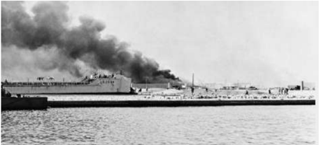

அரபு - இஸ்ரரேல் போர் (1967)

உருவானது முதல் சிரியா , லெபனான், ஜோர்டடான் ஆகிய நாடுகளில் பதுங்கியிருந்த பாலஸ்தீனிய கொரில்லலாப்படைகள் இஸ்ரரேலைத் தாக்கிவந்தன. இஸ்ரரேல் பதிலடி கொடுத்து வந்தது. ஜோர்டடானின் மேற்குக்கரையில் அமைந்திருந்த அல்-சமூ என்ற கிராமத்தின் மீது நவம்பர் 1966இல் இஸ்ரரேல் விமானத் தாக்குதல் நடத்தி 18 பேர் உயிரிழக்கவும் 54 பேர் காயங்கள் அடையும்படியும் செய்தது. சிரியாவுடன் ஏப்ரல் 1967இல் நடந்த வான்வவெளித்

தாக்குதலில் ஆறு சிறிய மிக் ரகப் போர் விமானங்கள் சுட்டு வீழ்த்தப்பட்டன. சிரியாவுக்கு தார்மீக ஆதரவு கொடுக்க விழைந்த நாசர் சினாய் மலையில் எகிப்தியப் படைகளைக் கொண்டு வந்து நிறுத்தியதோடு மே 18இல் ஐ.நா. சபை அங்கு நிறுத்தி வைத்திருந்த படைகளை அப்புறப்படுத்தக் கோரினார். மேலும், மே 22இல் அக்கபா வளைகுடாவை வளைத்து அங்கு இஸ்ரரேலியக் க ப்பல்கள் நுழைய முடியாதபடி செய்ததார். ஜோர்டடானின் மன்னர் ஹூசைன் எகிப்தோடு பரஸ்பர இராணுவ ஒப்பந்தங்களை ஏற்படுத்திக் கொண்டடார். இதன்படி ஜோர்டடானியப் படைகள் எகிப்தின் கட்டளைக்கு அடிபணியச் சம்மதித்தன. சிறிதுகாலத்தில் ஈராக்கும் இக்கூட்டணியில் இணைந்தது.

**பா லஸ்தீனிய விடுதலை அமைப்பு**

இஸ்ரரேல் என்ற தேசம் 1948இல் உருவாவதற்கு முன் பாலஸ்தீனத்தில் வாழ்ந்த அரேபியர்களுக்கும் அவர்கள் வம்சசாவளியினருக்குமாக உருவாக்கப்பட்ட ஒரு பரந்த அமைப்பு இதுவாகும். இரகசியமாக செயல்பட்டுவந்த எதிர்ப்பு இயக்கங்கள் தங்களை ஒருங்கிணைக்க 1964இல் உருவாக்கப்பட்ட அமைப்பபாகும். இவ்வமைப்பின் முக்கிய தலைவர் யாசர் அராபத் ஆவார்.

**இஸ்ரரேலின் தாக்குதல்**

அரபு நாடுகளை நாசர் ஒன்றிணைக்க மேற்கொண்ட முயற்சியைத் தொடர்ந்து

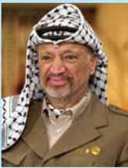

யாசர் அராபத் (1924-2004) யா சர் அராபத் பா லஸ்தீன விடுதலை அமைப்பின் செயற்குழுவிற்கு 1969இல் தலைமையேற்று 2004இல் அவர் இறக்கும் வரை அப்பொறுப்பில் வீற்றிருந்ததார். செப்டம்பர்

1970இல் அவர் அனைத்துப் பாலஸ்தீன அரபு கொரில்லலாப்படைகளுக்கும் முதன்மமைத் தளபதியாகவும் நியமிக்கப்பட்டிருந்ததார். ஒரு தலைப்பபாகையுடனும் மறைவாக அவர் வைத்திருந்த துப்பபாக்கியும் ஆலிவ் மரக்கிளையின் பகுதியும் அவர்தம் இராணுவச்சீருடையும் காண்போர் மனதில் பா லஸ்தீனப் பிரச்சனையின் தீவிரத்ததை நினைவூட்டுவதாக அமைந்தது. அவர் 2 ஏப்ரல் 1989 அன்று பாலஸ்தீன விடுதலை அமைப்பின் நடுவண்குழுவால் பாலஸ்தீன தேசத்தின் முதல் அதிபராகத் தேர்ந்ததெடுக்கப்பட்டடார்.

ஜூன் 5ஆம் தேதி இஸ்ரரேல் எதிர்பபாராத தாக்குதல் ஒன்றறைத் தொடுத்து எகிப்தின் 90 சதவீத விமானப்படையை தரைமட்டமாக்கியது. இதுபோன்றறே நிகழ்ந்த மற்றொரு தாக்குதலில் சிரியாவின் விமானப்படையும் கடும் பாதிப்புக்கு உள்ளளாகியிருந்தது. மூன்றறே நாள்களில் இஸ்ரரேலியர்கள் காஸா பகுதியையும் சூயஸ் கா ல்வவாயின் கிழக்குப்புறம் அமைந்த சினாய் தீபகற்பத்தின் முழுமையையும் கைப்பற்றிப் பெரும் வெற்றியைக் குவித்தனர்.

**அரபு-இஸ்ரரேல் போர் (1973)**

தங்களின் படைகளை ஒரே கட்டுப்பபாட்டுக்குள் கொண்டு வரும் நோக்கோடு எகிப்தின் அதிபர் அன்வர் சாதத்தும் சிரியாவின் அதிபர் ஹபீஸ் அல்-ஆஸாத்தும் ஜனவரி 1973இல் ஓர் இரகசிய ஒப்பந்தத்ததை ஏற்படுத்திக் கொண்டனர். சாதத் சினாய் மலையை விட்டு இஸ்ரரேல் விலகினால் தாம் அமைதி உடன்படிக்ககைக்குத் தயாராய் இருப்பதாகத்

தெ ரிவித் ததா ர் . இதற்கு இஸ்ரரேல் இணங்கவில்லலை . ஆகவே எகிப்தும் சிரியாவும் யோம் கிப்பூர் சமய விடுமு றை ய ன் று (6 அக்டோபர் 1973) ஓர் எதிர்பபாராத திடீர் தாக்குதலை

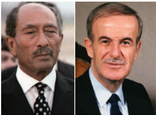

இஸ்ரரேல் மீது தொடுத்தனர். இத்ததாக்குதலில் இஸ்ரரேல் கடும்பின்னடைவைச் சந்தித்தபோதும் அதனால் அரபுப் படைகளை புறந்தள்ள முடிந்தது. இப்போரினால் அரேபியர்களும் எந்தலாபமும் பெறமுடியவில்லலை. இப்பிரச்சனையில் நடுவராகச் செயல்படும் போர்வவையில் அமெரிக்க ஐக்கிய நாடு தனது ஆதிக்கத்ததை அரபு நாடுகள் மீதும் அங்ககே அமையப்பபெற்ற எண்ணணெய்க் கிணறுகள் மீதும் நிறுவியது.

### 4.8 வியட்நநாம் போர்

இரண்டடாம் உலகப்போரின் முடிவில் வியட்மின் என்ற அமைப்பு வியட்நநாமின் வடக்குப் பா தியைத் தனது கட்டுப்பபாட்டுக்குள் வைத்திருந்தது. வியட்மின் ஹோ சி மின் தலைமையில் ஹனோய் நகரில் ஓர் அரசை உருவாக்கியது. இவ்வியட்மின் அரசு தென்பபாதி வியட்நநாமை வேகமாக ஆக்கிரமித்தது. எனினும் போட்ஸ்டடாம் நகரில் கூடிய நேசநாடுகள் ஜப்பபானிடமிருந்து மீட்கப்பட்ட இந்தோ – சீனப்பகுதியின் தெற்குப்பகுதியை பிரிட்டிஷாரும் வடக்குப்பகுதியை சீனாவுமாக பிரித்துக் கொள்வது என முடிவு செய்தன. ஹோ சி மின்னின் கட்டுப்பபாடு

இரண்டடாம் உலகப்போருக்குப் பிந்ததைய உலகம்

உறுதியாக இருந்ததால் வியட் மின்னனையும் பிரெஞ்சுப்படைகளையும் மோதிக்கொள்ளும்படி செய்துவிட்டு சீனப்படைகளும் பிரிட்டிஷ்படைகளும் 1946இன் தொடக்கத்தில் பின்வவாங்கின. இரு அரசுகளும் (பிரெஞ்சு மற்றும் வியட்மின்) ஏற்படுத்திக் கொண்ட உடன்படிக்ககையின் அடிப்படையில் வடக்கு வியட்நநாம் ஒரு விடுதலைபெற்ற நாடாக இந்தோ–சீனக் கூட்டடாட்சியில் பங்ககெடுப்பது என்று முடிவானது.

1949இல் மக்களின் ஆதரவைப்பபெற எண்ணிய பிரெஞ்சு அரசு வியட்நநாம், லாவோஸ், கம்போடியா ஆகிய நாடுகளை ஒரு பிரெஞ்சு கூட்டடாட்சியினுள் கொண்டு வந்து அவற்றறை சுதந்திரநாடாக அறிவித்து அந்நநாடுகளின் வெளியுறவுத்துறையையும் இராணுவத்ததையும் தன் கட்டுப்பபாட்டுக்குள் வைத்துக்கொள்ளப் போவதாய் கூறியது.

அமெரிக்ககாவிடமிருந்து உதவித்தொகையை பிரெஞ்சு பெற்றபோது வியட்மின்னுக்கு சீனப் பொதுவுடைமை அரசு உதவி செய்தது. இறுதியில் பிரெஞ்சுப்படைகள் போரில் தோற்கடிக்கப்பட்டது. பின் கொரியாவில் 1954இல் கூடிய ஜெனீவா மாநாட்டில் வியட்நநாம் ஒரு சுதந்திர நாடாகக் கொள்ளப்பட்டடாலும் தற்ககாலிகமாக வியட்மின் வடக்கு வியட்நநாமையும் பாவோடாய் தலைமையிலான அரசு தெற்கு வியட்நநாமையும் ஆட்சி செய்வது என்று முடிவுசெய்யப்பட்டது. கம்போடியாவும் லாவோஸும் சுதந்திரம்பபெற்ற நாடுகளானது.

ஹோ சி மின்னனை குடியரசுத்தலைவராக ஏற்று 16 மில்லியன் என்ற அளவில் மக்கள்தொகை கொண்ட வடக்கு வியட்நநாம் ஒரு பொதுவுடைமைவாத நாடாக மாறியது. ஏறக்குறைய அதேபோன்ற பரப்பளவும் மக்கள்தொகையும் கொண்ட தெற்கு வியட்நநாமிற்கு தீவிர ரோமன் க த்தோலிக்கரான நிகோ டின் டியம் அதிபரானார். தென்வியட்நநாமில் அரசின் நிலைமை அமெரிக்க நாட்டின் பொருளாதார மற்றும் பிற உதவிகளைச் சார்ந்ததே அமைந்தது. அதன் டணாங் க ப்பல் தளத்தில் 1965இல் வந்திறங்கத் தொடங்கிய மாலுமிகளைச் சேர்த்து ஒரே மாதத்தில் 33,500 துருப்புகள் என்ற அளவில் உயர்ந்தது. அவ்வவாண்டின் கடை சியில் இவ்வவெண்ணிக்ககை உயர்ந்து 2,10,000 என்றறானது. விடுதலை இயக்கங்களை அழித்தொழிக்கும் நோக்கோடு இரவு பகலாக அமெரிக்ககா இரு வியட்நநாம்கள் மீதும் குண்டுவீசியது. கொரில்லலா போர் முறையில் பயிற்றுவிக்கப்பட்ட வடவியட்நநாமின் அமெரிக்கப் படைகள் நோய்தொற்று விளைவிக்கும் ஆயுதங்களைப் பயன்படுத்தினார்கள். நப்பபாம் ஏஜண்ட் ஆரெஞ்ச் (காடுகளை அழிக்கக்கூடிய) போன்ற தீமூட்டும் ஆயுதங்களைப் பயன்படுத்தியது. பெரும் பரப்பில் நிலம்

இரண்டடாம் உலகப்ப ருக்குப் பிந்ததைய உலகம்

அழிக்கப்பட்டதோடு ஆயிரக்கணக்ககானோர் கொல்லப்பட்டனர். அமெரிக்கப்படைகளும் சேதங்களைச் சந்தித்தன.

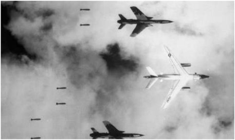

போர் 1975இன் தொடக்கத்தில் முக்கிய கட்டத்ததை எட்டியது. வடக்கு வியட்நநாமின் இராணுவமும் தெற்கு வியட்நநாமின் தேசிய விடுதலை முன்னணியும் எல்லலைகள் கடந்து அமெரிக்க ஆதரவு பெற்றத் தென் வியட்நநாமின் படைகளை நாசம் செய்தனர். மொத்த அமெரிக்கப் படை களும் 30 ஏப்ரல் 1975இல் வெளியேறியதால்

தென் வியட்நநாமின் சைகோன் நகரம் விடுதலை பெற்றது. வடக்கு வியட்நநாமும் தெற்கு வியட்நநாமும் 1976இல் ஒரேதேசமாக ஒன்றிணைக்கப்பட்டது. மிகப்பெருந்தலைவராக மக்களின் முன்

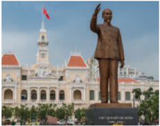

உருவெடுத்த ஹோ சி மின்னின் நினைவாக சைகோன் நகரம் ஹோ சி மின் நகரம் என்று பெயர் மாற்றப்பட்டது.

ஒருங்கிணைந்த சுதந்திர தேசமாக வியட்நநாம் உருவானது ஓர் அரிய வரலாற்று நிகழ்வவாகும். ஒரு சிறு நாடு தனது விடுதலையையும் ஒருங்கிணைவையும் உலகின் மிகப்பபெரிய சக்தியின் ஆயுதந்ததாங்கிய எதிர்ப்பபையும் மீறி அடைந்திருந்தது. சோஷலிஸ நாடுகளின் உதவியும் அரசியல் பூர்வமாக பல ஆசிய – ஆப்பிரிக்க நாடுகள் கொடுத்த ஆதரவும் உலகெங்கிலும் பரவிக்கிடந்த பல்வவேறு இனமக்கள் தார்மீக உணர்வோடு பக்கபலமாக நின்றதுமே இந்த வெற்றியை அடையக் காரணமாக அமைந்தது.

### 4.9 ஐரோப்பிய ஐக்கியத்ததை நோக்கி

(அ) ஐரோப்பியக் குழுமம்

இரண்டடாம் உலகப்போருக்குப் பின்வந்த கா லத்தில் எடுக்க முயன்ற முடிவுகளில்

முக்கியமானது மேற்கு ஐரோப்பிய நாடுகளை ஒருங்கிணைக்க நினைத்ததேயாகும். அதன்மூலம் (1) ஐரோப்பியர்களுக்கிடையே மூண்ட போர்களைத் தவிர்க்கவும் அதிலும் குறிப்பபாக பிரான்சுக்கும் ஜெர்மனிக்கும் ஏற்பட்டுக் கொண்டிருந்த பகைமையை ஒடுக்கவும், (2) ஒருங்கிணைந்த ஐரோப்பபாவைக் கொண்டு சோவியத் நாட்டின் அச்சுறுத்தல்களை எதிர்கொள்ளவும், (3) அமெரிக்க ஐக்கிய நாட்டின் படைகளுக்கும் சோவியத் நாட்டின் படை களுக்கும் சமமாக ஒரு படைபலத்ததை நிறுவவும், (4) கண்டங்களிடையே அல்லது கண்டங்களில் பொருளாதார மற்றும் இராணுவ வளங்களையும் திறன்களையும் முழுதாகப் பயன்படுத்தவும் முடியும் என்று கருதப்பட்டது. பத்துநாடுகள் லண்டனில் மே 1949இல் கூடி ஐரோப்பியசமூகத்ததை உருவாக்க கையொப்பமிட்டன. ஸ்ட்ரராஸ்பர்க் நகரை தலைமையகமாகக் கொண்ட ஐரோப்பிய சமூகத்தில் உறுப்புநாடுகளின் வெளியுறவுத்துறை அமைச்சர்களைக் கொண்ட ஒரு குழுவும் வெளிநாடுகளின் பாராளுமன்ற உறுப்பினர்கள் சிலரைக்கொண்ட கலந்ததாய்வு சபையும் அமையப்பபெற்றன.

**(ஆ) ஐரோப்பிய நிலக்கரி மற்றும் எஃகு சமூகம்**

ஐரோப்பியப் பாதுகாப்பு சமூகமும் ஐரோப்பிய நிலக்கரி மற்றும் எஃகு சமூகமும் தொடங்கப்பட்டன. ஐரோப்பிய நிலக்கரி மற்றும் எஃகு சமூகத்ததைச் சேர்ந்த ஆறு நாடுகள் (பிரான்ஸ், மேற்கு ஜெர்மனி, இத்ததாலி, பெல்ஜியம், ஹாலந்து, லக்ஸம்பர்க்) கூடி ரோம் ஒப்பந்தத்ததை ஏற்படுத்தியதோடு அதன் மூலம் ஐரோப்பியப் பொருளாதார சமூகம் அல்லது ஐரோப்பியப் பொதுச்சந்ததையை பிரெஸெல்ஸ் நகரைத் தலைமையகமாகக் கொண்டு ஏற்படுத்தின.

**(இ) ஐரோப்பியப் பொருளாதார சமூகம்**

இச்சமூகம் பண்டங்கள், சேவைகள், முதலீடு, தொழிலாளர்கள் போன்றவற்றின் நகர்வவை எல்லலைகள் கொண்டு நிறுத்துவதை மாற்றியது. சந்ததைப்போட்டியைக் கட்டுக்குள் கொண்டுவர முயன்றபோது கொள்ககைகளையும் தனியார் ஒப்பந்தங்களையும் புறக்கணித்தது. பொதுவான விவசாயக் கொள்ககையையும் பொதுவான வெளிநாட்டு வணிகத்ததையும் இவ்வமைப்பு உருவாக்கியது. ஐரோப்பிய பொதுச்சந்ததை என்பது ஒரு வெற்றிகரமான முயற்சியாகும்.

**(ஈ) ஒற்றறை ஐரோப்பியச் சட்டம்**

ஒற்றறை ஐரோப்பியச் சட்டம் 1 ஜூலை 1987இல் நடைமுறைக்கு வந்தது. அது ஐரோப்பியப் பொருளாதார சமூகத்தின் எல்லலைகளை விரிவாக்கி அதற்கு சட்டவடிவம் கொடுத்தது. மேலும், அது

உறுப்புநாடுகளை வெளியுறவுக் கொள்ககையில் அதிகமான ஒத்துழைப்பபை நாடியது. இச்சட்டம் உறுப்பு நாடுகளின் மக்கள் தொ கையின் அடிப்படையில் அவற்றிற்ககான ஓட்டுகளின் எண்ணிக்ககையை நிர்ணயித்தது. ஒரு சட்ட நிறைவேற்றத்திற்கு மூன்றில் இரண்டு பங்கு உறுப்பினர்களின் ஆதரவு தேவை என நிலை நிறுத்தப்பட்டது.

**(உ) ஐரோப்பிய ஒன்றியம்**

1992 பிப்ரவரி 7இல் கையெழுத்திடப்பட்ட மா ஸ்டிரிக்ட் (நெதர்லலாந்து) ஒப்பந்தம், ஐரோப்பிய ஒன்றியத்ததை ஏற்படுத்தியது. பொதுவான நிதிக் கொள்ககையும் நாடுகள் வழங்கிய பணத்ததை மீறிய பொதுவாக ஏற்றுக்கொள்ளப்பட்ட பணமும் (யூரோ) முதலில் நடைமுறைப்படுத்தப்பட்டு பின்னர் அவற்றறை நிர்வகிக்கும் பொதுநிறுவனங்களும் திட்டமிடப்பட்டு நடைமுறைப்படுத்தப்பட்டன . தற்போது ஐரோப்பிய ஒன்றியத்தில் 28 உறுப்பு நாடுகள் உள்ளன. இது பிரெஸெல்ஸ் (பெல்ஜியம்) நகரைத் தலைமையகமாகக் கொண்டு செயல்பட்டு வருகின்றது.

### 4.10 பெர்லின்சுவர் வீழ்ச்சியும் பனிப்போர் கால முடிவும்

ஜெர்மமானிய மேற்கு (ஜெர்மமானியக் கூட்டுக் குடியரசு), ஜெர்மமானிய கிழக்குப் (ஜெர்மமானிய ஜனநாயகக் குடியரசு) பிரிவுகள் வேறுபட்ட

வ ழ் க்ககை த் த ர த் தி ல் எதிரொலித்தன. மார்ஷல் திட்டத்தின் துணையால் மேற்கு பெர்லினின் பொருளாதாரம் செழித்தோங்கியது. அதற்கு மாறாக கிழக்கு பெர்லினின்

பொருளாதார வளர்ச்சியில் ரஷ்யயா போதிய அக்கறை கொண்டிருக்கவில்லலை . மேலும், கிழக்கு பெர்லினில் மக்களாட்சியோ சுதந்திரமோ இல்லலாததால் மக்களுக்குப் பெரும்சிரமம் இருந்தது. இதனால் கிழக்கு பெர்லின் மக்கள் மேற்கு பெர்லினுக்கு அதிக எண்ணிக்ககையில் இடம்பபெயரத் தொடங்கினர். மேற்கு பெர்லினிலோ ரஷ்யயா தன்மீது எந்தநேரத்திலும் படையெடுக்கக் கூடும் என்ற அச்சம் நிலவியது. இச்சூழலில் 1961இல் கிழக்கு ஜெர்மனி ஒரு சுவரை எழுப்பி தனக்கு கிழக்கு பெர்லின் மற்றும் அதன் சுற்றுப்புறப் பகுதிகளுக்கும் இருந்த தொடர்பபை நிறுத்தியது. காவல் கோபுரங்கள் எழுப்பப்பட்டு பயங்கர ஆயுதங்களின் துணையோடு கடுமையானக் கண்ககாணிப்புப் பணியின் மூலம் கிழக்கிலிருந்து மக்கள் நுழைவது தவிர்க்கப்பட்டு வந்தது. ரஷ்யயாவின் கட்டுப்பபாடு 1980களின் நடுவில் வலுவிழக்கத் தொடங்கிய

இரண்டடாம் உலகப்போருக்குப் பிந்ததைய உலகம்

நிலையில் இச்சுவரின் இருபுறமும் 9 நவம்பர் 1989இல் கூடிய மக்கள்கூட்டம் அதை தகர்க்கத் தொடங்கியது. ஜெர்மனி 3 அக்டோபர் 1990 அன்று முறையாக இணைக்கப்பட்டது. பெர்லின் சுவர் ஒரு கட்டுமானத்தடை என்பதைத் தாண்டிய ஒரு விஷயமாகும் அது முதலாளித்துவத்திற்கும் பொதுவுடைமைக்கும் இடையே இருந்தப் பிளவை அடையாளப்படுத்தக்கூடிய ஒன்று. பெர்லின் சுவரின் வீழ்ச்சியானது பனிப்போர் காலத்ததை முடிவுக்கு கொண்டு வந்தது.

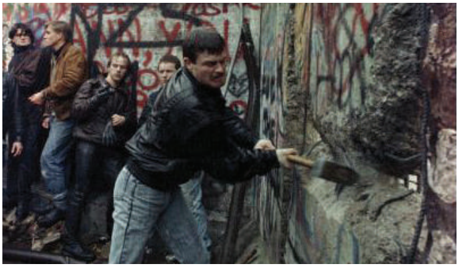

மேற்கு ஜெர்மனியின் வேந்தராக (Chancellor) 1982 முதல் 1990 வரை பொறுப்புவகித்த ஹெல்மட் கோல் கிழக்கு ஜெர்மனியையும், மேற்கு ஜெர்மனியையும் 1990இல் இணைக்கப் பெரும் பங்ககாற்றினார். அதன் மூலம் நாற்பத்ததைந்து ஆண்டுகளுக்குப் பின் ஒன்றுபட்ட ஜெர்மனியின் வேந்தரானார். அவர் பிரெஞ்சு குடியரசுத்தலைவரான மிட்டரண்டோடு இணைந்து மாஸ்ட்ரிக்ட் ஒப்பந்தத்ததை உருவாக்கி அதன் மூலமாக ஒருங்கிணைந்த ஐரோப்பபாவிற்கும் (European Union), யூரோ பண உருவாக்கத்திற்கும் வித்திட்டடார்.

**சோவியத் ஒன்றியத்தின் பிளவு**

உலக அரசியலில் 1970களிலும், 1980களின் முற்பகுதியிலும், சோவியத் ஒன்றியம் மிகுந்த செல்வவாக்கோடுத் திகழ்ந்தது. எனினும், அதன் பொருளாதாரம் நலிவடையவும், முதலாம் உலக நாடுகளுக்கு ஈடுகொடுக்கமுடியாமலும் தேங்கியது. அந்நநாட்டின் அதிபராக மிக்ககேல் கோர்பசேவ் 1985ஆம் ஆண்டு பதவியேற்றறார். இச்சூழலில் கோர்பசேவ் வெளிப்படைத்தன்மமை (Glasnost) பற்றியும், சீர்திருத்தம் (Perestroika) பற்றியும் பேசலானார். ஆனால், அவரது சீர்திருத்த முயற்சிகளுக்கு ஆளும் பொதுவுடைமை கட்சியினரிடமிருந்து எதிர்ப்புக் கிளம்பியதோடு அதற்குத் தேவையான வளங்கள் சோவியத் நாட்டில் இல்லலாதநிலையும் இருந்தது. உள்நநாட்டு உற்பத்தியில் மூன்றில் ஒரு பங்கு 1980களின் நடுவில் இராணுவத்திற்ககாக ஒதுக்கீடு செய்யப்பட்டது. அமெரிக்க ஐக்கிய நாட்டின் அதிபரான ரீகனின்

இரண்டடாம் உலகப்ப ருக்குப் பிந்ததைய உலகம்

விண்வவெளிப் போர்த்திட்டத்திற்கு ஈடுசெய்ய சோவியத் நாட்டிற்கு அதிக அளவு நிதித்ததேவை ஏற்பட்டது. ராணுவச் செலவினங்களின் அதிகரிப்பு நாட்டின் பொருளாதாரத்ததை மேற்கொண்டு சிரமத்தில் ஆழ்த்தியது.

ஆனால், சீர்திருத்தங்களை முன்னனெடுத்துக் கொண்டிருந்த நிலையிலும், வலுவிழந்தப் பொருளாதார சூழலிலும் கோர்பசேவால் கடுமையான நடவடிக்ககைகளை மேற்கொள்ள முடியவில்லலை. 'செர்னோபில் பேரழிவு' என்று அறியப்படும் உக்ரரைனில் 1988இல் நிகழ்ந்த அணுக்கசிவும், அதனால் ஏற்பட்டக் கடும்பபாதிப்பும் ஒரு பேரிடியாக விழுந்தது. பழமைவாத சக்திகளின் துணைகொண்டு 1989லும், 1991லும் நிலைமையை சமாளித்துத் தனது நிலையை வலுப்படுத்த கோர்பசேவ் முயன்றறார். ஆனால் ஒவ்வொரு முறையும் சுரங்கத்தொழிலாளர்களின் வேலைநிறுத்தப் போராட்டத்ததாலும், அதனால் நாட்டில் எற்பட்ட ஆற்றல் பற்றறாக்குறையாலும் நெருக்கடியைச் சந்தித்ததார்.

சோவியத் நாட்டின் அரவணைப்பில் இருந்த கிழக்கு ஐரோப்பியப் பொதுவுடைமை நாடுகளும் மிகக்கடுமையானப் பொருளாதார மற்றும் சமூக நெருக்கடியை எதிர் கொண்டன. இந்நநாடுகளின் மீது சோவியத் கொண்டிருந்த கட்டுப்பபாட்டடைத் தளர்த்த கோர்பசேவ் முடிவெடுத்தபோது அங்ககே சுதந்திர வேட்ககையும் ஜனநாயகத்ததை நோக்கிய நகர்வும் வேகமெடுக்கலாயின. தொழிலாளர்களின் தொடர் போராட்டம் பொதுவுடைமை ஆட்சியை முதலில் போலந்திலும், அதன்பின் ஹங்ககேரியிலும் அசைக்கத்துவங்கின. 1989இல் அலைகடல் போல்

பெரிஸ்டட்ரரோய்ககா (மறுகட்டமைப்பு) என்பது மிக்ககேல் கோர்பசேவால் சோவியத் நாட்டின் பொருளாதாரத்ததையும், அரசியல் அமைப்பபையும் மறுசீரமைப்பிற்கு உட்படுத்த 1980களின் கடை சியில் அறிமுகப்படுத்தப்பட்ட ஒன்றறாகும். வளர்ச்சியடைந்த முதலாளித்துவ நாடுகளின் முன்னனேற்றத்திற்கு சோவியத்தின் பொருளாதாரம் ஈடுகொடுக்கும்படி அதற்குப் புத்துணர்வு ஊட்ட வெளிப்படைத்தன்மமை (Glasnost) கொள்ககையோடு அறிமுகப்படுத்தபட்டதே பெரிஸ்டட்ரரோய்ககா ஆகும்.

வெளிப்படைத்தன்மமை என்ற கொள்ககை மிக்ககேல் கோர்பசேவால் பெரிஸ்டட்ரரோய்ககாவோடு அறிமுகப்படுத்தப்பட்ட வெளிப்படையான ஒரு கருத்தியல் கொள்ககையாகும் . வெளிப்படைத்தன்மமை எழுத்ததாளர்களுக்கு விதிக்கப்பட்டிருந்த கட்டுப்பபாடுகளைத் தளர்த்தி அரசையும், அரசியலையும் விமர்சிக்க உரிமை வழங்கியது.

எல்சின் ஆரம்ப காலத்தில் கோர்பசேவின் நண்பராகவே இருந்ததார். மாஸ்கோ நகரின் மேயராக இருந்த அவர் அரசியல் மற்றும் பொருளாதாரச் சுதந்திரத்ததை ஆதரித்ததின் மூலமாகப் பெரும்புகழ் பெற்றறார். சோவியத் பாராளுமன்றத்திற்கு 1989இல் ஜனநாயக முறைப்படி கோர்பசேவ் நடத்திய தேர்தலில் மாஸ்கோ தொகுதியில் போட்டியிட்ட அவர் பெரும் வெற்றி பெற்று அதிகாரத்திற்குத் திரும்பினார். அதற்கு அடுத்த ஆண்டு கோர்பசேவின் எதிர்ப்பபையும் மீறி அவர் ரஷ்யயாவின் அதிபராகத்

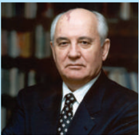

தேர்ந்ததெடுக்கப்பட்டடார். ரஷ்யக்குடியரசின் தன்னனாட்சியை வலியுறுத்திய அவர், பாராளுமன்றத்திற்கு கட்டுப்படாத முழு நிருவாகப் பொறுப்பபை கைகொள்ளும் அதிபர் முறையை முன்வவைத்ததார்.

பரவிய எழுச்சிகள் கிழக்கு ஜெர்மனியின் பெர்லின் சுவர் தகர்த்ததெறியப்படக் காரணமாக விளங்கின. அதைத் தொடர்ந்து செக்கோஸ்லோவகியாவிலும், பல்ககேரியாவிலும் நடந்து கொண்டிருந்த ஆட்சிகள் சரிந்தன. ருமேனியாவின் நிக்கோலா செளசெஸ்கு, உணர்வவாளர்களின் மீது துப்பபாக்கியால் சுட்டதையடுத்து (டிசம்பர் 1989) அவர் தம் இராணுவத் தளபதிகளே அவரைச் சுட்டு வீழ்த்த உத்தரவிட்டனர். துப்பபாக்கிச்சூடு சம்பந்தமான தொ லைக்ககாட்சிப் பதிவுகளும், பெர்லின் சுவரின் வீழ்ச்சியும் பொதுவுடைமை உலகம் நொறுக்கப்படத் தூண்டியது. ஆறேமாதங்களில் பாதி ஐரோப்பபாவின் அரசியல் வரைபடம் பெரும்மமாற்றத்திற்கு உட்படுத்தப்பட்டிருந்தது.

கோர்பசேவ் ஓர் அழுத்தமான நடவடிக்ககையை இடையூறு புரிவோர் மீது 1991இல் கைக்கொள்ள முயன்றபோது மாஸ்கோ நகரையே பிரமிக்க வைத்த இரண்டடாவது தொழிலாளர் எழுச்சி ஒரு பெரும் சவாலாக உருவெடுத்தது. அவரது அரசிலிருந்த பழமைவாத சக்திகள் அவரையும் மீறி கடும் நடவடிக்ககைகளைக் கைகொள்ள முயன்றன. கோர்பசேவை வீட்டுக்ககாவலில் வைத்த அந்த சக்திகள் துருப்புகளின் துணையோடு மாஸ்கோவில் ஒரு கிளர்ச்சியை ஏற்படுத்தின.

ஆனால், மற்றப் படைப்பிரிவினரின் ஆதரவைப்பபெற முடியாமல் போனதால் முடிவில் மேற்கத்திய நாடுகளின் பின்புலத்தோடு போரிஸ் எல்சின் என்ற சீர்திருத்தவாதி ஆட்சியைக் கைப்பற்றினார்.

இடைப்பட்டகாலத்தில் மூன்று பால்டிக் நாடுகள் சோவியத் ஐக்கியத்ததை விட்டுவிலகிச் சென்றிருந்தன. எஸ்டோனியா, லாட்வியா , லிதுவேனியா ஆகியவை ஐக்கிய நாடுகள் சபையில் சுதந்திர உறுப்பினர்களாகச் சேர்க்கப்பட்டன. மேலும், நவம்பர் 1991இல் 11 குடியரசுகள் (உக்ரரைன், ஜார்ஜியா , பெலாரஸ், அர்மீனியா , அசர்பபைஜான், கசகஸ்ததான், கிர்கிஸ்ததான், ம ல்டோவா, துர்க்மமெனிஸ்ததான், தஜிகிஸ்ததான் மற்றும் உஸ்பபெகிஸ்ததான்) சோவியத் ஒன்றியத்தில் இருந்து பிரிவதாக அறிவித்தன. அதற்கு மாற்றறாக சுதந்திர நாடுகளாக ஒரு பொதுநல அமைப்பின் கீழ் (common wealth) வீற்றிருப்பதை இந்நநாடுகள் விரும்பின. கோர்பசேவ் 25 டிசம்பர் 1991இல் தனது ராஜினாமாவை அறிவித்ததார். பெயரளவில் ஆறு நாள்களுக்கு சோவியத் ஒன்றியம் நீடித்ததாலும் அது 1991 டிசம்பர் 31 அன்று நள்ளிரவில் முழுமையாகக் கலைக்கப்பட்டது. இறுதியில் சோவியத் ஒன்றியமே இல்லலாமல் போனது.

**பாட ச்சுருக்கம்**

- சீனாவின் வரலாறு 1911இல் ஏற்பட்ட புரட்சிக்குப்பின் நிகழ்ந்தவற்றில் தொடங்கி இரண்டடாம் உலகப்போருக்குப்பின் அதுஒரு பொதுவுடைமை அரசாக மாறியதுவரை கூறப்பட்டுள்ளது.
- அமெரிக்க ஐக்கிய நாட்டிற்கும் சோவியத் நாட்டிற்குமிடையே உருவான பகைமை, உலகை இரு இராணுவப்பிரிவுகளாகப் பிரித்ததையும் வடக்கு அட்லலாண்டிக் ஒப்பந்த அமைப்புப் பற்றியும் வார்சசா ஒப்பந்தம் பற்றியும் தெளிவாக விளக்கப்பட்டுள்ளது.
- கொரியப் போர், கியூபாவின் ஏவுகணைச் சிக்கல், அரபு-இஸ்ரரேல் போர், வியட்நநாம் போர் போன்றவற்றறைப் பனிப்போர் பின்புலத்தில் படம்பிடித்துக் காட்டப்பட்டுள்ளது.
- மூன்றறாம் உலக நாடுகளின் கருத்தியலாக வெளிப்பட்ட அணிசேராஇயக்கம் பற்றி விவரிக்கப்பட்டுள்ளது.
- அமெரிக்க ஐக்கிய நாட்டிலிருந்து விலகி ஐரோப்பியக் குழுவை ஏற்படுத்தி அதன் நீட்சியாகவே பின்னர் ஐரோப்பியப் பொதுச் சந்ததையும் ஐரோப்பிய இணைவும் ஏற்பட்டது தெளிவாகக் கூறப்பட்டுள்ளது.

இரண்டடாம் உலகப்போருக்குப் பிந்ததைய உலகம்

**க லைச்சொற்கள்**

|  |  |  |
| --- | --- | --- |
| பகையுணர்வு கொண்ட | Antagonistic | acting against or indicating |
| நழுவுதல் | Wriggle out | to avoid doing something |
| வளர்ச்சி, உயர்வு | Ascension | the act of rising to an important position or a higher level, a movement upward |
| அதிருப்தி | Disillusioned | disappointed on finding out something is not as good as hoped |
| விலகியிருத்தல், ஒதுங்கியிருத்தல் | Abstaining | restrain oneself from doing something |
| வெறுப்புணர்ச்சி, கசப்புணர்வு | Embitter | cause to feel bitter – to make hateful |
| திறனற்றதாக்குதல், முடமாக்குதல் | Incapacitated | lacking in or deprived of strength or power |
| நுண்ணுயிரியல் ஆயுதங்கள் | Bacteriological weapons | the use of harmful bacteria as a weapon |