**அலகு - 2**

**இரு உலகப்போர்களுக்கு இடையில் உலகம்**

**கற்றலின் நோக்கங்கள்**

**கீழ்க்ககாண்பனவற்றோடு அறிமுகமாதல்**

- முதல் உலகப்போருக்குப் பிந்ததைய நிகழ்வுகள் பொருளாதாரப் பெருமந்தத்திற்கு இட்டுச் சென்றன
- தோல்வியடைந்த நாடுகளின் மீது திணிக்கப்பட்ட, நீதிக்குப் புறம்பபான வெர்சசெய்ல்ஸ் உடன்படிக்ககையின் சரத்துக்கள். இத்ததாலியில் முசோலினியின் தலைமையிலும், ஜெர்மனியில் ஹிட்லரின் தலைமையிலும் பாசிச அரசுகள் எழுச்சி பெறுதல்

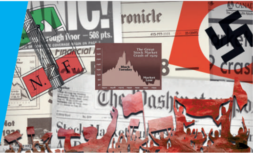

- காலனிகளாக்கப்பட்ட உலகில் காலனிய எதிர்ப்புப் போராட்டங்களும், காலனிய நீக்கச் செயல்பபாடுகளும், ஆய்வுக்கு எடுத்துக்கொள்ளப்பட்ட பகுதிகளாக தென்கிழக்ககாசியாவில் இந்தோ-பிரான்சும், தெற்ககாசியாவில் இந்தியாவும்
- ஆப்பிரிக்ககாவில் ஐரோப்பியக்ககாலனிகள் உருவாக்கப்படுதல். அவ்வகையில் தென்னனாப்பிரிக்ககாவில் இங்கிலாந்து காலனிகளை ஏற்படுத்துதல்
- தென் அமெரிக்ககாவில் விடுதலைப்போராட்டங்களும் அரசியல் வளர்ச்சிகளும்

**அறிமுகம்**

முதல் உலகப்போர் ஐரோப்பிய ஏகாதிபத்தியத்ததை அடித்தளமாகக் கொண்ட உலக முதலாளித்துவ முறையைத் தகர்த்தது. இப்போரினால் ஐரோப்பிய நாடுகள் அரசியல்ரீதியாகவும் நிதிசார்ந்த வகையிலும் கவலைக்குரிய அளவிற்குத் தளர்வடைந்து வலிமை குன்றின. தொழிலாளர்களுக்கும், அரசைக் கட்டுப்படுத்திய ஆளும் வர்க்கங்களுக்கும் இடையிலான முரண்பபாடுகளும் தீவிரமடைந்தன. இதன் விளைவாக இத்ததாலியிலும், ஜெர்மனியிலும் பா சிசம் எழுச்சி பெற்றது. போரினால் காலனியாதிக்க சக்திகள் வலிமைகுன்றியதால் காலனிய எதிர்ப்பியக்கங்கள் தீவிரமடைந்தன.

இதற்கு முந்ததைய பாடத்தில் நாம் கண்டவாறு மேலை உலகில் நிலவிய சிக்கல்கள் முதல் உலகப்போர் வெடிப்பதற்கு இட்டுச்சசென்றது. தற்போது நாம் முதல் உலகப்போர் முடிந்த பின்னர் ஏற்பட்ட சமூக அரசியல் வளர்ச்சிகளை நோக்கி கவனத்ததைத் திருப்புவோம்.

## 2 1 பொருளாதாரப் பெருமந்தம்

முதல் உலகப்போருக்குப் பின்னர் ஏற்பட்ட வளர்ச்சிப்போக்குகள்

முதல் உலகப்போரானது போர்க்ககாலப் பெரும்வளர்ச்சி முடிவற்றுத் தொடரும் என்ற நம்பிக்ககையின் அடிப்படையில் சில குறிப்பிட்ட தொழில்களின் விரிவாக்கத்திற்கு வழிகோலியது. இருந்த போதிலும் போர் ஒரு முடிவுக்கு வந்தபோது, போர்த்ததேவைகளைப் பூர்த்தி செய்வதற்ககாக உருவாகி வளர்ந்த சில தொழில்கள் கைவிடப்பட வேண்டியவைகளாக அல்லது மாற்றி அமைக்கப்பட வேண்டியவைகளாயின. வெர்சசெய்ல்ஸ் உடன்படிக்ககை ஏற்படுத்திய அரசியல்சிக்கல்கள், நிலைமையை மேலும் மோசமாக்கியது. பொருளாதார தேசியவாதம் எனும் புதியஅலை 'பாதுகாப்பு' அல்லது 'சுங்கத் தடைகள்', இறக்குமதியாகும் பொருள்களின் மீது வரிசுமத்துவது எனும் பெயர்களில் தன்னனை வெளிப்படுத்திக்கொண்டு, உலகவர்த்தகத்ததைப் பா தித்தது. போர் ஒவ்வொரு ஐரோப்பிய நாட்டின் மீதும் பெரும் கடன்சுமையை ஏற்றியது.

**அமெரிக்ககாவில் பங்குச்சந்ததையின் வீழ்ச்சி**

முதல் பெரும்வீழ்ச்சி 1929 அக்டோபர் 24இல் அரங்ககேறியது. அன்றறைய தினம் நியூயார்க் நகரப் பங்குச்சந்ததையில் பங்குகளின் விலைகள் செங்குத்ததாய் சரிந்தன. நம்பிக்ககை இழந்த முதலீட்டடாளர்களும், வாடிக்ககையாளர்களும் ஏனைய மக்களும் பங்குகளை விற்கத் தொடங்கினர். இருப்பில் இருந்தனவற்றறையும் விற்றுத்தீர்க்கத் தலைப்பட்டனர். ஆனால், அதனை வாங்குவதற்கு யாருமில்லலை . இப்பபெருவீழ்ச்சியும் முதலீட்டில் ஏற்பட்ட சரிவும் அமெரிக்க வங்கிகளின் தோல்விக்கு வழிவகுத்தன. அமெரிக்க முதலீட்டடாளர்கள் வெளிநாடுகளில் செய்திருந்த தங்கள் முதலீடுகளைத் திரும்பப்பபெறும் கட்டடாயத்திற்கு தள்ளப்பட்டனர்.

**பன்னனாட்டுச் செலாவணி முறையில் ஏற்பட்ட சீர்குலைவு**

இங்கிலாந்தில் செலவுகளைச் சுருக்குதல், வரிகளை உயர்த்துதல் போன்ற அவசரகால நடவடிக்ககைகள் மேற்கொள்ளப்பட்டபோதும் நிலைமைகளில் முன்னனேற்றம் ஏற்படவில்லலை . எனவே இங்கிலாந்து தங்கநாணய ஏற்பளவு (Gold Standard) முறையைக் கைவிட முடிவுசெய்தது. உடனடியாக ஏனைய பல நாடுகளும் தங்கநாணய ஏற்புமுறையை விட்டு விலகின. பெருங்ககேட்டினை ஏற்படுத்தவல்ல இச்சூழலுக்கு எதிர்நடவடிக்ககை மேற்கொள்ளவும், உள்நநாட்டுச்சந்ததையைப் பா துகாக்கும் பொருட்டு ஒவ்வொரு நாடும் ஒரு பா துகாப்புக் கொள்ககையை மேற்கொண்டதோடு, பணத்தின் மதிப்பபையும் குறைத்தன. பணமதிப்புக் குறைப்பபால் கடன்கொடுப்போர், கடன்கொடுப்பதை நிறுத்தினர். இதனால் உலகஅளவில் கட ன்வழங்குதல், வாங்குதல் நடவடிக்ககையில் பெருஞ்சுணக்கம் ஏற்பட்டது. இவ்வவாறு தங்களின் பொருளாதார நலன்களைப் பாதுகாப்பதற்ககாகப் பல்வவேறு நாடுகள் மேற்கொண்ட தற்ககாப்பு நடவடிக்ககைகள் முன்னனெப்போதுமில்லலாத அளவிற்கு உலகப்பொருளாதாரச் செயல்பபாடுகளை சரிவுக்கு இட்டுச்சசென்றது. இதனுடைய விளைவு ஆழமானதாகவும் நீண்டகாலம் நீடித்திருப்பதாகவும் அமைந்ததால் வரலாற்று அறிஞர்களும் பொருளாதார மேதைகளும் இதனைப் பெருமந்தம் என அழைக்கலாயினர்.

தங்கமதிப்பீட்டு அளவு என்பது ஒரு நாணயமுறை. இதில் ஒரு நாட்டினுடைய நாணயம் அல்லது காகிதப்பணம் தங்கத்தோடு நேரடித் தொடர்புடைய ஒரு மதிப்பினைப் பெற்றிருக்கும்.

**அரசியலில் ஏற்படுத்திய அதிர்வுகள்**

பெருமந்தம் பல நாடுகளின் அரசியல் நிலைமைகளை மாற்றியமைத்தது. இங்கிலாந்தில் 1931இல் நடைபெற்ற பொதுத்ததேர்தலில் தொழிலாளர் கட்சி தோற்கடிக்கப்பட்டது. அமெரிக்ககாவில் பெருமந்தத்திற்கு முந்ததைய பெரும்வளர்ச்சிக்குத் தானேகாரணம் என மார்தட்டிய குடியரசுக்கட்சி பெருமந்தத்திற்குப் பின்னர் இருபது ஆண்டுகளில் நடைபெற்ற அனைத்துத் தேர்தல்களிலும் மக்களால் ஒதுக்கப்பட்டது.

### 2.2 பாசிசத்தின், நாசிசத்தின் எழுச்சி

**(அ) இத்ததாலியில் போரின் தாக்கம்**

மேற்கு ஐரோப்பபாவில் பழைய ஆட்சி அதிகாரத்திற்கு எதிராகத் திரும்பிய நாடுகளுள் முதல்நநாடு இத்ததாலியாகும். முதல் உலகப்போரில் இத்ததாலியின் முதன்மமையான சவாலான பணி ஆஸ்திரியர்களை தெற்குமுனையில் நிறுத்திவைப்பதாகும். அதேசமயத்தில் ஆங்கிலேயர், பிரெஞ்சுக்ககாரர், அமெரிக்கர் ஆகியோர் பிளாண்டர்ஸ் போரில் ஜெர்மமானியரை இக்கட்டடாகச் சிக்கவைத்து பணியவைக்கவேண்டும் என்று எண்ணினர். போரில் பங்குகொண்டதால் ஏற்பட்ட பணச்சசெலவோ மிகப்பபெரிது. மேலும், போருக்குப்பின்னர், போரின் ஆதாயங்கள் பகிரப்பட்டபோது இத்ததாலி தான் எதிர்பபார்த்ததைக்ககாட்டிலும் குறைவாகவே பெற்றது. சோசலிஸ்டுகளின் ஆஸ்திரிய ஆதரவு கத்தோலிக்கர்களின் ஆதரவைப் பெறாத இப்போரில் இத்ததாலி பேரிழப்புகளைச் ச ந்தித்தது. வெர்சசெய்ல்ஸ் உடன்படிக்ககையின் மூலமாக இத்ததாலிக்கு மிகச்சிறிய பகுதிகளே கிடைத்ததால் தேசியவாதிகளும் மகிழ்வற்றறே இருந்தனர். போரினால் ஏற்பட்ட பணவீக்கத்ததைத் தொடர்ந்து பொருள்களின் விலைகள் உயர்ந்தன. எதிர்ப்புகளும், வேலைநிறுத்தங்களும் அடிக்கடி நடைபெற்றன. வெர்சசெய்ல்ஸில் ஏற்பட்ட அவமானத்திற்கு அப்போதைய இத்ததாலியின் ஆட்சியர்களே பொறுப்பு என மக்கள் கருதினர்.

**முசோலினியின் எழுச்சி**

வெர்சசெய்ல்ஸ் உடன்படிக்ககைக்குப் பின்னர், நடைபெற்றத் தேர்தலில் போல்ஷ்விசத்ததை (சோவியத் கம்யூனிசம்) பின்பற்றுவதாகத் தங்களை அறிவித்துக்கொண்ட இத்ததாலிய சோசலிஸ்டுகள் 1919 நவம்பரில் நடைபெற்ற தேர்தலில் மூன்றில் ஒரு பங்கு இடத்ததைக் கைப்பற்றினர். இரும்பு வேலை செய்பவரின் மகனான முசோலினி, தொடக்கப்பள்ளி ஆசிரியருக்ககான தகுதியைப் பெற்றவர், சோசலிஸச் சிந்தனைகளுடன் பத்திரிக்ககையாளர் ஆனார். ஆற்றல் மிக்க பேச்சசாளரான முசோலினி

இரு உலகப்போர்களுக்கு இடையில் உலகம்

முதல் உலகப்போரில் இத்ததாலி கலந்து கொள்வதற்கு எதிர்ப்பு தெரிவித்த சோசலிஸ்டுகளிடமிருந்து பிரிந்துசெல்வதற்கும், வன்முறையைப் பயன்படுத்துவதற்கும் ஆதரவளிக்கத் தொடங்கினார். 1919இல் பாசிசக்கட்சி தொடங்கப்பட்டபோது முசோலினி உடனடியாக அதில் உறுப்பினரானார். பா சிஸ்டுகள் அதிகாரம், வலிமை, ஒழுக்கம் ஆகியவற்றறை முன்னிலைப்படுத்தியதால், தொழிலதிபர்கள், தேசியவாதிகள், முன்னனாள் ராணுவத்தினர், நடுத்தரவர்க்கத்தினர், மனநிறைவற்ற இளைஞர்கள் ஆகியோரின் ஆதரவைப்பபெற்றனர். பாசிஸ்டுகள் சுதந்திரமாக வன்முறையைக் கைக்கொண்டனர். 1922 அக்டோபரில் ஒரு நீண்ட அமைச்சரவைச் சிக்கலின் போது முசோலினி பாசிஸ்டுகளின் மாபெரும் அணிவகுப்பு ஒன்றறை ரோமாபுரியை நோக்கி நடத்தினார். முசோலினியின் வலிமையைக் கண்டு வியந்துபோன அரசர் மூன்றறாம் விக்டர் இம்மமானுவேல், முசோலினியை ஆட்சியமைக்க வரவேற்றறார். மக்களாட்சிக் கட்சியின் ஒருங்கிணைக்க முடியாத தன்மமையும் உறுதியுடன் செயல்பட முடியாத இயலாமையும் முசோலினியின் வெற்றிக்கு உதவின.

பா சிஸம் என்பது தீவிர ஆதிக்க மனப்பபான்மமை கொ ண்ட அதிதீவிர தேசியவாதத்தின் ஓர் வடிவமாகும். சர்வவாதிகார வல்லமையும் எதிர்ப்பபை வன்முறை கொண்டு அடக்குவதும் சமூகத்ததையும், பொருளாதாரத்ததையும் வலுவான மத்திய அதிகாரத்தின் கீழ் வைத்திருப்பதும் இதன் பண்புகளாகும். இது இருபதாம் நூற்றறாண்டின் தொடக்கப்பகுதியில் ஐரோப்பபாவில் முக்கியத்துவம் பெற்றது. - விக்கிபீடியா

**முசோலினியின் கீழ் பாசிஸ்டுகள்**

இத்ததாலியில் 1924 தேர்தலில் வாக்ககாளர்கள் அச்சுறுத்தப்பட்ட பின்னர் பா சிஸ்டுகளுக்கு ஆதரவாக 65 விழுக்ககாடு வாக்குகள் பதிவ கியிரு ந்த ன . சோ ச லி ஸ் டு க ளி ன் தலைவரான மாட்டியோட்டி தேர்தல் விதிமுறைகளுக்கு உட்பட்டு நடைபெறவில்லலை

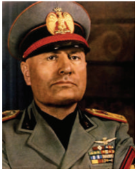

எனக் கேள்வி எழுப்பியதால் கொ லை செய்யப்பட்டடார். இதற்கு எதிர்ப்புத் தெரிவிக்கும் பொருட்டு எதிர்கட்சியினர் பாராளுமன்றத்ததைப் புறக்கணித்தனர். இதன் விளைவாக முசோலினி எதிர்க்கட்சிகளைத் தடைசெய்து பத்திரிகைகளைத்

இரு உலகப்போர்களுக்கு இடையில் உலகம்

தணிக்ககைக்கு உட்படுத்தினார். எதிர்க்கட்சித் தலைவர்கள் கொல்லப்பட்டனர் அல்லது சிறைவைக்கப்பட்டனர். 1926இல் இரண்டடாம் டியூஸ் (தலைவர்) எனும் பட்டத்ததைச் சூட்டிக்கொண்ட முசோலினி சட்டங்களை இயற்றும் அதிகாரத்துடன் சர்வவாதிகாரியானார். வேலைநிறுத்தங்களையும், ஆலைமூடல்களையும் தடைசெய்து சட்டங்கள் இயற்றினார். தொழிற்சங்கங்களும் தொழிற்சசாலை முதலாளிகளும் இடம்பபெறும் கழகங்கள் உருவாக்கப்பட்டன. 1938இல் பாராளுமன்றம் ஒழிக்கப்பட்டு அதற்கு மாற்றறாகப் பாசிஸ்டுக்கட்சியின் மற்றும் கழகங்களின் பிரதிநிதிகளைக் கொண்ட அமைப்பொன்று உருவாக்கப்பட்டது. இவ்வவேறுபாடு பொருளாதாரத்தின் மீதான முசோலினியின் சர்வவாதிகாரக் கட்டுப்பபாட்டுக்கு துணைநின்றதுடன், நிருவாகம் மற்றும் ஆயுதப்படைகளின் தலைவராக மற்ற பிற அதிகாரத்ததைச் செயல்படுத்தவும் அவருக்கு உதவியது.

**போப்பபாண்டவருடன் முசோலினி ஒப்பந்தம் செய்தல்**

பா சிஸ்ட் கட்சிக்ககென ஒரு மரியாதையைப் பெறுவற்ககாக, வாட்டிகன் நகரத்ததை ஒரு சுதந்திர அரசாக அங்கீகரிப்பதின் மூலம், ரோமன் க த்தோலிக்கத் திருச்சபையின் ஆதரவைப் பெறுவதில் முசோலினி வெற்றிபெற்றறார். இதற்குக் கைமாறாக திருச்சபை இத்ததாலிய அரசை அங்கீகரித்தது. ரோமன் கத்தோலிக்கச் சமயம் இத்ததாலியின் மதமாக அங்கீகரிக்கப்பட்டது. மேலும் பள்ளிகளில் மதபோதனைகள் செய்வதற்கு ஆணையிடப்பட்டது. மேற்சொல்லப்பட்டவற்றறை சரத்துக்களாகக் கொண்ட லேட்டரன் உடன்படிக்ககை 1929இல் கையெழுத்ததாயிற்று.

**பெருமந்தத்தின் போது இத்ததாலி**

பொருளாதாரப் பெருமந்தக் காலத்தின் போது பெருமளவு விளம்பரம் செய்யப்பட்ட பொதுத்துறைப் பணிகளான புதிய பாலங்கள், சாலைகள், கா ல்வவாய்கள், மருத்துவமனைகள், பள்ளிகள் ஆகியவை வேலையில்லலாத் திண்டடாட்டத்திற்கு தீர்வு சொல்லவில்லலை. 1935இல் பன்னனாட்டுச் சங்கம் முற்றிலுமாகச் செயலிழந்த பின்னர், முசோலினி ஒரு பொருளாதாரப் பேரரசை நிறுவும் பொருட்டு எத்தியோப்பியாவின் மீது படையெடுத்ததார். அவருடைய படையெடுப்புப் பொருளாதாரப் பிரச்சனைகளிலிருந்து மக்களின் கவனத்ததைத் திசைதிருப்பப் பயன்பட்டது.

**(ஆ) முதல் உலகப் போருக்குப்பின் ஜெர்மனி**

1918 முதல் 1933 முடிய ஜெர்மனி ஒரு குடியரசாக இருந்தது. இதனைத் தொடர்ந்து ஜெர்மனியில் பாசிஸம் வெற்றி பெற்றதற்ககான

காரணங்கள் பலவாகும். 1871 முதல் 1914 வரையிலான காலப்பகுதியில் ஜெர்மனி அரசியல், பொருளாதார, பண்பபாட்டுச் சாதனைகளில் தலைச் சுற்றவைக்குமளவிலான உச்சத்ததை எட்டியது. ஜெர்மனியின் பல்கலைக்கழகங்களும், அதன் அறிவியலும், தத்துவமும், இசையும் உலகம் முழுவதிலும் நன்கறியப்பட்டிருந்தன. தொழிற்சசாலை உற்பத்தி சார்ந்த பல துறைகளில் ஜெர்மனியானது இங்கிலாந்து, அமெரிக்ககா ஆகிய நாடுகளைக் கா ட்டிலும் சிறந்து விளங்கியது.

ஜெர்மனியின் தோல்வியும் முதல் உலகப்போரின் இறுதியில் பட்ட அவமானமும் நாட்டுப்பற்றுகொண்ட ஜெர்மனியின் மக்களுக்கு அதிர்ச்சியை ஏற்படுத்தியது. பெருமந்தம் மேலும் அவர்களது ஏமாற்றத்ததை அதிகமாக்கி அவர்களைக் குடியரசுக்கட்சியின் அரசுக்ககெதிராய்த் திருப்பியது.

**ஜெர்மமானிய பாசிசத்தின் தோற்றம்**

ஜெர்மனியில் பாசிசத்தின் தோற்றம் 1919லிருந்து தொடங்குகிறது. 1919ஆம் ஆண்டில், ஏழு நபர்களைக் கொண்ட ஒரு குழுவானது, மியூனிச் நகரில் சந்தித்து தேசிய சோசலிஸ்ட் ஜெர்மன் உழைப்பபாளர் கட்சி சுருக்கமாக நாசி (Nazi) கட்சியை நிறுவியது. ஹிட்லரும் அவர்களுள் ஒருவராக இருந்ததார். முதல் உலகப்போரின் போது பவேரியாவின் படையில் பணியாற்றினார். அவரின் ஆற்றல் மிக்க உரை வீரர்களைத் தட்டி எழுப்பியது. 1923இல் பவேரியாவில் அதிகாரத்ததைக் கைப்பற்ற அவர் முயற்சி செய்ததார். மியூனிச் நகரில் முன்கூட்டியே திட்டமிடப்படாமல் அவர் மேற்கொண்ட தேசியப்புரட்சி அவரைச் சிறையில் தள்ளியது. சிறையில் இருந்தபோது தனது அரசியல் சிந்தனைகளை உள்ளடக்கிய சுயசரிதை நூலான

சமூக ஜனநாயகக்கட்சியானது ஜெர்மன் பொதுத்தொழிலாளர் கழகம் என்ற பெயரில் 1863 மே 23இல் லிப்சிக் நகரத்தில் நிறுவப்பட்டது. அதனை நிறுவியவர் பெர்டினன்ட் லாஸ்ஸல்லி என்பவராவார். 19ஆம் நூற்றறாண்டின் இறுதிப்பகுதியைச் சேர்ந்த ஜெர்மமானிய மேட்டுக் குடியினர் ஒரு சோசலிசக்கட்சியின் இருப்பபையே புதிதாக ஒன்றிணைக்கப்பட்ட ரெய்க்கின் (குடியரசு) பாதுகாப்புக்கும் உறுதிப்பபாட்டிற்கும் ஓர் அச்சுறுத்தலாகக் கருதினர். எனவே பிஸ்மமார்க் 1878 முதல் 1890 வரை இக்கட்சியைத் தடைசெய்திருந்ததார்.

1945இல் ஹிட்லரின் மூன்றறாவது ரெய்க்கின் (குடியரசின்) வீழ்ச்சியைத் தொடர்ந்து இக்கட்சி புத்ததெழுச்சி பெற்றது. ஹிட்லரை எதிர்த்த கட்சி என்ற பெயருடன் வெய்மர் காலத்திலிருந்து செயல்படும் ஒரேகட்சி இதுவேயாகும்.

மெயின் காம்ப் (Mein Kampf - எனது போராட்டம்) எனும் நூலை எழுதினார். 1932இல் நடைபெற்ற குடியரசுத்தலைவர் தேர்தலில் கம்யூனிஸ்டுகள் 6,000,000 வாக்குகளைப் பெற்றனர். முதலாளிகள், சொத்து உரிமையாளர்கள் நாசிசத்ததை ஆதரிக்க தொடங்கினர். இவ்வவாய்ப்பபைப் பயன்படுத்தி ஹிட்லர் தவறான வழியில் அதிகாரத்ததைக் கைப்பற்றினார்.

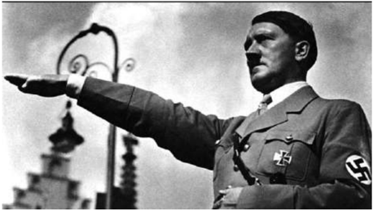

**ஹிட்லரின் நாசிச அரசு**

கம்யூனிஸ்டுகள் சமூக ஜனநாயகக்கட்சியுடன் (Social Democratic Party) கூட்டணி வைக்க மறுத்ததால் ஜெர்மனியில் குடியரசு ஆட்சி கவிழ்ந்தது. அதன்விளைவாகத் தொழிலதிபர்களும் வங்கியாளர்களும் குடியாட்சிக் கட்சியினரும் ஹிட்லரைத் தங்கள் கட்டுப்பபாட்டில் வைத்துக் கொ ள்ளமுடியும் என்ற நம்பிக்ககையில் 1933இல் ஹிட்லரை சான்சிலராக (முக்கிய அமைச்சர்) பதவியில் அமர்த்தும்படி குடியரசுத் தலைவர் வான் ஹிண்டன்பர்க் என்பபாரை வற்புறுத்தினர். மூன்றறாவது ரெய்க் (குடியரசு) என்றழைக்கப்பட்ட ஹிட்லரின் நாசிஅரசு முதல் உலகப்போருக்குப் பின்னர் ஜெர்மனியில் நிறுவப்பட்டிருந்த பாராளுமன்ற ஜனநாயக அரசை முடிவுக்குக் கொ ண்டுவந்தது.

ஹிட்லர் வெய்மர் குடியரசின் கொடிக்குப் பதிலாக ஸ்வஸ்திக் சின்னம் ( ) பொறிக்கப்பட்ட தேசிய சோசலிசக்கட்சியின் கொ டியை அறிமுகம்சசெய்ததார். ஜெர்மனி மிகவும் மையப்படுத்தப்பட்ட நாடாக மாற்றப்பட்டது. நாசிச கட்சியைத்தவிர பிறகட்சிகள் அனைத்தும் சட்டத்திற்குப் புறம்பபானவை என்று அறிவிக்கப்பட்டன. பழுப்புநிறச் சட்டடை அணிந்த போர்வீரர்கள், முழங்ககால்களுக்கு மேல்வரும் காலணிகள் அணிந்த புயல்படையினர் ஆகியோரின் எண்ணிக்ககை அதிகப்படுத்தப்பட்டது. ஹிட்லர் இளைஞர் அணியும், தொழிலாளர் அமைப்பும் நிறுவப்பட்டன. தொழிற்சங்கங்கள் ஒழிக்கப்பட்டன. அவற்றின் தலைவர்கள் கைது செய்யப்பட்டனர். அனைத்துத் தொழிலாளர்களும் ஜெர்மன் தொழிலாளர் அமைப்பில் சேருவதற்கு வற்புறுத்தப்பட்டனர்.

இரு உலகப்போர்களுக்கு இடையில் உலகம்

வேலைநிறுத்தங்கள் சட்டத்திற்குப் புறம்பபானவை என அறிவிக்கப்பட்டன. தொழிலாளர்களின் ஊதியத்ததை அரசே நிர்ணயித்தது. பத்திரிக்ககைகள், அரங்குகள், திரைப்படங்கள், வானொலி, கல்வி ஆகிய அனைத்தும் அரசின் கட்டுப்பபாட்டின் கீழ் கொ ண்டுவரப்பட்டன.

நாசிக் கட்சியின் பரப்புரைகளுக்கு ஜோசப் கோயபெல்ஸ் தலைமையேற்றறார். இவர் திட்டமிடப்பட்ட பரப்புரைகளின் மூலம் பொதுமக்களின் கருத்துக்களை நாசிகளுக்கு ஆதரவாக மாற்றினார். கெஸ்டபோ எனும் ரகசியக் கா வல்படை மற்றும் ஹிட்லரின் தேர்ந்ததெடுக்கப்பட்ட மெய்க்ககாப்பபாளர்களை ஹைட்ரிச் ஹிம்லர் என்பவர் நிர்வகித்ததார்.

**நாசிக் கட்சியின் யூதக்கொள்ககை**

ஹிட்லருடைய அரசு ஒடுக்குமுறை நடவடிக்ககைகளைப் பின்பற்றியதோடு யூதஇன மக்களுக்கு எதிராக ஒடுக்குமுறைக் கொள்ககையைப் பின்பற்றியது. யூதர்கள் அரசுப்பணிகளிலிருந்து நீக்கப்பட்டனர். பல்கலைக் கழகங்களிலிருந்து வெளியேற்றப்பட்டனர். அவர்களுக்குக் குடியுரிமையும் மறுக்கப்பட்டது. யூதர்களின் வணிகங்கள் நிறுத்தப்பட்டன. அவர்களின் நிறுவனங்கள் தாக்கப்பட்டன. இரண்டடாவது உலகப்போர் வெடித்த பின்னர், மின்கம்பி வேலிகளால் சூழப்பபெற்ற கண்ககாணிப்புக் கோபுரங்களுடன் கூடிய சித்ரவதை முகாம்கள் அமைக்கப்பபெற்று அவற்றில் யூதர்கள் சிறை வைக்கப்பட்டனர். உயிர் வாழ்வதற்குத் தேவையான அளவைக் காட்டிலும் குறைவாகவே உணவு வழங்கப்பட்ட அவர்கள் கட்டடாய உழைப்புக்கு உட்படுத்தப்பட்டடார்கள். பின்னர் அவர்கள் பூண்டோடு அழிக்கப்படுவதற்ககான முகாம்களுக்கு அழைத்துச் செல்லப்பட்டு தொழிற்சசாலை சார்ந்த முறைகளில் (விஷவாயு அறைகள்) கொல்லப்பட்டனர். இப்படுகொ லை நாசிக்களால் 'இறுதித் தீர்வு' (Final Solution) என்றழைக்கப்பட்டது.

**வெர்சசெய்ல்ஸ் உடன்படிக்ககையின் சரத்துக்களை ஹிட்லர் எதிர்த்தல்**

1934ஆம் ஆண்டு ஆகஸ்டு திங்கள் ஹிண்டன்பர்க் இயற்ககை எய்தவே, சான்சிலராக இருந்த ஹிட்லர் குடியரசுத் தலைவராகவும் ராணுவத்தின் தலைமைத் தளபதியாகவும் பொறுப்பபேற்றறார். ஹிட்லருடைய அயலுறவுக் கொ ள்ககையானது ஜெர்மனியின் படைபலத்ததை முன்பிருந்ததைப் போலவே பெருக்குவது, ஜெர்மனி வலுவிழந்து போவதற்குக் காரணமாயிருந்த வெர்சசெய்ல்ஸ் உடன்படிக்ககையின் சரத்துக்களை ஏற்ககாமல் மீறுவது என்பதை நோக்கமாகக் கொ ண்டிருந்தது.

இரு உலகப்போர்களுக்கு இடையில் உலகம்

2.3 ஆசியாவில் காலனிய எதிர்ப்பியக்கங்களும்,

காலனிய நீக்கச் செயல்பபாடுகளும்

**(அ) பிரெஞ்சு இந்தோ-சீனா**

காலனிய எதிர்ப்புணர்வின் எழுச்சி

1887இல் பிரான்சசால் கைப்பற்றப்பட்டதிலிருந்து இந்தோ-சீனா (இன்றறைய கம்போடியா , லாவோஸ், வியட்நநாம்) தனது எதிர்ப்பபைக்ககாட்டி வந்தது. இந்தோ-சீனர்கள் பிரெஞ்சு மொழியும் பண்பபாடும் தங்கள் மீது திணிக்கப்படுவதை எதிர்த்தபோதும் புரட்சி பற்றிய சிந்தனைகளை பிரெஞ்சுக்ககாரர்களிடமிருந்து கற்றுக்கொண்டனர். முதல் உலகப்போரின் போது ஒரு லட்சம் இந்தோ- சீனர்கள் பிரான்சில் போரிட்டனர். போரின்போது பிரெஞ்சுக்ககாரர்கள் எவ்வவாறு போரிட்டனர், எ வ்வவாறு துன்புற்றனர் என்பது குறித்த நேரடிஅனுபவ அறிவோடு திரும்பினர். மேலும் சீனத் தலைநிலப்பகுதியிலிருந்து பரவிய கம்யூனிசச் சிந்தனைகளும் தாக்கத்ததை ஏற்படுத்தியதிலிருந்து இந்தோ-சீனாவின் கணிசமான செல்வம் காலனியாதிக்க சக்திக்ககே பயன்படுவதை பலர் உணர்ந்தனர்.

கா லனிய நீக்கம் என்பது காலனியாதிக்க சக்திகள் காலனிகள் மீது கொண்டுள்ள நிறுவனம் மற்றும் சட்டம் சார்ந்த கட்டுப்பபாடுகளைச் சொந்த தேசிய அரசுகளிடம் வழங்குவதாகும்.

**வியட்நநாமின் கட்சியின் உதயம்**

இ ந்தோ-சீனாவி ல் இருந்த அரசியல் கட்சிகளில் வியட்நநாம் தேசியக் கட்சியே முக்கியமானது. 1927இல் உருவாக்கப்பட்ட இக்கட்சி மக்கள் தொகையில் பணக் ககார ர் களை யு ம் நடுத்தரப்பிரிவு மக்களையும் கொ ண்டிரு ந்த து . 1929இல் வியட்நநாம் வீரர்கள் இராணுவப்புரட்சி செய்தனர். பிரெஞ்சுக்

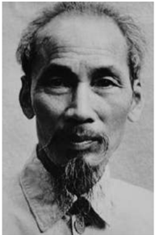

கவர்னர்ஜஜெனரலைக் கொ லைசெய்வதற்ககான முயற்சியும் தோல்வி அடைந்தது. இதனைத் தொடர்ந்து கம்யூனிஸ்ட்களின் தலைமையில் மிகப்பபெரும் விவசாயிகளின் புரட்சியும் நடைபெற்றது. இப்புரட்சி ஒடுக்கப்பட்டதைத் தொடர்ந்து 'வெள்ளளை பயங்கரவாதம் (White Terror)' என்பது அரங்ககேறியது. புரட்சியாளர்கள் ஆயிரக்கணக்கில் கொல்லப்பட்டனர்.

ஹோ சி மின் (Ho Chi Minh) 1890இல் டோங்கிங்கில் பிறந்ததார். தனது 21 ஆவது வயதில் அவர் ஐரோப்பபா சென்றறார். லண்டன் உணவுவிடுதியொன்றில் சமையல்கலைஞராய்ப் பணியாற்றியபின் அவர் பாரிஸ் சென்றறார். பாரிஸ் அமைதி மாநாட்டில் வியட்நநாமின் சுதந்திரத்திற்ககாக ஆதரவு திரட்டினார். தினசரிகளில் அவர் எழுதிய கட்டுரைகளும் குறிப்பபாக "விசாரணையில் பிரெஞ்சு காலனியாதிக்கம்" எனும் சிற்றறேடு அவரை நன்கறியப்பட்ட வியட்நநாமிய தேசியவாதி ஆக்கியது. 1921இல் ஹோ சி மின் பிரெஞ்சு கம்யூனிஸ்ட் கட்சியை உருவாக்கியவர்களில் ஒருவராக இருந்ததார். இரண்டு ஆண்டுகளுக்குப் பின்னர் அவர் மாஸ்கோ சென்று புரட்சியின் நுட்பங்களைக் கற்றறார். 1925இல் 'புரட்சிகர இளைஞர் இயக்கம்' எனும் அமைப்பபை நிறுவினார்.

வெள்ளளை பயங்கரவாதத்திற்குப் பின்னர் ஹோ சி மின் மாஸ்கோ சென்றறார். 1930களை மாஸ்கோவிலும் சீனாவிலும் கழித்ததார். இரண்டடாவது உலகப்போரின் தொடக்கத்தில் பிரான்ஸ் ஜெர்மனியால் 1940இல் தோற்கடிக்கப்பட்டது. ஹோ சி மின்னும் அவருடைய தோழர்களும் இச்சூழலைப் பயன்படுத்தி வியட்நநாமின் விடுதலையை முன்னனெடுத்தனர். 1941 ஜனவரி திங்கள் எல்லலையைக் கடந்து வியட்நநாம் வந்த அவர்கள் 'வியட்நநாம் விடுதலை சங்கம்' அல்லது வியட்மின் எனும் அமைப்பபை நிறுவினர். இது தனித்தன்மமை வாய்ந்த வியட்நநாமிய தேசியத்திற்குப் புதிய அழுத்தத்ததைக் கொடுத்தது.

**(ஆ) இந்தியாவில் காலனியாதிக்க நீக்கம்**

மாகாணங்களில் இரட்டடையாட்சி

இந்தியாவில் காலனிய நீக்கச்சசெயல்பபாடானது இருபதாம் நூற்றறாண்டின் தொடக்கத்தில், 1905இல் சுதேசி இயக்கத்தோடுத் தொடங்கியது. முதல் உலகப்போரானது விரைவான அரசியல் பொருளாதார மாற்றங்களை ஏற்படுத்தியது. 1919இல் இந்திய அரசுச்சட்டம் இரட்டடையாட்சி முறையை அறிமுகம் செய்தது. அச்சட்டம் தேர்ந்ததெடுக்கப்பட்ட உறுப்பினர்களைக் கொண்ட மாகாண சட்டசபைகளுக்கும் மாற்று அதிகாரங்களின் பட்டியலின் கீழ்வரும் சிலதுறைகளை இந்திய அமைச்சர்களே நிர்வகிக்கவும் வழிவகை செய்தது. இந்திய தேசிய காங்கிரஸ் இரட்டடையாட்சி தொடர்பபான ஏற்பபாடுகளை மறுத்ததோடு சட்டசபைகளைப் புறக்கணிக்க முடிவு செய்தது.

**இந்தியாவைத் தொ ழில்மயமாக்குவதில் நடவடிக்ககைக் குறைபாடுகள்**

சர்க்கரை, சிமெண்ட், சில வேதியியல் பொருள்களுக்கு எதிர்மறையான பாகுபாட்டு மனப்பபான்மமையோடு வழங்கப்பட்ட பாதுகாப்பபைத் தவிர காலனியப் பொருளாதாரக் கொள்ககையில் மா ற்றமேதுமில்லலை. ஆனால் உள்நநாட்டுத் தொழில்களைப் பொறுத்தமட்டில் தொழில்நுட்பம் சா ர்ந்த அறிவுரைகளும், கல்வியும் வழங்குதல் புதிய துறைகள் தொடர்பபாக முன்னோடித் தொழில் கூடங்களை அரசு தொடங்குதல் போன்ற

வடிவங்களில் மட்டுமே அரசு உதவிகள் செய்தது. ஆனால் ஆங்கிலேய நிறுவனங்கள் அரசின் தலையீட்டடை எதிர்த்ததால் வெகுவிரைவில் இக்கொள்ககையும் கைவிடப்பட்டது.

**இந்திய வேளாண்மமையின் மீது பெருமந்தம் ஏற்படுத்தியத் தாக்கம்**

பொருளாதாரப் பெருமந்தம் (1929) இந்திய வேளாண்மமைக்கும் உள்நநாட்டு உற்பத்தித் தொழில்களுக்கும் மரணஅடியைக் கொடுத்தது. எடுத்துக்ககாட்டடாக வேளாண் உற்பத்திப் பொருள்களின் விலை பாதியாகக் குறைந்தது. ஆனால், விவசாயி நிலத்திற்குக் கொடுக்கவேண்டிய குத்தகைத் தொகையில் மாற்றமேதுமில்லலை . விவசாய விளைபொருள்களின் விலையைப் பொறுத்தமட்டிலும் அரசுக்கு விவசாயிகள் செலுத்த வேண்டிய பணம் இரண்டு மடங்ககாகிற்று. விலைவாசியில் ஏற்பட்ட மிகப்பபெரும் வீழ்ச்சி இந்திய தேசியவாதிகளை உள்நநாட்டுப் பொருளாதாரத்ததைப் பா துகாக்கும் கோரிக்ககையைவைக்கத் தூண்டியது. 1930களில் இந்திய தேசிய காங்கிரஸ் ஒரு போராடும் குணம் மிக்க மாபெரும் மக்கள் இயக்கமாக எழுச்சி பெற்றது.

**இந்திய அரசுச் சட்டம் (1935)**

ஆங்கிலேயர்களுக்கு இந்திய தேசியவாதிகளைச் சமாதானம் செய்யவேண்டிய அவசியம் ஏற்பட்டது. அதன் வெளிப்பபாடே 1935 இந்திய அரசுச் சட்டம். இச்சட்டம் உள்ளளாட்சி அரசு நிறுவனங்களுக்கு அதிக அதிகாரம் வழங்கியதோடு நேரடித் தேர்தலையும் அறிமுகம் செய்தது. இச்சட்டத்தின் அடிப்படையில் 1937ஆம் ஆண்டு நடத்தப்பட்ட தேர்தல்களில் பெரும்பபாலான மாகாணங்களில் அகில இந்திய தேசிய காங்கிரஸ் அதிர்வவை ஏற்படுத்தும் வெற்றியைப் பெற்றது. இருந்தபோதிலும் மக்களால் தேர்ந்ததெடுக்கப்பட்ட காங்கிரஸ் அமைச்சரவைகளை கலந்ததாலோசிக்ககாமல் ஆங்கில அரசு இந்தியாவை இரண்டடாம் உலகப்போரில் ஈடுபடுத்தியதால் கா ங்கிரஸ் அமைச்சரவை ராஜினாமா செய்யும் கட்டடாயத்திற்குத் தள்ளப்பட்டது.

இரு உலகப்போர்களுக்கு இடையில் உலகம்

### 2.4 ஆப்பிரிக்ககாவில் காலனிய எதிர்ப்பியக்கங்கள்

**ஆப்பிரிக்ககாவில் குடியேற்றங்கள்**

ஆப்பிரிக்ககாவின் கடற்கரைப்பகுதிகளில் பதினாறாம் நூற்றறாண்டில் இடஆய்வு மேற்கொள்ளப்பட்டு ஒருசில ஐரோப்பியக் குடியேற்றங்களும் உருவாயின. ஆனால், ப த்தொன்பதாம் நூற்றறாண்டின் இறுதிக் கால் நூற்றறாண்டு வரையிலும் ஆப்பிரிக்ககாவின் உட்பகுதிகள் வெளி உலகத்துக்குத் தெரியாமலேயே இருந்தது. 1875இக்குப் பின்னர் ஐரோப்பியர்களின் காலனிகள் இங்கு உருவாயின. 1884-1885 ஆண்டுகளில் நடைபெற்ற பெர்லின் காலனிய மாநாட்டில் காலனியாதிக்க சக்திகள் ஆப்பிரிக்ககாவைத் தங்கள் செல்வவாக்கு மண்டலங்களாகப் பிரித்துக்கொள்ளலாம் எனத் தீர்மமானிக்கப்பட்டது. ஆனால், ஆங்கிலேயருக்கும் தென்னனாப்பிரிக்க போயர்களுக்கும் இடையே நடைபெற்றப் போர் இத்தீர்மமானத்திற்கு எதிரான செயலாகும்.

**போயர் போர்கள்**

இங்கிலாந்தின் காலனிகளான நேட்டடால், கேப்ககாலனி ஆகிய இரண்டிற்கும் சுதந்திர போயர் நாடுகளான டிரான்ஸ்வவால் மற்றும் ஆரஞ்சு சுதந்திரஅரசு ஆகியவற்றுக்கிடையே நீண்ட காலமாக நட்புறவு நிலவவில்லலை. 1886இல் டிரான்ஸ்வவால் பகுதியில் தங்கம் இருப்பது கண்டுபிடிக்கப்பட்டதைத் தொடர்ந்து பெரும் எண்ணிக்ககையில் ஆங்கிலேயச் சுரங்கத்தொழில் சா ர்நந்ததோர் ஜோகன்னனெஸ்பர்க்கிலும் அதன் சுற்றுப்புறங்களிலும் குடியேறினர். இவர்களை வெறுத்த போயர்கள் இவர்களை யுட்லலேண்டர்ஸ்

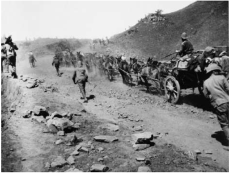

*இரு உலகப்போர்களுக்கு இடையில் உலகம்*

(Uitlanders-அயலவர்) என்றறே குறிப்பிட்டனர். குடியேறியவர்கள் மீது அதிகவரிகளை விதித்த போயர்கள், அவர்களுக்கு அரசியல் உரிமைகளையும் மறுத்தனர். யுட்லலேண்டர்ஸின் அரசியல்உரிமைகள் குறித்த பேச்சுவார்த்ததைகளில் உடன்பபாடுகளேதும் ஏற்படவில்லலை. எனவே , தென்னனாப்பிரிக்ககாவில் யா ர் அதிகாரம் மிகுந்தவர்கள்? போயர்களா? அல்லது ஆங்கிலேயர்களா? எனும் கேள்வியெழுந்தது. ஆங்கிலேயர்களால் தாக்கப்படுவோம் என்ற அச்சத்தில் போயர்கள் ஆயுதம் தரித்தனர். ஆங்கிலேயர்களைத் தாக்குவதெனவும் முடிவு செய்தனர்.

1899இல் தொடங்கிய போயர் போர்கள் 1902 வரை மூன்றறாண்டுகள் தொடர்ந்தன. போரின் தொடக்கத்தில் போயர்கள் வெற்றிபெற்றனர். ஆனால், 1900இல் முதற்பபாதியில் புதிதாக தருவிக்கப்பட்ட ஆங்கிலப்படைகளால் போயர்கள் தோற்கடிக்கப்பட்டு பிரிட்டோரியா கைப்பற்றப்பட்டது. ஆங்கிலேயர் போர் முடிந்துவிட்டது எனக்கருதினர். ஆனால், போயர்கள் கொரில்லலாப்போரைக் கைக்கொண்டனர். இது இரண்டு ஆண்டுகளுக்கு நீடித்தது. இதற்கு பதிலடி கொடுக்கும் முகமாக ஆங்கிலேயர் வயல்களையும் பயிர்களையும் நாசம் செய்தனர். போயர் பெண்களையும் குழந்ததைகளையும் பாசறைகளில் சிறைவைத்தனர். உணவு, மருத்துவப் பற்றறாக்குறையின் காரணமாகவும் சுகாதார வசதிகளின்மமையாலும் 26,000 போயர் மக்கள் மாண்டனர். இரண்டு போயர் நாடுகளையும் ஆங்கிலேயர் இணைத்துக்கொண்டனர். ஆனால், நாளடைவில் சுயா ட்சி வழங்கப்படுமென போயர்களுக்கு வா க்குறுதி வழங்கப்பட்டது. 1907இல் டிரான்ஸ்வவால், ஆரஞ்சு சுதந்திர அரசு ஆகிய இருநாடுகளுக்கும் முழுமையான பொறுப்பபாட்சி வழங்கப்பட்டது. பின்னர் இந்நநான்கும் ஓர் ஒன்றியமாக உருவானது. மேலும், 1909இல் இங்கிலாந்துப் பாராளுமன்றத்தில் நிறைவேற்றப்பட்ட தென்னனாப்பிரிக்கச் சட்டம் கேப் ட வுனில் ஒன்றியப் பாராளுமன்றத்ததை அமைத்துக் கொ டுத்தது. 1910ஆம் ஆண்டு தென்னனாப்பிரிக்க ஒன்றியம் (Union of South Africa) உதயமானது.

தென்னனாப்பிரிக்ககாவில் குடியேறிய டச்சுக் குடியேறிகளின் வம்சசாவளியினரே ஆப்பிரிக்கநேர்கள் என்றும் அழைக்கப்பட்ட போயர்கள் ஆவர். இவர்களது மொழி ஆப்பிரிக்ககான்ஸ்.

**தென்னனாப்பிரிக்ககாவில் தேசிய அரசியல்**

தென்னனாப்பிரிக்ககாவில் இருமுக்கிய அரசியல்கட்சிகள் செயல்பட்டன. அவை பெரும்பபாலும் ஆங்கிலேயர்களைக் கொண்ட யூனியனிஸ்ட் கட்சி மற்றும் ஆப்ரிகானர்கள் என்றழைக்கப்பட்ட போயர்களைப்பெரும்பபான்மமையாகக் கொண்டிருந்த தென்ஆப்பிரிக்கக் கட்சி. முதல் பிரதமமந்திரியான போதா , தென்ஆப்பிரிக்கக் கட்சியைச் சேர்ந்தவர் ஆங்கிலேயருடன் ஒத்துழைத்து ஆட்சியை நடத்தினார். ஆனால் தென்னனாப்பிரிக்கக் கட்சியைச்

சேர்ந்த போராடும் குணமிக்க ஒருபிரிவினர் ஹெர்சசாக் என்பவரின் தலைமையின் கீழ் தேசியக்கட்சி எனும் கட்சியைத் தொடங்கினர். 1920ஆம் ஆண்டுத் தேர்தலில் தேசியக் கட்சி நாற்பத்து நான்கு இடங்களைக் கைப்பற்றியது. தென்னனாப்பிரிக்கக் கட்சி

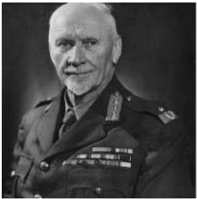

ஸ்மட்ஸ் என்பபாரின் தலைமையில் நாற்பத்தொன்று இடங்களில் வெற்றி பெற்றது. இத்தருவாயில் ஆங்கிலேயர் அதிகமிருந்த யூனியனிஸ்ட் கட்சி தென்னனாப்பிரிக்கக் கட்சியுடன் இணைந்தது. இதனால் போர்க்குணம் கொண்ட ஆப்ரிகானர்களின் கட்டுப்பபாட்டிலிருந்த தேசியக்கட்சியைக் காட்டிலும் ஸ்மட்ஸ் பெரும்பபான்மமை பெற்றறார்.

**கறுப்பின மக்களுக்கு எதிரான இனக்கொள்ககை**

ஆப்ரிக்கநேர்கள் கறுப்பின மக்களுக்கும் சிறுபான்மமை இந்தியர்களுக்கும் எதிராக கடுமையான இனக்கொள்ககையைப் பின்பற்றினர். கறுப்பின மக்களின் குடியிருப்புகளை நகரங்களின் சில குறிப்பிட்ட பகுதிகளுக்குள்ளளாக கட்டுப்படுத்துவதற்ககாக 1923இல் ஒரு சட்டம் இயற்றப்பட்டது. ஏற்கனவே 1913இல் இயற்றப்பட்ட சட்டம் வெள்ளளை மற்றும் கறுப்பின விவசாயிகளைப் பிரித்து வைத்தது. இதனால் நாட்டின் பெரும்பபாலான பகுதிகளில் கறுப்பின மக்களால் நிலங்களை வாங்குவது முடியாமலேயே போனது. 1924ஆம் ஆண்டுத் தேர்தலில் வெள்ளளையின சுரங்கத் தொழிலாளர்களை அதிகம் கொண்ட தொழிலாளர் இயக்கத்தின் ஆதரவுடன் தேசியக்கட்சி வெற்றி பெற்றது. 1924இல் இயற்றப்பட்ட சட்டம் கறுப்பின மக்களை வேலைநிறுத்தத்தில் ஈடுபடுவதிலிருந்தும் தொழிற்சங்கத்தில் சேருவதில் இருந்தும் தடுத்தது. மாநிலத்தில் கறுப்பின மக்களின் வாக்குரிமை பறிக்கப்பட்டது. இவ்வவாறு மண்ணின் மைந்தர்களான கறுப்பினமக்கள் அனைத்து உரிமைகளும் மறுக்கப்பட்டு அவர்கள் அரசியல், பொருளாதாரம், சமூகம் ஆகிய அனைத்துத் தளங்களிலும் துன்புற்றனர்.

**தென்னனாப்பிரிக்ககாவில் இனஒதுக்கல்:**

இனஒதுக்கல் என்பதன் பொருள் தனிமைப்படுத்துதல் அல்லது ஒதுக்கிவைத்தல் என்பதாகும். இது 1947இல் தேசியவாதக் கட்சியின் கொள்ககையாயிற்று. 1950 முதல் வரிசையாகப் பல சட்டங்கள் நடைமுறைக்கு வந்தன. ஒட்டுமொத்த நாடும் பல்வவேறு இடங்களுக்ககான தனித்தனிப் பகுதிகளாக பிரிக்கப்பட்டன. வெள்ளளை இனத்தவருக்கும் வெள்ளளையரல்லலாத இனத்தவருக்கும் இடையில் திருமணங்கள் தடைசெய்யப்பட்டன. ஏறத்ததாழ அனைத்துப் பள்ளிகளும் அரசின் கட்டுப்பபாட்டின்கீழ் கொண்டுவரப்பட்டன. இதன்மூலம் வெள்ளளையருக்கு வழங்கப்படும் கல்வியில் இருந்து மாறுபட்ட கல்வியை ஏனைய ஆப்பிரிக்கர்களுக்கும் நடைமுறைப்படுத்தப்பட்டது. பல்கலைக்கழகக் கல்வியும் பிரித்து வைக்கப்பட்டது. தென்னனாப்பிரிக்ககாவில்

வெள்ளளை கறுப்பின மக்களுக்கிடையிலான அரசியல் சமத்துவம் என்பது மக்கள் தொகையில் மூன்றில் இரண்டு பங்ககாக இருக்கும் கறுப்பின மக்களின் ஆட்சியைக்

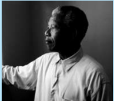

குறிக்கும் உண்மமையின் அடிப்படையிலேயே இனஒதுக்கல் உருவானது. நெல்சன் மண்டடேலா அரசியல் வானில் பிரகாசிக்கத் தொடங்கிப் பொதுமக்களின் பேராதரவைப் பெற்றபோது ஆப்பிரிக்க தேசிய காங்கிரஸ் கட்சித் தடைசெய்யப்பட்டு நெல்சன் மண்டடேலா சிறை வைக்கப்பட்டடார். உலக அளவிலான எதிர்ப்பலைகள் தென் ஆப்பிரிக்ககாவில் இனவாத ஆட்சியை முடிவுக்குக் கொண்டுவர உதவியது. 1990இல் ஆப்பிரிக்க தேசிய காங்கிரஸ் மீதான தடை விலக்கிக் கொள்ளப்பட்டு மண்டடேலா 27 ஆண்டுகளுக்குப் பின் விடுதலை செய்யப்பட்டடார். இதனைத் தொடர்ந்து நடைபெற்ற தேர்தலில் ஆப்பிரிக்க மக்களுக்கு வாக்குரிமை வழங்கப்பட்டது. தேர்தலில் ஆப்பிரிக்க தேசிய காங்கிரஸ் வெற்றிபெற்று மண்டடேலா தென்னனாப்பிரிக்ககாவின் முதல் கறுப்பினக் குடியரசுத் தலைவரானார். இனஒதுக்கல்

கொ ள்ககை ஒரு முடிவுக்கு வந்ததாலும் ஆப்பிரிக்ககாவின் பொருளாதார மண்டல முழு ஆதிக்கமும் வெள்ளளை இனத்தவரிடமே உள்ளது.

இரு உலகப்போர்களுக்கு இடையில் உலகம்

### 2.5

**தென் அமெரிக்ககாவில் அரசியல் வளர்ச்சிப் போக்குகள்**

**மா யர்களும் அஸ்டடெக்குகளும்**

ஐரோப்பியர்கள் அமெரிக்ககாவைக் கண்டுபிடிப்பதற்கு முன்னர் மத்திய அமெரிக்ககாவில் மெக்சிகோ, தென் அமெரிக்ககாவில் பெரு ஆகிய பகுதிகளில் மூன்று நாகரிகங்களின் மையங்கள் இருந்துள்ளன. மாயா, இன்ககா, அஸ்டடெக் நாகரிகங்கள் எனப்படும் இவை மிகவும் முன்னனேறிய நாகரிகங்களாக இருந்துள்ளன. இந்நநாகரிகங்களுக்கு உட்பட்ட பகுதிகளில் பலநாடுகள் இருந்தன. சிறந்த நிருவாகக் கட்டமைப்புடன் வலிமைமிக்க அரசாங்கங்களை அவை கொண்டிருந்தன. 11ஆம் நூற்றறாண்டில் பெரிய நகரங்கள் இணைந்து மாயாபன் எனும் அமைப்பபாக உருவானது (அமெரிக்க மண்ணின் மைந்தர்களின் மாயா நாகரிகமையம்). இவ்வமைப்பு நூற்றுக்கும் மேற்பட்ட ஆண்டுகள் செயல்பட்டது. பன்னிரண்டடாம் நூற்றறாண்டின் இறுதியில் மாயாபன் அழிக்கப்பட்டடாலும் ஏனையநகரங்கள் தொடர்ந்து இருந்தன. பதினான்ககாம் நூற்றறாண்டில் மெக்சிகோவிலிருந்து வந்த அஸ்டடெக்குகள் மாயா நாட்டடைக் கைப்பற்றி டெனோச்டிட்லலான் எனும் தலைநகரை நிறுவினர். ஏறத்ததாழ இருநூறு ஆண்டுகள் அஸ்டடெக்குகள் தங்கள் பேரரசை ஆட்சி செய்தனர்.

**ஐரோப்பியக் காலனியாதிக்கமும் அதன் தாக்கமும்**

பதினாறாம் நூற்றறாண்டில் (1519 தருவாயில்) அஸ்டடெக்குகள் தங்கள் அதிகாரத்தின் உச்சத்தில் இருந்தபோது ஹெர்னன் கோர்டஸ் எனும் ஸ்பபானியரின் தலைமையில் வந்த விரல்விட்டு எண்ணக்கூடிய துணிச்சல்மிக்க வீரர்களின் முன்னர் மொத்தப் பேரரசும் நிலைகுலைந்தது. கோர்டஸின் படையெடுப்புடன் ஒட்டுமொத்த மெக்சிகன் நாகரிகமும் சீர்குலைந்தது. அத்துடன் பெருமைவாய்ந்த நகரமான டெனோச்டிட்லலானும் அந்நநாகரிகத்திற்ககான சுவடுகளேதுமின்றி அழிந்துபோனது. இது உலகின் மிக மோசமான இனப்படுகொ லைகளுள் ஒன்றறாகும். மற்றொரு புகழ்பபெற்ற படையெடுப்பபாளர் பிரான்சிஸ்கோ பிசாரோ எனும் ஸ்பபானியராவார். இவர் இன்ககா

பேரரசின் மீது படையெடுத்துக் கைப்பற்றினார். இன்ககா பெயரிலேயே சில ஆண்டுகள் ஆட்சிபுரிய முயன்ற பிசாரோ அளவிடற்கரிய செல்வங்களைக் கைப்பற்றினார். பின்னர் ஸ்பபானியர்கள் பெருவை தங்கள் பகுதிகளில் ஒன்றறாய் மா ற்றினர்.

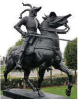

இரு உலகப்போர்களுக்கு இடையில் உலகம்

பதினெட்டடாம் நூற்றறாண்டின் பிற்பகுதியில் அரசியல், சுதந்திரம், நிருவாக சுயாட்சி, பொருளாதாரத்தில் சுயாதிபத்திய உரிமை (சுயமாக முடிவெடுக்கும் உரிமை) ஆகிய கோரிக்ககைகள் லத்தீன் அமெரிக்ககா முழுவதும் பரவியது. ஹைதி நாட்டின் அடிமைகள், காலனியமக்கள் ஆகியோர்க்கும் ஆங்கிலேய, பிரெஞ்சு காலனி ஆதிக்க சக்திகளின் படைகளுக்குமிடையே கொ டூரமான போர்கள் நடைபெற்றன. 17911804 காலப்பகுதிகளில் தௌசெயிண்ட் லூவெர்தூரி என்பவரின் தலைமையில் நடைபெற்ற இப்போராட்டங்கள் பிரான்சின் காலனியாதிக்கக் கட்டுப்பபாட்டிலிருந்து ஹைதி மக்கள் விடுதலை பெறுவதில் முடிந்தது. இவ்வவாறு அடிமை முறையையும் பிரான்சின் காலனியர் கட்டுப்பபாடுகளையும் தூக்கியெறிந்த முதல் கரீபிய நாடாக ஹைதி உருவெடுத்தது.

**ஸ்பபெயின், போர்ச்சுகல் மீதான நெப்போலியப் படையெடுப்பின் தாக்கம்**

அமெரிக்க, பிரெஞ்சுப் புரட்சிகள் லத்தீன் அமெரிக்கர்களுக்கு ஊக்கமளித்தன. 1808இல் நெப்போலியன் ஸ்பபெயின், போர்ச்சுகல் ஆகிய நாடுகளின்மீது படையெடுத்தது தென்அமெரிக்ககாவில் விடுதலைப்போராட்டச் செயல்பபாடுகளை விரைவுபடுத்தின. விடுதலை வீரர், 'தளை தகர்ப்பபாளர்' என அறியப்பட்டிருந்த சைமன் பொலிவர் என்பவரின் தலைமையில் ஏற்கனவே விடுதலை உணர்வு வளர்ந்து கொண்டிருந்தது. போர்ச்சுகலை நெப்போலியன் கைப்பற்றியபோது போர்த்துகீசிய அரச குடும்பம் லிஸ்பன் நகரைவிட்டு தப்பியோடியதால் போர்த்துகலின் காலனியாக இருந்த பிரேசில் சுதந்திர நாடானது. போர்த்துகல் அரியணைக்ககான தனது உரிமையைத்துறந்த முதலாம் பெட்ரோ, பிரேசிலின் சுதந்திரத்ததைப் பிரகடனம் செய்ததார்.

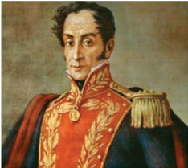

**ம ன்றோவின் கோட்பபாடு**

1815இல் நெப்போலியன் வீழ்ச்சியுற்றபோது விடுதலைப்போராட்டங்கள் மேலும் தீவிரமடைந்தன.

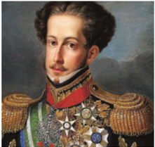

ஆனால், இச்சமயத்தில் அமெரிக்கக் குடியரசுத்தலைவர் மன்றோ தனது புகழ்பபெற்ற ம ன்றோ கோட்பபாட்டடை முன்வவைத்ததார். அமெரிக்ககாவின் எந்தப் பகுதியிலும் அது வடக்கோ தெற்கோ ஐரோப்பியர்கள் தலையிட்டடால் அது அமெரிக்க ஐக்கிய நாடுகளுக்ககெதிரான போராகக் கருதப்படும் என அறிவித்ததார். இப்பயமுறுத்தல் ஐரோப்பியர்களை அச்சங்கொள்ளச் செய்து அவர்களை தென்அமெரிக்க விவகாரங்களிலிருந்து விலகியிருக்கச் செய்தது. 1830வாக்கில் ஒட்டு மொத்த தென்அமெரிக்ககாவும் ஐரோப்பிய மேலாதிக்கத்திலிருந்து விடுதலை பெற்றன. இவ்வவாறு ஐரோப்பிய நாடுகளிடமிருந்து அமெரிக்ககா , தென்அமெரிக்கக் குடியரசுகளைக் காப்பபாற்றியது. ஆனால், காப்பபாற்றிய அமெரிக்ககாவிடமிருந்து, தென் அமெரிக்ககாவைக் காப்பபாற்ற யாருமில்லலை .

**லத்தீன் அமெரிக்க தேசியவாதிகளிடையே ஒற்றுமையின்மமை**

லத்தீன் அமெரிக்க தேசியவாதிகள் ஸ்பபெயின், போர்த்துகல் ஆகியவற்றுக்கு எதிராக மட்டும் போர் செய்யவில்லலை. தங்களுக்கிடையேயும் மோதிக்கொண்டனர். 1821இல் மத்திய அமெரிக்ககா

மெக்சிகோவிடம் இருந்து பிரிந்தது. பின்னர் (1839) மத்திய அமெரிக்ககாவே ஐந்து குடியரசுகளாகப் (கோஸ்டடாரிக்ககா, எல் சால்வடார், கவுதமாலா , ஹோண்டுராஸ், நிகராகுவா) பிரிந்தது. 1828இல் உருகுவே பிரேசிலிடமிருந்துப் பிரிந்தது. 1830இல் பொலிவரால் உருவாக்கப்பட்ட கிரான் கொ லம்பியாவிலிருந்து வெனிசூலாவும், ஈக்வடாரும் பிரிந்தன.

**அமெரிக்ககாவின் ஏகாதிபத்திய ஆர்வம்**

இருபதாம் நூற்றறாண்டு தொடக்கத்தில், 1898இல் ஸ்பபானியர்களைத் தோற்கடித்த அமெரிக்ககா கியூபாவையும் போர்டட்டடோ ரிக்கோவையும் கைப்பற்றிக் கொண்டது. 1898 முதல் 1902 வரை கியூபா அமெரிக்ககாவின் இராணுவ ஆட்சியின் கீழிருந்தது. இறுதியில் அமெரிக்கர்கள் கியூபாவை விட்டு

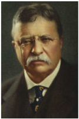

வெளியேறிய போது கியூபாவில் கப்பற்படைத்தளம் ஒன்றறை மட்டும் தங்கள் வசம் வைத்துக்கொண்டனர். 1904இல் தியோடர் ரூஸ்வவெல்ட், மன்றோ கோட்பபாட்டில் ஒரு திருத்தத்ததைக் கொண்டுவந்ததார்.

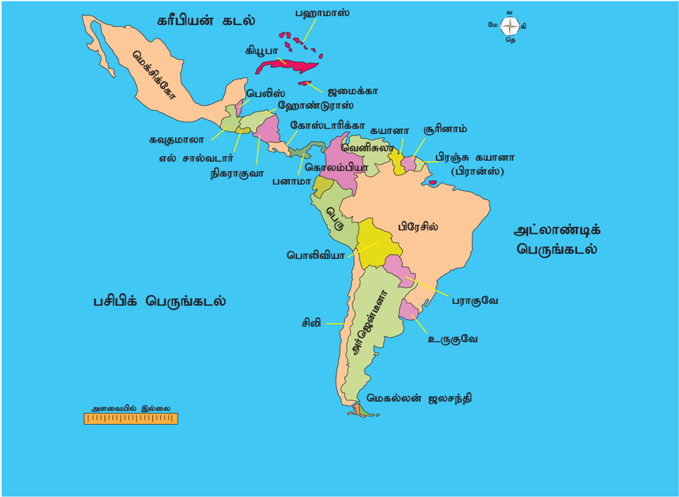

**லத்தீன் அமெரிக்ககா**

இரு உலகப்போர்களுக்கு இடையில் உலகம்

இத்திருத்தம் ஒழுங்ககைப் பராமரிப்பதற்ககாக இலத்தீன் அமெரிக்ககா விவகாரங்களில் தலையிட அமெரிக்ககாவிற்கு அனுமதி வழங்கும் வகையில் மேற்கொள்ளப்பட்டது. இத்திருத்தம் கொண்டு வரப்பட்ட பின்னர் அமெரிக்ககா அரசியல்ரீதியாக மட்டுமல்லலாமல் பொருளாதாரரீதியாகவும் மேம்பட்ட செல்வவாக்குப் பெற்ற நாடானது.

**தென் அமெரிக்ககாவில் பெருமந்தம்**

பொருளாதாரப் பெருமந்தத்ததால் உருவான சூழ்நிலையில் சிலரின் அல்லது சில குடும்பங்களின் ஆட்சியால் பல உறுதியான குழுக்களின் எதிர்பபார்ப்புகளை ஏற்றுக்கொள்ள முடியவில்லலை . மெக்சிகோவில் அதிருப்திக் குழுக்கள், நடுத்தரவர்க்க அறிவுஜீவிகள், வேளாண் சமூகங்கள் ஆகியோரை உள்ளடக்கிய வன்முறை சார்ந்த சமூக எதிர்ப்புகள் அரங்ககேறின. வேறு இடங்களில் தேர்தல் சீர்திருத்தங்கள் புதிய சமூக குழுக்கள் வாக்குப்பபெட்டிகள் வழியாக அரசியல் அதிகாரத்ததைப் பெற உதவிசெய்தன.

இலத்தீன் அமெரிக்ககா, அமெரிக்ககாவின் தலையீட்டடை எதிர்த்ததோடு, டாலர் ஏகாதிபத்தியத்ததை விரும்பவில்லலை. 1933க்குப் பின்னர் அமெரிக்ககாவின் கொள்ககையில் மா ற்றத்ததை ஏற்படுத்தியது. அமெரிக்கக் குடியரசுத்தலைவர் பிராங்க்ளின் D. ரூஸ்வவெல்ட் தன்னுடைய 'அண்டடை நாட்டுடன் நட்புறவு' கொ ள்ககையில், அமெரிக்ககா வேறு எந்த நாடுகளின் உள்நநாட்டு விவகாரங்களிலும் தலையிடாது என்று கூறியதோடு லத்தீன் அமெரிக்க நாடுகளுக்குப் பொருளாதார தொழில்நுட்ப உதவிகளைச் செய்யவும் ஒத்துக்கொண்டடார்.

டா லர் ஏகாதிபத்தியம்: இச்சொல் தொலைதூர நாடுகளுக்குப் பொருளாதார உதவிசெய்வதன் மூலம் அவற்றின் மீது ஆதிக்கம் செலுத்தவும், தக்கவைத்துக் கொள்ளவும், அமெரிக்ககா பின்பற்றியக் கொள்ககையை விளக்குவதற்குப் பயன்படுத்தப்படுவதாகும்.

**பாட ச்சுருக்கம்**

- முதல் உலகப்போர் முடிந்ததிலிருந்து காலனிய எதிர்ப்புப் போராட்டங்கள் தீவிரமடையத் தொடங்கின.
- தோல்வியடைந்த நாடுகளுக்கு எதிராகப் பாரிஸ் அமைதி மாநாட்டில் எடுக்கப்பட்ட கடுமையான முடிவுகள், நடைபெற்றுக்கொண்டிருந்த ஆட்சிகளை நிலைகுலையச் செய்ததோடு அந்நநாடுகளில் குறிப்பபாக இத்ததாலியிலும், ஜெர்மனியிலும் பாசிசசக்திகள் எழுச்சி பெறுவதற்ககான சூழலையும் உருவாக்கின.
- 1929இல் அமெரிக்ககாவில் தோன்றியப் பொருளாதாரப் பெருமந்தம், பின்னர் உலகத்தின் அனைத்து முதலாளித்துவ நாடுகளையும் பாதித்து அரசியலிலும் சமூகத்திலும் மாற்றங்களை ஏற்படுத்தியது.
- இந்தியாவில் இரு போர்களுக்கு இடையிலான காலப்பகுதியில் காலனி நீக்கச் செயல்பபாடு.
- மன்றோ கொ ள்ககை லத்தீன் அமெரிக்ககாவில் ஐரோப்பிய சக்திகள் காலனிகள் ஏற்படுத்துவதைத் தடுத்து அதன்மூலம் அவை முன்னதாகவே இறையாண்மமைத் தகுதியைப் பெறுவதை உறுதிப்படுத்தியது. பின்னர் இதையே லத்தின் அமெரிக்கர்கள் தங்கள் நாட்டு விவகாரங்களில் தலையிடவும் செல்வவாதாரங்களைச் சுரண்டவும் அமெரிக்ககா போட்ட வேடம் எனக் கருதினர்.

**க லைச்சொற்கள்**

|  |  |  |
| --- | --- | --- |
| ஒற்றுமை உணர்வு, பொதுக் காரியத்திற்கான ஆதரவு | Solidarity | a bond of unity, support for a common cause |
| விலைவீழ்ச்சி, சரிவு | Slump | a sudden severe or prolonged fall in the price |
| திவால், கடன் தீர்க்க முடியா நிலை | Bankruptcy | insolvency, financial ruin |
| பணமதிப்புக் குறைதல் | Devaluation | a decrease in the value of a country's currency |

இரு உலகப்போர்களுக்கு இடையில் உலகம்

|  |  |  |
| --- | --- | --- |
| மிரட்டல், அச்சுறுத்தல் | Intimidation | threat, the act of making fearful |
| வலுப்படுத்தினர் | Bolstered | strengthened |
| மனத்தளர்ச்சி அடைதல், நம்பிக்கை இழத்தல் | Demoralized | having lost confidence or hope, disheartened |
| கெட்டிக்காரத்தனமாய் அல்லது சூழ்ச்சியாய் கையாளு | Manipulate | control or influence a person or situation cleverly, unfairly to achieve a specific purpose |
| செல்லலாதாக்கல், ரத்துசெய்தல் | Annulling | declaring invalid or null and void |
