**அலகு - 3**

**இரண்டடாம் உலகப்போர்**

**கற்றலின் நோக்கங்கள்**

**கீழ்க்ககாண்பனவற்றோடு அறிமுகமாதல்**

- முதல் உலப்போருக்குப் பிந்ததைய அரசியல், பொருளாதார வளர்ச்சிகளை அறிமுகப்படுத்திக்கொள்ளுதல். அவையே இறுதியில் இரண்டடாம் உலகப்போருக்கு இட்டுச்சசென்றதை அறிந்துகொள்ளுதல்
- பொதுவாகப் போரின் போக்ககையும் திருப்புமுனைகளாய் அமைந்த முக்கிய நிகழ்வுகளையும் அறிந்துகொள்ளுதல்
- இரண்டடாம் உலகப் போரின் விளைவுகளை அறிந்துகொள்ளுதல்

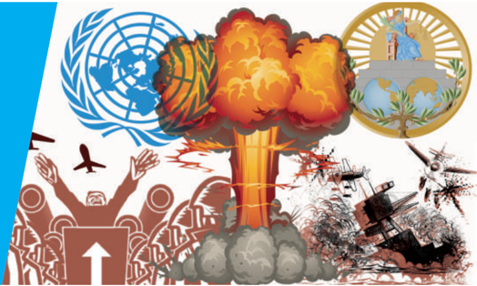

- பேரழிவு (Holocaust) என்பதையும், நாசிச ஜெர்மனியில் யூதர்கள் பெரும் எண்ணிக்ககையில் கொல்லப்பட்டதையும் புரிந்துகொள்ளுதல்
- இரண்டடாம் உலகப்போருக்குப் பின்னர் ஒரு புதிய பன்னனாட்டு அமைப்பு முறையை உருவாக்குவதற்ககாக அமைக்கப்பட்ட பன்னனாட்டு நிறுவனங்கள் குறித்த அறிவைப் பெறுதல்

**அறிமுகம்**

இருபதாம் நூற்றறாண்டின் முதல் பாதி இவ்வுலகை நிலைகுலையச் செய்து, பெரும்சசேதங்களை ஏற்படுத்திய இரண்டு மாபெரும் போர்களைச் சந்தித்தது. முதல் உலகப்போர் 1914இல் தொடங்கி 1918வரையும் இரண்டடாம் உலகப்போர் 1939இல் தொடங்கி 1945வரையும் நடைபெற்றது. உலகம் ஏற்கனவே பல போர்களைச் ச ந்தித்திருந்ததாலும் இவ்விரு போர்கள் மட்டுமே உலகப்போர்கள் எனக் குறிப்பிடப்படுகின்றன. ஏனெனில் இவ்விரு போர்களிலும் மோதல்கள் நடைபெற்ற பகுதிகள் பரந்துவிரிந்து இருந்தன. மேலும், இப்போர்களினால் உயிரிழந்த ஆயுதம் ஏந்திப் போரிட்டோர், பொதுமக்கள் ஆகியோரின் இறப்பு எண்ணிக்ககை மிக அதிகமாக இருந்தது. மேலும், இவ்விரு போர்களும் ஐரோப்பிய, ஆசிய, ஆப்பிரிக்கக் கண்டங்களில் பல முனைகளில் நடைபெற்றன.

இவ்விரு போர்களிலும் பிரிட்டன், பிரான்ஸ், ரஷ்யயா, அமெரிக்ககா ஆகிய நேச நாடுகளின் கூட்டுப்படைகள் ஜெர்மனியின் தலைமையிலான அச்சு நாடுகளுக்கு எதிராகப் போரிட்டன. இரண்டடாம் உலகப்போரில் ஜெர்மனியின் நட்பு நாடுகளாக

இத்ததாலி மற்றும் ஜப்பபான் விளங்கின.

3.1 இரண்டடாம் உலகப் போருக்ககான காரணங்கள், போரின் போக்கு, விளைவுகள்

**(அ) காரணங்கள்**

முதலாம் உலகப்போர், மாபெரும் போர் என்றும் அனைத்துப் போர்களையும் முடித்துவைக்கும் போர் எனவும் குறிப்பிடப்பட்டது. பகைநாடுகளில், குறிப்பபாக நேச நாடுகள் மீண்டும் ஒரு நீண்ட மோதலுக்ககான எண்ணத்ததைக் கொண்டிருக்கவில்லலை, இதுவே முதல் உலகப் போருக்குப் பின் இந்நநாடுகளின் செயல்பபாடுகளை இயக்கும் சக்தியாய்த் திகழ்ந்தது. எழுச்சி பெற்ற ஜெர்மனி மேற்கொண்ட ஆக்கிரமிப்பு இராணுவ நடவடிக்ககைகளும், ஜப்பபானின் விரைவான வளர்ச்சியுமே இரண்டடாம் உலகப்போருக்ககான உடனடி மற்றும் அடிப்படைக் காரணங்களாகும்.

ஜெர்மனியும், வெர்சசெய்ல்ஸ் உடன்படிக்ககையும் (1919)

1919 ஜூனில் கையெழுத்ததான வெர்சசெய்ல்ஸ் உடன்படிக்ககையோடு முதல் உலகப்போர்

முடிவுற்றது. அதன் சரத்துகளில் மூன்று அம்சங்கள் ஜெர்மனி மக்களிடையே பெரும் அதிருப்தியை ஏற்படுத்தின. (i) ஜெர்மனி தனது மேற்கு, வடக்கு, கிழக்கு ஆகிய எல்லலைகளில் பல பகுதிகளை விட்டுத்தரக் கட்டடாயப்படுத்தப்பட்டது. (ii) ஜெர்மனி ஆயுதக்குறைப்புக்கு உள்ளளாக்கப்பட்டு மிகக் குறைந்த அளவிலான படைகளை மட்டுமே வைத்துக்கொள்ள அனுமதிக்கப்பட்டது. (iii) போரினால் நேச நாடுகளுக்கு ஏற்பட்ட இராணுவ வீரர்கள் மற்றும் பொதுமக்களின் உயிர் இழப்பிற்ககாக ஜெர்மனி இழப்பீடு வழங்க வேண்டுமென எதிர்பபார்க்கப்பட்டது.

**ப ன்னனாட்டுச் சங்கத்தின் தோல்வி**

அமெரிக்க அதிபர் உட்ரோ வில்சனின் முயற்சியால் பன்னனாட்டுச் சங்கம் உருவானது என்பதை பாடம் 1-இல் பார்தத்ததோம். இச்சங்கம் நாடுகளிடையே பிரச்சனை ஏற்படும்போது நடுவராக இருந்து பிரச்சனைகளைத் தீர்க்கும் என்றும் இராணுவ ஆக்கிரமிப்பபை மேற்கொள்ளும் நாடுகளுக்கு எதிராக நடவடிக்ககை எடுக்கும் எனவும் எதிர்பபார்க்கப்பட்டது. ஆனால் அமெரிக்ககா இவ்வமைப்பில் உறுப்புநாடாகச் சேரவில்லலை. ஏனெனில் போருக்குப்பின்னர் அமெரிக்ககாவின் பொதுவான மனோநிலை மரபான தனித்திருக்கும் கொள்ககைக்கு ஆதரவாக இருந்தது. ஏனைய நேசநாடுகளும் தலையிடாக்கொள்ககை மனநிலையில் உறுதியாக இருந்தன. இதன் விளைவாக பன்னனாட்டுச் சங்கம் ஒரு பயனற்ற பன்னனாட்டுச் சங்கமாக இருந்தது.

**முதல் உலகப்போருக்குப் பின் ஏற்பட்ட சிக்கலும், ஜெர்மனியும்**

மேற்குறிப்பிட்டவாறு வெர்சசெய்ல்ஸ் உடன்படிக்ககையின் முக்கியமான மூன்று ச ரத்துக்கள், குறிப்பபாக போர் இழப்பீடு தொடர்பபான ச ரத்துக்கள் ஜெர்மனியில் பெரும் அதிருப்தியை ஏற்படுத்தின. முதல் உலகப்போருக்குப் பின் பத்ததாண்டுகளில் பலநாடுகள் எதிர்கொண்ட பிரச்சனைகள் இத்ததாலி (முசோலினி), ஜெர்மனி (ஹிட்லர்), ஸ்பபெயின் (பிராங்கோ) ஆகிய நாடுகளில் தீவிர வலதுசாரி சர்வவாதிகார ஆட்சி எழுச்சி பெறுவதற்கு இட்டுச் சென்றன.

முதல் உலகப்போருக்குப் பின்னர் ஜெர்மனி பெருமளவிலான வேலையில்லலாத் திண் டடா ட் ட த் ததை யும் க டு மை ய ன பண வீக்கத்ததையும் அனுபவிக்க நேர்ந்தது. மேலும் அதனுடைய காகிதச் செலாவணி முழுமையாக மதிப்பிழந்தது. சாதாரண மக்கள் ரொட்டி வாங்குவதற்ககாக வண்டிநிறைய பணத்ததை எடுத்துச்சசெல்வது போன்ற பல படங்கள் 1920களில் வெளியாயின. பல சுற்றுப் பேச்சுவார்த்ததைகளுக்குப்

இரண்டடாம் உலகப்போர்

பின்னர் ஜெர்மனி வழங்கவேண்டிய போர் இழப்பீட்டுத் தொகை குறைக்கப்பட்டடாலும் மேற்சொல்லப்பட்ட துயரங்களுக்கு ஜெர்மனியின் மீது கட்டடாயமாகச் சுமத்தப்பட்ட போர் இழப்பீடே காரணம் எனக் குற்றம் சாட்டப்பட்டது.

**அடால்ப் ஹிட்லரின் எழுச்சி**

ஜெர்மனி பெருமளவு அவமானப் படுத்தப்பட்டதாக நிலவிய கருத்ததைப் பயன்படுத்தி, தனது வல்லமை மிக்க சொற்பொழிவாற்றும் திறமையாலும் உணர்ச்சிமிக்கப் பேச்சுக்களாலும் ஜெர்மனியை அதன் இராணுவப் புகழ்மிக்க முந்ததைய காலத்திற்கு மீண்டும் அழைத்துச் செல்வதாக அடால்ப் ஹிட்லர் மக்களைத் தன்பக்கம் ஈர்த்ததார். தேசிய சமதர்மவாதிகள் கட்சியை நிறுவினர். இது நாசிக் கட்சி என்று அழைக்கப்பட்டது. இரண்டு அடிப்படைக் கருத்துகளை அடித்தளமாகக் கொண்டு ஹிட்லர் ஆதரவைத் திரட்டினார். ஒன்று ஜெர்மனியரே சுத்தமான ஆரிய 'இனத்தவர்' எனும் இனஉயர்வு மனப்பபாங்கு மற்றொன்று மிக ஆழமான யூத வெறுப்பு. 1933இல் ஆட்சிக்கு வந்த அவர் 1945வரை ஜெர்மனியை ஆட்சி செய்ததார்.

வெர்சசெய்ல்ஸ் உடன்படிக்ககையின் ச ரத்துக்களுக்கு நேரெதிராக ஹிட்லர் ஜெர்மனியின் இராணுவத்ததையும் ஆயுதங்களையும் அதிகரிக்க தொடங்கினார். ஆயுதப் படைகளுக்ககான ஆள்சசேர்ப்பு, அரசாங்கத்தின் செலவில் நிறுவப்பட்ட , இராணுவத்திற்குத் தேவைப்படும் ஆயுதங்களையும் ஏனைய இயந்திரங்களையும் உற்பத்தி செய்யும் தொழிற்சசாலைகள் நிறுவப்படுதல் போன்றவற்றறால் ஜெர்மனியின் பொருளாதாரம் புத்துயிர் பெற்றதோடு, வேலையில்லலாத் திண்டடாட்டப் பிரச்சனையும் தீர்த்து வைக்கப்பட்டது.

எழுச்சிமிக்க முசோலினியின் எத்தியோப்பியப் படையெடுப்பினால் இத்ததாலியுடன் கொண்டிருந்த உறவினை பிரிட்டனும் பிரான்சும் முறித்துக்கொண்ட அதேவேளையில் ஜெர்மனியும் இத்ததாலியும் நட்புகொண்டன. ஹிட்லர் படைநீக்கம் செய்யப்பட்ட மண்டலமாகக் கருதப்பட்ட ரைன்லலாந்தின்மீது 1936இல் படையெடுத்ததார். இத்ததாலியும் ஜெர்மனியும் இணைந்து ரோம்-பெர்லின் உடன்படிக்ககையை ஏற்படுத்தின. பின்னர் இதில் ஜப்பபான் இணைந்தவுடன் ரோம்-பெர்லின்-டோக்கியோ அச்சு உடன்படிக்ககை உருவானது. 1938இல் ஹிட்லர் ஆஸ்திரியா, செக்கோஸ்லோவாக்கியா ஆகிய நாடுகளைத் தாக்கிக் கைப்பற்றினார். செக்கோஸ்லோவாக்கியாவின் ஒரு பகுதியான சூடட்டன்லலாந்தில் ஜெர்மன் மொழி பேசும் மக்கள் வாழ்ந்து வந்தனர். ஜெர்மன் மொழி பேசும் மக்கள் வாழ்கின்ற பகுதிகள் அனைத்தும் ஒரே நாடாக இணைக்கப்பட வேண்டும் என ஹிட்லர் உரிமை கோரினார்.

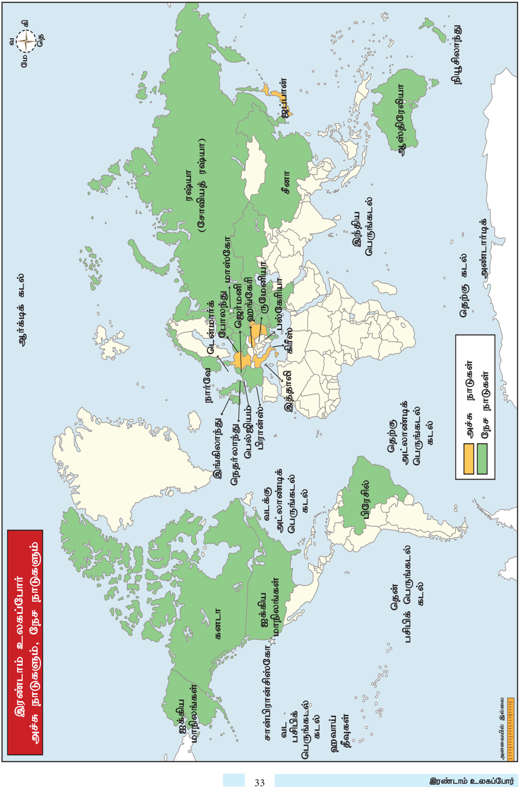

**நேசநாடுகளும் தலையிடாக் கொள்ககையும்**

இதே சமயத்தில் இத்ததாலியும் ஜப்பபானும் ஆக்கிரமிப்பு நடவடிக்ககைகளில் ஈடுபட்டன. இத்ததாலி 1935இல் எத்தியோபியா மீதும், 1939இல் அல்பபேனியா மீதும் படையெடுத்தது. எத்தியோப்பிய பேரரசர் ஹெய்லி செலாஸ்ஸி பன்னனாட்டுச் ச ங்கத்திடம் முறையிட்டடார். ஆனால் அவருக்கு எவ்வித உதவியும் கிடைக்கவில்லலை. கிழக்குப் பகுதிகளில் ஜப்பபான் இராணுவ விரிவாக்க நடவடிக்ககைகளை மேற்கொண்டது. 1931இல் ஜப்பபான் மஞ்சூரியாவின் மீது படையெடுத்தது. 1937இல் சீனாவைத் தாக்கி பெய்ஜிங்ககை முற்றுகையிட்டது. இந்நடவடிக்ககைகளை எல்லலாம் நேசநாடுகளால் கண்டுகொள்ளளாமல் இருந்தன. பன்னனாட்டுச் சங்கத்ததால் எவ்வித நடவடிக்ககையும் மேற்கொள்ள இயலவில்லலை .

இவ்வவாறு ஜெர்மனி, இத்ததாலி, ஜப்பபான் ஆகியவை இராணுவரீதியான நடவடிக்ககைகளை மேற்கொண்டபோதும் பிரிட்டனும் பிரான்சும் எதிலும் தலையிடாமலேயே இருந்தன. பிரிட்டனின் பொது மனநிலை மற்றுமொரு போரைத் தொடங்குவதற்கு ஆதரவாக இல்லலை. பிரிட்டனின் பிரதமர்கள் பால்டுவின், சேம்பர்லின் ஆகியோரும் அதிகாரபூர்வமாக தங்களின் நலன்சசாரா பகுதிகளில் நடைபெறும் நிகழ்வுகளில் தலையிடுவது நியாயமற்றது என நினைத்தனர். அமெரிக்ககாவோ வெளியுலகை பற்றிச் சற்றறேனும் அக்கறை கொள்ளளாமல் பொருளாதாரப் பெருமந்தத்தின் பின்னர் தனது பொருளாதாரத்ததை மீட்டு எடுப்பதில் மட்டும் கவனத்ததைச் செலுத்தியது.

**மியூனிச் உடன்படிக்ககை**

சோவியத் ரஷ்யயாவும் மேற்கத்திய நாடுகளும் ஒன்றின்மீது மற்றொன்று அவநம்பிக்ககை கொண்டிருந்தன. 1938இல் பிரிட்டன் பிரதமர் சேம்பர்லின் ஜெர்மனியோடு மியூனிச் உடன்படிக்ககையை மேற்கொண்டடார். இது செக்கோஸ்லோவாக்கியாவின் மீது படையெடுத்து அதன் ஜெர்மன் மொழி பேசும்

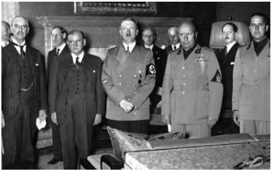

இரண்டடாம் உலகப்போர்

பகுதியான சூடட்டன்லலாந்ததை ஜெர்மனி இணைத்துக்கொண்டதை ஏற்றுக்கொள்வதாக அமைந்தது. இருந்தபோதிலும் 1939இல் சோவியத் யூனியன் ஜெர்மனியுடன் ஒருவர்மீது ம ற்றொருவர் படையெடுப்பதில்லலை என ஒப்பந்தம் செய்துகொண்டது. நேசநாடுகளின் செயலற்ற இத்தன்மமையும் படைகளைப் பெருக்கிக் கொள்வதில் அவை காட்டிய தயக்கமும் இரண்டடாம் உலகப்போருக்குக் காரணங்களாக அமைந்தன.

வேறு எந்த ஒரு நாட்டடையும் தான் தாக்கப்போவதில்லலை என ஹிட்லர் மியூனிச் உடன்படிக்ககையில் உறுதியளித்திருந்ததாலும் அது உடனடியாக மீறப்பட்டது. 1939இல் ஹிட்லர் செக்கோஸ்லோவாக்கியாவின் மீது படையெடுத்ததார். அடுத்து போலந்து தாக்கப்பட்டது. இதுவே ஜெர்மனிக்கு எதிராக பிரிட்டனும் பிரான்சும் போர்ப்பிரகடனம் செய்வதற்கு இட்டுச்சசென்ற இறுதிநடவடிக்ககைகளாக அமைந்தன. பிரிட்டன் பிரதமர் சேம்பர்லின் 1940இல் பதவிவிலகினார். ஹிட்லரைப் பற்றியும் அவருடைய இராணுவ நோக்கங்களைப் பற்றியும் எப்போதும் எச்சரித்து வந்த வின்ஸ்டன் சர்ச்சில் பிரதமரானார்.

**(ஆ) இரண்டடாம் உலகப்போரின் போக்கு**

**போரின் தன்மமை**

ஐரோப்பபா, ஆசியா, பசிபிக் எனும் இருவேறு முனைகளில் நடைபெற்றது. ஐரோப்பபாவில் நேசநாடுகள் ஜெர்மனிக்கும் இத்ததாலிக்கும் எதிராகப் போரிட்டன. ஆசிய பசிபிக் பகுதிகளில் நேசநாடுகள் ஜப்பபானுக்கு எதிராக போர் செய்தன.

நவீனப் போராகும். டாங்குகள், போர்க்கப்பல்கள், விமானம் தாங்கிக் கப்பல்கள், நீர்மூழ்கிகள், போர்விமானங்கள், குண்டுவீசும் விமானங்கள், கனரக இராணுவ தளவாடங்களைக் கொண்டு போர்கள் நடத்தப்பட்டன. இவையனைத்ததையும் உற்பத்தி செய்வதற்குப் பெருமளவிலான வளங்கள் தேவைப்பட்டன. இராணுவ உபகரணங்களை நவீனப்படுத்துவதற்கு தேவையான கச்சசாப்பொருள்கள், உற்பத்தித்திறன், தொழிற்நுட்பம் ஆகியவையும் தேவைப்பட்டன. பின்னர் நினைத்து வருந்தும் அளவிற்கு பெரும் பொருட்சசெலவை ஏற்படுத்திய, நீண்ட காலப் போராக இப்போர் அமைந்தது.

**போரின் தொடக்கம்**

பிரிட்டனும் பிரான்சும் 1939 செப்டம்பரில் ஜெர்மனியின் மீது

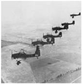

போர்ப் பிரகடனம் செய்தன. இத்ததாலி 1940 ஜூனில் ஜெர்மனியோடு சேர்ந்தது. 1940 செப்டம்பரில் ஜப்பபான் அச்சு நாடுகளுடன் கை கோர்த்தது.

போர் அறிவிப்பு செய்யப்பட்டவுடன் சிறிய அளவிலான செயல்பபாடுகளே காணப்பட்டன. பிரிட்டன் ஏற்ெகனவே தனது இராணுவ வலிமையை அதிகரிக்கத் தொடங்கிவிட்டது. இளைஞர்கள் அனைவரும் கட்டடாய இராணுவச் சேவைக்கு அழைக்கப்பட்டனர். போரின் தொடக்க ஆண்டுகள் ஜெர்மன் படையினரின் பிரமிக்கவைக்கும் வெற்றியாண்டுகளாகத் திகழ்ந்தன. டென்மமார்க், நார்வவே பின்னர் பிரான்ஸ் ஆகிய நாடுகளை ஜெர்மமானிய ராணுவம் கைப்பற்றியது. 1941இல் ரஷ்யயாவின் எல்லலை வரையிலான ஐரோப்பபாவின் முக்கியநிலப் பகுதிகள் அனைத்தும் அச்சு நாடுகளின் க ட்டுப்பபாட்டின் கீழ்க் கொண்டுவரப்பட்டன. திடீரென, மிக வலுவான நாடுகளைத் தாக்கிக் கைப்பற்ற ஜெர்மமானியப் படைகள் பிளிட்ஸ்கிரிக் எனும் மின்னல் வேகத்ததாக்குதல் (lightning strike, ஜெர்மன் மொழியில் Blitzkrieg) போர்த்தந்திரத்ததைக் கடைப்பிடித்தன.

பகுதிகளில் இருந்தும், அமெரிக்ககாவிலிருந்தும் க டல்வழியாக இறக்குமதி செய்யப்படும் உணவுப்பண்டங்கள், கச்சசாப் பொருள்கள், தொழிற்சசாலை உற்பத்திப் பொருள்கள் ஆகியவற்றறையே பெரிதும் சார்ந்திருந்தது. இதனைத் தாக்குவதற்ககாக ஜெர்மனி நீர்மூழ்கிக் கப்பற்படையை அனுப்பிப் பெரும்சசேதத்ததை ஏற்படுத்தியது. குறிப்பபாக அட்லலாண்டிக் பெருங்கடலில் பிரிட்டனுக்குத் தேவையானப் பொருள்களை ஏற்றிவரும் பயணியர் கப்பல்களை அவை மூழ்கடித்தன.

**முக்கிய நிகழ்வுகள்**

ட ன்கிர்க் (Dunkirk) - 1940 மே மாதத்தில் சுமார் 3 லட்சம் பிரிட்டன், பிரான்சு நாடுகளின் கூட்டுப்படை வீரர்களுக்கு டன்கிர்க் நகரின் க டற்கரைப் பகுதிக்குப் பின்வவாங்கும் கட்டடாயம்

ஏற்பட்டது. பெருமளவிலான தனது வீரர்களை பிரிட்டன் டன்கிர்க்கில் இழந்திருந்ததால் மீண்டும் இது போன்றதொரு படையை அணிதிரட்டுவது பிரிட்டனுக்கு இடர்ப்பபாடு மிகுந்ததாக இருந்திருக்கும்.

பிரிட்டன் போர் - 1940 ஜூலையில் பிரிட்டனின் மீது ஜெர்மனி படையெடுக்கும் எனும் அச்சம் ஏற்பட்டது. நீண்ட நெடிய ஆகாய விமானக் குண்டுத் தாக்குதல்களின் மூலம் தனது திட்டங்களை ஏற்றுக்கொள்ளுமாறு பிரிட்டனை வற்புறுத்த ஹிட்லர் விரும்பினார். ஜெர்மனியின் விமானப்படைகள் குறிப்பிட்ட இலக்குகளை, மிகக் குறிப்பபாகத் துறைமுகங்கள், விமானத்தளங்கள், தொழிற்சசாலைகள் ஆகியவற்றறைத் தாக்கத் தொடங்கின. 1940 செப்டம்பரில் லண்டன் நகரம் இரக்கமற்ற குண்டுவீச்சுக்கு இலக்ககானது. இந்நடவடிக்ககை மின்னல் (Blitz) என்றழைக்கப்பட்டது. 1940 அக்டோபரில் லண்டன் மற்றும் ஏனைய தொழில் நகரங்களின் மீது இரவு நேரத்தில் குண்டு வீச்சுத் தாக்குதல் தொடங்கிற்று. ஆனால் இது தோல்வியில் முடிந்தது. ஜெர்மனியின் போர் விமானங்கள் சற்று தொலைவில் வரும்போதே அவற்றறைக் கண்டறியும் திறன்பபெற்ற, புதிதாகக் க ண்டறியப்பட்ட, மிக ரகசியமாக வைக்கப்பட்டிருந்த க ண்டறி கருவியெனும் ரேடாரைப் பயன்படுத்தி பிரிட்டனின் ராயல் ஏர்போர்ஸ் போர்விமானங்கள் ஜெர்மனியின் குண்டுவீச்சு விமானங்களைத் தாக்கிப் பேரிழப்பபை விளைவித்தன. விமானத் தாக்குதல்கள் 1940 அக்டோபர் மாதத்தோடு நின்று போனது. விமானப்போரில் ஏற்பட்ட இத்தோல்வியால் பிரிட்டனின் மீது படையெடுக்கும் திட்டத்ததை ஜெர்மனி கைவிட்டது.

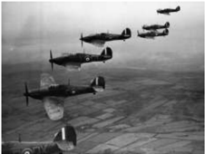

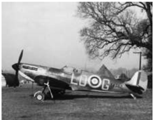

**கட ன் குத்தகைத் திட்டம் (1941-1945)**

அமெரிக்கக் குடியரசுத்தலைவர் ரூஸ்வவெல்ட், தனித்திருத்தல் கொள்ககையிலிருந்து மாற வேண்டியதன் அவசியத்ததை உணர்ந்ததார். ஆனால், ஐரோப்பியப் போர்களில் நேரடியாகத் தலையிடுவது சாத்தியமில்லலாமல் இருந்தது. எனவே 1941 மார்ச்சில் கடன் குத்தகைத் திட்டத்ததைத் (Lend -Lease) தொடங்கினார். அதன்படி 'கடன்' எனும் பெயரில் ஆயுதம், உணவுப் பண்டம், இராணுவத்

இரண்டடாம் உலகப்போர்

தளவாடம், ஏனைய பொருள்கள் பிரிட்டனுக்கு அனுப்பி வைக்கப்படும். அவை பயன்படுத்திய பின்னர் திருப்பிக் கொடுக்கப்பட்டுவிடும். இத்திட்டம் மிகப்பபெருமளவிற்கு பிரிட்டனின் வளங்களைப் பெருக்கியது. 1941-1945 இடைப்பட்ட ஆண்டுகளில் இத்திட்டத்தின் கீழ் பெறப்பட்ட உதவியின் மதிப்பு 46.5 பில்லியன் டாலராகும்.

**ரஷ்யப் படையெடுப்பு (1941-1942)**

**ஸ்டடாலின்கிரேடு போர் (1942 ஜூலை 17 முதல் 1943 பிப்ரவரி 2 வரை)**

1942 ஆகஸ்ட்டில் ஜெர்மமானியர் ஸ்டடாலின்கிரேடு நகரைத் தாக்கினர். வோல்ககா நதிக்கரையில், 30 மைல் (50 கி.மீ) பரப்பளவில் அமைந்திருந்த ஸ்டடாலின்கிரேடு ஆயுதங்களையும் டிராக்டர்களையும் உற்பத்தி செய்யும் முக்கியத் தொழில் நகரமாகும். அந்நகரைக் கைப்பற்றிவிட்டடால் தெற்கு ரஷ்யயாவுடனான சோவியத்தின் போக்குவரத்துத் தொடர்புகள் துண்டிக்கப்பட்டுவிடும். மேலும், காகஸஸ் பகுதிகளிலுள்ள எண்ணணெய் வயல்களைச் சென்றடைவதற்கு ஜெர்மன் படைக ளுக்கு ஸ்டடாலின் கிரேடு வசதியாக இருக்கும். மேலும், சோவியத்தின் தலைவர் ஸ்டடாலினின் பெயரைத்ததாங்கிய இந்நகரைக் கைப்பற்றுதல் ஹிட்லரின் தனிப்பட்ட வெற்றியாகவும் அவரது பிரச்சசாரத்திற்குக் கிடைத்த வெற்றியாகவும் கருதப்படும். ஜெர்மனியின் போர்த் திட்டமிடல் வல்லுநர்கள் 'ஃபால் புளூ' (Operation Blue) எனும் திட்டத்தின்படி இந்நகரைக் கைப்பற்றிவிடலாம் என நம்பினர். 1942 ஜூன் 28இல் ஜெர்மனி படைக ள் குறிப்பிடத் தகுந்த வெற்றிகளோடு போர் நடவடிக்ககைகளைத் தொடங்கின.

ஜெர்மன் படைகள் கைப்பற்றிய பகுதிகளில் வாழ்ந்த ரஷ்ய மக்கள் மோசமான பணியிட, வாழ்க்ககைச் சூழல்களால் மட்டுமே

இரண்டடாம் உலகப்போர்

துன்பங்களை அனுபவிக்கவில்லலை. அவர்கள் ஜெர்மன் படைகளாலும் மிகவும் மோசமாகவும் நடத்தப்பட்டனர். போரின்போது 15 மில்லியன் பொதுமக்கள் உயிரிழந்தனர். 10 மில்லியன் படை வீரர்களும் பலியாயினர். மொத்தத்தில் ரஷ்யயாவின் மக்கள்தொகையில் பத்தில் ஒரு பகுதியினர் மரணத்ததைத் தழுவினர். இருந்த போதிலும் ரஷ்ய மக்கள், ஸ்டடாலினுக்கு எதிராகப் புரட்சி ஏற்படும் என்ற ஹிட்லரின் நம்பிக்ககைக்கு நேர்மமாறாக சோவியத் அரசுக்கு ஆதரவாக இருந்தனர்.

**எல் அலாமெய்ன் போர் (1942)**

போரின் தொடக்க ஆண்டுகளில் ஜெனரல் ரோம்மமெல் தலைமையிலான ஜெர்மன் படைகள் வட ஆப்பிரிக்ககாவை விரைந்து கைப்பற்றுவதில் வியத்தகு வெற்றிகளைப் பெற்றன. எகிப்து மட்டுமே இங்கிலாந்தின் கைவசமிருந்தது. ஜெனரல் மாண்டட்ககோமரியின் தலைமையிலான நேசநாட்டுப் படைகள் எதிர்த்ததாக்குதல் நடத்தி வட ஆப்பிரிக்ககாவில் எல் அலாமெய்ன் என்ற இடத்தில் ஜெர்மனி, இத்ததாலியப் படைகளைத் தோற்கடித்தன. பாலைவனத்தின் வழியாகத் துரத்தப்பட்ட ஜெர்மனி படைகள் வட ஆப்பிரிக்ககாவிலிருந்து வெளியேற்றப்பட்டன. இதனால் இத்ததாலியின் மீது படையெடுப்பதற்கு வசதியான தளம் நேச நாடுகளுக்குக் கிடைத்தது.

**இத்ததாலி சரணடைதல் (1943)**

இத்ததாலியில் முசோலினியின் சர்வவாதிகார ஆட்சி தூக்கியெறியப்பட்டது. புதிய இத்ததாலி அரசு 1943இல் நேச நாடுகளிடம் சரணடைந்தது. இருந்தபோதிலும் ஜெர்மனி வடக்ககே ஒரு பொம்மமை அரசை நிறுவி அதில் முசோலினியை அமரவைத்தது. 1945 ஏப்ரலில், முசோலினி இத்ததாலியக் கிளர்ச்சியாளர்களால் கொல்லப்பட்டடார்.

**ஹிட்லரின் முடிவு**

ஜெனரல் ஐசனோவரின் தலைமையிலான நேசநாட்டுப் படைகள் பிரான்ஸ் நாட்டின் நார்மண்டியின் மீது படையெடுத்தன. ஜெர்மமானியப் படைக ள் மெதுவாகப் பின்னுக்குத் தள்ளப்பட்டன. ஆனால் ஜெர்மனி படைகள் தொடர்ந்து எதிர்த்துப் போரிட்டதால் போர் ஓராண்டுக்கும் மேலாக நீடித்து இறுதியில் 1945 மே மாதத்தில் முடிவுற்றது. ஹிட்லர் 1945 ஏப்ரலில் தற்கொலை செய்துகொண்டடார்.

1944 இலிருந்து ரஷ்யப் படைகள் கிழக்குப்புறத்தில் ஜெர்மனியைத் தாக்கி கிழக்கு ஐரோப்பபாவின் பெரும்பகுதியையும், போலந்ததையும் கைப்பற்றியது. 1945இல் பெர்லின் நகரின் சில பகுதிகளையும் ரஷ்யப்படைகள் கைப்பற்றின. இதனால் போருக்குப் பின்னர் ஜெர்மனி இருபிரிவுகளாகப் பிரிக்கப்பட்டது.

**ஆசியா- பசிபிக் பகுதிகளில் நடைபெற்ற போர்**

ஹிட்லரைப் போலவே ஜப்பபானும் பேரரசுக் க னவில் இருந்தது. 1931இல் ஜப்பபானியப் படைகள் மஞ்சூரியா மீது படையெடுத்தன. சீனா இதுகுறித்து பன்னனாட்டுச் சங்கத்தில் முறையிட்டது. இந்த ஆக்கிரமிப்பு நடவடிக்ககை பிரிட்டன் அல்லது அமெரிக்ககாவின் கவனத்ததை ஈர்க்கவில்லலை . 1937இல் ஜப்பபான் சீனாவின் மீது படையெடுத்து அதன் பாரம்பரியமிக்கத் தலைநகரான பெய்ஜிங் நகரை (பீகிங்) முற்றுகையிட்டது. ஷாங்ககாயைச் சுற்றியிருந்தப் பகுதிகளும் அப்பகுதியின் தலைநகரான நான்சிங் (நான்கிங்) நகரமும் அவ்வவாண்டின் இறுதியில் கைப்பற்றப்பட்டன. இதனைத் தொடர்ந்து வரலாறு காணாத மனித படுகொலையை ஜப்பபான் நான்கிங்கில் அரங்ககேற்றியது. விளையாட்டு போல் பொதுமக்கள் மொத்தமாகக் கொல்லப்பட்டனர். பெண்கள், குழந்ததைகள் முதல் வயது முதிர்நந்ததோர் வரை பல்வவேறு சித்தரவதைக்கு உள்ளளாக்கப்பட்டு கொல்லப்பட்டனர். குவாங்சூவும் (கேன்டன்) சீனாவின் வேறுபல பகுதிகளும் ஆக்கிரமிக்கப்பட்டன. சியாங்-கே-ஷேக்கின் தலைமையிலான சீனப்படைகள் மேற்ககேயிருந்த ம லைப் பகுதிகளுக்குப் பின்வவாங்கி அங்கிருந்தபடியே ஜப்பபானியருக்கு எதிரானப் போரைத் தொடர்ந்தனர்.

**முத்துத் துறைமுகம் (Pearl Harbour) (1941)**

1941 டிசம்பரில் ஹவாயிலுள்ள அமெரிக்கக் கப்பற்படைத் தளமான முத்துத் துறைமுகத்தின் மீது ஜப்பபானிய விமானப்படைகள் முன்னறிவிப்பின்றி பெரும்ததாக்குதலைத் தொடுத்தன. அமெரிக்ககாவின் பசிபிக் கப்பற்படையை முடக்கிவிட்டடால் தென்கிழக்கு ஆசிய நாடுகளின் மீது படையெடுக்கும்போது எதிர்ப்பபேதும் இருக்ககாது என ஜப்பபான் நினைத்ததே இதற்குக் காரணமாகும். இத்ததாக்குதலில் பல போர்க்கப்பல்களும் போர்விமானங்களும் அழிக்கப்பட்டன. அமெரிக்க வீரர்கள் பலர் கொல்லப்பட்டனர். இதனைத் தொடர்ந்து அமெரிக்ககா ஜப்பபான் மீது போர்ப் பிரகடனம் செய்தது. சீனாவும் பிரிட்டனும் அமெரிக்ககாவுடன்

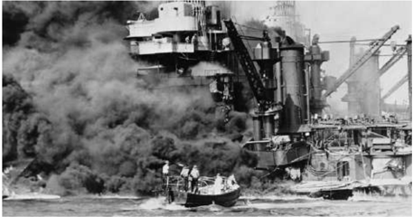

இணைந்தன. இதனால் ஆசிய பசிபிக் போரும் ஐரோப்பியப் போரும் ஒன்றிணைந்து ஒரு பொதுக் காரணத்திற்ககான போராக மாறியது. மிக முக்கியமாக இத்ததாக்குதல் பெருமளவிலான வளங்களைக் கொண்டிருந்த அமெரிக்க நாட்டடை நேசநாடுகளின் அணியில் இப்போரில் பங்ககேற்க வைத்தது.

**தென்கிழக்குஆசியாவில் ஜப்பபானின்ஆக்கிரமிப்புகள்**

தென்கிழக்கு ஆசிய நாடுகள் அனைத்திலும் தனது பேரரசை விரிவாக்கவேண்டுமென்ற தனது திட்டத்தில் ஜப்பபான் குறிப்பிடத்தக்க வெற்றிகளைப் பெற்றது. குவாம், பிலிப்பபைன்ஸ், ஹாங்ககாங், சிங்கப்பூர், மலேயா, டச்சு கிழக்கிந்தியா (இந்தோனேசியா), பர்மமா ஆகிய அனைத்தும் ஜப்பபானிடம் வீழ்ந்தன.

**மிட்வவே போரும் க்வவாடல்ககெனால் போரும் (1942)**

மிட்வவே போரில் அமெரிக்கக் கப்பற்படை ஜப்பபானின் கப்பற்படையைத் தோற்கடித்தது. இது போரின் போக்ககைநேசநாடுகளுக்குச் சாதகமாக மாற்றியது. சாலமோன் தீவுகளிலுள்ள க்வவாடல்ககெனால் போரில்

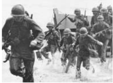

க லாட்படையும் கப்பற்படையும் இணைந்து தாக்குதலை மேற்கொண்டன. இப்போர் பல மாதங்கள் நீடித்தது. இவ்விரு போர்களுமே ஜப்பபானுக்குப் படுதோல்விகளாய் அமைந்தன.

இதன் பின்னர் அமெரிக்கப் படைகள் பிலிப்பபைன்ஸஸை மீட்டது. படிப்படியாக ஜப்பபானியர் தாங்கள் கைப்பற்றிய பகுதிகளிலிருந்து வெளியேற்றப்பட்டனர். 1944இல் இந்தியாவின் வடகிழக்குப் பகுதி மீது படையெடுக்க முயன்ற ஜப்பபானியரை இந்தியப் படைகளும் ஆங்கிலேயப் படைக ளும் இணைந்து எதிர்கொண்டு பின்னுக்குத் தள்ளினர். பின்னர் சீனப் படைகளோடு சேர்ந்து ஜப்பபானியரை பர்மமாவை விட்டு வெளியேற்றினர். மலேயாவையும் சிங்கப்பூரையும் விடுவித்தனர்.

**ஹிரோஷிமா , நாகசாகி (ஆகஸ்ட் 1945)**

இதனிடையே நவீன அறிவியல் வளர்ச்சியைப் பயன்படுத்தி ரகசியத் திட்டத்தின் மூலம் அமெரிக்ககா அணுகுண்டுகளைத் தயாரித்திருந்தது. வழக்கமான வெடிமருந்து குண்டடைக் காட்டிலும் பெருமளவிலான

ச க்தி கொண்டனவாக இக்குண்டுகள் விளங்கின. ஜப்பபானியப் படைத்தளபதிகள் சரணடைய மறுத்தபோது அமெரிக்ககா ஜப்பபானின் ஹிரோஷிமா நகர்மீது ஒரு

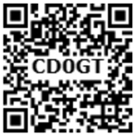

இரண்டடாம் உலகப்போர்

அணுகுண்டடை வீசியது. இதன் பின்னரும் ஜப்பபானியர் சரணடைய மறுத்ததால் மற்றொரு அணுகுண்டு நாகசாகியின் மீது வீசப்பட்டது. இறுதியாக ஜப்பபான் ஆகஸ்ட் 15, 1945இல் தங்களது சரணடைதலை அறிவித்தபின், செப்டம்பர் 2, 1945இல் முறையாகக் கையெழுத்திட்டதும் இரண்டடாம் உலகப்போர் ஓர் முடிவுக்கு வந்தது.

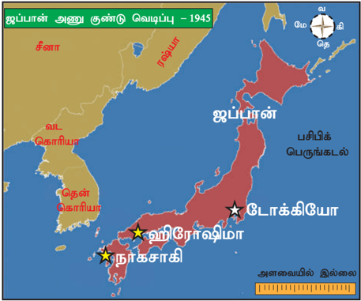

**(இ) போரின் விளைவுகள்**

உலகம்இருஅணிகளாகப்பிரிதல்: இரண்டடாவது உலகப்போர் உலகில் அடிப்படையானதும் முக்கியமானதுமான பல மாற்றங்களை ஏற்படுத்தியது. வல்லரசுகள் தலைமையிலான அணிகளைக் கொண்ட உலகம் இரு துருவங்களானது. ஒரு அணி க ம்யூனிச எதிர்ப்புக் கருத்துக்களைக் கொண்ட அமெரிக்ககாவால் தலைமையேற்கப்பட்டது. மற்றொரு அணிக்கு சோவியத் யூனியன் தலைமை தாங்கியது. க ம்யூனிச நாடுகள், கம்யூனிசமல்லலாத நாடுகள் என ஐரோப்பபா இரண்டடாகப் பிரிக்கப்பட்டது.

அணு ஆயுதப் பரவல்: அமெரிக்க ஐக்கிய நாடுகளும் சோவியத் யூனியனும் அணுஆயுதங்களை அதிகரிக்கும் போட்டியில் இறங்கி, ஆயுதங்களைப் பெருக்கிக் குவித்தன. பல நாடுகளில் இராணுவத்திற்ககான செலவினங்கள் உச்சத்ததை எட்டின.

ப ன்னனாட்டு முகமைகள்: பல பன்னனாட்டு முகமைகள் குறிப்பபாக ஐக்கிய நாடுகள் சபை , உலக வங்கி, பன்னனாட்டு நிதியம் (International Monetary Fund) போன்ற அமைப்புகள் உருவாக்கப்பட்டன.

க லனி நீக்கச் செயல்பபாட்டின் அடிப்படையில் க லனியாதிக்கச் சக்திகள் தங்களது காலனிகளுக்கு விடுதலை வழங்கவேண்டிய க ட்டடாயத்திற்குள்ளளாயினர். அதில் இந்தியா முதலாவதாய் சுதந்திரம் பெற்றது.

இரண்டடாம் உலகப்போர்

### 3.2 பேரழிவும் பின்விளைவும்

ஹிட்லர் ஆட்சிப்பொறுப்பபேற்ற பின்னர் யூதர்கள் பலவழிகளில் கொடுமைப்படுத்தப்பட்டனர். அவர்களுக்ககான சமூகஉரிமைகள் மறுக்கப்பட்டன. அவர்களின் சொத்துக்கள் பறிமுதல் செய்யப்பட்டன. அவர்கள் 'கெட்டோக்கள்' எனப்படும் ஒதுக்குபுறமான பகுதிகளில் வாழ வற்புறுத்தப்பட்டனர். இவற்றறைத் தொடர்ந்து நாசிகள் யூதர்களை முற்றிலுமாகக் கொன்று குவிப்பதற்ககாக 'இறுதித் தீர்வு' எனும் க ருத்ததை முன்வவைத்தனர்.

இரண்டடாவது உலகப் போரின்போது ஜெர்மமானியர்களால் ஆறு மில்லியன் யூத மக்கள் கொல்லப்பட்ட இனஅழிப்பபை விளக்குவதற்கு பேரழிவுப்படுகொலை (Holocaust) என்ற சொல் பயன்படுத்தப்படுகிறது. ஹிட்லர் மற்றும் நாசிகளுடைய அரசியல் நிகழ்ச்சி நிரலின் முக்கிய அம்சங்களின் ஒன்று யூதர்களை அழிப்பதாகும். ஜெர்மனியில் சாதாரணமாகவும் சொல்லப்போனால் ஐரோப்பபா முழுவதும் ஏற்கனவே நிலவிவந்த யூத எதிர்ப்பு உணர்வுகளை ஹிட்லர் பயன்படுத்திக் கொண்டடார். யூதர்கள் ஐரோப்பபா முழுவதிலும் சிதறிக்கிடந்தனர். அவர்களில் பலர் வணிகத்துறையிலும் கலைகளிலும் தொழிற்துறைகளிலும் புகழ்பபெற்று விளங்கினர். வட்டித்தொழில் யூதர்களிடையே முக்கிய வணிக நடவடிக்ககையாக இருந்தது. இது அவர்களுக்கு எதிரான வெறுப்பபை மேலும் வலுவடையச் செய்தது. ஷேக்ஸ்பியரின் வெனிஸ் நகர வணிகர் (Merchant of Venice) எனும் நாடகம் மக்களிடையே யூதர்களின் மீதிருந்த வெறுப்பபையும் அவநம்பிக்ககையையும் படம் பிடித்துக் காட்டியது.

**மனித உரிமைப் பிரகடனம்**

இத்தகையப் பேரழிவு நடைபெற்றபின், ஐக்கிய நாடுகள் சபை தன்னுடைய மனிதஉரிமை சாச னத்தில் இனம், பால், மொழி, மதம் ஆகிய வேறுபாடுகளின்றி அடிப்படைச் சுதந்திரமும் மனித உரிமைகளும் உலகளாவிய முறையில் கடை பிடிக்கப்படுவதை ஊக்குவிக்கப்போவதாக உறுதிமொழி மேற்கொண்டது. உலகளாவிய முறையில் மனித உரிமைகளைக் காப்பதற்ககாக ஐக்கிய நாடுகள் சபை மேற்கொண்ட முயற்சிகளின் விளைவாக மனித உரிமைகள் ஆணையம் உருவாக்கப்பட்டது. இவ்வமைப்பபால் உருவாக்கப்பட்ட குழு ஒன்றுக்கு மறைந்த குடியரசுத் தலைவர் பிராங்கிளின் ரூஸ்வவெல்ட்டின் மனைவியார் எலினார் ரூஸ்வவெல்ட் தலைமை வகித்ததார். ஆணையக் குழுவில் உறுப்பினர்களாக

ச ர்லஸ் மாலிக் (லெபனான்), P.C.சாங் (தேசியவாத சீனா), ஜான் ஹம்ப்ரி (கனடா), ரெனே காசின் (பிரான்ஸ்) ஆகியோர் இருந்தனர். மனித உரிமைகளின் உலகளாவிய பிரகடனம் 30 கட்டுரைகளில் அடிப்படை மனித உரிமைகளை முன் வைக்கிறது. 1948 டிசம்பர் 10இல் ஐ.நா.சபை இந்த வரலாற்று சாசனத்ததை ஏற்றுக் கொண்டது. இந்த நாள் (டிசம்பர் 10) உலகம் முழுவதும் மனித உரிமைகள் தினமாக கொண்டடாடப்படுகிறது. இப்பிரகடனத்ததைப் பின்பற்றி 1948இல் தொடங்கி சுமார் 90 நாடுகளின் அரசியல் அமைப்புகளில் மனித உரிமைகள் தொடர்பபான சரத்துக்கள் சேர்த்துக்கொள்ளப்பட்டுள்ளதாக நியூயார்க்கிலுள்ள 'பிராங்கிளின் எலினார் ரூஸ்வவெல்ட்' நிறுவனம் கூறுகிறது.

**இஸ்ரரேல் நாட்டின் பிறப்பு**

மேற்சொல்லப்பட்ட பேரழிவின் முக்கிய விளைவு யூத இன மக்களுக்ககென இஸ்ரரேல் எனும் நாடு உருவாக்கப்பட்டதாகும். வரலாற்று ரீதியாக , ரோமர்கள் காலத்திலிருந்து இதுவே இவர்களின் தாயகமாகும்.

### 3.3 புதிய பன்னனாட்டு ஒழுங்கமைவு

1941இல் சுதந்திரமான அனைத்து உலக நாடுகளிடையே நிரந்தரமான அமைதியைப் பேணத் தேவைப்படும் பன்னனாட்டு ஒத்துழைப்பு குறித்து அமெரிக்க ஐக்கிய நாடுகளும் பிரிட்டனும் தீவிர கவனம் செலுத்தத் தொடங்கின. பன்னனாட்டுப் பொருளாதாரம், நிதி ஆகியவற்றின் நிலைத்த தன்மமையும் முக்கிய நோக்கங்களாக இருந்தன. இப்பொது நோக்கங்களுக்கு, உலகத்தின் பல்வவேறு நாடுகளைச் சேர்ந்த உறுப்பினர்கள் இணைந்து செயல்படும் பன்னனாட்டு அமைப்பு தேவைப்பட்டது. இம்முயற்சியின் இறுதியாக ஐக்கிய நாடுகள் சபை, உலக வங்கி, பன்னனாட்டு நிதி அமைப்பு போன்றவையும் அனைத்து நாடுகள், சமூகங்கள் ஆகியவற்றின் முக்கிய அடிப்படை அம்சங்கள் குறித்து நடவடிக்ககை மேற்கொள்ள, அவற்றின் துணை அமைப்புகளும் நிறுவப்பட்டன.

**ஐக்கிய நாடுகள் சபை**

நிறுவப்படுவதற்ககான முதல் முயற்சியை அமெரிக்க ஐக்கிய நாடுகளும் பிரிட்டனும் 1941இல் அட்லலாண்டிக் சாசனத்தின் வழியே வெளியிட்டன. ஐக்கிய நாடுகள் சபையின் பிரகடனம் 1942இல் புத்ததாண்டு

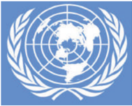

தினத்தன்று, அச்சு நாடுகளுக்கு எதிராக (ஜெர்மனி,

இத்ததாலி, ஜப்பபான்) போர் செய்துவந்த 26 நாடுகளால் ஏற்றுக்கொள்ளப்பட்டது. ஐக்கிய நாடுகள் சபையின் சாச னத்தில் 1945ஆம் ஆண்டு, ஜூன் 26ஆம் நாள் 51 நாடுகள் கையெழுத்திட்டன. இந்தியா அப்போது சுதந்திர நாடாக இல்லலையென்பதால் சாசனத்தில் கையெழுத்திடவில்லலை. தற்போது ஐக்கிய நாடுகள் சபை 193 உறுப்பு நாடுகளைக் கொண்டுள்ளது. ஒவ்வொரு நாடும் சிறியதோ அல்லது பெரியதோ , ஐக்கிய நாடுகள் சபையில் சமமான வாக்குகளை பெற்றுள்ளது.

"ஐக்கிய நாடுகள் சபையின் மக்களாகிய நாங்கள் எதிர்ககால சந்ததியினரை போரின் துயரங்களிலிருந்துக் காப்போம் என உறுதி கூறுகிறோம். அது நம்முடைய வாழ்நநாளில் இருமுறை மனிதகுலத்திற்குச் சொல்லமுடியாத துயரங்களைக் கொண்டுவந்துள்ளது. மேலும் அடிப்படை மனித உரிமைகள், மனிதப்பண்புகளைப் பெற்றுள்ள தனிநபர்களின் கண்ணியம், மதிப்பு, ஆணுக்கும் பெண்ணுக்கும், சிறிய நாட்டிற்கும் பெரிய நாட்டிற்கும் சம உரிமை ஆகியவற்றின் மீதான நம்பிக்ககையை மீண்டும் உறுதி செய்வோம்".... - ஐக்கிய நாடுகள் சபையின் முகவுரையிலிருந்து

**பொதுச்சபையும் பாதுகாப்பு அவையும்**

ஏறத்ததாழ ஏனைய அரசுகளைப் போலவே, அரசுக்குரிய ச ட்டமியற்றுதல், நிர்வகித்தல், நீதித்துறை போன்றவற்றிற்கு நிகரான அமைப்புகளோடு செயல்படுகிறது. பொதுச்சபை எனும் அமைப்பில் ஒவ்வொரு நாடும் பிரதிநிதித்துவப்

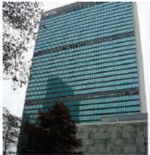

படுத்தப்படுகின்றன. ஆண்டுக்கொருமுறை கூடும் இவ்வமைப்பில் நாடுகளின் நலன்சசார்ந்த அம்சங்களும் முரண்பபாடுகளுக்ககான காரணங்களும் விவாதிக்கப்படுகின்றன. பாதுகாப்பு சபையானது பதினைந்து உறுப்பினர்களைக் கொண்டுள்ளது. அமெரிக்க ஐக்கிய நாடுகள், பிரிட்டன், பிரான்ஸ், ரஷ்யயா, மற்றும் சீனா ஆகிய ஐந்து நாடுகள் இச்சபையின் நிரந்தர உறுப்பு நாடுகளாகும். ஏனைய பத்து உறுப்பினர்கள் சுழற்சி முறையில் தேர்ந்ததெடுக்கப்படுவர். இவ்விரு சபைகளுமே ஒரு சட்டமன்றத்ததைப் போலச் செயல்படுகின்றன. ஒவ்வொரு நிரந்தர உறுப்பினருக்கும் மறுப்பபாணை அதிகாரம் (Veto power) உண்டு. எடுக்கும் எந்த முடிவையும் இதன் மூலம் தடுத்துவிடலாம். இவ்வதிகாரம் வல்லரசுகளால் குறிப்பபாக அமெரிக்ககாவாலும் ரஷ்யயாவாலும் முக்கிய முடிவுகளைத்

இரண்டடாம் உலகப்போர்

தடுப்பதற்ககாகப் பயன்படுத்தப்படுகின்றது. மிக முக்கியமான அம்சங்களும் முரண்பபாடுகளும் பாதுகாப்பு சபையில் விவாதிக்கப்படுகின்றன.

**நிருவாக அமைப்பு**

யின் செயல்பபாட்டு அங்கமாகத் திகழ்வது செயலகம் ஆகும். இதன் பொதுச் செயலாளர் பொதுச்சபையில், பாதுகாப்புச்சபையின் பரிந்துரையின்படி தேர்ந்ததெடுககப்படுகிறார். பொதுச் செயலாளர் தனது காபினெட் உறுப்பினர்கள், ஏனைய அதிகாரிகள் ஆகியோரின் துணையோடு ஐக்கிய நாடுகள் சபையை நடத்துகிறார். பன்னனாட்டு நீதிமன்றம் ஐக்கிய நாடுகள் சபையின் நீதி நிருவாகக் கிளையாகும். இது நெதர்லலாந்திலுள்ள தி ஹேக்கில் (The Hague) அமைந்துள்ளது. பொருளாதார மற்றும் சமூக மன்றம் (Economic and Social Council-ECOSOC) ஐக்கிய நாடுகள் சபை யின் ஐந்ததாவது அங்கமாகும். ஐக்கிய நாடுகள் சபை மேற்கொள்ளும் அனைத்துப் பொருளாதாரச் சமூகப் பணிகளை ஒருங்கிணைப்பது இவ்வமைப்பின் பணியாகும். உலகின் பல்வவேறு பகுதிகளில் வட்டடாரங்களின் வளர்ச்சிக்ககாக (ஆசியா பசிபிக், மேற்கு ஆசியா, ஐரோப்பபா, ஆப்பிரிக்ககா , லத்தீன் அமெரிக்ககா) பல வட்டடார பொருளாதார ஆணையங்கள் செயல்படுகின்றன. அவைப் பொருளாதார மற்றும் சமூக மன்றத்தின் (ECOSOC) துணையமைப்புகளாகும். மிக வெற்றிகரமாகச் செயல்படும் இவற்றிற்கு பொருளாதார வல்லுநரான குன்னனார் மிர்ததால் போன்றோர் தலைமை ஏற்றிருக்கின்றனர்.

**ஐ.நாவின் இதர முக்கியத் துணைஅமைப்புகள்**

இரண்டடாம் உலகப்போர்

**ஐ.நா.வின் செயல்பபாடுகள்**

க டந்த பல பத்ததாண்டுகளில் உலகம் எதிர்கொண்ட, மாறிவரும் பிரச்சனைகளுக்கு ஏற்றவாறு ஐக்கிய நாடுகள் சபை தனது செயல்பபாடுகளை விரிவாக்கம் செய்துள்ளது. 1960களில் காலனியாதிக்க நீக்கம் முக்கியப் பிரச்சனையாகும். மனித உரிமைகள், அகதிகள் பிரச்சனை, பருவகாலமாற்றம், பாலினச் சமத்துவம் ஆகியன தற்போது ஐக்கிய நாடுகள் சபையின் செயல்பபாட்டு வளையத்தினுள் உள்ளன. மிகச்சிறப்பபாகக் கட்டடாயம் குறிப்பிடப்பட வேண்டியது ஐ.நாவின் அமைதிப்படை. உலகம் முழுவதிலும் மோதல்கள் அரங்ககேறியப் பல்வவேறு பகுதிகளில் அப்படை பணி செய்துள்ளது. அதன் முக்கியப் பகுதியாக உள்ள இந்திய இராணுவம் உலகின் பல்வவேறு பகுதிகளில் பணியமர்த்தப்பட்டுள்ளது.

**உலக வங்கி**

"பிரெட்டன் உட்ஸ் இரட்டடையர்கள்" எனக் குறிக்கப்படும் உலக வங்கி, பன்னனாட்டு நிதி அமைப்பு ஆகிய இரண்டும் 1944இல் நடைபெற்ற பிரெட்டன் உட்ஸ் மாநாட்டிற்குப் பின் 1945இல் நிறுவப்பட்டன. இவ்விரு நிறுவனங்களும் அமெரிக்ககாவில் வாஷிங்டன் நகரில் அமைந்துள்ளன. இரண்டுமே ச ம எண்ணிக்ககையிலான உறுப்பினர்களைக் கொண்டுள்ளன. ஏனெனில் ஒரு நாடு பன்னனாட்டு நிதிஅமைப்பில் உறுப்பினர் ஆகாமல் உலகவங்கியில் உறுப்பினராக முடியாது.

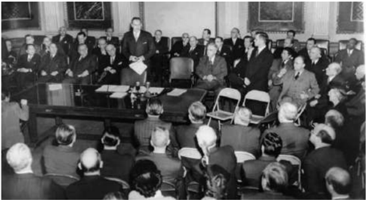

யின் இரு முக்கிய அங்கங்கள் புனரமைப்பு மற்றும் வளர்ச்சிக்ககானப் பன்னனாட்டு வங்கி (International Bank for Reconstruction and Development - IBRD), மற்றொன்று பன்னனாட்டு வளர்ச்சி முகமை (International Development Agency - IDA) ஆகும். இவையிரண்டுமே உலகவங்கி என்ற பெயரிலேயே குறிப்பிடப்படுகிறது. தொடக்க ஆண்டுகளில் IBRDயின் பணியானது போரினால் சீர்குலைந்துபோன ஐரோப்பிய நாடுகளில் புனரமைப்பு நடவடிக்ககைகளை மேற்கொண்ட மார்ஷல் திட்டத்திற்கு நிதி வழங்குவதாய் அமைந்தது. பின்னர் இதன் செயல்பபாடுகள் ஏழை நாடுகளின் பொருளாதார வளர்ச்சியை

மேம்படுத்துவது, பல்வவேறு நாடுகளின் வளர்ச்சித் திட்டங்களுக்கு கடன் வழங்குவது என விரிவடைந்தது. மேலும், பன்னனாட்டு வளர்ச்சி முகமை வளர்ச்சிப் பணிகளுக்குத் தேவைப்படும் நிதியை அரசுகளுக்குக் கடனாக வழங்கியது. மிகக் குறைந்த வட்டிக்கு 50 ஆண்டு கால அளவிற்கு வழங்கப்பட்ட இக்கடன்கள் "மென் கடன்கள்" (Soft Loans) என்றழைக்கப்பட்டன. பன்னனாட்டு நிதி வாரியம் (International Finance Corporation-IFC) எனும் மற்றொரு அமைப்பு வளரும் நாடுகளிலுள்ள தனியார் நிறுவனங்களுடன் செயல்படுகிறது.

அண்மமைக்ககாலங்களில் இவ்வங்கி ஆயிரமாண்டு வளர்ச்சி இலக்குகளை அடையும் சாதனைக்ககான ஊக்குவிப்பபை வழங்கிவருகிறது. மக்களின் வாழ்க்ககைத்தரத்ததை உயர்த்துதல், க ல்லலாமையை இல்லலாமலாக்குவது, பெண்களை வலிமையுள்ளவர்களாக ஆக்குதல், தாய் சேய் நல மேம்பபாடு, சூழலியல் மேம்பபாடு, எய்ட்ஸ் ஒழிப்பு ஆகியவையே இதன் வளர்ச்சி இலக்குகளாகும்.

**ப ன்னனாட்டு நிதியமைப்பு (International Monetary Fund - IMF)**

பன்னனாட்டு நிதியமைப்பபானது அடிப்படையில் ஹேரி டேக்ஸ்டர் ஒயிட், ஜான் மேனார்டு கெய்ன்ஸ் எனும் புகழ்பபெற்றப் பொருளாதார நிபுணர்களின் மூளையில் உதித்த குழந்ததையாகும். இவ்வமைப்பு 1945இல் 29 உறுப்புநாடுகளைக் கொண்டு முறையாக தொடங்கப்பபெற்றது. தற்போது 189 நாடுகள் உறுப்புநாடுகளாக உள்ளன. இதனுடைய அடிப்படை நோக்கம் உலகம் முழுவதிலும் நிதி மற்றும் வளர்ச்சியின் நிலைத்த தன்மமையை உறுதிப்படுத்துவதாகும். இதனுடைய முக்கிய நிகழ்ச்சிநிரல் பன்னனாட்டளவில் நிதி சார்ந்த ஒத்துழைப்பபை மேம்படுத்துவது, பன்னனாட்டு வணிகத்ததையும் நாணயச் செலாவணியையும் உறுதியாக வைத்திருத்தல் ஆகியவையாகும். இவ்வமைப்பு பணம் செலுத்துவதில் சமநிலைப் பிரச்சனைகளை (ஏனெனில் இந்நநாடுகளால் தங்கள் இறக்குமதிகளுக்கு பணம் செலுத்த முடிவதில்லலை) ச ந்திக்கும் நாடுகளுக்குக் கடன் வழங்கும். ஆனால் க டன் வாங்கும் நாடுகள் மீது இவ்வமைப்பு வரவு செலவுத்திட்டங்களைச் சுருக்குதல், செலவுகளைச்

பன்னனாட்டு நிதியமைப்பின் (IMF) நோக்கங்கள்: உலக அளவில் நிதி சார்ந்த ஒத்துழைப்பபைப் பேணுவது, நிதி நிலையை உறுதியானதாக வைத்திருத்தல், பன்னனாட்டு வணிகத்திற்கு வசதிகள் ஏற்படுத்திக் கொடுப்பது, வேலை வாய்ப்பினைப் பெருக்குவது, நீடித்தப் பொருளாதார வளர்ச்சி, உலகம் முழுவதிலும் வறுமையை ஒழிப்பது என்பனவாகும்.

சுருக்குதல் போன்ற கடுமையான நிபந்தனைகளைச் சுமத்துகிறது. இந்நடவடிக்ககைகள் பெரும்பபாலும் வளரும் நாடுகளால் விரும்பப்படுவதில்லலை . ஏனெனில் மக்களுக்கு மானியம் வழங்கும் பல்வவேறு திட்டங்களைக் கைவிட வேண்டிய சூழல் உருவாகிறது.

### 3.4 போருக்குப்பின் ஐரோப்பபாவில் ம க்கள் நல அரசுகள்

மக்கள் நலஅரசு (Welfare State) எனும் சொற்றொடர், அரசாங்கமே மக்களின் சமூகப் பொருளாதார நலன்களுக்குப் பொறுப்பு என்ற கோட்பபாட்டடைக், குறிப்பதாகும். இவ்வவாறு மக்களுக்குப் பாதுகாப்பு வழங்குவது, ச ட்டம் ஒழுங்ககைப் பராமரிப்பது என்பதோடு இல்லலாமல் அரசாங்கத்தின் பொறுப்பபை மேலும் விரிவுபடுத்துவதாகும்.

1942இல் பிரிட்டன் பொதுவாக பெவரிட்ஜ் அறிக்ககை (Beveridge Report) என்றழைக்கப்பட்ட அறிக்ககையை வெளியிட்டது. அவ்வறிக்ககையில், பொது நலனுக்குப் பெருந்தடைகளாக உள்ள வறுமை , நோய் ஆகியவற்றறை வெற்றிகொள்ள , பொதுமக்களுக்கு அதிக வருமானத்ததை அளிப்பது, உடல் நலப்பபாதுகாப்பு, கல்வி, வீட்டுவசதி, வேலைவாய்ப்பு ஆகியவற்றறை வழங்கும் பல திட்டங்கள் தொகுப்பபாக இடம் பெற்றிருந்தன.

போருக்குப் பின்னர் பிரிட்டனில் தொழிலாளர் க ட்சி ஆட்சியமைத்தது. "தொட்டிலிலிருந்து கல்லறை வரை " மக்களைக் கவனித்துக்கொள்ளும் திட்டங்களை மேற்கொள்ளப்போவதாக அவ்வரசு உறுதியளித்தது. மக்களுக்கு விரிவான அளவில் தேசிய நலச் சேவையின் மூலம் இலவச மருத்துவ வசதி, முதியோர்க்கு ஓய்வூதியம், வேலையற்றோர்க்கு உதவித்தொகை போன்ற நிதியுதவிகள் குழந்ததை நல சேவைகள், குடும்பநலச்சசேவைகள் ஆகியவற்றறை வழங்குவதற்ககாகப் பல சட்டங்கள் இயற்றப்பட்டன. அனைவருக்குமான இலவசப் பள்ளிக் கல்வி என்பதற்கு மேலாக இவையனைத்தும் அளிக்கப்பட்டன.

இத்திட்டங்களின் பலன்கள் முதியோர் ஓய்வூதியம், வேலையற்றோர்க்ககான உதவித்தொகை ஆகியவற்றறைப் பொறுத்த அளவில் ப ணப் பரிமாற்றத்தின் மூலமாகவும் ஏனைய நலன்கள், இலவசச் சேவைகள் மூலமாகவும் மக்களைச் சென்றடைந்தன. இவற்றிற்கு மேலாக இந்நநாடுகளில் பொருளாதார ஏற்றதாழ்வுகளை குறைப்பதற்ககாக முற்போக்கு வரிவிதித்தலின் மூலம் அதிகமாக வருமானம் ஈட்டுவோர் மீது அதிகவரி விதிக்கப்பட்டது.

இரண்டடாம் உலகப்போர்

**பாட ச்சுருக்கம்**

- இரண்டடாம் உலகப்போர் 1939 முதல் 1945 வரை நடைபெற்றது. ஐரோப்பபா, ஆப்பிரிக்ககா, ஆசியா பசிபிக் என ஏறத்ததாழ உலகின் அனைத்துப் பகுதிகளிலும் இப்போர் நடைபெற்றது. தொடக்கத்தில் பிரிட்டன், பிரான்சு, பின்னர் சோவியத் யூனியன், அமெரிக்க ஐக்கிய நாடுகள் ஆகியோரைக் கொண்டநேசநாடுகள் அணி அச்சு நாடுகளான ஜெர்மனி, இத்ததாலி, ஜப்பபான் ஆகியவற்றிற்கு எதிராகப் போரிட்டன.
- தொடக்கத்தில் ஐரோப்பபாவில் ஜெர்மனியும் கிழக்குப்பகுதிகளில் ஜப்பபானும் பல வெற்றிகளைப் பெற்றன. இருந்தபோதிலும் அமெரிக்ககா தனது மாபெரும் வளங்களுடன் நேசநாடுகள் அணியில் சேர்ந்த பின்னர் ஜெர்மனி, ஜப்பபான் ஆகிய இரு நாடுகளும் பல நீண்ட சண்டடைக்குப் பின்னர் தோற்கடிக்கப்பட்டன.
- போருக்குப் பிந்ததைய உலகம், அமெரிக்க ஐக்கிய நாடுகள், ஐக்கிய சோவியத் சோசலிஸக் குடியரசுகள் என்றழைக்கப்பட்ட இரு வல்லரசுகளின் எழுச்சியைக் கண்ணுற்றது. இரு நாடுகளும் ஆயுதப்பபெருக்கக் குறிப்பபாக, அணு ஆயுதப் பெருக்கப் போட்டிகளில் ஈடுபட்டன.

**க லைச்சொற்கள்**

|  |  |  |
| --- | --- | --- |
| பேரழிவு | Devastation/ havoc | total destruction |
| போர் நாட்டம் | Belligerent | one eager to fight / aggressive |
| மீண்டடெழுகிற | Resurgent | rising again |
| இழப்பீடுகள் | Reparations | compensation exacted from a defeated nation by the victors |
| போர்த்தளவாடங்கள் | Armaments | weapons |
| கட்டாய இராணுவ சேவைக்கு அழைக்கப்பட்ட | Conscripted | compulsory military service |
| வதைத்துக் கொல்லுதல் | Slaughter | kill a large number of people indiscriminately |
| பல்கிப் பெருகுதல் | Proliferation | a rapid increase |
| குடிசைத்தொகுதி | Ghettos | slums |
| மறுப்பபாணை / எதிர்வவாக்கு | Veto | a vote that blocks a decision / negative vote |
| வரம்பு / எல்லலை | Ambit | range |
| மீளாத்துயரம் | Scourge | eternal suffering |
| கடுமையான | Stringent | tough |
